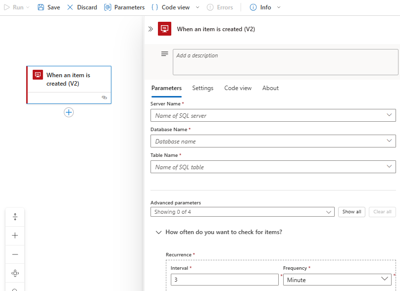
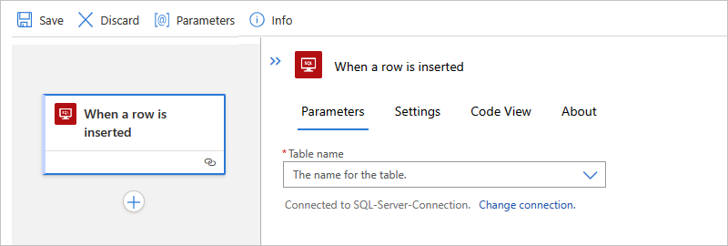
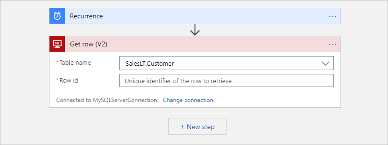
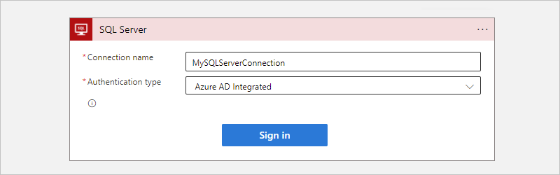
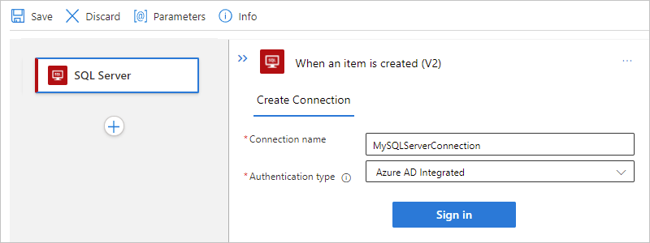
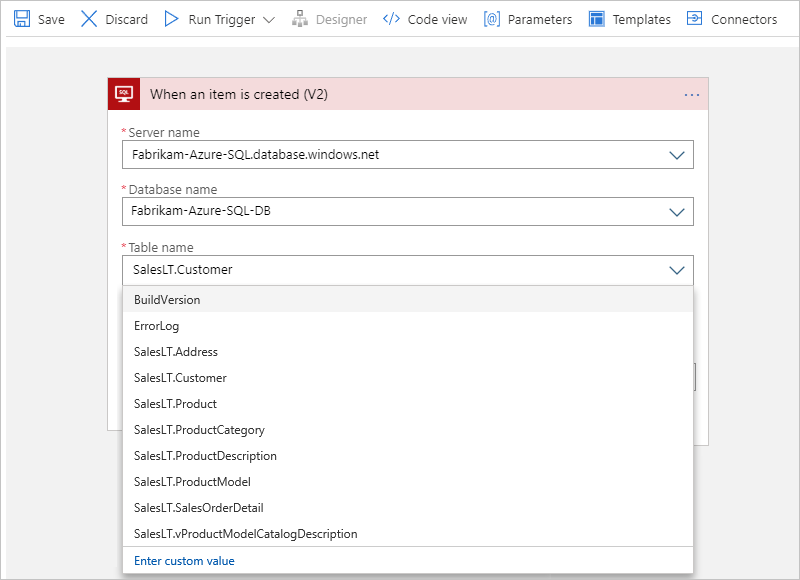
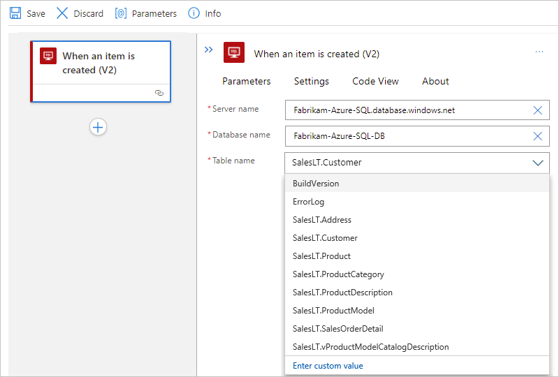
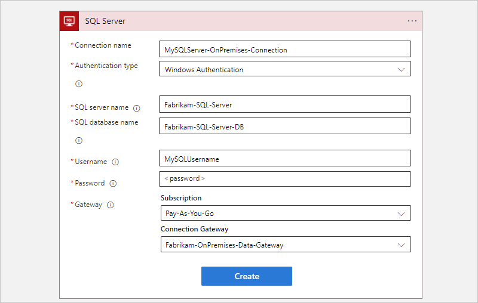
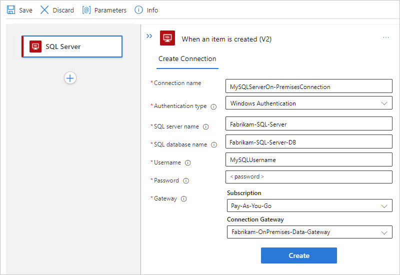

# Connect to an SQL database from workflows in Azure Logic Apps

[!INCLUDE [logic-apps-sku-consumption-standard](../../includes/logic-apps-sku-consumption-standard.md)]

This how-to guide shows how to access your SQL database from a workflow in Azure Logic Apps with the SQL Server connector. You can then create automated workflows that run when triggered by events in your SQL database or in other systems and run actions to manage your SQL data and resources.

For example, your workflow can run actions that get, insert, and delete data or that can run SQL queries and stored procedures. Your workflow can check for new records in a non-SQL database, do some processing work, use the results to create new records in your SQL database, and send email alerts about the new records.

If you're new to Azure Logic Apps, review the following get started documentation:

* [What is Azure Logic Apps](../logic-apps/logic-apps-overview.md)

* [Create an example Consumption logic app workflow in multi-tenant Azure Logic Apps](../logic-apps/quickstart-create-example-consumption-workflow.md)

* [Create an example Standard logic app workflow in single-tenant Azure Logic Apps](../logic-apps/create-single-tenant-workflows-azure-portal.md)

## Supported SQL editions

The SQL Server connector supports the following SQL editions:

* [SQL Server](/sql/sql-server/sql-server-technical-documentation)
* [Azure SQL Database](/azure/azure-sql/database/sql-database-paas-overview)
* [Azure SQL Managed Instance](/azure/azure-sql/managed-instance/sql-managed-instance-paas-overview)

## Connector technical reference

The SQL Server connector has different versions, based on [logic app type and host environment](../logic-apps/logic-apps-overview.md#resource-environment-differences).

| Logic app | Environment | Connector version |
|-----------|-------------|-------------------|
| **Consumption** | Multi-tenant Azure Logic Apps | Managed connector, which appears in the designer under the **Standard** label. For more information, review the following documentation:   - [SQL Server managed connector reference](/connectors/sql)  - [Managed connectors in Azure Logic Apps](managed.md) |
| **Consumption** | Integration service environment (ISE) | Managed connector, which appears in the designer under the **Standard** label, and the ISE version, which has different message limits than the Standard class. For more information, review the following documentation:   - [SQL Server managed connector reference](/connectors/sql)  - [ISE message limits](../logic-apps/logic-apps-limits-and-config.md#message-size-limits)  - [Managed connectors in Azure Logic Apps](managed.md) |
| **Standard** | Single-tenant Azure Logic Apps and App Service Environment v3 (Windows plans only) | Managed connector, which appears in the connector gallery under **Runtime** > **Shared**, and the built-in connector, which appears in the connector gallery under **Runtime** > **In-App** and is [service provider-based](../logic-apps/custom-connector-overview.md#service-provider-interface-implementation). The built-in connector differs in the following ways:   - The built-in connector can directly connect to an SQL database and access Azure virtual networks by using a connection string without an on-premises data gateway.   For more information, review the following documentation:   - [SQL Server managed connector reference](/connectors/sql/)  - [SQL Server built-in connector reference](/azure/logic-apps/connectors/built-in/reference/sql/)  - [Built-in connectors in Azure Logic Apps](built-in.md) |

### Limitations

For more information, review the [SQL Server managed connector reference](/connectors/sql/) or the [SQL Server built-in connector reference](/azure/logic-apps/connectors/built-in/reference/sql/).

## Prerequisites

* An Azure account and subscription. If you don't have a subscription, [sign up for a free Azure account](https://azure.microsoft.com/free/?WT.mc_id=A261C142F).

* [SQL Server database](/sql/relational-databases/databases/create-a-database), [Azure SQL Database](/azure/azure-sql/database/single-database-create-quickstart), or [SQL Managed Instance](/azure/azure-sql/managed-instance/instance-create-quickstart).

  The SQL Server connector requires that your tables contain data so that the connector operations can return results when called. For example, if you use Azure SQL Database, you can use the included sample databases to try the SQL Server connector operations.

* The information required to create an SQL database connection, such as your SQL server and database name. If you're using Windows Authentication or SQL Server Authentication to authenticate access, you also need your user name and password. You can usually find this information in the connection string.

  > [!IMPORTANT]
  >
  > If you use an SQL Server connection string that you copied directly from the Azure portal, 
  > you have to manually add your password to the connection string.

  * For an SQL database in Azure, the connection string has the following format:

    `Server=tcp:{your-server-name}.database.windows.net,1433;Initial Catalog={your-database-name};Persist Security Info=False;User ID={your-user-name};Password={your-password};MultipleActiveResultSets=False;Encrypt=True;TrustServerCertificate=False;Connection Timeout=30;`

    1. To find this string in the [Azure portal](https://portal.azure.com), open your database.

    1. On the database menu, under **Properties**, select **Connection strings**.

  * For an on-premises SQL server, the connection string has the following format:

    `Server={your-server-address};Database={your-database-name};User Id={your-user-name};Password={your-password};`

* In Standard workflows, to use the SQL built-in triggers, you must enable change tracking in the table where you want to use the trigger. For more information, see [Enable and disable change tracking](/sql/relational-databases/track-changes/enable-and-disable-change-tracking-sql-server).

* The logic app workflow where you want to access your SQL database. To start your workflow with a SQL Server trigger, you have to start with a blank workflow. To use a SQL Server action, start your workflow with any trigger.

* To connect to an on-premises SQL server, the following extra requirements apply, based on whether you have a Consumption or Standard logic app workflow.

  * Consumption workflow

    * In multi-tenant Azure Logic Apps, you need the [on-premises data gateway](../logic-apps/logic-apps-gateway-install.md) installed on a local computer and a [data gateway resource that's already created in Azure](../logic-apps/logic-apps-gateway-connection.md).

    * In an ISE, you don't need the on-premises data gateway for SQL Server Authentication and non-Windows Authentication connections, and you can use the ISE-versioned SQL Server connector. For Windows Authentication, you need the [on-premises data gateway](../logic-apps/logic-apps-gateway-install.md) on a local computer and a [data gateway resource that's already created in Azure](../logic-apps/logic-apps-gateway-connection.md). The ISE-version connector doesn't support Windows Authentication, so you have to use the regular SQL Server managed connector.

  * Standard workflow

    You can use the SQL Server built-in connector or managed connector.

    * To use Microsoft Entra authentication or managed identity authentication with your logic app, you have to set up your SQL Server to work with these authentication types. For more information, see [Authentication - SQL Server managed connector reference](/connectors/sql/#authentication).

    * To use the built-in connector, you can authenticate your connection with either a managed identity, Microsoft Entra ID, or a connection string. You can adjust connection pooling by specifying parameters in the connection string. For more information, review [Connection Pooling](/dotnet/framework/data/adonet/connection-pooling).

    * To use the SQL Server managed connector, follow the same requirements as a Consumption logic app workflow in multi-tenant Azure Logic Apps. For other connector requirements, review the [SQL Server managed connector reference](/connectors/sql/).

## Add a SQL Server trigger

The following steps use the Azure portal, but with the appropriate Azure Logic Apps extension, you can also use the following tools to create logic app workflows:

* Consumption workflows: [Visual Studio](../logic-apps/quickstart-create-logic-apps-with-visual-studio.md) or [Visual Studio Code](../logic-apps/quickstart-create-logic-apps-visual-studio-code.md)

* Standard workflows: [Visual Studio Code](../logic-apps/create-single-tenant-workflows-visual-studio-code.md)

### [Consumption](#tab/consumption)

1. In the [Azure portal](https://portal.azure.com), open your Consumption logic app and blank workflow in the designer.

1. In the designer, under the search box, select **Standard**. Then, [follow these general steps](../logic-apps/create-workflow-with-trigger-or-action.md?tabs=consumption#add-trigger) to add the [SQL Server managed trigger you want](/connectors/sql/#triggers).

   This example continues with the trigger named **When an item is created**.

1. If prompted, provide the [information for your connection](#create-connection). When you're done, select **Create**.

1. After the trigger information box appears, provide the necessary information required by [your selected trigger](/connectors/sql/#triggers).

   For this example, in the trigger named **When an item is created**, provide the values for the SQL server name and database name, if you didn't previously provide them. Otherwise, from the **Table name** list, select the table that you want to use. Select the **Frequency** and **Interval** to set the schedule for the trigger to check for new items.

   

1. If any other properties are available for this trigger, open the **Add new parameter** list, and select those properties relevant to your scenario.

   This trigger returns only one row from the selected table, and nothing else. To perform other tasks, continue by adding either a [SQL Server connector action](#add-sql-action) or another action that performs the next task that you want in your logic app workflow.

   For example, to view the data in this row, you can add other actions that create a file that includes the fields from the returned row, and then send email alerts. To learn about other available actions for this connector, see the [SQL Server managed connector reference](/connectors/sql/).

1. When you're done, save your workflow. On the designer toolbar, select **Save**.

### [Standard](#tab/standard)

1. In the [Azure portal](https://portal.azure.com), open your Standard logic app and blank workflow in the designer.

1. In the designer, [follow these general steps](../logic-apps/create-workflow-with-trigger-or-action.md?tabs=standard#add-trigger) to find and add the SQL Server [built-in trigger](/azure/logic-apps/connectors/built-in/reference/sql/#triggers) or [managed trigger](/connectors/sql/#triggers) you want.

   For example, you might select the built-in trigger named **When a row is inserted** or the managed trigger named **When a row is created**. This example continues with the built-in trigger named **When a row is inserted**.

1. If prompted, provide the [information for your connection](#create-connection). When you're done, select **Create**.

1. After the trigger information box appears, provide the information required by your selected [built-in trigger](/azure/logic-apps/connectors/built-in/reference/sql/#triggers) or [managed trigger](/connectors/sql/#triggers).

   For this example, in the trigger named **When a row is inserted**, from the **Table name** list, select the table that you want to use.

   

1. If any other properties are available for this trigger, open the **Add new parameter** list, and select those properties relevant to your scenario.

   In this example, the **When a row is inserted** built-in trigger returns the row that you inserted in the selected table, and nothing else. To perform other tasks, continue by adding either another SQL Server action or another action that performs the next task that you want in your logic app workflow.

   For example, to view the data in this row, you can add other actions that create a file that includes the fields from the returned row, and then send email alerts. To learn about other available actions for this connector, see the [SQL Server built-in connector reference](/azure/logic-apps/connectors/built-in/reference/sql/#actions) or the [SQL Server managed connector reference](/connectors/sql/#actions).

1. When you're done, save your workflow. On the designer toolbar, select **Save**.

---

When you save your workflow, this step automatically publishes your updates to your deployed logic app, which is live in Azure. With only a trigger, your workflow just checks the SQL database based on your specified schedule. You have to [add an action](#add-sql-action) that responds to the trigger.

## Add a SQL Server action

The following steps use the Azure portal, but with the appropriate Azure Logic Apps extension, you can also use Visual Studio to edit Consumption logic app workflows or Visual Studio Code to the following tools to edit logic app workflows:

* Consumption workflows: [Visual Studio](../logic-apps/quickstart-create-logic-apps-with-visual-studio.md) or [Visual Studio Code](../logic-apps/quickstart-create-logic-apps-visual-studio-code.md)

* Standard workflows: [Visual Studio Code](../logic-apps/create-single-tenant-workflows-visual-studio-code.md)

In this example, the logic app workflow starts with the [Recurrence trigger](../connectors/connectors-native-recurrence.md), and calls an action that gets a row from an SQL database.

### [Consumption](#tab/consumption)

1. In the [Azure portal](https://portal.azure.com), open your Consumption logic app and workflow in the designer.

1. In the designer, [follow these general steps](../logic-apps/create-workflow-with-trigger-or-action.md?tabs=consumption#add-action) to add the [SQL Server managed action you want](/connectors/sql/#actions).

   This example continues with the action named **Get row**, which gets a single record.

1. If prompted, provide the [information for your connection](#create-connection). When you're done, select **Create**.

1. After the action information box appears, from the **Table name** list, select the table that you want to use. In the **Row id** property, enter the ID for the record that you want.

   For this example, the table name is **SalesLT.Customer**.

   

   This action returns only one row from the selected table, and nothing else. To view the data in this row, add other actions. For example, such actions might create a file, include the fields from the returned row, and store the file in a cloud storage account. To learn about other available actions for this connector, see the [connector's reference page](/connectors/sql/).

1. When you're done, save your workflow. On the designer toolbar, select **Save**.

### [Standard](#tab/standard)

1. In the [Azure portal](https://portal.azure.com), open your Standard logic app and workflow in the designer.

1. In the designer, [follow these general steps](../logic-apps/create-workflow-with-trigger-or-action.md?tabs=standard#add-action) to find and add the SQL Server [built-in action](/azure/logic-apps/connectors/built-in/reference/sql/#actions) or [managed action](/connectors/sql/#actions) you want.

   For example, you might select the built-in action named **Execute query** or the managed action named **Get row**, which gets a single record. This example continues with the managed action named **Get row**. 

1. If prompted, provide the [information for your connection](#create-connection). When you're done, select **Create**.

1. After the action information box appears, provide the values for the SQL server name and database name, if you didn't previously provide them. Otherwise, from the **Table name** list, select the table that you want to use. In the **Row id** property, enter the ID for the record that you want.

   For this example, the table name is **SalesLT.Customer**.

   

   This action returns only one row from the selected table, and nothing else. To view the data in this row, add other actions. For example, such actions might create a file, include the fields from the returned row, and store the file in a cloud storage account. To learn about other available actions for this connector, review the [managed connector's reference page](/connectors/sql/).

1. When you're done, save your workflow. On the designer toolbar, select **Save**.

---

## Connect to your database

[!INCLUDE [Create connection general intro](../../includes/connectors-create-connection-general-intro.md)]

After you provide this information, continue with the following steps based on your target database:

* [Connect to cloud-based Azure SQL Database or SQL Managed Instance](#connect-azure-sql-db)
* [Connect to on-premises SQL Server](#connect-sql-server)

### Connect to Azure SQL Database or SQL Managed Instance

To access a SQL Managed Instance without using the on-premises data gateway or integration service environment, you have to [set up the public endpoint on the SQL Managed Instance](/azure/azure-sql/managed-instance/public-endpoint-configure). The public endpoint uses port 3342, so make sure that you specify this port number when you create the connection from your logic app.

In the connection information box, complete the following steps:

1. For **Connection name**, provide a name to use for your connection.

1. For **Authentication type**, select the authentication that's required and enabled on your database in Azure SQL Database or SQL Managed Instance:

   | Authentication | Description |
   |----------------|-------------|
   | **Connection string** | - Supported only in Standard workflows with the SQL Server built-in connector.   - Requires the connection string to your SQL server and database. |
   | **Active Directory OAuth** | - Supported only in Standard workflows with the SQL Server built-in connector. For more information, see the following documentation:   - [Authentication for SQL Server connector](/connectors/sql/#authentication)  - [Enable Microsoft Entra ID Open Authentication (Microsoft Entra ID OAuth)](../logic-apps/logic-apps-securing-a-logic-app.md#enable-oauth)  - [Microsoft Entra ID Open Authentication](../logic-apps/logic-apps-securing-a-logic-app.md#azure-active-directory-oauth-authentication) |
   | **Logic Apps Managed Identity** | - Supported with the SQL Server managed connector and ISE-versioned connector. In Standard workflows, this authentication type is available for the SQL Server built-in connector, but the option is named **Managed identity** instead.   - Requires the following items:   --- A valid managed identity that's [enabled on your logic app resource](../logic-apps/create-managed-service-identity.md) and has access to your database.   --- **SQL DB Contributor** role access to the SQL Server resource   --- **Contributor** access to the resource group that includes the SQL Server resource.   For more information, see the following documentation:   - [Managed identity authentication for SQL Server connector](/connectors/sql/#managed-identity-authentication)  - [SQL - Server-Level Roles](/sql/relational-databases/security/authentication-access/server-level-roles) |
   | **Service principal (Microsoft Entra application)** | - Supported with the SQL Server managed connector.   - Requires a Microsoft Entra application and service principal. For more information, see [Create a Microsoft Entra application and service principal that can access resources using the Azure portal](../active-directory/develop/howto-create-service-principal-portal.md). |
   | [**Microsoft Entra integrated**](/azure/azure-sql/database/authentication-aad-overview) | - Supported with the SQL Server managed connector and ISE-versioned connector.   - Requires a valid managed identity in Microsoft Entra that's [enabled on your logic app resource](../logic-apps/create-managed-service-identity.md) and has access to your database. For more information, see these topics:   - [Azure SQL Security Overview - Authentication](/azure/azure-sql/database/security-overview#authentication)  - [Authorize database access to Azure SQL - Authentication and authorization](/azure/azure-sql/database/logins-create-manage#authentication-and-authorization)  - [Azure SQL - Microsoft Entra integrated authentication](/azure/azure-sql/database/authentication-aad-overview) |
   | [**SQL Server Authentication**](/sql/relational-databases/security/choose-an-authentication-mode#connecting-through-sql-server-authentication) | - Supported with the SQL Server managed connector and ISE-versioned connector.   - Requires the following items:   --- A data gateway resource that's previously created in Azure for your connection, regardless whether your logic app is in multi-tenant Azure Logic Apps or an ISE.   --- A valid user name and strong password that are created and stored in your SQL Server database. For more information, see the following topics:   - [Azure SQL Security Overview - Authentication](/azure/azure-sql/database/security-overview#authentication)  - [Authorize database access to Azure SQL - Authentication and authorization](/azure/azure-sql/database/logins-create-manage#authentication-and-authorization) |

   The following examples show how the connection information box might appear if you use the SQL Server *managed* connector and select **Microsoft Entra integrated** authentication:

   **Consumption workflows**

   

   **Standard workflows**

   

1. After you select **Microsoft Entra integrated**, select **Sign in**. Based on whether you use Azure SQL Database or SQL Managed Instance, select your user credentials for authentication.

1. Select these values for your database:

   | Property | Required | Description |
   |----------|----------|-------------|
   | **Server name** | Yes | The address for your SQL server, for example, **Fabrikam-Azure-SQL.database.windows.net** |
   | **Database name** | Yes | The name for your SQL database, for example, **Fabrikam-Azure-SQL-DB** |
   | **Table name** | Yes | The table that you want to use, for example, **SalesLT.Customer** |

   > [!TIP]
   >
   > To provide your database and table information, you have these options:
   > 
   > * Find this information in your database's connection string. For example, in the Azure portal, find and open your database. On the database menu, select either **Connection strings** or **Properties**, where you can find the following string:
   >
   >   `Server=tcp:{your-server-address}.database.windows.net,1433;Initial Catalog={your-database-name};Persist Security Info=False;User ID={your-user-name};Password={your-password};MultipleActiveResultSets=False;Encrypt=True;TrustServerCertificate=False;Connection Timeout=30;`
   >
   > * By default, tables in system databases are filtered out, so they might not automatically appear when you select a system database. As an alternative, you can manually enter the table name after you select **Enter custom value** from the database list.

   This database information box looks similar to the following example:

   **Consumption workflows**

   

   **Standard workflows**

   

1. Now, continue with the steps that you haven't completed yet in either [Add a SQL trigger](#add-sql-trigger) or [Add a SQL action](#add-sql-action).

### Connect to on-premises SQL Server

In the connection information box, complete the following steps:

1. For connections to your on-premises SQL server that require the on-premises data gateway, make sure that you've [completed these prerequisites](#multi-tenant-or-ise).

   Otherwise, your data gateway resource doesn't appear in the **Connection Gateway** list when you create your connection.

1. For **Authentication Type**, select the authentication that's required and enabled on your SQL Server:

   | Authentication | Description |
   |----------------|-------------|
   | [**SQL Server Authentication**](/sql/relational-databases/security/choose-an-authentication-mode#connecting-through-sql-server-authentication) | - Supported with the SQL Server managed connector, SQL Server built-in connector, and ISE-versioned connector.   - Requires the following items:   --- A data gateway resource that's previously created in Azure for your connection, regardless whether your logic app is in multi-tenant Azure Logic Apps or an ISE.   --- A valid user name and strong password that are created and stored in your SQL Server.   For more information, see [SQL Server Authentication](/sql/relational-databases/security/choose-an-authentication-mode#connecting-through-sql-server-authentication). |
   | [**Windows Authentication**](/sql/relational-databases/security/choose-an-authentication-mode#connecting-through-windows-authentication) | - Supported with the SQL Server managed connector.   - Requires the following items:   --- A data gateway resource that's previously created in Azure for your connection, regardless whether your logic app is in multi-tenant Azure Logic Apps or an ISE.   --- A valid Windows user name and password to confirm your identity through your Windows account.   For more information, see [Windows Authentication](/sql/relational-databases/security/choose-an-authentication-mode#connecting-through-windows-authentication). |

1. Select or provide the following values for your SQL database:

   | Property | Required | Description |
   |----------|----------|-------------|
   | **SQL server name** | Yes | The address for your SQL server, for example, `Fabrikam-Azure-SQL.database.windows.net` |
   | **SQL database name** | Yes | The name for your SQL Server database, for example, `Fabrikam-Azure-SQL-DB` |
   | **Username** | Yes | Your user name for the SQL server and database |
   | **Password** | Yes | Your password for the SQL server and database |
   | **Subscription** |  Yes, for Windows authentication | The Azure subscription for the data gateway resource that you previously created in Azure |
   | **Connection Gateway** | Yes, for Windows authentication | The name for the data gateway resource that you previously created in Azure     **Tip**: If your gateway doesn't appear in the list, check that you correctly [set up your gateway](../logic-apps/logic-apps-gateway-connection.md). |

   > [!TIP]
   > You can find this information in your database's connection string:
   > 
   > * `Server={your-server-address}`
   > * `Database={your-database-name}`
   > * `User ID={your-user-name}`
   > * `Password={your-password}`

   The following examples show how the connection information box might appear if you select **Windows** authentication.

   **Consumption workflows**

   

   **Standard workflows**

   

1. When you're ready, select **Create**.

1. Now, continue with the steps that you haven't completed yet in either [Add a SQL trigger](#add-sql-trigger) or [Add a SQL action](#add-sql-action).

## Handle bulk data

Sometimes, you work with result sets so large that the connector doesn't return all the results at the same time. Or, you want better control over the size and structure for your result sets. The following list includes some ways that you can handle such large result sets:

* To help you manage results as smaller sets, turn on *pagination*. For more information, see [Get bulk data, records, and items by using pagination](../logic-apps/logic-apps-exceed-default-page-size-with-pagination.md). For more information, see [SQL Pagination for bulk data transfer with Logic Apps](https://social.technet.microsoft.com/wiki/contents/articles/40060.sql-pagination-for-bulk-data-transfer-with-logic-apps.aspx).

* Create a [*stored procedure*](/sql/relational-databases/stored-procedures/stored-procedures-database-engine) that organizes the results the way that you want. The SQL Server connector provides many backend features that you can access by using Azure Logic Apps so that you can more easily automate business tasks that work with SQL database tables.

  When a SQL action gets or inserts multiple rows, your logic app workflow can iterate through these rows by using an [*until loop*](../logic-apps/logic-apps-control-flow-loops.md#until-loop) within these [limits](../logic-apps/logic-apps-limits-and-config.md). However, when your logic app has to work with record sets so large, for example, thousands or millions of rows, that you want to minimize the costs resulting from calls to the database.

  To organize the results in the way that you want, you can create a stored procedure that runs in your SQL instance and uses the **SELECT - ORDER BY** statement. This solution gives you more control over the size and structure of your results. Your logic app calls the stored procedure by using the SQL Server connector's **Execute stored procedure** action. For more information, see [SELECT - ORDER BY Clause](/sql/t-sql/queries/select-order-by-clause-transact-sql).

  > [!NOTE]
  >
  > The SQL Server connector has a stored procedure timeout limit that's [less than 2 minutes](/connectors/sql/#known-issues-and-limitations). 
  > Some stored procedures might take longer than this limit to complete, causing a `504 Timeout` error. You can work around this problem 
  > by using a SQL completion trigger, native SQL pass-through query, a state table, and server-side jobs.
  > 
  > For this task, you can use the [Azure Elastic Job Agent](/azure/azure-sql/database/elastic-jobs-overview) 
  > for [Azure SQL Database](/azure/azure-sql/database/sql-database-paas-overview). For 
  > [SQL Server on premises](/sql/sql-server/sql-server-technical-documentation) 
  > and [SQL Managed Instance](/azure/azure-sql/managed-instance/sql-managed-instance-paas-overview), 
  > you can use the [SQL Server Agent](/sql/ssms/agent/sql-server-agent). To learn more, see 
  > [Handle long-running stored procedure timeouts in the SQL Server connector for Azure Logic Apps](../logic-apps/handle-long-running-stored-procedures-sql-connector.md).

### Handle dynamic bulk data

When you call a stored procedure by using the SQL Server connector, the returned output is sometimes dynamic. In this scenario, follow these steps:

1. In the [Azure portal](https://portal.azure.com), open your logic app and workflow in the designer.

1. View the output format by performing a test run. Copy and save your sample output.

1. In the designer, under the action where you call the stored procedure, add the built-in action named [**Parse JSON**](../logic-apps/logic-apps-perform-data-operations.md#parse-json-action).

1. In the **Parse JSON** action, select **Use sample payload to generate schema**.

1. In the **Enter or paste a sample JSON payload** box, paste your sample output, and select **Done**.

   > [!NOTE]
   >
   > If you get an error that Azure Logic Apps can't generate a schema, check that your 
   > sample output's syntax is correctly formatted. If you still can't generate the schema, 
   > in the **Schema** box, manually enter the schema.

1. When you're done, save your workflow.

1. To reference the JSON content properties, select inside the edit boxes where you want to reference those properties so that the dynamic content list appears. In the list, under the [**Parse JSON**](../logic-apps/logic-apps-perform-data-operations.md#parse-json-action) heading, select the data tokens for the JSON content properties that you want.

## Next steps

* [Managed connectors for Azure Logic Apps](/connectors/connector-reference/connector-reference-logicapps-connectors)
* [Built-in connectors for Azure Logic Apps](built-in.md)
