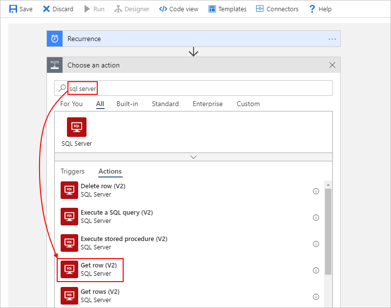
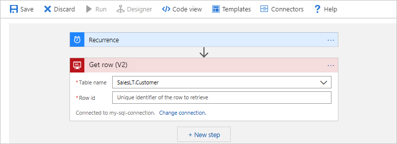

# Automate workflows for SQL Server or Azure SQL Database by using Azure Logic Apps

This article shows how you can access data in your SQL database from inside a logic app with the SQL Server connector. That way, you can automate tasks, processes, or workflows that manage your SQL data and resources by creating logic apps. The SQL Server connector works for both [on-premises SQL Server](https://docs.microsoft.com/sql/sql-server/sql-server-technical-documentation) and for [cloud-based Azure SQL Database](https://docs.microsoft.com/azure/sql-database/sql-database-technical-overview).

You can create logic apps that run when triggered by events in your SQL database or in other systems, such as Dynamics CRM Online. Your logic apps can also get, insert, and delete data along with running SQL queries and stored procedures. For example, you can build a logic app that automatically checks for new records in Dynamics CRM Online, adds items to your SQL database for any new records, and then sends email alerts about the added items.

If you're new to logic apps, review [What is Azure Logic Apps](../logic-apps/logic-apps-overview.md) and [Quickstart: Create your first logic app](../logic-apps/quickstart-create-first-logic-app-workflow.md). For connector-specific technical information, limitations, and known issues, see the [SQL Server connector reference page](https://docs.microsoft.com/connectors/sql/).

## Prerequisites

* An Azure subscription. If you don't have a subscription, [sign up for a free Azure account](https://azure.microsoft.com/free/).

* An [SQL Server database](https://docs.microsoft.com/sql/relational-databases/databases/create-a-database) or [Azure SQL database](../sql-database/sql-database-get-started-portal.md)

  Your tables must have data so that your logic app can return results when calling operations. If you create an Azure SQL Database, you can use sample databases, which are included.

* Your SQL server name, database name, your user name, and your password. You need these credentials so that you can authorize your logic to access your SQL server.

  * For SQL Server, you can find these details in the connection string:

    `Server={your-server-address};Database={your-database-name};User Id={your-user-name};Password={your-password};`

  * For Azure SQL Database, you can find these details in the connection string, or in the Azure portal under the SQL Database properties:

    `Server=tcp:{your-server-name}.database.windows.net,1433;Initial Catalog={your-database-name};Persist Security Info=False;User ID={your-user-name};Password={your-password};MultipleActiveResultSets=False;Encrypt=True;TrustServerCertificate=False;Connection Timeout=30;`

* Before you can connect logic apps to on-premises systems such as SQL Server, you have to [set up an on-premises data gateway](../logic-apps/logic-apps-gateway-install.md). That way, you can select the gateway when you create the SQL connection for your logic app.

* The logic app where you need access to your SQL database. To start your logic app with a SQL trigger, you need a [blank logic app](../logic-apps/quickstart-create-first-logic-app-workflow.md).

## Add a SQL trigger

In Azure Logic Apps, every logic app must start with a [trigger](../logic-apps/logic-apps-overview.md#logic-app-concepts), which fires when a specific event happens or when a specific condition is met. Each time that the trigger fires, the Logic Apps engine creates a logic app instance and starts running your logic app's workflow.

1. In the Azure portal or Visual Studio, create a blank logic app, which opens Logic Apps Designer. This example uses the Azure portal.

1. On the designer, in the search box, enter "sql server" as your filter. From the triggers list, select the SQL trigger that you want.

   This example uses the **When an item is created**  trigger.

   

1. If you are prompted to create a connection, [create your SQL connection now](#create-connection). If your connection exists, select a **Table name**.

   

1. Set the **Interval** and **Frequency** properties, which specify how often your logic app checks the table.

   This trigger returns only one row from the selected table, nothing else. To perform other tasks, add other actions that perform the tasks you want. For example, to view the data in this row, you can add other actions that create a file that includes the fields from the returned row, and then send email alerts. To learn about other available actions for this connector, see the [connector's reference page](https://docs.microsoft.com/connectors/sql/).

1. When you're done, on the designer toolbar, select **Save**.

   This step automatically enables and publishes your logic app live in Azure.

## Add a SQL action

In Azure Logic Apps, an [action](../logic-apps/logic-apps-overview.md#logic-app-concepts) is a step in your workflow that follows a trigger or another action. In this example, the logic app starts with the [Recurrence trigger](../connectors/connectors-native-recurrence.md), and calls an action that gets a row from a SQL database.

1. In the Azure portal or Visual Studio, open your logic app in Logic Apps Designer. This example uses the Azure portal.

1. Under the trigger or action where you want to add the SQL action, select **New step**.

   

   To add an action between existing steps, move your mouse over the connecting arrow. Select the plus sign (**+**) that appears, and then select **Add an action**.

1. Under **Choose an action**, in the search box, enter "sql server" as your filter. From the actions list, select the SQL action that you want.

   This example uses the **Get row** action, which gets a single record.

   

   This action returns only one row from the selected table, nothing else. To view the data in this row, you might add other actions that create a file that includes the fields from the returned row, and store that file in a cloud storage account. To learn about other available actions for this connector, see the [connector's reference page](https://docs.microsoft.com/connectors/sql/).

1. If you are prompted to create a connection, [create your SQL connection now](#create-connection). If your connection exists, select a **Table name**, and enter the **Row ID** for the record that you want.

   

1. When you're done, on the designer toolbar, select **Save**.

   This step automatically enables and publishes your logic app live in Azure.

## Connect to your database

[!INCLUDE [Create connection general intro](../../includes/connectors-create-connection-general-intro.md)]

[!INCLUDE [Create a connection to SQL Server or Azure SQL Database](../../includes/connectors-create-api-sqlazure.md)]

## Handle bulk data

Sometimes, you have to work with result sets so large that the connector doesn't return all the results at the same time, or you want better control over the size and structure for your result sets. Here's some ways that you can handle such large result sets:

* To help you manage results as smaller sets, turn on *pagination*. For more information, see [Get bulk data, records, and items by using pagination](../logic-apps/logic-apps-exceed-default-page-size-with-pagination.md).

* Create a stored procedure that organizes the results the way you want.

  When getting or inserting multiple rows, your logic app can iterate through these rows by using an [*until loop*](../logic-apps/logic-apps-control-flow-loops.md#until-loop) within these [limits](../logic-apps/logic-apps-limits-and-config.md). However, when your logic app has to work with record sets so large, for example, thousands or millions of rows, that you want to minimize the costs resulting from calls to the database.

  To organize the results in the way that you want, you can create a [*stored procedure*](https://docs.microsoft.com/sql/relational-databases/stored-procedures/stored-procedures-database-engine) that runs in your SQL instance and uses the **SELECT - ORDER BY** statement. This solution gives you more control over the size and structure of your results. Your logic app calls the stored procedure by using the SQL Server connector's **Execute stored procedure** action.

  For more solution details, see these articles:

  * [SQL Pagination for bulk data transfer with Logic Apps](https://social.technet.microsoft.com/wiki/contents/articles/40060.sql-pagination-for-bulk-data-transfer-with-logic-apps.aspx)

  * [SELECT - ORDER BY Clause](https://docs.microsoft.com/sql/t-sql/queries/select-order-by-clause-transact-sql)

## Connector-specific details

For technical information about this connector's triggers, actions, and limits, see the [connector's reference page](https://docs.microsoft.com/connectors/sql/).

## Next steps

* Learn about other [connectors for Azure Logic Apps](../connectors/apis-list.md)