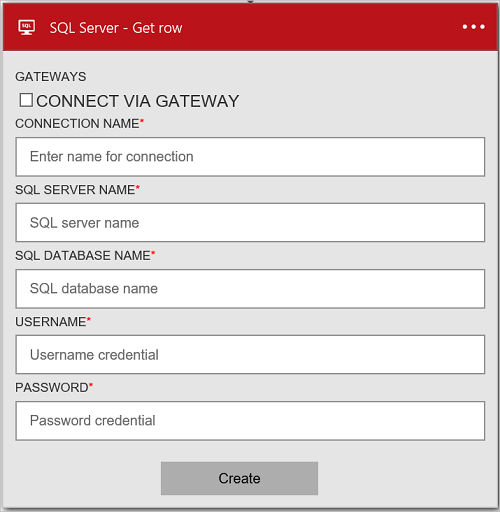
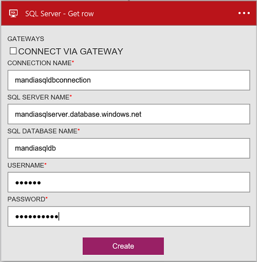
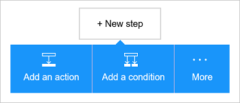
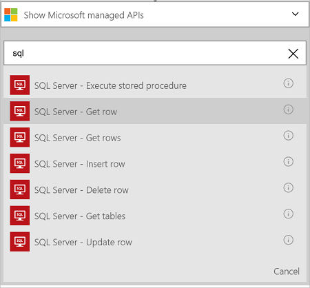
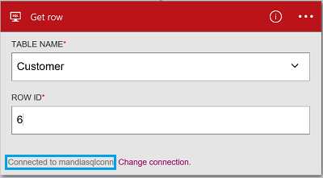

<properties
    pageTitle="Add the Azure SQL Database connector in your Logic Apps | Microsoft Azure"
    description="Overview of Azure SQL Database connector with REST API parameters"
    services=""
    documentationCenter="" 
    authors="MandiOhlinger"
    manager="erikre"
    editor=""
    tags="connectors"/>

<tags
   ms.service="multiple"
   ms.devlang="na"
   ms.topic="article"
   ms.tgt_pltfrm="na"
   ms.workload="na" 
   ms.date="07/14/2016"
   ms.author="mandia"/>

# Get started with the Azure SQL Database connector
Using the Azure SQL Database connector, you can create workflows for your organization that manage data in your tables. You can:

- Build your workflow by adding a new customer to a customers database, or updating an order in an orders database.
- Use actions to get a row of data, insert a new row, and even delete. For example,  when a record is created in Dynamics CRM Online (a trigger), you can insert a row in an Azure SQL Database (an action). 

This topic shows you how to use the SQL Database connector in a logic app, and also lists the actions.

>[AZURE.NOTE] This version of the article applies to logic apps general availability (GA). 

To learn more about logic apps, see [create a logic app](../app-service-logic/app-service-logic-create-a-logic-app.md).

>[AZURE.INCLUDE [What you need to get started](../../includes/connectors-create-api-sqlazure.md)]

## Create the connection

When you add this connector to your logic apps, you create a connection to SQL Database. The first time you add this connector, you are prompted for the connection information: 

  

> [AZURE.NOTE] Once the connection is created, you can reuse this same connection with other logic apps.

#### To create the connection

1. Enter the SQL Database details. Properties with an asterisk are required.

	| Property | Details |
|---|---|
| Connect via Gateway | Leave this unchecked. This is used when connecting to an on-premises SQL Server. |
| Connection Name * | Enter any name for your connection. | 
| SQL Server Name * | Enter the server name; which is something like *servername.database.windows.net*. The server name is displayed in the SQL Database properties in the Azure portal, and also displayed in the connection string. | 
| SQL Database Name * | Enter the name you gave your SQL Database. This is listed in the SQL Database properties in the connection string: Initial Catalog=*yoursqldbname*. | 
| Username * | Enter the username you created when the SQL Database was created. This is listed in the SQL Database properties in the Azure portal. | 
| Password * | Enter the password you created when the SQL Database was created. | 

	These credentials are used to authorize your logic app to connect, and access your SQL data. Once complete, your connection details look similar to the following:  

	 

2. Select **Create**. 

## Use a trigger

This connector does not have any triggers. You can use other triggers to start the logic app, including a Recurrence trigger, an HTTP Webhook trigger, triggers available with other connectors, and more. [Create a logic app](../app-service-logic/app-service-logic-create-a-logic-app.md) provides an example.

## Use an action
	
An action is an operation carried out by the workflow defined in a Logic app.

1. Select the plus sign. You see several choices: **Add an action**, **Add a condition**, or one of the **More** options.

	

2. Choose **Add an action**.

3. In the text box, type “sql” to get a list of all the available actions.

	 

4. In our example, choose **SQL Server - Get row**. If a connection already exists, then select the **Table name** from the drop-down list, and enter the **Row ID** you want to return.

	

	If you are prompted for the connection information, then enter the details to create the connection. [Create the connection](connectors-create-api-sqlazure.md#create-the-connection) in this topic describes these properties. 

	> [AZURE.NOTE] In this example, we return a row from a table. To see the data in this row, you can add another action that creates a file using the fields from the table. For example, you can add a OneDrive action that uses the FirstName and LastName fields to create a new file in the cloud storage account. 

5. **Save** your changes (top left corner of the toolbar). Your logic app is saved and automatically enabled.

## Technical Details

## Actions
An action is an operation carried out by the workflow defined in a logic app. The SQL Database connector includes the following actions. 

|Action|Description|
|--- | ---|
|[ExecuteProcedure](connectors-create-api-sqlazure.md#execute-stored-procedure)|Executes a stored procedure in SQL|
|[GetRow](connectors-create-api-sqlazure.md#get-row)|Retrieves a single row from a SQL table|
|[GetRows](connectors-create-api-sqlazure.md#get-rows)|Retrieves rows from a SQL table|
|[InsertRow](connectors-create-api-sqlazure.md#insert-row)|Inserts a new row into a SQL table|
|[DeleteRow](connectors-create-api-sqlazure.md#delete-row)|Deletes a row from a SQL table|
|[GetTables](connectors-create-api-sqlazure.md#get-tables)|Retrieves tables from a SQL database|
|[UpdateRow](connectors-create-api-sqlazure.md#update-row)|Updates an existing row in a SQL table|

### Action Details

In this section, you can see specific details about each action, including any required or optional input properties, and any corresponding output associated with the connector.

#### Execute stored procedure
Executes a stored procedure in SQL.  
An asterisk (*) means the property is required.

| Property Name| Display Name |Description|
| ---|---|---|
|procedure * | Procedure name | The name of the stored procedure you want to execute |
|parameters * | Input parameters | The parameters are dynamic and based on the stored procedure you choose.    For example, if you're using the Adventure Works sample database, you can choose the *ufnGetCustomerInformation* stored procedure. The **Customer ID** input parameter is displayed. Enter "6" or one of the other customer IDs. |

**Output Details**  
ProcedureResult: Carries result of stored procedure execution

| Property Name | Data Type | Description |
|---|---|---|
|OutputParameters|object|Output parameter values |
|ReturnCode|integer|Return code of a procedure |
|ResultSets|object| Result sets|

#### Get row 
Retrieves a single row from a SQL table.  
An asterisk (*) means the property is required.

| Property Name| Display Name |Description|
| ---|---|---|
|table * | Table name |Name of SQL table|
|id * | Row id |Unique identifier of the row to retrieve|

**Output Details**  
Item

| Property Name | Data Type |
|---|---|
|ItemInternalId|string|

#### Get rows 
Retrieves rows from a SQL table.  
An asterisk (*) means the property is required.

| Property Name| Display Name |Description|
| ---|---|---|
|dataset * | Dataset name| dataset name |
|table * |Table name |Name of SQL table|
|$skip| Skip Count|Number of entries to skip (default = 0)|
|$top| Maximum Get Count |Maximum number of entries to retrieve (default = 256)|
|$filter| Filter Query|An ODATA filter query to restrict the number of entries|
|$orderby|Order By |An ODATA orderBy query for specifying the order of entries|

**Output Details**  
ItemsList

| Property Name | Data Type |
|---|---|
|value|array|

#### Insert row 
Inserts a new row into a SQL table.  
An asterisk (*) means the property is required.

| Property Name| Display Name |Description|
| ---|---|---|
|dataset * | Dataset name |Name of SQL dataset |
|table * | Table name |Name of SQL table|
|item *|Row|Row to insert into the specified table in SQL|

**Output Details**  
Item

| Property Name | Data Type |
|---|---|
|ItemInternalId|string|

#### Delete row 
Deletes a row from a SQL table.  
An asterisk (*) means the property is required.

| Property Name| Display Name |Description|
| ---|---|---|
|dataset * | Dataset name |Name of SQL dataset |
|table * |Table name |Name of SQL table|
|id * |Row id |Unique identifier of the row to delete|

**Output Details**  
None.

#### Get tables 
Retrieves tables from a SQL database.  

There are no parameters for this call. 

**Output Details**  
TablesList

| Property Name | Data Type |
|---|---|
|value|array|

#### Update row 
Updates an existing row in a SQL table.  
An asterisk (*) means the property is required.

| Property Name| Display Name |Description|
| ---|---|---|
|dataset * | Dataset name |Name of SQL dataset |
|table * |Table name |Name of SQL table|
|id * |Row id |Unique identifier of the row to delete|
|item * |Row|item to be updated|

**Output Details**  
Item

| Property Name | Data Type |
|---|---|
|ItemInternalId|string|

### HTTP Responses

When making calls to the different actions, you may get certain responses. The following table outlines the responses and their descriptions:  

|Name|Description|
|---|---|
|200|OK|
|202|Accepted|
|400|Bad Request|
|401|Unauthorized|
|403|Forbidden|
|404|Not Found|
|500|Internal Server Error. Unknown error occurred|
|default|Operation Failed.|

## Next steps

Try out the platform and [create a logic app](../app-service-logic/app-service-logic-create-a-logic-app.md) now. You can explore the other available connectors in logic apps by looking at our [APIs list](apis-list.md).
