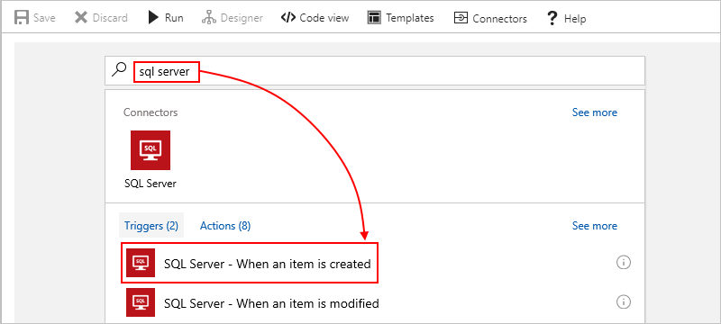
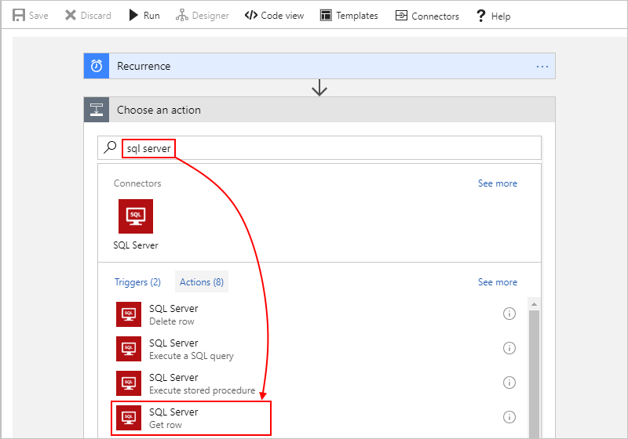
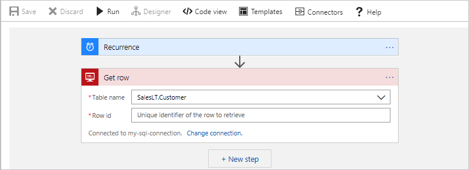

---
# required metadata
title: Connect to SQL Server or Azure SQL Database - Azure Logic Apps | Microsoft Docs
description: How to access and manage SQL databases on premises or in the cloud by automating workflows with Azure Logic Apps
author: ecfan
manager: jeconnoc
ms.author: estfan
ms.date: 05/15/2018
ms.topic: article
ms.service: logic-apps
services: logic-apps

# optional metadata
ms.reviewer: klam, LADocs
ms.suite: integration
tags: connectors
---

# Connect to SQL Server or Azure SQL Database from Azure Logic Apps

This article shows how you can access data in your SQL database 
from inside a logic app with the SQL Server connector. 
That way, you can automate tasks, processes, and workflows 
that manage your SQL data and resources by creating logic apps. 
The connector works for both 
[SQL Server on premises](https://docs.microsoft.com/sql/sql-server/sql-server-technical-documentation) 
and for [Azure SQL Database in the cloud](https://docs.microsoft.com/azure/sql-database/sql-database-technical-overview). 

You can create logic apps that run when triggered by events in 
your SQL database or in other systems, such as Dynamics CRM Online. 
Your logic apps can also get, insert, and delete data along with executing 
SQL queries and stored procedures. For example, you can build a logic 
app that automatically checks for new records in Dynamics CRM Online, 
adds items to your SQL database for any new records, and then sends email alerts.

If you don't have an Azure subscription, 
<a href="https://azure.microsoft.com/free/" target="_blank">sign up for a free Azure account</a>. 
If you're new to logic apps, review 
[What is Azure Logic Apps](../logic-apps/logic-apps-overview.md) 
and [Quickstart: Create your first logic app](../logic-apps/quickstart-create-first-logic-app-workflow.md). 
For connector-specific technical information, see the 
<a href="https://docs.microsoft.com/connectors/sql/" target="blank">SQL Server connector reference</a>.

## Prerequisites

* The logic app where you need access to your SQL database. 
To start your logic app with a SQL trigger, you need a [blank logic app](../logic-apps/quickstart-create-first-logic-app-workflow.md). 

* An [Azure SQL database](../sql-database/sql-database-get-started-portal.md) 
or a [SQL Server database](https://docs.microsoft.com/sql/relational-databases/databases/create-a-database) 

  Your tables must have data so that your logic app can return 
  results when calling operations. If you create an Azure SQL Database, 
  you can use sample databases, which are included. 

* Your SQL server name, database name, your user name, and your password. 
You need these credentials so that you can authorize your logic to access your SQL server. 

  * For Azure SQL Database, you can find these details in the connection string, 
  or in the Azure portal under the SQL Database properties:

    "Server=tcp:<*yourServerName*>.database.windows.net,1433;Initial Catalog=<*yourDatabaseName*>;Persist Security Info=False;User ID=<*yourUserName*>;Password=<*yourPassword*>;MultipleActiveResultSets=False;Encrypt=True;TrustServerCertificate=False;Connection Timeout=30;"

  * For SQL Server, you can find these details in the connection string: 

    "Server=<*yourServerAddress*>;Database=<*yourDatabaseName*>;User Id=<*yourUserName*>;Password=<*yourPassword*>;"

* Before you can connect logic apps to on-premises systems, such as SQL Server, you must 
[set up an on-premises data gateway](../logic-apps/logic-apps-gateway-install.md). 
That way, you can select the gateway when you create the SQL connection for your logic app.

## Add SQL trigger

In Azure Logic Apps, every logic app must start with a 
[trigger](../logic-apps/logic-apps-overview.md#logic-app-concepts), 
which fires when a specific event happens or when a 
specific condition is met. Each time the trigger fires, 
the Logic Apps engine creates a logic app instance 
and starts running your app's workflow.

1. In the Azure portal or Visual Studio, 
create a blank logic app, which opens Logic Apps Designer. 
This example uses the Azure portal.

2. In the search box, enter "sql server" as your filter. 
From the triggers list, select the SQL trigger that you want. 

   For this example, select this trigger: 
   **SQL Server - When an item is created**

   

3. If you're prompted for connection details, 
   [create your SQL connection now](#create-connection). 
   Or, if your connection already exists, 
   select the **Table name** that you want from the list.

   

4. Set the **Interval** and **Frequency** properties, 
which specify how often your logic app checks the table.

   This example only checks the selected table, nothing else. 
   To do something more interesting, add actions that perform the tasks you want. 
   
   For example, to view the new item in the table, 
   you might add other actions, such as create a file 
   that has fields from the table, and then send email alerts. 
   To learn about other actions for this connector or other connectors, see 
   [Logic Apps connectors](../connectors/apis-list.md).

5. When you're done, on the designer toolbar, choose **Save**. 

   This step automatically enables and publishes your logic app live in Azure. 

## Add SQL action

In Azure Logic Apps, an [action](../logic-apps/logic-apps-overview.md#logic-app-concepts) 
is a step in your workflow that follows a trigger or another action. 
In this example, the logic app starts with the 
[Recurrence trigger](../connectors/connectors-native-recurrence.md), 
and calls an action that gets a row from a SQL database.

1. In the Azure portal or Visual Studio, 
open your logic app in Logic Apps Designer. 
This example uses the Azure portal.

2. In the Logic App Designer, under the trigger or action, 
choose **New step** > **Add an action**.

   
   
   To add an action between existing steps, 
   move your mouse over the connecting arrow. 
   Choose the plus sign (**+**) that appears, 
   and then choose **Add an action**.

2. In the search box, enter "sql server" as your filter. 
From the actions list, select any SQL action that you want. 

   For this example, select this action, which gets a single record: 
   **SQL Server - Get row**

    

3. If you're prompted for connection details, 
   [create your SQL connection now](#create-connection). 
   Or, if your connection exists, select a **Table name**, 
   and enter the **Row ID** for the record that you want.

   
   
   This example returns only one row from the selected table, nothing else. 
   To view the data in this row, you might add other actions 
   that create a file with fields from the row for later review, 
   and store that file in a cloud storage account. To learn about 
   other actions in this connector or other connectors, see 
   [Logic Apps connectors](../connectors/apis-list.md).

4. When you're done, on the designer toolbar, choose **Save**. 

## Connect to your database

[!INCLUDE [Create connection general intro](../../includes/connectors-create-connection-general-intro.md)]

[!INCLUDE [Create a connection to SQL Server or Azure SQL Database](../../includes/connectors-create-api-sqlazure.md)]

## Handle bulk data

Sometimes, you might have to work with result sets so large that the 
connector doesn't return all the results at the same time, or you 
want better control over the size and structure for your result sets. 
Here's some ways that you can handle such large result sets:

* To help you manage results as smaller sets, turn on *pagination*. 
For more information, see 
[Get bulk data, records, and items by using pagination](../logic-apps/logic-apps-exceed-default-page-size-with-pagination.md).

* Create a stored procedure that organizes the results the way you want.

  When getting or inserting multiple rows, your logic 
  app can iterate through these rows by using an 
  [*until loop*](../logic-apps/logic-apps-control-flow-loops.md#until-loop) 
  within these [limits](../logic-apps/logic-apps-limits-and-config.md). 
  However, when your logic app has to work with record sets so large, 
  for example, thousands or millions of rows, that you want to minimize 
  the costs resulting from calls to the database.

  To organize the results in the way that you want, you can create a 
  [*stored procedure*](https://docs.microsoft.com/sql/relational-databases/stored-procedures/stored-procedures-database-engine) 
  that runs in your SQL instance and uses the **SELECT - ORDER BY** statement. 
  This solution gives you more control over the size and structure of your results. 
  Your logic app calls the stored procedure by using the SQL Server connector's 
  **Execute stored procedure** action.

  For solution details, see these articles:

  * [SQL Pagination for bulk data transfer with Logic Apps](https://social.technet.microsoft.com/wiki/contents/articles/40060.sql-pagination-for-bulk-data-transfer-with-logic-apps.aspx)

  * [SELECT - ORDER BY Clause](https://docs.microsoft.com/sql/t-sql/queries/select-order-by-clause-transact-sql)

## Connector-specific details

For technical information about this connector's triggers, actions, 
and limits, see the [connector's reference details](/connectors/sql/). 

## Next steps

* Learn about other [Logic Apps connectors](../connectors/apis-list.md)

