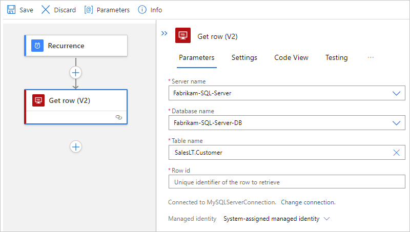
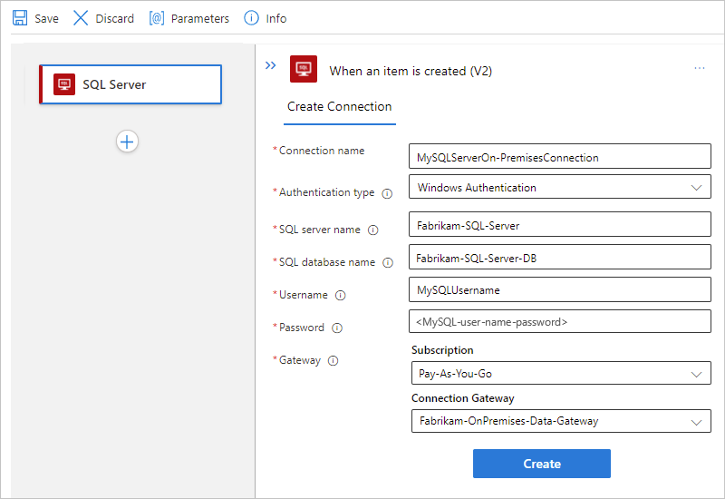

# Connect to an SQL database from workflows in Azure Logic Apps

This article shows how to access your SQL database from a workflow in Azure Logic Apps with the SQL Server connector. You can then create automated workflows that run when triggered by events in your SQL database or in other systems and run actions to manage your SQL data and resources.

For example, your workflow can run actions that get, insert, and delete data or that can run SQL queries and stored procedures. Your workflow can check for new records in a non-SQL database, do some processing work, use the results to create new records in your SQL database, and send email alerts about the new records.

If you're new to Azure Logic Apps, review the following get started documentation:

* [What is Azure Logic Apps](../logic-apps/logic-apps-overview.md)
* [Quickstart: Create your first logic app workflow](../logic-apps/quickstart-create-first-logic-app-workflow.md)

## Supported SQL editions

The SQL Server connector supports the following SQL editions:

* [SQL Server](/sql/sql-server/sql-server-technical-documentation)
* [Azure SQL Database](/azure/azure-sql/database/sql-database-paas-overview)
* [Azure SQL Managed Instance](/azure/azure-sql/managed-instance/sql-managed-instance-paas-overview)

## Connector technical reference

The SQL Server connector has different versions, based on [logic app type and host environment](../logic-apps/logic-apps-overview.md#resource-environment-differences).

| Logic app | Environment | Connector version |
|-----------|-------------|-------------------|
| **Consumption** | Multi-tenant Azure Logic Apps | Managed connector (Standard class). For more information, review the following documentation: <br><br>- [SQL Server managed connector reference](/connectors/sql). <br>- [Managed connectors in Azure Logic Apps](managed.md) |
| **Consumption** | Integration service environment (ISE) | Managed connector (Standard class) and ISE version, which has different message limits than the Standard class. For more information, review the following documentation: <br><br>- [SQL Server managed connector reference](/connectors/sql) <br>- [ISE message limits](../logic-apps/logic-apps-limits-and-config.md#message-size-limits) <br>- [Managed connectors in Azure Logic Apps](managed.md) |
| **Standard** | Single-tenant Azure Logic Apps and App Service Environment v3 (Windows plans only) | Managed connector (Azure-hosted) and built-in connector, which is [service provider based](../logic-apps/custom-connector-overview.md#service-provider-interface-implementation). The built-in version differs in the following ways: <br><br>- The built-in version doesn't have triggers. You can use either an SQL managed connector trigger or a different trigger. <br><br>- The built-in version connects directly to an SQL server and database requiring only a connection string. You don't need the on-premises data gateway. <br><br>- The built-in version can directly access Azure virtual networks. You don't need the on-premises data gateway.<br><br>For more information, review the following documentation: <br><br>- [SQL Server managed connector reference](/connectors/sql/) <br>- [SQL Server built-in connector reference](#built-in-connector-operations) section later in this article <br>- [Built-in connectors in Azure Logic Apps](built-in.md) |

## Limitations

For more information, review the [SQL Server managed connector reference](/connectors/sql/) or the [SQL Server built-in connector reference](#built-in-connector-operations).

## Prerequisites

* An Azure account and subscription. If you don't have a subscription, [sign up for a free Azure account](https://azure.microsoft.com/free/?WT.mc_id=A261C142F).

* [SQL Server database](/sql/relational-databases/databases/create-a-database), [Azure SQL Database](/azure/azure-sql/database/single-database-create-quickstart), or [SQL Managed Instance](/azure/azure-sql/managed-instance/instance-create-quickstart).

  The SQL Server connector requires that your tables contain data so that the connector operations can return results when called. For example, if you use Azure SQL Database, you can use the included sample databases to try the SQL Server connector operations.

* The information required to create an SQL database connection, such as your SQL server and database name. If you're using Windows Authentication or SQL Server Authentication to authenticate access, you also need your user name and password. You can usually find this information in the connection string.

  > [!IMPORTANT]
  >
  > If you use an SQL Server connection string that you copied directly from the Azure portal, 
  > you have to manually add your password to the connection string.

  * For an SQL database in Azure, the connection string has the following format: 

    `Server=tcp:{your-server-name}.database.windows.net,1433;Initial Catalog={your-database-name};Persist Security Info=False;User ID={your-user-name};Password={your-password};MultipleActiveResultSets=False;Encrypt=True;TrustServerCertificate=False;Connection Timeout=30;`

    1. To find this string in the [Azure portal](https://portal.azure.com), open your database.

    1. On the database menu, under **Properties**, select **Connection strings**.

  * For an on-premises SQL server, the connection string has the following format:

    `Server={your-server-address};Database={your-database-name};User Id={your-user-name};Password={your-password};`

* The logic app workflow where you want to access your SQL database. To start your workflow with a SQL Server trigger, you have to start with a blank workflow. To use a SQL Server action, start your workflow with any trigger.

<a name="multi-tenant-or-ise"></a>

* To connect to an on-premises SQL server, the following extra requirements apply, based on whether you have a Consumption or Standard logic app workflow.

  * Consumption logic app workflow

    * In multi-tenant Azure Logic Apps, you need the [on-premises data gateway](../logic-apps/logic-apps-gateway-install.md) installed on a local computer and a [data gateway resource that's already created in Azure](../logic-apps/logic-apps-gateway-connection.md).

    * In an ISE, you don't need the on-premises data gateway for SQL Server Authentication and non-Windows Authentication connections, and you can use the ISE-versioned SQL Server connector. For Windows Authentication, you need the [on-premises data gateway](../logic-apps/logic-apps-gateway-install.md) on a local computer and a [data gateway resource that's already created in Azure](../logic-apps/logic-apps-gateway-connection.md). The ISE-version connector doesn't support Windows Authentication, so you have to use the regular SQL Server managed connector.

  * Standard logic app workflow

    You can use the SQL Server built-in connector, which requires a connection string. The built-in connector currently supports only SQL Server Authentication. You can adjust connection pooling by specifying parameters in the connection string. For more information, review [Connection Pooling](/dotnet/framework/data/adonet/connection-pooling).

    To use the SQL Server managed connector, follow the same requirements as a Consumption logic app workflow in multi-tenant Azure Logic Apps.

    For other connector requirements, review [SQL Server managed connector reference](/connectors/sql/).

<a name="add-sql-trigger"></a>

## Add a SQL Server trigger

The following steps use the Azure portal, but with the appropriate Azure Logic Apps extension, you can also use the following tools to create logic app workflows:

* Consumption logic app workflows: [Visual Studio](../logic-apps/quickstart-create-logic-apps-with-visual-studio.md) or [Visual Studio Code](../logic-apps/quickstart-create-logic-apps-visual-studio-code.md)

* Standard logic app workflows: [Visual Studio Code](../logic-apps/create-single-tenant-workflows-visual-studio-code.md)

### [Consumption](#tab/consumption)

1. In the [Azure portal](https://portal.azure.com), open your blank logic app workflow in the designer.

1. Find and select the [SQL Server trigger](/connectors/sql) that you want to use.

   1. On the designer, under the search box, select **Standard**.

   1. In the search box, enter **sql server**.

   1. From the triggers list, select the SQL trigger that you want.

      This example continues with the trigger named **When an item is created**.

      

1. Provide the [information for your connection](#create-connection). When you're done, select **Create**.

1. After the trigger information box appears, specify the interval and frequency for how often the trigger checks the table.

1. To add other properties available for this trigger, open the **Add new parameter** list and select those properties.

   This trigger returns only one row from the selected table, and nothing else. To perform other tasks, continue by adding either a [SQL Server connector action](#add-sql-action) or [another action](../connectors/apis-list.md) that performs the next task that you want in your logic app workflow.

   For example, to view the data in this row, you can add other actions that create a file that includes the fields from the returned row, and then send email alerts. To learn about other available actions for this connector, see the [SQL Server managed connector reference](/connectors/sql/).

1. When you're done, save your workflow. On the designer toolbar, select **Save**.

### [Standard](#tab/standard)

In Standard logic app workflows, only the SQL Server managed connector has triggers. The SQL Server built-in connector doesn't have any triggers.

1. In the [Azure portal](https://portal.azure.com), open your blank logic app workflow in the designer.

1. Find and select the [SQL Server trigger](/connectors/sql) that you want to use.

   1. On the designer, select **Choose an operation**.

   1. Under the **Choose an operation** search box, select **Azure**.

   1. In the search box, enter **sql server**.

   1. From the triggers list, select the SQL trigger that you want.

      This example continues with the trigger named **When an item is created**.

      

1. Provide the [information for your connection](#create-connection). When you're done, select **Create**.  

1. After the trigger information box appears, specify the interval and frequency for how often the trigger checks the table.

1. To add other properties available for this trigger, open the **Add new parameter** list and select those properties.

   This trigger returns only one row from the selected table, and nothing else. To perform other tasks, continue by adding either a [SQL Server connector action](#add-sql-action) or [another action](../connectors/apis-list.md) that performs the next task that you want in your logic app workflow.

   For example, to view the data in this row, you can add other actions that create a file that includes the fields from the returned row, and then send email alerts. To learn about other available actions for this connector, see the [SQL Server managed connector reference](/connectors/sql/).

1. When you're done, save your workflow. On the designer toolbar, select **Save**.

---

When you save your workflow, this step automatically publishes your updates to your deployed logic app, which is live in Azure. With only a trigger, your workflow just checks the SQL database based on your specified schedule. You have to [add an action](#add-sql-action) that responds to the trigger.

<a name="trigger-recurrence-shift-drift"></a>

## Trigger recurrence shift and drift (daylight saving time)

Recurring connection-based triggers where you need to create a connection first, such as the SQL Server managed connector trigger, differ from built-in triggers that run natively in Azure Logic Apps, such as the [Recurrence trigger](../connectors/connectors-native-recurrence.md). For recurring connection-based triggers, the recurrence schedule isn't the only driver that controls execution, and the time zone only determines the initial start time. Subsequent runs depend on the recurrence schedule, the last trigger execution, *and* other factors that might cause run times to drift or produce unexpected behavior. For example, unexpected behavior can include failure to maintain the specified schedule when daylight saving time (DST) starts and ends.

To make sure that the recurrence time doesn't shift when DST takes effect, manually adjust the recurrence. That way, your workflow continues to run at the expected or specified start time. Otherwise, the start time shifts one hour forward when DST starts and one hour backward when DST ends. For more information, see [Recurrence for connection-based triggers](../connectors/apis-list.md#recurrence-for-connection-based-triggers).

<a name="add-sql-action"></a>

## Add a SQL Server action

The following steps use the Azure portal, but with the appropriate Azure Logic Apps extension, you can also use Visual Studio to edit Consumption logic app workflows or Visual Studio Code to the following tools to edit logic app workflows:

* Consumption logic app workflows: [Visual Studio](../logic-apps/quickstart-create-logic-apps-with-visual-studio.md) or [Visual Studio Code](../logic-apps/quickstart-create-logic-apps-visual-studio-code.md)

* Standard logic app workflows: [Visual Studio Code](../logic-apps/create-single-tenant-workflows-visual-studio-code.md)

In this example, the logic app workflow starts with the [Recurrence trigger](../connectors/connectors-native-recurrence.md), and calls an action that gets a row from an SQL database.

### [Consumption](#tab/consumption)

1. In the [Azure portal](https://portal.azure.com), open your logic app workflow in the designer.

1. Find and select the [SQL Server action](/connectors/sql) that you want to use.

   This example continues with the action named **Get row**.

   1. Under the trigger or action where you want to add the SQL action, select **New step**.

      Or, to add an action between existing steps, move your pointer over the connecting arrow. Select the plus sign (**+**) that appears, and then select **Add an action**.

   1. Under the **Choose an operation** search box, select **Standard**.

   1. In the search box, enter **sql server**.

   1. From the actions list, select the SQL Server action that you want.

      This example uses the **Get row** action, which gets a single record.

      

1. Provide the [information for your connection](#create-connection). When you're done, select **Create**.

1. If you haven't already provided the SQL server name and database name, provide those values. Otherwise, from the **Table name** list, select the table that you want to use.  In the **Row id** property, enter the ID for the record that you want.

   In this example, the table name is **SalesLT.Customer**.

   

   This action returns only one row from the selected table, and nothing else. To view the data in this row, add other actions. For example, such actions might create a file, include the fields from the returned row, and store the file in a cloud storage account. To learn about other available actions for this connector, see the [connector's reference page](/connectors/sql/).

1. When you're done, save your workflow. On the designer toolbar, select **Save**.

### [Standard](#tab/standard)

1. In the [Azure portal](https://portal.azure.com), open your logic app workflow in the designer.

1. Find and select the SQL Server action that you want to use.

   1. Under the trigger or action where you want to add the action, select the plus sign (**+**), and then select **Add an action**.

      Or, to add an action between existing steps, select the plus sign (**+**) on the connecting arrow, and then select **Add an action**.

   1. Under the **Choose an operation** search box, select either of the following options:

      * **Built-in** when you want to use SQL Server [built-in actions](#built-in-connector-operations) such as **Execute query**

        

      * **Azure** when you want to use [SQL Server managed connector actions](/connectors/sql) such as **Get row**

        

   1. In the search box, enter **sql server**.

   1. From the actions list, select the SQL Server action that you want.

      * [Built-in actions](#built-in-connector-operations)

        This example selects the built-in action named **Execute query**.

        

      * [Managed actions](/connectors/sql/#actions)

        This example selects the action named **Get row**, which gets a single record.

        

1. Provide the [information for your connection](#create-connection). When you're done, select **Create**.

1. Provide the information required by your selected action.

   The following example continues with the managed action named **Get row**. If you haven't already provided the SQL server name and database name, provide those values. Otherwise, from the **Table name** list, select the table that you want to use.  In this example, the table name is **SalesLT.Customer**. In the **Row id** property, enter the ID for the record that you want.

   

   This action returns only one row from the selected table, and nothing else. To view the data in this row, add other actions. For example, such actions might create a file, include the fields from the returned row, and store the file in a cloud storage account. To learn about other available actions for this connector, review the [managed connector's reference page](/connectors/sql/).

1. When you're done, save your workflow. On the designer toolbar, select **Save**.

---

<a name="create-connection"></a>

## Connect to your database

[!INCLUDE [Create connection general intro](../../includes/connectors-create-connection-general-intro.md)]

After you provide this information, continue with the following steps based on your target database:

* [Connect to cloud-based Azure SQL Database or SQL Managed Instance](#connect-azure-sql-db)
* [Connect to on-premises SQL Server](#connect-sql-server)

<a name="connect-azure-sql-db"></a>

### Connect to Azure SQL Database or SQL Managed Instance

To access a SQL Managed Instance without using the on-premises data gateway or integration service environment, you have to [set up the public endpoint on the SQL Managed Instance](/azure/azure-sql/managed-instance/public-endpoint-configure). The public endpoint uses port 3342, so make sure that you specify this port number when you create the connection from your logic app.

In the connection information box, complete the following steps:

1. For **Connection name**, provide a name to use for your connection.

1. For **Authentication type**, select the authentication that's required and enabled on your database in Azure SQL Database or SQL Managed Instance:

   | Authentication | Description |
   |----------------|-------------|
   | **Service principal (Azure AD application)** | - Supported with the SQL Server managed connector. <br><br>- Requires an Azure AD application and service principal. For more information, see [Create an Azure AD application and service principal that can access resources using the Azure portal](../active-directory/develop/howto-create-service-principal-portal.md). |
   | **Logic Apps Managed Identity** | - Supported with the SQL Server managed connector and ISE-versioned connector. <br><br>- Requires the following items: <br><br>--- A valid managed identity that's [enabled on your logic app resource](../logic-apps/create-managed-service-identity.md) and has access to your database. <br><br>--- **SQL DB Contributor** role access to the SQL Server resource <br><br>--- **Contributor** access to the resource group that includes the SQL Server resource. <br><br>For more information, see [SQL - Server-Level Roles](/sql/relational-databases/security/authentication-access/server-level-roles). |
   | [**Azure AD Integrated**](/azure/azure-sql/database/authentication-aad-overview) | - Supported with the SQL Server managed connector and ISE-versioned connector. <br><br>- Requires a valid managed identity in Azure Active Directory (Azure AD) that's [enabled on your logic app resource](../logic-apps/create-managed-service-identity.md) and has access to your database. For more information, see these topics: <br><br>- [Azure SQL Security Overview - Authentication](/azure/azure-sql/database/security-overview#authentication) <br>- [Authorize database access to Azure SQL - Authentication and authorization](/azure/azure-sql/database/logins-create-manage#authentication-and-authorization) <br>- [Azure SQL - Azure AD Integrated authentication](/azure/azure-sql/database/authentication-aad-overview) |
   | [**SQL Server Authentication**](/sql/relational-databases/security/choose-an-authentication-mode#connecting-through-sql-server-authentication) | - Supported with the SQL Server managed connector, SQL Server built-in connector, and ISE-versioned connector. <br><br>- Requires the following items: <br><br>--- A data gateway resource that's previously created in Azure for your connection, regardless whether your logic app is in multi-tenant Azure Logic Apps or an ISE. <br><br>--- A valid user name and strong password that are created and stored in your SQL Server database. For more information, see the following topics: <br><br>- [Azure SQL Security Overview - Authentication](/azure/azure-sql/database/security-overview#authentication) <br>- [Authorize database access to Azure SQL - Authentication and authorization](/azure/azure-sql/database/logins-create-manage#authentication-and-authorization) |

   The following examples show how the connection information box might appear if you select **Azure AD Integrated** authentication.

   * Consumption logic app workflows

     

   * Standard logic app workflows

     

1. After you select **Azure AD Integrated**, select **Sign in**. Based on whether you use Azure SQL Database or SQL Managed Instance, select your user credentials for authentication.

1. Select these values for your database:

   | Property | Required | Description |
   |----------|----------|-------------|
   | **Server name** | Yes | The address for your SQL server, for example, **Fabrikam-Azure-SQL.database.windows.net** |
   | **Database name** | Yes | The name for your SQL database, for example, **Fabrikam-Azure-SQL-DB** |
   | **Table name** | Yes | The table that you want to use, for example, **SalesLT.Customer** |

   > [!TIP]
   >
   > To provide your database and table information, you have these options:
   > 
   > * Find this information in your database's connection string. For example, in the Azure portal, find and open your database. On the database menu, select either **Connection strings** or **Properties**, where you can find the following string:
   >
   >   `Server=tcp:{your-server-address}.database.windows.net,1433;Initial Catalog={your-database-name};Persist Security Info=False;User ID={your-user-name};Password={your-password};MultipleActiveResultSets=False;Encrypt=True;TrustServerCertificate=False;Connection Timeout=30;`
   >
   > * By default, tables in system databases are filtered out, so they might not automatically appear when you select a system database. As an alternative, you can manually enter the table name after you select **Enter custom value** from the database list.
   >

   This database information box looks similar to the following example:

   * Consumption logic app workflows

     

   * Standard logic app workflows

     

1. Now, continue with the steps that you haven't completed yet in either [Add a SQL trigger](#add-sql-trigger) or [Add a SQL action](#add-sql-action).

<a name="connect-sql-server"></a>

### Connect to on-premises SQL Server

In the connection information box, complete the following steps:

1. For connections to your on-premises SQL server that require the on-premises data gateway, make sure that you've [completed these prerequisites](#multi-tenant-or-ise).

   Otherwise, your data gateway resource won't appear in the **Connection Gateway** list when you create your connection.

1. For **Authentication Type**, select the authentication that's required and enabled on your SQL Server:

   | Authentication | Description |
   |----------------|-------------|
   | [**SQL Server Authentication**](/sql/relational-databases/security/choose-an-authentication-mode#connecting-through-sql-server-authentication) | - Supported with the SQL Server managed connector, SQL Server built-in connector, and ISE-versioned connector. <br><br>- Requires the following items: <br><br>--- A data gateway resource that's previously created in Azure for your connection, regardless whether your logic app is in multi-tenant Azure Logic Apps or an ISE. <br><br>--- A valid user name and strong password that are created and stored in your SQL Server. <br><br>For more information, see [SQL Server Authentication](/sql/relational-databases/security/choose-an-authentication-mode#connecting-through-sql-server-authentication). |
   | [**Windows Authentication**](/sql/relational-databases/security/choose-an-authentication-mode#connecting-through-windows-authentication) | - Supported with the SQL Server managed connector. <br><br>- Requires the following items: <br><br>--- A data gateway resource that's previously created in Azure for your connection, regardless whether your logic app is in multi-tenant Azure Logic Apps or an ISE. <br><br>--- A valid Windows user name and password to confirm your identity through your Windows account. <br><br>For more information, see [Windows Authentication](/sql/relational-databases/security/choose-an-authentication-mode#connecting-through-windows-authentication). |

1. Select or provide the following values for your SQL database:

   | Property | Required | Description |
   |----------|----------|-------------|
   | **SQL server name** | Yes | The address for your SQL server, for example, `Fabrikam-Azure-SQL.database.windows.net` |
   | **SQL database name** | Yes | The name for your SQL Server database, for example, `Fabrikam-Azure-SQL-DB` |
   | **Username** | Yes | Your user name for the SQL server and database |
   | **Password** | Yes | Your password for the SQL server and database |
   | **Subscription** |  Yes, for Windows authentication | The Azure subscription for the data gateway resource that you previously created in Azure |
   | **Connection Gateway** | Yes, for Windows authentication | The name for the data gateway resource that you previously created in Azure <br><br><br><br>**Tip**: If your gateway doesn't appear in the list, check that you correctly [set up your gateway](../logic-apps/logic-apps-gateway-connection.md). |

   > [!TIP]
   > You can find this information in your database's connection string:
   > 
   > * `Server={your-server-address}`
   > * `Database={your-database-name}`
   > * `User ID={your-user-name}`
   > * `Password={your-password}`

   The following examples show how the connection information box might appear if you select **Windows** authentication.

   * Consumption logic app workflows

     

   * Standard logic app workflows

     

1. When you're ready, select **Create**.

1. Now, continue with the steps that you haven't completed yet in either [Add a SQL trigger](#add-sql-trigger) or [Add a SQL action](#add-sql-action).

<a name="handle-bulk-data"></a>

## Handle bulk data

Sometimes, you work with result sets so large that the connector doesn't return all the results at the same time. Or, you want better control over the size and structure for your result sets. The following list includes some ways that you can handle such large result sets:

* To help you manage results as smaller sets, turn on *pagination*. For more information, see [Get bulk data, records, and items by using pagination](../logic-apps/logic-apps-exceed-default-page-size-with-pagination.md). For more information, see [SQL Pagination for bulk data transfer with Logic Apps](https://social.technet.microsoft.com/wiki/contents/articles/40060.sql-pagination-for-bulk-data-transfer-with-logic-apps.aspx).

* Create a [*stored procedure*](/sql/relational-databases/stored-procedures/stored-procedures-database-engine) that organizes the results the way that you want. The SQL Server connector provides many backend features that you can access by using Azure Logic Apps so that you can more easily automate business tasks that work with SQL database tables.

  When a SQL action gets or inserts multiple rows, your logic app workflow can iterate through these rows by using an [*until loop*](../logic-apps/logic-apps-control-flow-loops.md#until-loop) within these [limits](../logic-apps/logic-apps-limits-and-config.md). However, when your logic app has to work with record sets so large, for example, thousands or millions of rows, that you want to minimize the costs resulting from calls to the database.

  To organize the results in the way that you want, you can create a stored procedure that runs in your SQL instance and uses the **SELECT - ORDER BY** statement. This solution gives you more control over the size and structure of your results. Your logic app calls the stored procedure by using the SQL Server connector's **Execute stored procedure** action. For more information, see [SELECT - ORDER BY Clause](/sql/t-sql/queries/select-order-by-clause-transact-sql).

  > [!NOTE]
  >
  > The SQL Server connector has a stored procedure timeout limit that's [less than 2 minutes](/connectors/sql/#known-issues-and-limitations). 
  > Some stored procedures might take longer than this limit to complete, causing a `504 Timeout` error. You can work around this problem 
  > by using a SQL completion trigger, native SQL pass-through query, a state table, and server-side jobs.
  > 
  > For this task, you can use the [Azure Elastic Job Agent](/azure/azure-sql/database/elastic-jobs-overview) 
  > for [Azure SQL Database](/azure/azure-sql/database/sql-database-paas-overview). For 
  > [SQL Server on premises](/sql/sql-server/sql-server-technical-documentation) 
  > and [SQL Managed Instance](/azure/azure-sql/managed-instance/sql-managed-instance-paas-overview), 
  > you can use the [SQL Server Agent](/sql/ssms/agent/sql-server-agent). To learn more, see 
  > [Handle long-running stored procedure timeouts in the SQL Server connector for Azure Logic Apps](../logic-apps/handle-long-running-stored-procedures-sql-connector.md).

### Handle dynamic bulk data

When you call a stored procedure by using the SQL Server connector, the returned output is sometimes dynamic. In this scenario, follow these steps:

1. In the [Azure portal](https://portal.azure.com), open your logic app workflow in the designer.

1. View the output format by performing a test run. Copy and save your sample output.

1. In the designer, under the action where you call the stored procedure, add a new action.

1. In the **Choose an operation** box, find and select the action named [**Parse JSON**](../logic-apps/logic-apps-perform-data-operations.md#parse-json-action).

1. In the **Parse JSON** action, select **Use sample payload to generate schema**.

1. In the **Enter or paste a sample JSON payload** box, paste your sample output, and select **Done**.

   > [!NOTE]
   >
   > If you get an error that Azure Logic Apps can't generate a schema, check that your 
   > sample output's syntax is correctly formatted. If you still can't generate the schema, 
   > in the **Schema** box, manually enter the schema.

1. When you're done, save your workflow.

1. To reference the JSON content properties, click inside the edit boxes where you want to reference those properties so that the dynamic content list appears. In the list, under the [**Parse JSON**](../logic-apps/logic-apps-perform-data-operations.md#parse-json-action) heading, select the data tokens for the JSON content properties that you want.

<a name="built-in-connector-app-settings"></a>

## Built-in connector app settings

In a Standard logic app resource, the SQL Server built-in connector includes app settings that control various thresholds for performance, throughput, capacity, and so on. For example, you can change the query timeout value from 30 seconds. For more information, review [Reference for app settings - local.settings.json](../logic-apps/edit-app-settings-host-settings.md#reference-local-settings-json).

<a name="built-in-connector-operations"></a>

## SQL built-in connector operations

The SQL Server built-in connector is available only for Standard logic app workflows and provides the following actions, but no triggers:

| Action | Description |
|--------|-------------|
| [**Delete rows**](#delete-rows) | Deletes and returns the table rows that match the specified **Where condition** value. |
| [**Execute query**](#execute-query) | Runs a query on an SQL database. |
| [**Execute stored procedure**](#execute-stored-procedure) | Runs a stored procedure on an SQL database. |
| [**Get rows**](#get-rows) | Gets the table rows that match the specified **Where condition** value. |
| [**Get tables**](#get-tables) | Gets all the tables from the database. |
| [**Insert row**](#insert-row) | Inserts a single row in the specified table. |
| [**Update rows**](#update-rows) | Updates the specified columns in all the table rows that match the specified **Where condition** value using the **Set columns** column names and values. |

<a name="delete-rows"></a>

### Delete rows

Operation ID: `deleteRows`

Deletes and returns the table rows that match the specified **Where condition** value.

#### Parameters

| Name | Key | Required | Type | Description |
|------|-----|----------|------|-------------|
| **Table name** | `tableName` | True | String | The name for the table |
| **Where condition** | `columnValuesForWhereCondition` | True | Object | This object contains the column names and corresponding values used for selecting the rows to delete. To provide this information, follow the *key-value* pair format, for example, *columnName* and *columnValue*, which also lets you specify single or specific rows to delete. |

#### Returns

| Name | Type |
|------|------|
| **Result** | An array object that returns all the deleted rows. Each row contains the column name and the corresponding deleted value. |
| **Result Item** | An array object that returns one deleted row at a time. A **For each** loop is automatically added to your workflow to iterate through the array. Each row contains the column name and the corresponding deleted value. |

*Example*

The following example shows sample parameter values for the **Delete rows** action:

**Sample values**

| Parameter | JSON name | Sample value |
|-----------|-----------|--------------|
| **Table name** | `tableName` | tableName1 |
| **Where condition** | `columnValuesForWhereCondition` | Key-value pairs: <br><br>- <*columnName1*>, <*columnValue1*> <br><br>- <*columnName2*>, <*columnValue2*> |

**Parameters in the action's underlying JSON definition**

```json
"parameters": {
   "tableName": "tableName1",
   "columnValuesForWhereCondition": {
      "columnName1": "columnValue1",
      "columnName2": "columnValue2"
   }
},
```

<a name="execute-query"></a>

### Execute query

Operation ID: `executeQuery`

Runs a query on an SQL database.

#### Parameters

| Name | Key | Required | Type | Description |
|------|-----|----------|------|-------------|
| **Query** | `query` | True | Dynamic | The body for your SQL query |
| **Query parameters** | `queryParameters` | False | Objects | The parameters for your query. <br><br>**Note**: If the query requires input parameters, you must provide these parameters. |

#### Returns

| Name | Type |
|------|------|
| **Result** | An array object that returns all the query results. Each row contains the column name and the corresponding value. |
| **Result Item** | An array object that returns one query result at a time. A **For each** loop is automatically added to your workflow to iterate through the array. Each row contains the column name and the corresponding value. |

<a name="execute-stored-procedure"></a>

### Execute stored procedure

Operation ID: `executeStoredProcedure`

Runs a stored procedure on an SQL database.

#### Parameters

| Name | Key | Required | Type | Description |
|------|-----|----------|------|-------------|
| **Procedure name** | `storedProcedureName` | True | String | The name for your stored procedure |
| **Parameters** | `storedProcedureParameters` | False | Dynamic | The parameters for your stored procedure. <br><br>**Note**: If the stored procedure requires input parameters, you must provide these parameters. |

#### Returns

| Name | Type |
|------|------|
| **Result** | An object that contains the result sets array, return code, and output parameters |
| **Result Result Sets** | An object array that contains all the result sets from the stored procedure, which might return zero, one, or multiple result sets. |
| **Result Return Code** | An integer that represents the status code from the stored procedure |
| **Result Stored Procedure Parameters** |  An object that contains the final values of the stored procedure's output and input-output parameters |
| **Status Code** | The status code from the **Execute stored procedure** operation |

<a name="get-rows"></a>

### Get rows

Operation ID: `getRows`

Gets the table rows that match the specified **Where condition** value.

#### Parameters

| Name | Key | Required | Type | Description |
|------|-----|----------|------|-------------|
| **Table name** | `tableName` | True | String | The name for the table |
| **Where condition** | `columnValuesForWhereCondition` | False | Dynamic | This object contains the column names and corresponding values used for selecting the rows to get. To provide this information, follow the *key-value* pair format, for example, *columnName* and *columnValue*, which also lets you specify single or specific rows to get. |

#### Returns

| Name | Type |
|------|------|
| **Result** | An array object that returns all the row results. |
| **Result Item** | An array object that returns one row result at a time. A **For each** loop is automatically added to your workflow to iterate through the array. |

*Example*

The following example shows sample parameter values for the **Get rows** action:

**Sample values**

| Parameter | JSON name | Sample value |
|-----------|-----------|--------------|
| **Table name** | `tableName` | tableName1 |
| **Where condition** | `columnValuesForWhereCondition` | Key-value pairs: <br><br>- <*columnName1*>, <*columnValue1*> <br><br>- <*columnName2*>, <*columnValue2*> |

**Parameters in the action's underlying JSON definition**

```json
"parameters": {
   "tableName": "tableName1",
   "columnValuesForWhereCondition": {
      "columnName1": "columnValue1",
      "columnName2": "columnValue2"
   }
},
```

<a name="get-tables"></a>

### Get tables

Operation ID: `getTables`

Gets a list of all the tables in the database.

#### Parameters

None.

#### Returns

| Name | Type |
|------|------|
| **Result** | An array object that contains the full names and display names for all tables in the database. |
| **Result Display Name** | An array object that contains the display name for each table in the database. A **For each** loop is automatically added to your workflow to iterate through the array. |
| **Result Full Name** | An array object that contains the full name for each table in the database. A **For each** loop is automatically added to your workflow to iterate through the array. |
| **Result Item** | An array object that returns the full name and display name one at time for each table. A **For each** loop is automatically added to your workflow to iterate through the array. |

<a name="insert-row"></a>

### Insert row

Operation ID: `insertRow`

Inserts a single row in the specified table.

| Name | Key | Required | Type | Description |
|------|-----|----------|------|-------------|
| **Table name** | `tableName` | True | String | The name for the table |
| **Set columns** | `setColumns` | False | Dynamic | This object contains the column names and corresponding values to insert. To provide this information, follow the *key-value* pair format, for example, *columnName* and *columnValue*. If the table has columns with default or autogenerated values, you can leave this field empty. |

#### Returns

| Name | Type |
|------|------|
| **Result** | The inserted row, including the names and values of any autogenerated, default, and null value columns. |

<a name="update-rows"></a>

### Update rows

Operation ID: `updateRows`

Updates the specified columns in all the table rows that match the specified **Where condition** value using the **Set columns** column names and values.

| Name | Key | Required | Type | Description |
|------|-----|----------|------|-------------|
| **Table name** | `tableName` | True | String | The name for the table |
| **Where condition** | `columnValuesForWhereCondition` | True | Dynamic | This object contains the column names and corresponding values for selecting the rows to update. To provide this information, follow the *key-value* pair format, for example, *columnName* and *columnValue*, which also lets you specify single or specific rows to update. |
| **Set columns** | `setColumns` | True | Dynamic | This object contains the column names and the corresponding values to use for the update. To provide this information, follow the *key-value* pair format, for example, *columnName* and *columnValue*. |

#### Returns

| Name | Type |
|------|------|
| **Result** | An array object that returns all the columns for the updated rows. |
| **Result Item** | An array object that returns one column at a time from the updated rows. A **For each** loop is automatically added to your workflow to iterate through the array. |

*Example*

The following example shows sample parameter values for the **Update rows** action:

**Sample values**

| Parameter | JSON name | Sample value |
|-----------|-----------|--------------|
| **Table name** | `tableName` | tableName1 |
| **Where condition** | `columnValuesForWhereCondition` | Key-value pairs: <br><br>- <*columnName1*>, <*columnValue1*> <br><br>- <*columnName2*>, <*columnValue2*> |

**Parameters in the action's underlying JSON definition**

```json
"parameters": {
   "tableName": "tableName1",
   "columnValuesForWhereCondition": {
      "columnName1": "columnValue1",
      "columnName2": "columnValue2"
   }
},
```

## Troubleshoot problems

<a name="connection-problems"></a>

### Connection problems

Connection problems can commonly happen, so to troubleshoot and resolve these kinds of issues, review [Solving connectivity errors to SQL Server](https://support.microsoft.com/help/4009936/solving-connectivity-errors-to-sql-server). The following list provides some examples:

* **A network-related or instance-specific error occurred while establishing a connection to SQL Server. The server was not found or was not accessible. Verify that the instance name is correct and that SQL Server is configured to allow remote connections.**

* **(provider: Named Pipes Provider, error: 40 - Could not open a connection to SQL Server) (Microsoft SQL Server, Error: 53)**

* **(provider: TCP Provider, error: 0 - No such host is known.) (Microsoft SQL Server, Error: 11001)**

## Next steps

* [Managed connectors for Azure Logic Apps](/connectors/connector-reference/connector-reference-logicapps-connectors)
* [Built-in connectors for Azure Logic Apps](built-in.md)
