<properties
	pageTitle="Learn how to use the Twitter connector in logic apps | Microsoft Azure"
	description="Overview of Twitter connector with REST API parameters"
	services=""
	documentationCenter="" 
	authors="msftman"
	manager="erikre"
	editor=""
	tags="connectors"/>

<tags
   ms.service="multiple"
   ms.devlang="na"
   ms.topic="article"
   ms.tgt_pltfrm="na"
   ms.workload="na" 
   ms.date="07/18/2016"
   ms.author="deonhe"/>

# Get started with the Twitter connector

With the Twitter connector you can:

- Post tweets and get tweets
- Access timelines, friends and followers
- Perform any of the other actions and triggers described below  

To use [any connector](./apis-list.md), you first need to create a logic app. You can get started by [creating a logic app now](../app-service-logic/app-service-logic-create-a-logic-app.md).  

## Connect to Twitter

Before your logic app can access any service, you first need to create a *connection* to the service. A [connection](./connectors-overview.md) provides connectivity between a logic app and another service.  

### Create a connection to Twitter

>[AZURE.INCLUDE [Steps to create a connection to Twitter](../../includes/connectors-create-api-twitter.md)]

## Use a Twitter trigger

A trigger is an event that can be used to start the workflow defined in a logic app. [Learn more about triggers](../app-service-logic/app-service-logic-what-are-logic-apps.md#logic-app-concepts).

In this example, I will show you how to use the **When a new tweet is posted**  trigger to search for #Seattle and, if #Seattle is found, update a file in Dropbox with the text from the tweet. In an enterprise example, you could search for the name of your company and update a SQL database with the text from the tweet.

1. Enter *twitter* in the search box on the logic apps designer then select the **Twitter - When a new tweet is posted**  trigger   
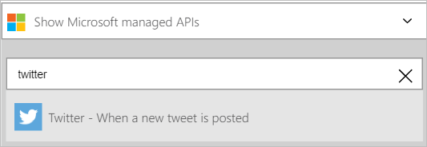  
- Enter *#Seattle* in the **Search Text** control  
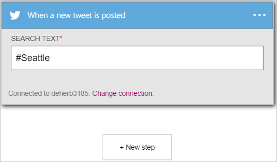 

At this point, your logic app has been configured with a trigger that will begin a run of the other triggers and actions in the workflow. 

>[AZURE.NOTE]For a logic app to be functional, it must contain at least one trigger and one action. Follow the steps in the next section to add an action.  

## Add a condition
Since we are only interested in tweets from users with more than 50 users, a condition that confirms the number of followers must first be added to the logic app.  

1. Select **+ New step** to add the action you would like to take when #Seattle is found in a new tweet  
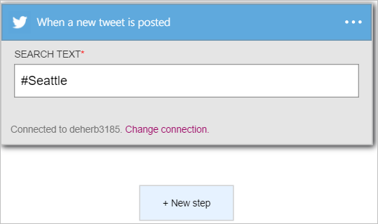  
- Select the **Add a condition** link.  
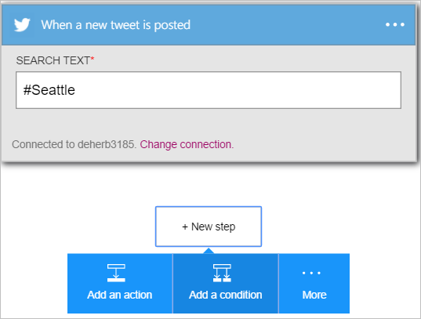   
This opens the **Condition** control where you can check conditions such as *is equal to*, *is less than*, *is greater than*, *contains*, etc.  
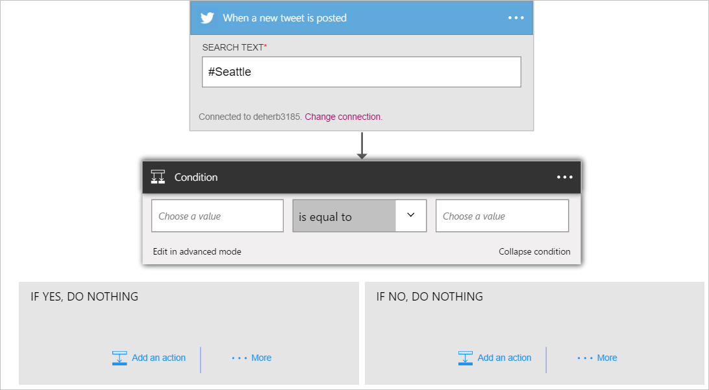   
- Select the **Choose a value** control.  
In this control, you can select one or more of the properties from any previous actions or triggers as the value whose condition will be evaluated to true or false.
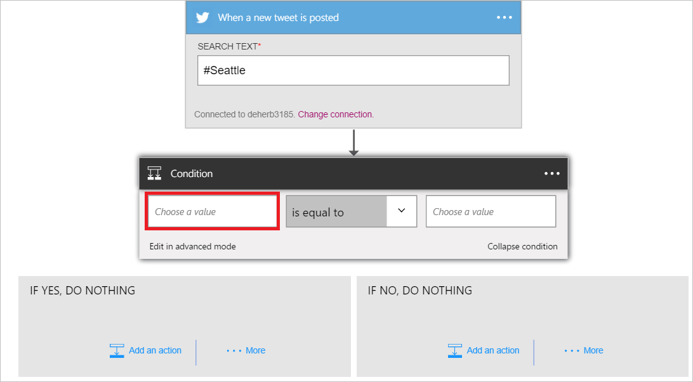   
- Select the **...** to expand the list of properties so you can see all the properties that are available.        
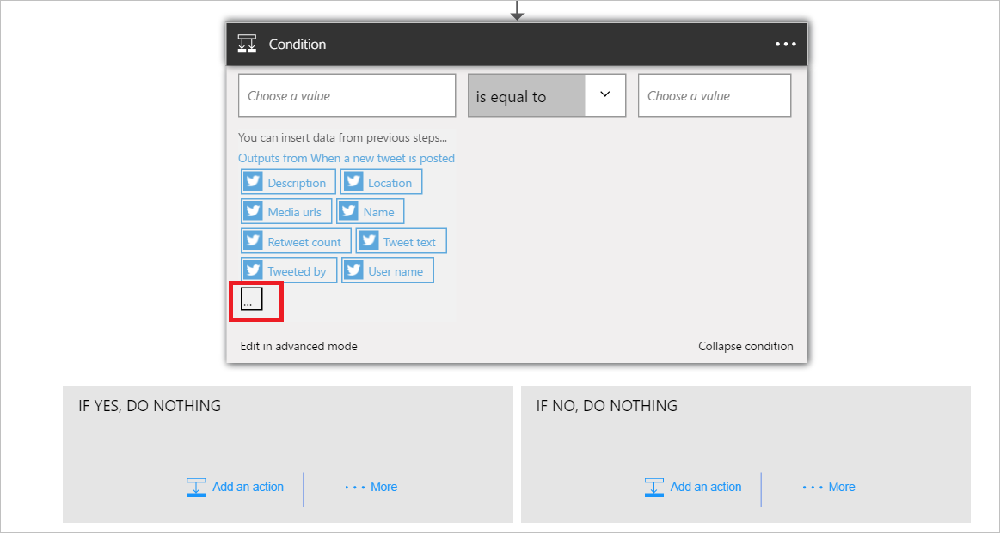   
- Select the **Followers count** property.    
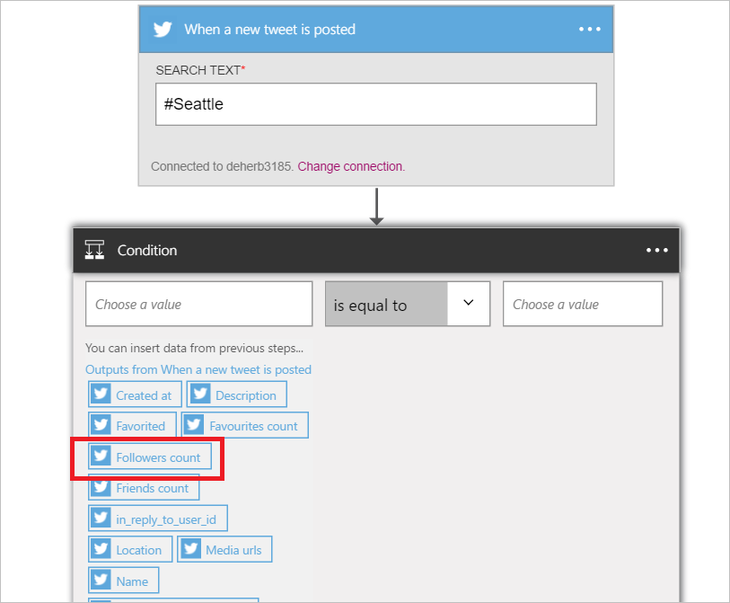   
- Notice the Followers count property is now in the value control.    
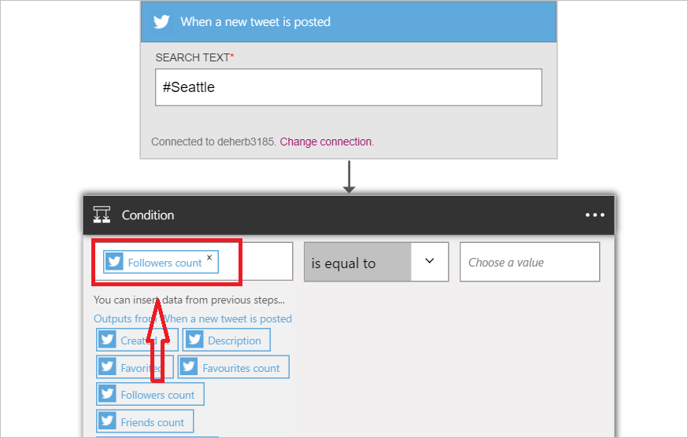   
- Select **is greater than** from the operators list.    
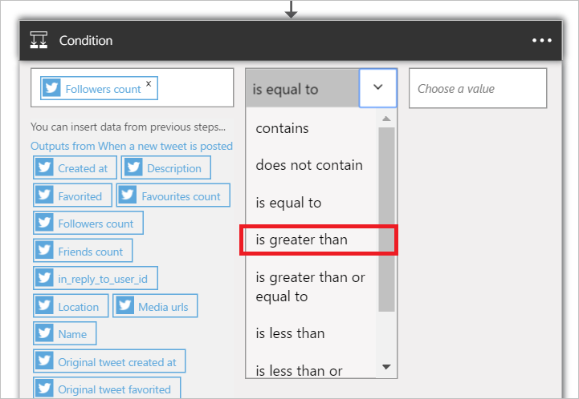   
- Enter 50 as the operand for the *is greater than* operator.  
The condition is now added. Save your work using the **Save** link on the menu above.    
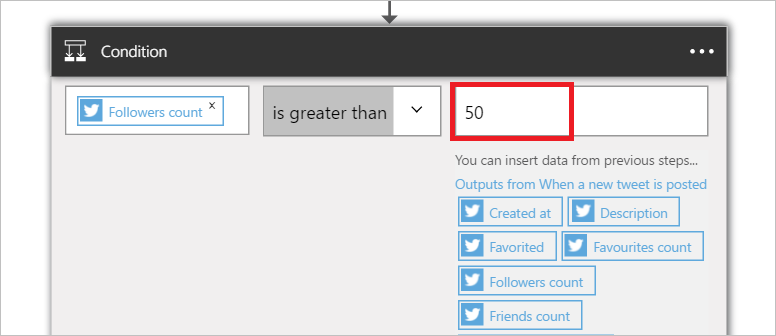   

## Use a Twitter action

An action is an operation carried out by the workflow defined in a logic app. [Learn more about actions](../app-service-logic/app-service-logic-what-are-logic-apps.md#logic-app-concepts).  

Now that you have added a trigger, follow these steps to add an action that will post a new tweet with the contents of the tweets found by the trigger. For the purposes of this walk-through only tweets from users with more than 50 followers will be posted.  

In the next step, you will add a Twitter action that will post a tweet using some of the properties of each tweet that has been posted by a user who has more than 50 followers.  

1. Select **Add an action**. This opens the search control where you can search for other actions and triggers.  
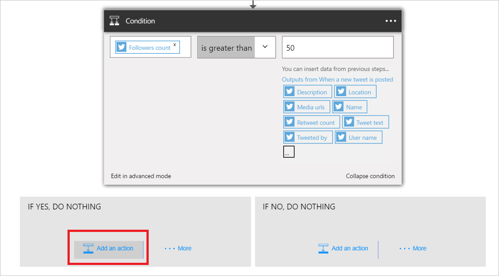   
- Enter *twitter* into the search box then select the **Twitter - Post a tweet** action. This opens the **Post a tweet** control where you will enter all details for the tweet being posted.      
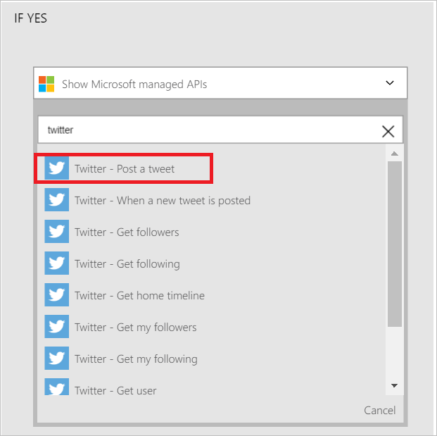   
- Select the **Tweet text** control. All outputs from previous actions and triggers in the logic app are now visible. You can select any of these and use them as part of the tweet text of the new tweet.     
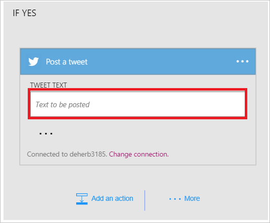   
- Select **User name**   
- Enter *says:* in the tweet text control. Do this just after User name.  
- Select *Tweet text*.       
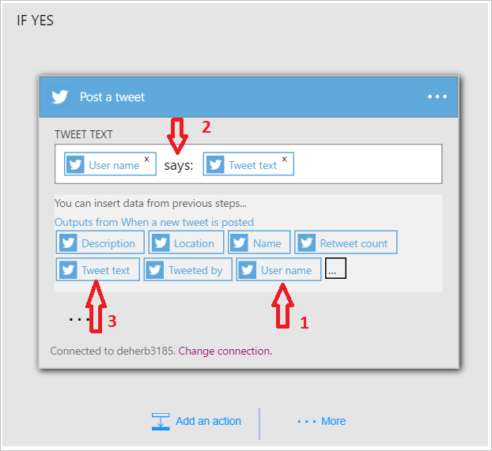   
- Save your work and send a tweet with the #Seattle hashtag to activate your workflow.  

## Technical Details

Here are the details about the triggers, actions and responses that this connection supports:

## Twitter triggers

The Twitter connector has the following trigger(s):  

|Trigger | Description|
|--- | ---|
|[When a new tweet is posted](connectors-create-api-twitter.md#when-a-new-tweet-is-posted)|This operation triggers a flow when a new tweet that matches a given search query is posted.|

## Twitter actions

The Twitter connector has the following actions:

|Action|Description|
|--- | ---|
|[Get user timeline](connectors-create-api-twitter.md#get-user-timeline)|This operation gets a list of the most recent tweets posted by a given user.|
|[Get home timeline](connectors-create-api-twitter.md#get-home-timeline)|This operation gets the most recent tweets and re-tweets posted by me and my followers.|
|[Search tweets](connectors-create-api-twitter.md#search-tweets)|This operation gets a list of relevant tweets matching the search query.|
|[Get followers](connectors-create-api-twitter.md#get-followers)|This operation gets the list of users that follow a given user.|
|[Get my followers](connectors-create-api-twitter.md#get-my-followers)|This operation gets the list of users who are following me.|
|[Get following](connectors-create-api-twitter.md#get-following)|The operation gets the list of people the given user follows.|
|[Get my following](connectors-create-api-twitter.md#get-my-following)|This operation gets the list of users that I am following.|
|[Get user](connectors-create-api-twitter.md#get-user)|This operation gets the profile details for a given user, such as user name, description, followers count, and more.|
|[Post a tweet](connectors-create-api-twitter.md#post-a-tweet)|This operation posts a new tweet.|
## Action details

Here are the details for the actions and triggers for this connector, along with their responses:

### Get user timeline
This operation gets a list of the most recent tweets posted by a given user. 

|Property Name| Display Name|Description|
| ---|---|---|
|userName*|User name|Twitter handle for the user|
|maxResults|Maximum results|Maximum number of tweets to return|

An * indicates that a property is required

#### Output Details

TweetModel: Representation of Tweet Object

| Property Name | Data Type | Description |
|---|---|---|
|TweetText|string|Text content of the tweet|
|TweetId|string|Id of the tweet|
|CreatedAt|string|Time at which the tweet was posted|
|RetweetCount|integer|Total number of re-tweets for the tweet|
|TweetedBy|string|Name of the user who has posted the tweet|
|MediaUrls|array|Url of the media posted along with the tweet|
|TweetLanguageCode|string|Language code of the tweet|
|TweetInReplyToUserId|string|User Id of the author of the tweet that the current tweet is a reply to|
|Favorited|boolean|Indicates whether the tweet is marked as favorited or not|
|UserMentions|array|List of users mentioned in the tweet|
|OriginalTweet|not defined|Original tweet from which the current tweet is re-tweeted|
|UserDetails|not defined|Details of the user who tweeted|

### Get home timeline
This operation gets the most recent tweets and re-tweets posted by me and my followers. 

|Property Name| Display Name|Description|
| ---|---|---|
|maxResults|Maximum results|Maximum number of tweets to return|

An * indicates that a property is required

#### Output Details

TweetModel: Representation of Tweet Object

| Property Name | Data Type | Description |
|---|---|---|
|TweetText|string|Text content of the tweet|
|TweetId|string|Id of the tweet|
|CreatedAt|string|Time at which the tweet was posted|
|RetweetCount|integer|Total number of re-tweets for the tweet|
|TweetedBy|string|Name of the user who has posted the tweet|
|MediaUrls|array|Url of the media posted along with the tweet|
|TweetLanguageCode|string|Language code of the tweet|
|TweetInReplyToUserId|string|User Id of the author of the tweet that the current tweet is a reply to|
|Favorited|boolean|Indicates whether the tweet is marked as favorited or not|
|UserMentions|array|List of users mentioned in the tweet|
|OriginalTweet|not defined|Original tweet from which the current tweet is re-tweeted|
|UserDetails|not defined|Details of the user who tweeted|

### Search tweets
This operation gets a list of relevant tweets matching the search query. 

|Property Name| Display Name|Description|
| ---|---|---|
|searchQuery*|Search text|Search term like "happy hour", #haiku, love OR hate|
|maxResults|Maximum results|Maximum number of tweets to return|

An * indicates that a property is required

#### Output Details

TweetModel: Representation of Tweet Object

| Property Name | Data Type | Description |
|---|---|---|
|TweetText|string|Text content of the tweet|
|TweetId|string|Id of the tweet|
|CreatedAt|string|Time at which the tweet was posted|
|RetweetCount|integer|Total number of re-tweets for the tweet|
|TweetedBy|string|Name of the user who has posted the tweet|
|MediaUrls|array|Url of the media posted along with the tweet|
|TweetLanguageCode|string|Language code of the tweet|
|TweetInReplyToUserId|string|User Id of the author of the tweet that the current tweet is a reply to|
|Favorited|boolean|Indicates whether the tweet is marked as favorited or not|
|UserMentions|array|List of users mentioned in the tweet|
|OriginalTweet|not defined|Original tweet from which the current tweet is re-tweeted|
|UserDetails|not defined|Details of the user who tweeted|

### Get followers
This operation gets the list of users that follow a given user. 

|Property Name| Display Name|Description|
| ---|---|---|
|userName*|User name|Twitter handle for the user|
|maxResults|Maximum results|Maximum number of users to return|

An * indicates that a property is required

#### Output Details

UserDetailsModel: Twitter user details

| Property Name | Data Type | Description |
|---|---|---|
|FullName|string|Name of the user|
|Location|string|Location of the user|
|Id|integer|Twitter Id of the user|
|UserName|string|Screen name of the user|
|FollowersCount|integer|Number of followers|
|Description|string|User description|
|StatusesCount|integer|User status count|
|FriendsCount|integer|Number of friends|
|FavouritesCount|integer|Number of tweets that the user has favorited|
|ProfileImageUrl|string|Url of the profile image|

### Get my followers
This operation gets the list of users who are following me. 

|Property Name| Display Name|Description|
| ---|---|---|
|maxResults|Maximum results|Maximum number of users to get|

An * indicates that a property is required

#### Output Details

UserDetailsModel: Twitter user details

| Property Name | Data Type | Description |
|---|---|---|
|FullName|string|Name of the user|
|Location|string|Location of the user|
|Id|integer|Twitter Id of the user|
|UserName|string|Screen name of the user|
|FollowersCount|integer|Number of followers|
|Description|string|User description|
|StatusesCount|integer|User status count|
|FriendsCount|integer|Number of friends|
|FavouritesCount|integer|Number of tweets that the user has favorited|
|ProfileImageUrl|string|Url of the profile image|

### Get following
The operation gets the list of people the given user follows. 

|Property Name| Display Name|Description|
| ---|---|---|
|userName*|User name|Twitter handle for the user|
|maxResults|Maximum results|Maximum number of users to return|

An * indicates that a property is required

#### Output Details

UserDetailsModel: Twitter user details

| Property Name | Data Type | Description |
|---|---|---|
|FullName|string|Name of the user|
|Location|string|Location of the user|
|Id|integer|Twitter Id of the user|
|UserName|string|Screen name of the user|
|FollowersCount|integer|Number of followers|
|Description|string|User description|
|StatusesCount|integer|User status count|
|FriendsCount|integer|Number of friends|
|FavouritesCount|integer|Number of tweets that the user has favorited|
|ProfileImageUrl|string|Url of the profile image|

### Get my following
This operation gets the list of users that I am following. 

|Property Name| Display Name|Description|
| ---|---|---|
|maxResults|Maximum results|Maximum number of users to return|

An * indicates that a property is required

#### Output Details

UserDetailsModel: Twitter user details

| Property Name | Data Type | Description |
|---|---|---|
|FullName|string|Name of the user|
|Location|string|Location of the user|
|Id|integer|Twitter Id of the user|
|UserName|string|Screen name of the user|
|FollowersCount|integer|Number of followers|
|Description|string|User description|
|StatusesCount|integer|User status count|
|FriendsCount|integer|Number of friends|
|FavouritesCount|integer|Number of tweets that the user has favorited|
|ProfileImageUrl|string|Url of the profile image|

### Get user
This operation gets the profile details for a given user, such as user name, description, followers count, and more. 

|Property Name| Display Name|Description|
| ---|---|---|
|userName*|User name|Twitter handle for the user|

An * indicates that a property is required

#### Output Details

UserDetailsModel: Twitter user details

| Property Name | Data Type | Description |
|---|---|---|
|FullName|string|Name of the user|
|Location|string|Location of the user|
|Id|integer|Twitter Id of the user|
|UserName|string|Screen name of the user|
|FollowersCount|integer|Number of followers|
|Description|string|User description|
|StatusesCount|integer|User status count|
|FriendsCount|integer|Number of friends|
|FavouritesCount|integer|Number of tweets that the user has favorited|
|ProfileImageUrl|string|Url of the profile image|

### Post a tweet
This operation posts a new tweet. 

|Property Name| Display Name|Description|
| ---|---|---|
|tweetText|Tweet text|Text to be posted|
|body|Media|Media to be posted|

An * indicates that a property is required

#### Output Details

TweetResponseModel: Model representing Posted Tweet

| Property Name | Data Type | Description |
|---|---|---|
|TweetId|string|ID of the retrieved tweet|

### When a new tweet is posted
This operation triggers a flow when a new tweet that matches a given search query is posted. 

|Property Name| Display Name|Description|
| ---|---|---|
|searchQuery*|Search text|Search term like "happy hour", #haiku, love OR hate|

An * indicates that a property is required

#### Output Details

TriggerBatchResponse[TweetModel]

| Property Name | Data Type |
|---|---|
|value|array|

## HTTP responses

The actions and triggers above can return one or more of the following HTTP status codes: 

|Name|Description|
|---|---|
|200|OK|
|202|Accepted|
|400|Bad Request|
|401|Unauthorized|
|403|Forbidden|
|404|Not Found|
|500|Internal Server Error. Unknown error occurred.|
|default|Operation Failed.|

## Next steps
[Create a logic app](../app-service-logic/app-service-logic-create-a-logic-app.md)