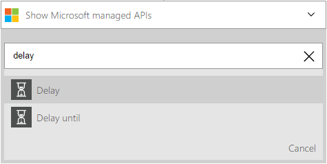
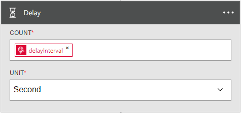

<properties
	pageTitle="Add a delay in logic apps | Microsoft Azure"
	description="Overview of the delay and delay-until actions, and how to use them with an Azure logic app."
	services=""
	documentationCenter=""
	authors="jeffhollan"
	manager="erikre"
	editor=""
	tags="connectors"/>

<tags
   ms.service="logic-apps"
   ms.devlang="na"
   ms.topic="article"
   ms.tgt_pltfrm="na"
   ms.workload="na"
   ms.date="07/18/2016"
   ms.author="jehollan"/>

# Get started with the delay and delay-until actions

By using the delay and "delay-until" actions, you can complete workflow scenarios.

For example, you can:

- Wait until a weekday to send a status update over email.
- Delay the workflow until an HTTP call has time to complete before resuming and retrieving the result.

To get started using the delay action in a logic app, see [Create a logic app](../app-service-logic/app-service-logic-create-a-logic-app.md).

## Use the delay actions

An action is an operation that is carried out by the workflow that is defined in a logic app. [Learn more about actions](connectors-overview.md).

Here’s an example sequence of how to use a delay step in a logic app:

1. After adding a trigger, click **New Step** to add an action.
2. Search for "delay" to bring up the delay actions. In this example, we will select **Delay**.

	

3. Complete any of the action properties to configure the delay.

	

4. Click **Save** to publish and activate the logic app.

## Action details

The recurrence trigger has the following properties that can be configured.

### Delay action

This action delays the run for a certain time interval.
A * means that it is a required field.

|Display name|Property name|Description|
|---|---|---|
|Count*|count|The number of time units to delay|
|Unit*|unit|The unit of time: `Second`, `Minute`, `Hour`, or `Day`|
 

### Delay-until action

This action delays the run until a specified date/time.
A * means that it is a required field.

|Display name|Property name|Description|
|---|---|---|
|Year*|timestamp|The year to delay until (GMT)|
|Month*|timestamp|The month to delay until (GMT)|
|Day*|timestamp|The day to delay until (GMT)|
 

## Next steps

Now, try out the platform and [create a logic app](../app-service-logic/app-service-logic-create-a-logic-app.md). You can explore the other available connectors in logic apps by looking at our [APIs list](apis-list.md).
