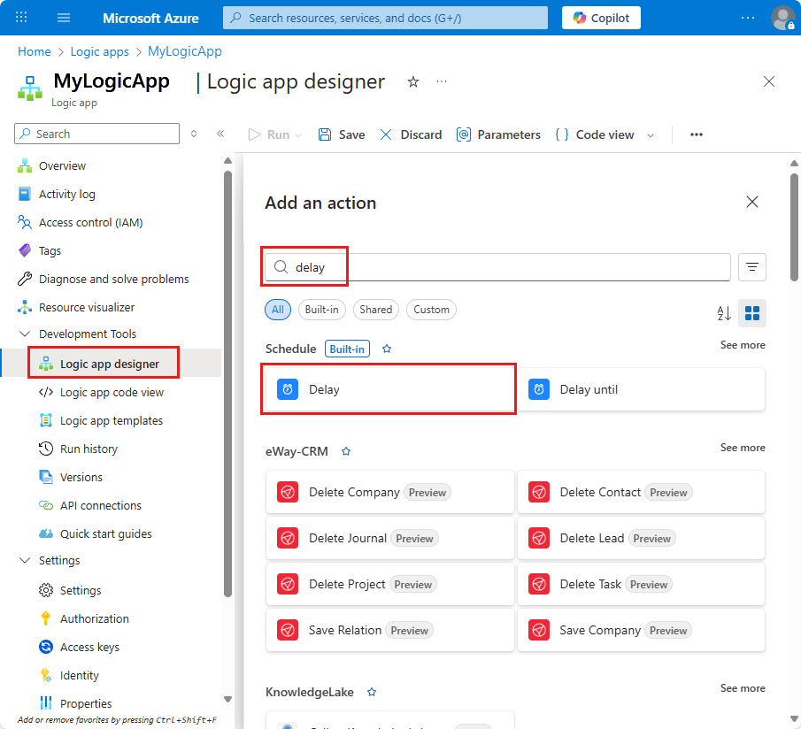
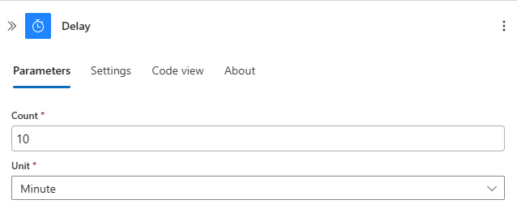
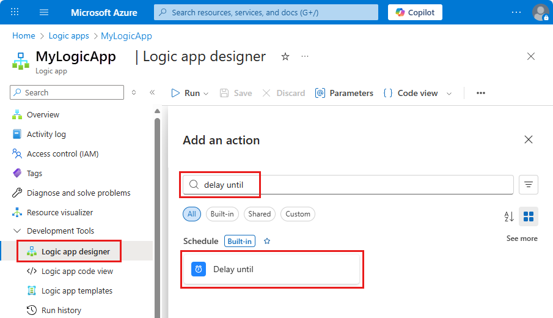
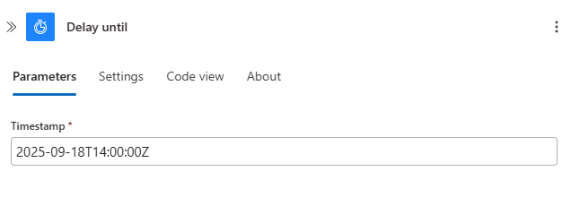

# Delay running the next action in Azure Logic Apps

[!INCLUDE [logic-apps-sku-consumption](../../includes/logic-apps-sku-consumption.md)]

To have your logic app wait an amount of time before running the next action, you can add the built-in **Delay** action before an action in your logic app's workflow. Or, you can add the built-in **Delay until** action to wait until a specific date and time before running the next action. For more information about the built-in Schedule actions and triggers, see [Schedule and run recurring automated, tasks, and workflows with Azure Logic Apps](../logic-apps/concepts-schedule-automated-recurring-tasks-workflows.md).

* **Delay**: Wait for the specified number of time units, such as seconds, minutes, hours, days, weeks, or months, before the next action runs.

* **Delay until**: Wait until the specified date and time before the next action runs.

Here are some example ways to use these actions:

* Wait until a weekday to send a status update over email.

* Delay your workflow until an HTTP call finishes before resuming and retrieving data.

## Prerequisites

* An Azure account and subscription. If you don't have a subscription, you can [sign up for a free Azure account](https://azure.microsoft.com/free/?WT.mc_id=A261C142F).

* Basic knowledge about [logic apps](../logic-apps/logic-apps-overview.md). Before you can use an action, your logic app must first start with a trigger. You can use any trigger you want and add other actions before you add a delay action. This topic uses an Office 365 Outlook trigger.

## Add the Delay action

1. In the Logic App Designer, under the step where you want to add the delay action, choose **New step**.

   To add the delay action between steps, move the pointer over the arrow that connects the steps. Choose the plus sign (+) that appears, and then select **Add an action**.

1. In the search box, enter "delay" as your filter. From the actions list, select this action: **Delay**

   

1. Specify the amount of time to wait before the next action runs.

   

   | Property | JSON name | Required | Type | Description |
   |----------|-----------|----------|------|-------------|
   | Count | count | Yes | Integer | The number of time units to delay |
   | Unit | unit | Yes | String | The unit of time, for example: `Second`, `Minute`, `Hour`, `Day`, `Week`, or `Month` |
   ||||||

1. Add any other actions that you want to run in your workflow.

1. When you're done, save your logic app.

## Add the Delay-until action

1. In the Logic App Designer, under the step where you want to add the delay action, choose **New step**.

   To add the delay action between steps, move the pointer over the arrow that connects the steps. Choose the plus sign (+) that appears, and then select **Add an action**.

1. In the search box, enter "delay" as your filter. From the actions list, select this action: **Delay until**

   

1. Provide the end date and time for when you want to resume the workflow.

   

   | Property | JSON name | Required | Type | Description |
   |----------|-----------|----------|------|-------------|
   | Timestamp | timestamp | Yes | String | The end date and time for resuming the workflow using this format: 
YYYY-MM-DDThh:mm:ssZ 
So for example, if you want September 18, 2017 at 2:00 PM, specify "2017-09-18T14:00:00Z". 
**Note:** This time format must follow the [ISO 8601 date time specification](https://en.wikipedia.org/wiki/ISO_8601#Combined_date_and_time_representations) in [UTC date time format](https://en.wikipedia.org/wiki/Coordinated_Universal_Time), but without a [UTC offset](https://en.wikipedia.org/wiki/UTC_offset). Without a time zone, you must add the letter "Z" at the end without any spaces. This "Z" refers to the equivalent [nautical time](https://en.wikipedia.org/wiki/Nautical_time). |
   ||||||

1. Add any other actions that you want to run in your workflow.

1. When you're done, save your logic app.

## Next steps

* [Managed connectors for Azure Logic Apps](/connectors/connector-reference/connector-reference-logicapps-connectors)
* [Built-in connectors for Azure Logic Apps](built-in.md)