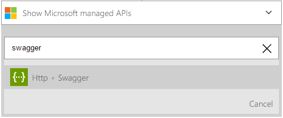
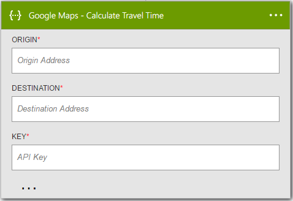

<properties
	pageTitle="Add the HTTP + Swagger action in Logic Apps | Microsoft Azure"
	description="Overview of the HTTP + Swagger action and operations"
	services=""
	documentationCenter="" 
	authors="jeffhollan"
	manager="erikre"
	editor=""
	tags="connectors"/>

<tags
   ms.service="logic-apps"
   ms.devlang="na"
   ms.topic="article"
   ms.tgt_pltfrm="na"
   ms.workload="na" 
   ms.date="07/18/2016"
   ms.author="jehollan"/>

# Get started with the HTTP + Swagger action

With the HTTP + Swagger action, you can create a first-class connector to any REST endpoint through a [Swagger document](https://swagger.io).

- Extend a logic app to call any REST endpoint with a first-class designer experience

To get started using the HTTP + Swagger action in a logic app, see [create a logic app](../app-service-logic/app-service-logic-create-a-logic-app.md).

---

## Use HTTP + Swagger as a trigger or an action

The HTTP + Swagger trigger and action functions the same as the [HTTP action](connectors-native-http.md) but provides a better design experience by showing the shape of the API and outputs in the designer from the [swagger metadata](https://swagger.io).  In addition, you can use HTTP + Swagger as a trigger, and if you want to implement a polling trigger should follow the polling patter [described in this document](../app-service-logic/app-service-logic-create-api-app.md#polling-triggers).
	
[Learn more about Logic App triggers and actions.](connectors-overview.md)

Here's an example of using the HTTP + Swagger operation as an action in a workflow.

1. Select the **New Step** button
1. Choose **Add an action**
1. In the action search box, type "swagger" to list the HTTP + Swagger action

	

1. Enter in the URL for a swagger document
	- The URL must be an HTTPS endpoint and have CORS enabled to work from the designer. If the swagger document does not meet this you can use [Azure storage with CORS enabled](#hosting-swagger-from-storage) to store the document.
1. Click next to read and render from the swagger document
1. Add in any parameters required for the HTTP call

	

1. Click save at the top left corner of the toolbar, and your logic app will both save and publish (activate)

### Hosting Swagger from Storage

You may wish to reference a swagger document which is either not hosted, or does not meet the security and cross-origin requirements needed to use in the designer.  As a workaround, you can store the swagger document in Azure storage and enable CORS to reference the document.  Here are the steps to create, configure, and store swagger in Azure storage:

1. [Create an Azure storage account with blob storage](../storage/storage-create-storage-account.md) -- set permissions to "Public Access"
1. Enable CORS on the Blob 
	- You can use [this PowerShell script](https://github.com/logicappsio/EnableCORSAzureBlob/blob/master/EnableCORSAzureBlob.ps1) to configure that setting automatically.
1. Upload the swagger file into the Azure Blob
	- You can do this from the [Azure Portal](https://portal.azure.com) or from a tool like [Azure Storage Explorer](http://storageexplorer.com/)
1. Reference an HTTPS link to the document in Azure Blob (follows the format `https://*storageAccountName*.blob.core.windows.net/*container*/*filename*`)

---

## Technical details

Below are the details for the triggers and actions this connector supports.

## HTTP + Swagger triggers

A trigger is an event that can be used to start the workflow defined in a Logic app. [Learn more about triggers.](connectors-overview.md) The HTTP + Swagger connector has 1 trigger. 

|Trigger|Description|
|---|---|
|HTTP + Swagger|Make an HTTP call and return the response content|

## HTTP + Swagger actions

An action is an operation carried out by the workflow defined in a Logic app. [Learn more about actions.](connectors-overview.md) The HTTP + Swagger connector has 1 possible action. 

|Action|Description|
|---|---|
|HTTP + Swagger|Make an HTTP call and return the response content|

### Action details

The HTTP + Swagger connector comes with 1 possible action. Below, there is information on each of the actions, their required and optional input fields, and the corresponding output details associated with their usage.

#### HTTP + Swagger

Make an HTTP outbound request with assistance of swagger metadata.
An * means required field.

|Display Name|Property Name|Description|
|---|---|---|
|Method*|method|HTTP Verb to use|
|URI*|uri|URI for the HTTP request|
|Headers|headers|A JSON object of HTTP headers to include|
|Body|body|The HTTP request body|
|Authentication|authentication|Authentication to use for request - [see HTTP for details](./connectors-native-http.md#authentication)|
 

**Output Details**

HTTP Response

|Property Name|Data Type|Description|
|---|---|---|
|Headers|object|Response headers|
|Body|object|Response object|
|Status Code|int|HTTP status code|

### HTTP responses

When making calls to various actions, you might get certain responses. Below is a table outlining corresponding responses and descriptions.

|Name|Description|
|---|---|
|200|OK|
|202|Accepted|
|400|Bad Request|
|401|Unauthorized|
|403|Forbidden|
|404|Not Found|
|500|Internal Server Error. Unknown error occurred|

---

## Next steps

Below are details on how to move forward with logic apps and our community.

## Create a logic app

Try out the platform and [create a logic app](../app-service-logic/app-service-logic-create-a-logic-app.md) now. You can explore the other available connectors in logic apps by looking at our [APIs list](apis-list.md).
