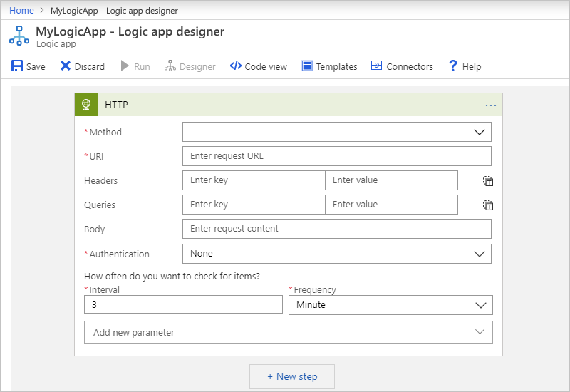
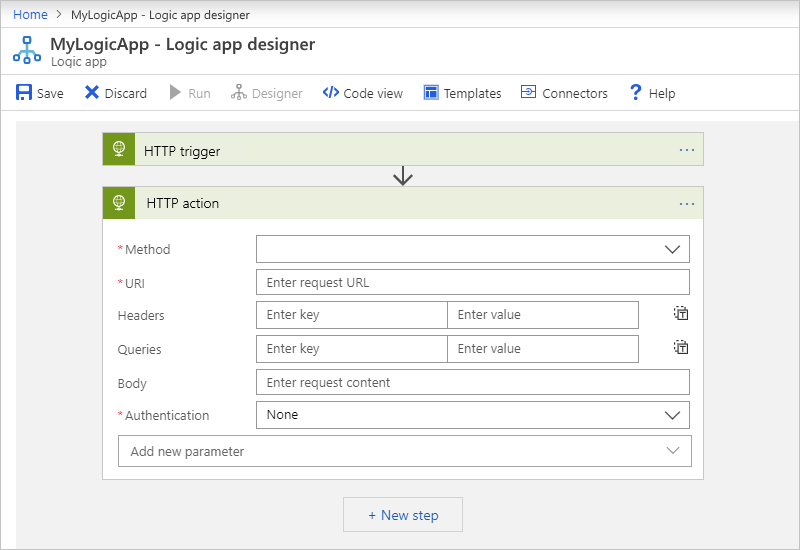
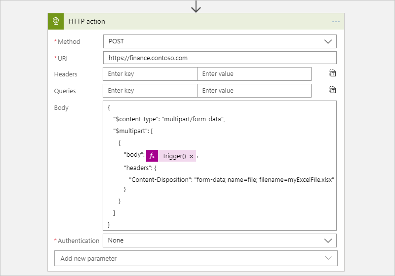
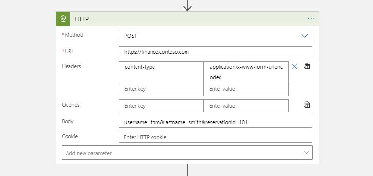
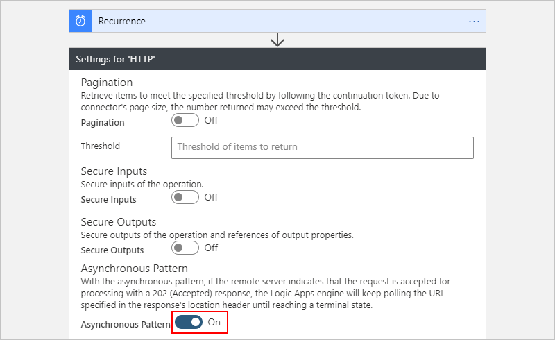
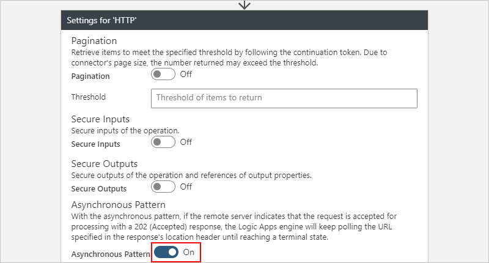

# Call service endpoints over HTTP or HTTPS from Azure Logic Apps

[!INCLUDE [logic-apps-sku-consumption](../../includes/logic-apps-sku-consumption.md)]

With [Azure Logic Apps](../logic-apps/logic-apps-overview.md) and the built-in HTTP trigger or action, you can create automated tasks and workflows that can send outbound requests to endpoints on other services and systems over HTTP or HTTPS. To receive and respond to inbound HTTPS calls instead, use the built-in [Request trigger and Response action](../connectors/connectors-native-reqres.md).

For example, you can monitor a service endpoint for your website by checking that endpoint on a specific schedule. When the specified event happens at that endpoint, such as your website going down, the event triggers your logic app's workflow and runs the actions in that workflow.

* To check or *poll* an endpoint on a recurring schedule, [add the HTTP trigger](#http-trigger) as the first step in your workflow. Each time that the trigger checks the endpoint, the trigger calls or sends a *request* to the endpoint. The endpoint's response determines whether your logic app's workflow runs. The trigger passes any content from the endpoint's response to the actions in your logic app.

* To call an endpoint from anywhere else in your workflow, [add the HTTP action](#http-action). The endpoint's response determines how your workflow's remaining actions run.

This article shows how to use the HTTP trigger and HTTP action so that your logic app can send outbound calls to other services and systems.

For information about encryption, security, and authorization for outbound calls from your logic app, such as [Transport Layer Security (TLS)](https://en.wikipedia.org/wiki/Transport_Layer_Security), previously known as Secure Sockets Layer (SSL), self-signed certificates, or [Azure Active Directory Open Authentication (Azure AD OAuth)](../active-directory/develop/index.yml), see [Secure access and data - Access for outbound calls to other services and systems](../logic-apps/logic-apps-securing-a-logic-app.md#secure-outbound-requests).

## Prerequisites

* An Azure account and subscription. If you don't have an Azure subscription, [sign up for a free Azure account](https://azure.microsoft.com/free/?WT.mc_id=A261C142F).

* The URL for the target endpoint that you want to call

* Basic knowledge about how to create logic app workflows. If you're new to logic apps, see [What is Azure Logic Apps](../logic-apps/logic-apps-overview.md)?

* The logic app workflow from where you want to call the target endpoint. To start with the HTTP trigger, you'll need a blank workflow. To use the HTTP action, start your workflow with any trigger that you want. This example uses the HTTP trigger as the first step.

<a name="http-trigger"></a>

## Add an HTTP trigger

This built-in trigger makes an HTTP call to the specified URL for an endpoint and returns a response.

1. In the [Azure portal](https://portal.azure.com), open your logic app and blank workflow in the designer.

1. [Follow these general steps to add the built-in trigger named **HTTP** to your workflow](../logic-apps/create-workflow-with-trigger-or-action.md?tabs=consumption#add-trigger).

   This example renames the trigger to **HTTP trigger** so that the trigger has a more descriptive name. Also, the example later adds an HTTP action, and both names must be unique.

1. Provide the values for the [HTTP trigger parameters](../logic-apps/logic-apps-workflow-actions-triggers.md#http-trigger) that you want to include in the call to the target endpoint. Set up the recurrence for how often you want the trigger to check the target endpoint.

   

   If you select an authentication type other than **None**, the authentication settings differ based on your selection. For more information about authentication types available for HTTP, see these topics:

   * [Add authentication to outbound calls](../logic-apps/logic-apps-securing-a-logic-app.md#add-authentication-outbound)
   * [Authenticate access to resources with managed identities](../logic-apps/create-managed-service-identity.md)

1. To add other available parameters, open the **Add new parameter** list, and select the parameters that you want.

1. Continue building your workflow with actions that run when the trigger fires.

1. When you're done, remember to save your workflow. On the designer toolbar, select **Save**.

<a name="http-action"></a>

## Add an HTTP action

This built-in action makes an HTTP call to the specified URL for an endpoint and returns a response.

1. In the [Azure portal](https://portal.azure.com), open your logic app and workflow in the designer.

   This example uses the HTTP trigger added in the previous section as the first step.

1. [Follow these general steps to add the built-in action named **HTTP** to your workflow](../logic-apps/create-workflow-with-trigger-or-action.md?tabs=consumption#add-action).

   This example renames the action to **HTTP action** so that the step has a more descriptive name. Operation names in your workflow must be unique.

1. Provide the values for the [HTTP action parameters](../logic-apps/logic-apps-workflow-actions-triggers.md#http-action) that you want to include in the call to the target endpoint.

   

   If you select an authentication type other than **None**, the authentication settings differ based on your selection. For more information about authentication types available for HTTP, see these topics:

   * [Add authentication to outbound calls](../logic-apps/logic-apps-securing-a-logic-app.md#add-authentication-outbound)
   * [Authenticate access to resources with managed identities](../logic-apps/create-managed-service-identity.md)

1. To add other available parameters, open the **Add new parameter** list, and select the parameters that you want.

1. When you're done, remember to save your workflow. On the designer toolbar, select **Save**.

## Trigger and action outputs

Here's more information about the outputs from an HTTP trigger or action, which returns this information:

| Property | Type | Description |
|----------|------|-------------|
| `headers` | JSON object | The headers from the request |
| `body` | JSON object | The object with the body content from the request |
| `status code` | Integer | The status code from the request |

| Status code | Description |
|-------------|-------------|
| 200 | OK |
| 202 | Accepted |
| 400 | Bad request |
| 401 | Unauthorized |
| 403 | Forbidden |
| 404 | Not Found |
| 500 | Internal server error. Unknown error occurred. |

<a name="single-tenant-authentication"></a>

## Authentication for single-tenant environment

If you have a **Logic App (Standard)** resource in single-tenant Azure Logic Apps, and you want to use an HTTP operation with any of the following authentication types, make sure to complete the extra setup steps for the corresponding authentication type. Otherwise, the call fails.

* [TLS/SSL certificate](#tls-ssl-certificate-authentication): Add the app setting, `WEBSITE_LOAD_ROOT_CERTIFICATES`, and set the value to the thumbprint for your TLS/SSL certificate.

* [Client certificate or Azure Active Directory Open Authentication (Azure AD OAuth) with the "Certificate" credential type](#client-certificate-authentication): Add the app setting, `WEBSITE_LOAD_USER_PROFILE`, and set the value to `1`.

<a name="tls-ssl-certificate-authentication"></a>

### TLS/SSL certificate authentication

1. In your logic app resource's app settings, [add or update the app setting](../logic-apps/edit-app-settings-host-settings.md#manage-app-settings), `WEBSITE_LOAD_ROOT_CERTIFICATES`.

1. For the setting value, provide the thumbprint for your TLS/SSL certificate as the root certificate to be trusted.

   `"WEBSITE_LOAD_ROOT_CERTIFICATES": "<thumbprint-for-TLS/SSL-certificate>"`

For example, if you're working in Visual Studio Code, follow these steps:

1. Open your logic app project's **local.settings.json** file.

1. In the `Values` JSON object, add or update the `WEBSITE_LOAD_ROOT_CERTIFICATES` setting:

   ```json
   {
      "IsEncrypted": false,
      "Values": {
         <...>
         "AzureWebJobsStorage": "UseDevelopmentStorage=true",
         "WEBSITE_LOAD_ROOT_CERTIFICATES": "<thumbprint-for-TLS/SSL-certificate>",
         <...>
      }
   }
   ```

   > [!NOTE]
   >
   > To find the thumbprint, follow these steps:
   >
   > 1. On your logic app resource menu, under **Settings**, select **TLS/SSL settings** > **Private Key Certificates (.pfx)** or **Public Key Certificates (.cer)**.
   > 
   > 2. Find the certificate that you want to use, and copy the thumbprint.
   > 
   > For more information, review [Find the thumbprint - Azure App Service](../app-service/configure-ssl-certificate-in-code.md#find-the-thumbprint).

For more information, review the following documentation:

* [Edit host and app settings for logic apps in single-tenant Azure Logic Apps](../logic-apps/edit-app-settings-host-settings.md#manage-app-settings)
* [Private client certificates - Azure App Service](../app-service/environment/certificates.md#private-client-certificate)

<a name="client-certificate-authentication"></a>

### Client certificate or Azure AD OAuth with "Certificate" credential type authentication

1. In your logic app resource's app settings, [add or update the app setting](../logic-apps/edit-app-settings-host-settings.md#manage-app-settings), `WEBSITE_LOAD_USER_PROFILE`.

1. For the setting value, specify `1`.

   `"WEBSITE_LOAD_USER_PROFILE": "1"`

For example, if you're working in Visual Studio Code, follow these steps:

1. Open your logic app project's **local.settings.json** file.

1. In the `Values` JSON object, add or update the `WEBSITE_LOAD_USER_PROFILE` setting:

   ```json
   {
      "IsEncrypted": false,
      "Values": {
         <...>
         "AzureWebJobsStorage": "UseDevelopmentStorage=true",
         "WEBSITE_LOAD_USER_PROFILE": "1",
         <...>
      }
   }
   ```

For more information, review the following documentation:

* [Edit host and app settings for logic apps in single-tenant Azure Logic Apps](../logic-apps/edit-app-settings-host-settings.md#manage-app-settings)
* [Private client certificates - Azure App Service](../app-service/environment/certificates.md#private-client-certificate)

## Content with multipart/form-data type

To handle content that has `multipart/form-data` type in HTTP requests, you can add a JSON object that includes the `$content-type` and `$multipart` attributes to the HTTP request's body by using this format.

```json
"body": {
   "$content-type": "multipart/form-data",
   "$multipart": [
      {
         "body": "<output-from-trigger-or-previous-action>",
         "headers": {
            "Content-Disposition": "form-data; name=file; filename=<file-name>"
         }
      }
   ]
}
```

For example, suppose you have a logic app that sends an HTTP POST request for an Excel file to a website by using that site's API, which supports the `multipart/form-data` type. Here's how this action might look:



Here's the same example that shows the HTTP action's JSON definition in the underlying workflow definition:

```json
"HTTP_action": {
   "inputs": {
      "body": {
         "$content-type": "multipart/form-data",
         "$multipart": [
            {
               "body": "@trigger()",
               "headers": {
                  "Content-Disposition": "form-data; name=file; filename=myExcelFile.xlsx"
               }
            }
         ]
      },
      "method": "POST",
      "uri": "https://finance.contoso.com"
   },
   "runAfter": {},
   "type": "Http"
}
```

## Content with application/x-www-form-urlencoded type

To provide form-urlencoded data in the body for an HTTP request, you have to specify that the data has the `application/x-www-form-urlencoded` content type. In the HTTP trigger or action, add the `content-type` header. Set the header value to `application/x-www-form-urlencoded`.

For example, suppose you have a logic app that sends an HTTP POST request to a website, which supports the `application/x-www-form-urlencoded` type. Here's how this action might look:



<a name="asynchronous-pattern"></a>

## Asynchronous request-response behavior

For *stateful* workflows in both multi-tenant and single-tenant Azure Logic Apps, all HTTP-based actions follow the standard [asynchronous operation pattern](/azure/architecture/patterns/async-request-reply) as the default behavior. This pattern specifies that after an HTTP action calls or sends a request to an endpoint, service, system, or API, the receiver immediately returns a ["202 ACCEPTED"](https://www.w3.org/Protocols/rfc2616/rfc2616-sec10.html#sec10.2.3) response. This code confirms that the receiver accepted the request but hasn't finished processing. The response can include a `location` header that specifies the URI and a refresh ID that the caller can use to poll or check the status for the asynchronous request until the receiver stops processing and returns a ["200 OK"](https://www.w3.org/Protocols/rfc2616/rfc2616-sec10.html#sec10.2.1) success response or other non-202 response. However, the caller doesn't have to wait for the request to finish processing and can continue to run the next action. For more information, see [Asynchronous microservice integration enforces microservice autonomy](/azure/architecture/microservices/design/interservice-communication#synchronous-versus-asynchronous-messaging).

For *stateless* workflows in single-tenant Azure Logic Apps, HTTP-based actions don't use the asynchronous operation pattern. Instead, they only run synchronously, return the ["202 ACCEPTED"](https://www.w3.org/Protocols/rfc2616/rfc2616-sec10.html#sec10.2.3) response as-is, and proceed to the next step in the workflow execution. If the response includes a `location` header, a stateless workflow won't poll the specified URI to check the status. To follow the standard [asynchronous operation pattern](/azure/architecture/patterns/async-request-reply), use a stateful workflow instead.

* In the Logic App Designer, the HTTP action, but not trigger, has an **Asynchronous Pattern** setting, which is enabled by default. This setting specifies that the caller doesn't wait for processing to finish and can move on to the next action but continues checking the status until processing stops. If disabled, this setting specifies that the caller waits for processing to finish before moving on to the next action.

  To find this setting, follow these steps:

  1. On the HTTP action's title bar, select the ellipses (**...**) button, which opens the action's settings.

  1. Find the **Asynchronous Pattern** setting.

     

* The HTTP action's underlying JavaScript Object Notation (JSON) definition implicitly follows the asynchronous operation pattern.

<a name="disable-asynchronous-operations"></a>

## Disable asynchronous operations

Sometimes, you might want to disable the HTTP action's asynchronous behavior in specific scenarios, for example, when you want to:

* [Avoid HTTP timeouts for long-running tasks](#avoid-http-timeouts)
* [Disable checking location headers](#disable-location-header-check)

<a name="turn-off-asynchronous-pattern-setting"></a>

### Turn off **Asynchronous Pattern** setting

1. In the Logic App Designer, on the HTTP action's title bar, select the ellipses (**...**) button, which opens the action's settings.

1. Find the **Asynchronous Pattern** setting, turn the setting to **Off** if enabled, and select **Done**.

   

<a name="add-disable-async-pattern-option"></a>

### Disable asynchronous pattern in action's JSON definition

In the HTTP action's underlying JSON definition, [add the `"DisableAsyncPattern"` operation option](../logic-apps/logic-apps-workflow-actions-triggers.md#operation-options) to the action's definition so that the action follows the synchronous operation pattern instead. For more information, see also [Run actions in a synchronous operation pattern](../logic-apps/logic-apps-workflow-actions-triggers.md#disable-asynchronous-pattern).

<a name="avoid-http-timeouts"></a>

## Avoid HTTP timeouts for long-running tasks

HTTP requests have a [timeout limit](../logic-apps/logic-apps-limits-and-config.md#http-limits). If you have a long-running HTTP action that times out due to this limit, you have these options:

* [Disable the HTTP action's asynchronous operation pattern](#disable-asynchronous-operations) so that the action doesn't continually poll or check the request's status. Instead, the action waits for the receiver to respond with the status and results after the request finishes processing.

* Replace the HTTP action with the [HTTP Webhook action](../connectors/connectors-native-webhook.md), which waits for the receiver to respond with the status and results after the request finishes processing.

<a name="disable-location-header-check"></a>

### Set up interval between retry attempts with the Retry-After header

To specify the number of seconds between retry attempts, you can add the `Retry-After` header to the HTTP action response. For example, if the target endpoint returns the `429 - Too many requests` status code, you can specify a longer interval between retries. The `Retry-After` header also works with the `202 - Accepted` status code.

Here's the same example that shows the HTTP action response that contains `Retry-After`:

```json
{
    "statusCode": 429,
    "headers": {
        "Retry-After": "300"
    }
}
```

## Pagination support

Sometimes, the target service responds by returning the results one page at a time. If the response specifies the next page with the **nextLink** or **@odata.nextLink** property, you can turn on the **Pagination** setting on the HTTP action. This setting causes the HTTP action to automatically follow these links and get the next page. However, if the response specifies the next page with any other tag, you might have to add a loop to your workflow. Make this loop follow that tag and manually get each page until the tag is null.

## Disable checking location headers

Some endpoints, services, systems, or APIs return a `202 ACCEPTED` response that doesn't have a `location` header. To avoid having an HTTP action continually check the request status when the `location` header doesn't exist, you can have these options:

* [Disable the HTTP action's asynchronous operation pattern](#disable-asynchronous-operations) so that the action doesn't continually poll or check the request's status. Instead, the action waits for the receiver to respond with the status and results after the request finishes processing.

* Replace the HTTP action with the [HTTP Webhook action](../connectors/connectors-native-webhook.md), which waits for the receiver to respond with the status and results after the request finishes processing.

## Known issues

<a name="omitted-headers"></a>

### Omitted HTTP headers

If an HTTP trigger or action includes these headers, Logic Apps removes these headers from the generated request message without showing any warning or error:

* `Accept-*` headers except for `Accept-version`
* `Allow`
* `Content-*` headers except for `Content-Disposition`, `Content-Encoding`, and `Content-Type`, which are honored when you use the POST and PUT operations. However, Logic Apps drops these headers when you use the GET operation.
* `Cookie` header, but Logic Apps honors any value that you specify using the **Cookie** property.
* `Expires`
* `Host`
* `Last-Modified`
* `Origin`
* `Set-Cookie`
* `Transfer-Encoding`

Although Logic Apps won't stop you from saving logic apps that use an HTTP trigger or action with these headers, Logic Apps ignores these headers.

## Connector reference

For technical information about trigger and action parameters, see these sections:

* [HTTP trigger parameters](../logic-apps/logic-apps-workflow-actions-triggers.md#http-trigger)
* [HTTP action parameters](../logic-apps/logic-apps-workflow-actions-triggers.md#http-action)

## Next steps

* [Managed connectors for Azure Logic Apps](/connectors/connector-reference/connector-reference-logicapps-connectors)
* [Built-in connectors for Azure Logic Apps](built-in.md)
