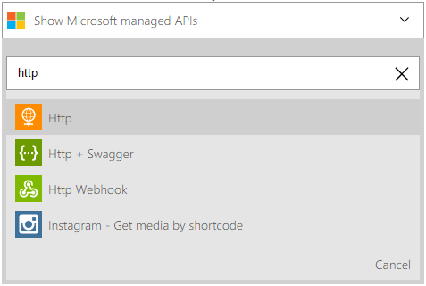
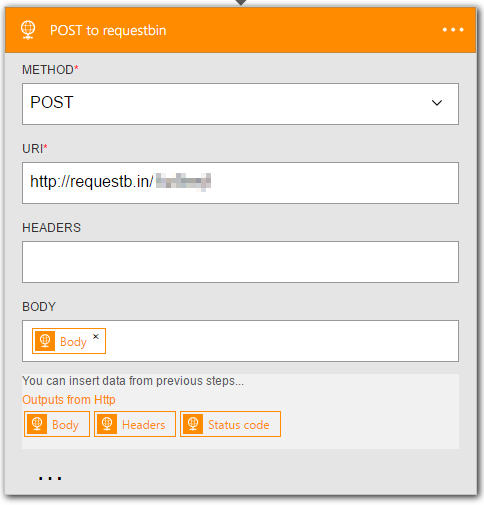

<properties
	pageTitle="Add the HTTP action in logic apps | Microsoft Azure"
	description="Overview of the HTTP action with properties"
	services=""
	documentationCenter=""
	authors="jeffhollan"
	manager="erikre"
	editor=""
	tags="connectors"/>

<tags
   ms.service="logic-apps"
   ms.devlang="na"
   ms.topic="article"
   ms.tgt_pltfrm="na"
   ms.workload="na"
   ms.date="07/15/2016"
   ms.author="jehollan"/>

# Get started with the HTTP action

With the HTTP action, you can extend workflows for your organization and communicate to any endpoint over HTTP. You can:

- Create logic app workflows that activate (trigger) when a website that you manage goes down.
- Communicate to any endpoint over HTTP to extend your workflows into other services.

To get started using the HTTP action in a logic app, see [create a logic app](../app-service-logic/app-service-logic-create-a-logic-app.md).

## Use the HTTP trigger

A trigger is an event that can be used to start the workflow that is defined in a logic app. [Learn more about triggers](connectors-overview.md).

Here’s an example sequence of how to set up the HTTP trigger in the Logic App Designer.

1. Add the HTTP trigger in your logic app.
2. Fill in the parameters for the HTTP endpoint that you want to poll.
3. Modify the recurrence interval on how frequently it should poll.
4. The logic app now fires with any content that is returned during each check.


### How the HTTP trigger works

The HTTP trigger makes a call to an HTTP endpoint on a recurring interval. By default, any HTTP response code < 300 results in a logic app run. You can add a condition in code-view that will evaluate after the HTTP call to determine if the logic app should fire. Here's an example of an HTTP trigger that fires whenever the status code returned is greater than or equal to `400`.

```javascript
"Http":
{
	"conditions": [
		{
			"expression": "@greaterOrEquals(triggerOutputs()['statusCode'], 400)"
		}
	],
	"inputs": {
		"method": "GET",
		"uri": "https://blogs.msdn.microsoft.com/logicapps/",
		"headers": {
			"accept-language": "en"
		}
	},
	"recurrence": {
		"frequency": "Second",
		"interval": 15
	},
	"type": "Http"
}
```

Full details about the HTTP trigger parameters are available on [MSDN](https://msdn.microsoft.com/library/azure/mt643939.aspx#HTTP-trigger).

## Use the HTTP action

An action is an operation that is carried out by the workflow that is defined in a logic app. [Learn more about actions.](connectors-overview.md)

1. Select the **New Step** button.
2. Choose **Add an action**.
3. In the action search box, type "HTTP" to list the HTTP action.

	

4. Add in any parameters that are required for the HTTP call.

	

5. Click save at the top left corner of the toolbar, and your logic app will both save and publish (activate).

## HTTP trigger

Here are the details for the trigger that this connector supports. The HTTP connector has one trigger.

|Trigger|Description|
|---|---|
|HTTP|Makes an HTTP call and returns the response content.|

## HTTP action

Here are the details for the action that this connector supports. The HTTP connector has one possible action.

|Action|Description|
|---|---|
|HTTP|Makes an HTTP call and returns the response content.|

## HTTP details

The following tables describe the required and optional input fields for the action and the corresponding output details that are associated with using the action.


#### HTTP request
The action makes an HTTP outbound request.
A * means that it is a required field.

|Display Name|Property Name|Description|
|---|---|---|
|Method*|method|The HTTP verb to use|
|URI*|uri|URI for the HTTP request|
|Headers|headers|A JSON object of HTTP headers to include|
|Body|body|The HTTP request body|
|Authentication|authentication|Details in the [Authentication section](#authentication)|
<br>

#### Output details

Here is the HTTP response.

|Property name|Data type|Description|
|---|---|---|
|Headers|object|Response headers|
|Body|object|Response object|
|Status Code|int|HTTP status code|

## Authentication

The Logic Apps feature of Azure App Service allows you to use different types of authentication against HTTP endpoints. You can use this authentication with the **HTTP**, **[HTTP + Swagger](./connectors-native-http-swagger.md)**, and **[HTTP Webhook](./connectors-native-webhook.md)** connectors. The following types of authentication are configurable:

* [Basic authentication](#basic-authentication)
* [Client certificate authentication](#client-certificate-authentication)
* [Azure Active Directory (Azure AD) OAuth authentication](#azure-active-directory-oauth-authentication)

#### Basic authentication

The following authentication object is needed for basic authentication.
A * means that it is a required field.

|Property name|Data type|Description|
|---|---|---|
|Type*|type|Type of authentication (must be `Basic` for basic authentication)|
|Username*|username|Username to authenticate|
|Password*|password|Password to authenticate|

>[AZURE.TIP] If you want to use a password that cannot be retrieved from the definition, use a `securestring` parameter and the `@parameters()` [workflow definition function](http://aka.ms/logicappdocs).

So you would create an object like this in the authentication field:

```javascript
{
	"type": "Basic",
	"username": "user",
	"password": "test"
}
```

#### Client certificate authentication

The following authentication object is needed for client certificate authentication. A * means that it is a required field.

|Property Name|Data Type|Description|
|---|---|---|
|Type*|type|Type of authentication (must be `ClientCertificate` for SSL client certificates)|
|PFX*|pfx|Base64-encoded contents of the PFX file|
|Password*|password|Password to access the PFX file|

>[AZURE.TIP] You can use a `securestring` parameter and the `@parameters()` [workflow definition function](http://aka.ms/logicappdocs) to use a parameter that won't be readable in the definition after saving.

For example:

```javascript
{
	"type": "ClientCertificate",
	"pfx": "aGVsbG8g...d29ybGQ=",
	"password": "@parameters('myPassword')"
}
```

#### Azure AD OAuth authentication

The following authentication object is needed for Azure AD OAuth authentication. A * means that it is a required field.

|Property name|Data type|Description|
|---|---|---|
|Type*|type|The type of authentication (must be `ActiveDirectoryOAuth` for Azure AD OAuth)|
|Tenant*|tenant|The tenant identifier for the Azure AD tenant|
|Audience*|audience|Set to `https://management.core.windows.net/`|
|Client ID*|clientId|The client identifier for the Azure AD application|
|Secret*|secret|The secret of the client that is requesting the token|

>[AZURE.TIP] You can use a `securestring` parameter and the `@parameters()` [workflow definition function](http://aka.ms/logicappdocs) to use a parameter that won't be readable in the definition after saving.

For example:

```javascript
{
	"type": "ActiveDirectoryOAuth",
	"tenant": "72f988bf-86f1-41af-91ab-2d7cd011db47",
	"audience": "https://management.core.windows.net/",
	"clientId": "34750e0b-72d1-4e4f-bbbe-664f6d04d411",
	"secret": "hcqgkYc9ebgNLA5c+GDg7xl9ZJMD88TmTJiJBgZ8dFo="
}
```

## Next steps

Now, try out the platform and [create a logic app](../app-service-logic/app-service-logic-create-a-logic-app.md). You can explore the other available connectors in logic apps by looking at our [APIs list](apis-list.md).
