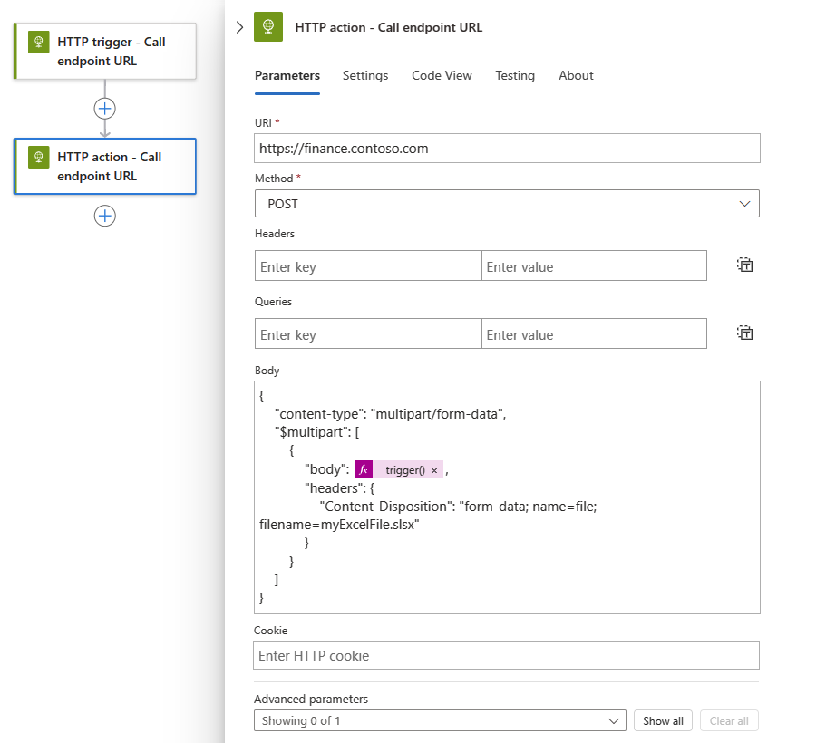

# Call service endpoints over HTTP or HTTPS from Azure Logic Apps

With [Azure Logic Apps](../logic-apps/logic-apps-overview.md) and the built-in HTTP trigger or action, you can create automated tasks and workflows that send requests to service endpoints over HTTP or HTTPS. For example, you can monitor the service endpoint for your website by checking that endpoint on a specific schedule. When the specified event happens at that endpoint, such as your website going down, the event triggers your logic app's workflow and runs the actions in that workflow. If you want to receive and respond to inbound HTTPS calls instead, use the built-in [Request trigger or Response action](../connectors/connectors-native-reqres.md).

* To check or *poll* an endpoint on a recurring schedule, [add the HTTP trigger](#http-trigger) as the first step in your workflow. Each time that the trigger checks the endpoint, the trigger calls or sends a *request* to the endpoint. The endpoint's response determines whether your logic app's workflow runs. The trigger passes any content from the endpoint's response to the actions in your logic app.

* To call an endpoint from anywhere else in your workflow, [add the HTTP action](#http-action). The endpoint's response determines how your workflow's remaining actions run.

This article shows how to add an HTTP trigger or action to your logic app's workflow.

## Prerequisites

* An Azure subscription. If you don't have an Azure subscription, [sign up for a free Azure account](https://azure.microsoft.com/free/).

* The URL for the target endpoint that you want to call

* Basic knowledge about [how to create logic apps](../logic-apps/quickstart-create-first-logic-app-workflow.md). If you're new to logic apps, review [What is Azure Logic Apps](../logic-apps/logic-apps-overview.md)?

* The logic app from where you want to call the target endpoint. To start with the HTTP trigger, [create a blank logic app](../logic-apps/quickstart-create-first-logic-app-workflow.md). To use the HTTP action, start your logic app with any trigger that you want. This example uses the HTTP trigger as the first step.

<a name="http-trigger"></a>

## Add an HTTP trigger

This built-in trigger makes an HTTP call to the specified URL for an endpoint and returns a response.

1. Sign in to the [Azure portal](https://portal.azure.com). Open your blank logic app in Logic App Designer.

1. Under the designer's search box, select **Built-in**. In the search box, enter `http` as your filter. From the **Triggers** list, select the **HTTP** trigger.

   

   This example renames the trigger to "HTTP trigger" so that the step has a more descriptive name. Also, the example later adds an HTTP action, and both names must be unique.

1. Provide the values for the [HTTP trigger parameters](../logic-apps/logic-apps-workflow-actions-triggers.md#http-trigger) that you want to include in the call to the target endpoint. Set up the recurrence for how often you want the trigger to check the target endpoint.

   

   If you select an authentication type other than **None**, the authentication settings differ based on your selection. For more information about authentication types available for HTTP, see these topics:

   * [Add authentication to outbound calls](../logic-apps/logic-apps-securing-a-logic-app.md#add-authentication-outbound)
   * [Authenticate access to resources with managed identities](../logic-apps/create-managed-service-identity.md)

1. To add other available parameters, open the **Add new parameter** list, and select the parameters that you want.

1. Continue building your logic app's workflow with actions that run when the trigger fires.

1. When you're done, remember to save your logic app. On the designer toolbar, select **Save**.

<a name="http-action"></a>

## Add an HTTP action

This built-in action makes an HTTP call to the specified URL for an endpoint and returns a response.

1. Sign in to the [Azure portal](https://portal.azure.com). Open your logic app in Logic App Designer.

   This example uses the HTTP trigger as the first step.

1. Under the step where you want to add the HTTP action, select **New step**.

   To add an action between steps, move your pointer over the arrow between steps. Select the plus sign (**+**) that appears, and then select **Add an action**.

1. Under **Choose an action**, select **Built-in**. In the search box, enter `http` as your filter. From the **Actions** list, select the **HTTP** action.

   

   This example renames the action to "HTTP action" so that the step has a more descriptive name.

1. Provide the values for the [HTTP action parameters](../logic-apps/logic-apps-workflow-actions-triggers.md#http-action) that you want to include in the call to the target endpoint.

   

   If you select an authentication type other than **None**, the authentication settings differ based on your selection. For more information about authentication types available for HTTP, see these topics:

   * [Add authentication to outbound calls](../logic-apps/logic-apps-securing-a-logic-app.md#add-authentication-outbound)
   * [Authenticate access to resources with managed identities](../logic-apps/create-managed-service-identity.md)

1. To add other available parameters, open the **Add new parameter** list, and select the parameters that you want.

1. When you're done, remember to save your logic app. On the designer toolbar, select **Save**.

<a name="tls-support"></a>

## Transport Layer Security (TLS)

Based the target endpoint's capability, outbound calls support Transport Layer Security (TLS), which was previously Secure Sockets Layer (SSL), versions 1.0, 1.1, and 1.2. Logic Apps negotiates with the endpoint over using the highest supported version possible.

For example, if the endpoint supports 1.2, the HTTP connector uses 1.2 first. Otherwise, the connector uses the next highest supported version.

<a name="self-signed"></a>

## Self-signed certificates

* For logic apps in the global, multi-tenant Azure environment, the HTTP connector doesn't permit self-signed TLS/SSL certificates. If your logic app makes an HTTP call to a server and presents a TLS/SSL self-signed certificate, the HTTP call fails with a `TrustFailure` error.

* For logic apps in an [integration service environment (ISE)](../logic-apps/connect-virtual-network-vnet-isolated-environment-overview.md), the HTTP connector permits self-signed certificates for TLS/SSL handshakes. However, you must first [enable self-signed certificate support](../logic-apps/create-integration-service-environment-rest-api.md#request-body) for an existing ISE or new ISE by using the Logic Apps REST API, and install the public certificate at the `TrustedRoot` location.

## Content with multipart/form-data type

To handle content that has `multipart/form-data` type in HTTP requests, you can add a JSON object that includes the `$content-type` and `$multipart` attributes to the HTTP request's body by using this format.

```json
"body": {
   "$content-type": "multipart/form-data",
   "$multipart": [
      {
         "body": "<output-from-trigger-or-previous-action>",
         "headers": {
            "Content-Disposition": "form-data; name=file; filename=<file-name>"
         }
      }
   ]
}
```

For example, suppose you have a logic app that sends an HTTP POST request for an Excel file to a website by using that site's API, which supports the `multipart/form-data` type. Here's how this action might look:



Here is the same example that shows the HTTP action's JSON definition in the underlying workflow definition:

```json
"HTTP_action": {
   "inputs": {
      "body": {
         "$content-type": "multipart/form-data",
         "$multipart": [
            {
               "body": "@trigger()",
               "headers": {
                  "Content-Disposition": "form-data; name=file; filename=myExcelFile.xlsx"
               }
            }
         ]
      },
      "method": "POST",
      "uri": "https://finance.contoso.com"
   },
   "runAfter": {},
   "type": "Http"
}
```

<a name="asynchronous-pattern"></a>

## Asynchronous request-response behavior

By default, all HTTP-based actions in Azure Logic Apps follow the standard [asynchronous operation pattern](https://docs.microsoft.com/azure/architecture/patterns/async-request-reply). This pattern specifies that after an HTTP action calls or sends a request to an endpoint, service, system, or API, the receiver immediately returns a ["202 ACCEPTED"](https://www.w3.org/Protocols/rfc2616/rfc2616-sec10.html#sec10.2.3) response. This code confirms that the receiver accepted the request but hasn't finished processing. The response can include a `location` header that specifies the URL and a refresh ID that the caller can use to poll or check the status for the asynchronous request until the receiver stops processing and returns a ["200 OK"](https://www.w3.org/Protocols/rfc2616/rfc2616-sec10.html#sec10.2.1) success response or other non-202 response. However, the caller doesn't have to wait for the request to finish processing and can continue to run the next action. For more information, see [Asynchronous microservice integration enforces microservice autonomy](https://docs.microsoft.com/azure/architecture/microservices/design/interservice-communication#synchronous-versus-asynchronous-messaging).

* In the Logic App Designer, the HTTP action, but not trigger, has an **Asynchronous Pattern** setting, which is enabled by default. This setting specifies that the caller doesn't wait for processing to finish and can move on to the next action but continues checking the status until processing stops. If disabled, this setting specifies that the caller waits for processing to finish before moving on to the next action.

  To find this setting, follow these steps:

  1. On the HTTP action's title bar, select the ellipses (**...**) button, which opens the action's settings.

  1. Find the **Asynchronous Pattern** setting.

     

* The HTTP action's underlying JavaScript Object Notation (JSON) definition implicitly follows the asynchronous operation pattern.

<a name="disable-asynchronous-operations"></a>

## Disable asynchronous operations

Sometimes, you might want to the HTTP action's asynchronous behavior in specific scenarios, for example, when you want to:

* [Avoid HTTP timeouts for long-running tasks](#avoid-http-timeouts)
* [Disable checking location headers](#disable-location-header-check)

<a name="turn-off-asynchronous-pattern-setting"></a>

### Turn off **Asynchronous Pattern** setting

1. In the Logic App Designer, on the HTTP action's title bar, select the ellipses (**...**) button, which opens the action's settings.

1. Find the **Asynchronous Pattern** setting, turn the setting to **Off** if enabled, and select **Done**.

   

<a name="add-disable-async-pattern-option"></a>

### Disable asynchronous pattern in action's JSON definition

In the HTTP action's underlying JSON definition, [add the `"DisableAsyncPattern"` operation option](../logic-apps/logic-apps-workflow-actions-triggers.md#operation-options) to the action's definition so that the action follows the synchronous operation pattern instead. For more information, see also [Run actions in a synchronous operation pattern](../logic-apps/logic-apps-workflow-actions-triggers.md#disable-asynchronous-pattern).

<a name="avoid-http-timeouts"></a>

## Avoid HTTP timeouts for long-running tasks

HTTP requests have a [timeout limit](../logic-apps/logic-apps-limits-and-config.md#http-limits). If you have a long-running HTTP action that times out due to this limit, you have these options:

* [Disable the HTTP action's asynchronous operation pattern](#disable-asynchronous-operations) so that the action doesn't continually poll or check the request's status. Instead, the action waits for the receiver to respond with the status and results after the request finishes processing.

* Replace the HTTP action with the [HTTP Webhook action](../connectors/connectors-native-webhook.md), which waits for the receiver to respond with the status and results after the request finishes processing.

<a name="disable-location-header-check"></a>

## Disable checking location headers

Some endpoints, services, systems, or APIs return a "202 ACCEPTED" response that don't have a `location` header. To avoid having an HTTP action continually check the request status when the `location` header doesn't exist, you can have these options:

* [Disable the HTTP action's asynchronous operation pattern](#disable-asynchronous-operations) so that the action doesn't continually poll or check the request's status. Instead, the action waits for the receiver to respond with the status and results after the request finishes processing.

* Replace the HTTP action with the [HTTP Webhook action](../connectors/connectors-native-webhook.md), which waits for the receiver to respond with the status and results after the request finishes processing.

## Known issues

<a name="omitted-headers"></a>

### Omitted HTTP headers

If an HTTP trigger or action includes these headers, Logic Apps removes these headers from the generated request message without showing any warning or error:

* `Accept-*`
* `Allow`
* `Content-*` with these exceptions: `Content-Disposition`, `Content-Encoding`, and `Content-Type`
* `Cookie`
* `Expires`
* `Host`
* `Last-Modified`
* `Origin`
* `Set-Cookie`
* `Transfer-Encoding`

Although Logic Apps won't stop you from saving logic apps that use an HTTP trigger or action with these headers, Logic Apps ignores these headers.

## Connector reference

For more information about trigger and action parameters, see these sections:

* [HTTP trigger parameters](../logic-apps/logic-apps-workflow-actions-triggers.md#http-trigger)
* [HTTP action parameters](../logic-apps/logic-apps-workflow-actions-triggers.md#http-action)

### Output details

Here is more information about the outputs from an HTTP trigger or action, which returns this information:

| Property | Type | Description |
|----------|------|-------------|
| `headers` | JSON object | The headers from the request |
| `body` | JSON object | The object with the body content from the request |
| `status code` | Integer | The status code from the request |
|||

| Status code | Description |
|-------------|-------------|
| 200 | OK |
| 202 | Accepted |
| 400 | Bad request |
| 401 | Unauthorized |
| 403 | Forbidden |
| 404 | Not Found |
| 500 | Internal server error. Unknown error occurred. |
|||

## Next steps

* Learn about other [Logic Apps connectors](../connectors/apis-list.md)
