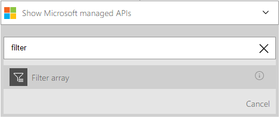
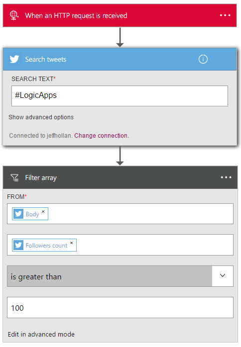

<properties
	pageTitle="Add the query action in Logic Apps | Microsoft Azure"
	description="Overview of query action for performing actions like Filter Array."
	services=""
	documentationCenter="" 
	authors="jeffhollan"
	manager="erikre"
	editor=""
	tags="connectors"/>

<tags
   ms.service="app-service-logic"
   ms.devlang="na"
   ms.topic="article"
   ms.tgt_pltfrm="na"
   ms.workload="na" 
   ms.date="07/20/2016"
   ms.author="jehollan"/>

# Get started with the query action

With the query action you can work with batches and arrays to accomplish workflows to:

- Create a task for all high priority records from a database.
- Save all PDF attachments for emails into Azure Blob.

To get started using the query action in a logic app, see [create a logic app](../app-service-logic/app-service-logic-create-a-logic-app.md).

---

## Use the query action
	
An action is an operation carried out by the workflow defined in a logic app. [Learn more about actions.](connectors-overview.md)  The query action currently has one operation exposed in the designer - filter array.  This allows you to query an array and return a set of filtered results.  Here's how you can add it in a logic app:

1. Select the **New Step** button
1. Choose **Add an action**
1. In the action search box, type "Filter" to list the **Filter array** action

	

1. Select an array to filter (the screenshot below shows the array of results from a Twitter search)
1. Create a condition to evaluate on each item (the screenshot below filters tweets from users with more than 100 followers)

	

1. The action will output a new array that contains only results that met the filter requirements
1. Click save at the top left corner of the toolbar, and your logic app will both save and publish (activate)

---

## Technical details

Below are the details for actions this connector supports.

## Query actions

An action is an operation carried out by the workflow defined in a logic app. [Learn more about actions.](connectors-overview.md) The connector has 1 possible action. 

|Action|Description|
|---|---|
|Filter Array|Evaluate a condition for each item in an array and return the results|

### Action details

The query action comes with 1 possible action. Below, there is information on each of the actions, their required and optional input fields, and the corresponding output details associated with their usage.

#### Filter Array
Make an HTTP outbound request.
An * means required field.

|Display Name|Property Name|Description|
|---|---|---|
|From*|from|The array to filter|
|Condition*|where|The condition to evaluate for each item|
 

**Output Details**

HTTP Response

|Property Name|Data Type|Description|
|---|---|---|
|Filtered array|array|Array that contains an object for each filtered result|

---

## Next steps

Below are details on how to move forward with logic apps and our community.

## Create a logic app

Try out the platform and [create a logic app](../app-service-logic/app-service-logic-create-a-logic-app.md) now. You can explore the other available connectors in logic apps by looking at our [APIs list](apis-list.md).
