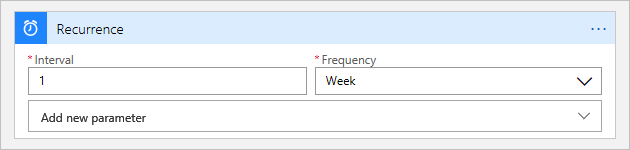
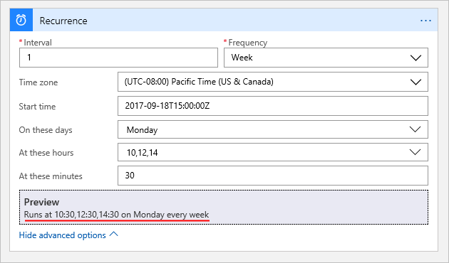

# Create and run recurring tasks and workflows with Azure Logic Apps

To schedule tasks, actions, workloads, or processes that run regularly, 
you can create a logic app workflow that starts with the 
**Schedule - Recurrence** [trigger](../logic-apps/logic-apps-overview.md#logic-app-concepts). 
With this trigger, you can set a date and time for starting the recurrence 
and a recurrence schedule for performing tasks, such as these examples and more:

* Get internal data: [Run a SQL stored procedure](../connectors/connectors-create-api-sqlazure.md) every day.
* Get external data: Pull weather reports from NOAA every 15 minutes.
* Report data: Email a summary for all orders greater than a specific amount in the past week.
* Process data: Compress today's uploaded images every weekday during off-peak hours.
* Clean up data: Delete all tweets older than three months.
* Archive data: Push invoices to a backup service every month.

This trigger supports many patterns, for example:

* Run immediately and repeat every *n* number of seconds, minutes, hours, days
weeks, or months.
* Start at a specific time, then run and repeat every *n* number of seconds, 
minutes, hours, days, weeks, or months.
* Run and repeat at one or more times each day, for example, at 8:00 AM and 5:00 PM.
* Run and repeat each week, but only for specific days, such as Saturday and Sunday.
* Run and repeat each week, but only for specific days and times, 
such as Monday through Friday at 8:00 AM and 5:00 PM.

When the recurrence trigger fires each time, 
Logic Apps creates and runs a new instance of your logic app workflow.

## Prerequisites

* An Azure subscription. If you don't have a subscription, 
you can [start with a free Azure account](https://azure.microsoft.com/free/). 
Otherwise, you can [sign up for a Pay-As-You-Go subscription](https://azure.microsoft.com/pricing/purchase-options/).

* Basic knowledge about 
[how to create logic apps](../logic-apps/quickstart-create-first-logic-app-workflow.md) 

## Add a recurrence trigger to your logic app

1. Sign in to the [Azure portal](https://portal.azure.com). 
Create a blank logic app, or learn [how to create a blank logic app](../logic-apps/quickstart-create-first-logic-app-workflow.md).

2. After Logic Apps Designer appears, in the search box, 
enter "recurrence" as your filter. Select the **Schedule - Recurrence** trigger. 

   

   This trigger is now the first step in your logic app.

3. Set the interval and frequency for the recurrence. 
In this example, set these properties to run your workflow every week. 

   

4. For more scheduling options, choose **Show advanced options**. 

   

5. Now you can set these options: 

   * Set a start date and time for firing the trigger. 
   If you specify a start date and time, you can also apply a time zone. 

   * If you select "Day" or "Week" for the frequency, 
   you can select specific times for the recurrence. 

   * If you select "Week", you can select specific days of the week too.
   
   

   For example, suppose that today is Monday, September 4, 2017. 
   The following recurrence trigger doesn't fire *any sooner* than the 
   start date and time, which is Monday, September 18, 2017 at 8:00 AM PST. 
   However, the recurrence schedule is set for 10:30 AM, 12:30 PM, 
   and 2:30 PM on Mondays only. So the first time that the trigger fires 
   and creates a logic app workflow instance is at 10:30 AM. 
   To learn more about how start times work, 
   see these [start time examples](#start-time).
   Future runs happen at 12:30 PM and 2:30 PM on the same day. 
   Each recurrence creates their own workflow instance. After that, 
   the entire schedule repeats all over again next Monday. 
   [*What are some other example occurrences?*](#example-recurrences)

   

   > [!NOTE]
   > The trigger shows a preview for your specified recurrence 
   > only when you select "Day" or "Week" as the frequency.
   
6. Now build your remaining workflow with actions or flow control statements. 
For more actions that you can add, see [Connectors](../connectors/apis-list.md). 

## Trigger details

You can configure these properties for the recurrence trigger.

| Name | Required | Property name | Type | Description | 
|----- | -------- | ------------- | ---- | ----------- | 
| **Frequency** | Yes | frequency | String | The unit of time for the recurrence: **Second**, **Minute**, **Hour**, **Day**, **Week**, or **Month** | 
| **Interval** | Yes | interval | Integer | A positive integer that describes how often the workflow runs based on the frequency. <p>The default interval is 1. Here are the minimum and maximum intervals: <p>- Month: 1-16 months </br>- Day: 1-500 days </br>- Hour: 1-12,000 hours </br>- Minute: 1-72,000 minutes </br>- Second: 1-9,999,999 seconds<p>For example, if the interval is 6, and the frequency is "Month", then the recurrence is every 6 months. | 
| **Time zone** | No | timeZone | String | Applies only when you specify a start time because this trigger doesn't accept [UTC offset](https://en.wikipedia.org/wiki/UTC_offset). Select the time zone that you want to apply. | 
| **Start time** | No | startTime | String | Provide a start time in this format: <p>YYYY-MM-DDThh:mm:ss if you select a time zone <p>-or- <p>YYYY-MM-DDThh:mm:ssZ if you don't select a time zone <p>So for example, if you want September 18, 2017 at 2:00 PM, then specify "2017-09-18T14:00:00" and select a time zone such as Pacific Time. Or, specify "2017-09-18T14:00:00Z" without a time zone. <p>**Note:** This start time must follow the [ISO 8601 date time specification](https://en.wikipedia.org/wiki/ISO_8601#Combined_date_and_time_representations) in [UTC date time format](https://en.wikipedia.org/wiki/Coordinated_Universal_Time), but without a [UTC offset](https://en.wikipedia.org/wiki/UTC_offset). If you don't select a time zone, you must add the letter "Z" at the end without any spaces. This "Z" refers to the equivalent [nautical time](https://en.wikipedia.org/wiki/Nautical_time). <p>For simple schedules, the start time is the first occurrence, while for complex schedules, the trigger doesn't fire any sooner than the start time. [*What are the ways that I can use the start date and time?*](#start-time) | 
| **On these days** | No | weekDays | String or string array | If you select "Week", you can select one or more days when you want to run the workflow: **Monday**, **Tuesday**, **Wednesday**, **Thursday**, **Friday**, **Saturday**, and **Sunday** | 
| **At these hours** | No | hours | Integer or integer array | If you select "Day" or "Week", you can select one or more integers from 0 to 23 as the hours of the day when you want to run the workflow. <p>For example, if you specify "10", "12" and "14", you get 10 AM, 12 PM, and 2 PM as the hour marks. | 
| **At these minutes** | No | minutes | Integer or integer array | If you select "Day" or "Week", you can select one or more integers from 0 to 59 as the minutes of the hour when you want to run the workflow. <p>For example, you can specify "30" as the minute mark and using the previous example for hours of the day, you get 10:30 AM, 12:30 PM, and 2:30 PM. | 
||||| 

## JSON example

Here is an example [recurrence trigger definition](../logic-apps/logic-apps-workflow-actions-triggers.md#recurrence-trigger):

``` json
{
    "triggers": {
        "Recurrence": {
            "type": "Recurrence",
            "recurrence": {
                "frequency": "Week",
                "interval": 1,
                "schedule": {
                    "hours": [
                        10,
                        12,
                        14
                    ],
                    "minutes": [
                        30
                    ],
                    "weekDays": [
                        "Monday"
                    ]
                },
               "startTime": "2017-09-07T14:00:00",
               "timeZone": "Pacific Standard Time"
            }
        }
    }
}
```

## FAQ

<a name="example-recurrences"></a>

**Q:** What are other example recurrence schedules? </br>
**A:** Here are more examples:

| Recurrence | Interval | Frequency | Start time | On these days | At these hours | At these minutes | Note |
| ---------- | -------- | --------- | ---------- | ------------- | -------------- | ---------------- | ---- |
| Run every 15 minutes (no start date and time) | 15 | Minute | {none} | {unavailable} | {none} | {none} | This schedule starts immediately, then calculates future recurrences based on the last run time. | 
| Run every 15 minutes (with start date and time) | 15 | Minute | *startDate*T*startTime*Z | {unavailable} | {none} | {none} | This schedule doesn't start *any sooner* than the specified start date and time, then calculates future recurrences based on the last run time. | 
| Run every hour, on the hour (with start date and time) | 1 | Hour | *startDate*Thh:00:00Z | {unavailable} | {none} | {none} | This schedule doesn't start *any sooner* than the specified start date and time. Future recurrences run every hour at the "00" minute mark. <p>If the frequency is "Week" or "Month", this schedule respectively runs only one day per week or one day per month. | 
| Run every hour, every day (no start date and time) | 1 | Hour | {none} | {unavailable} | {none} | {none} | This schedule starts immediately and calculates future recurrences based on the last run time. <p>If the frequency is "Week" or "Month", this schedule respectively runs only one day per week or one day per month. | 
| Run every hour, every day (with start date and time) | 1 | Hour | *startDate*T*startTime*Z | {unavailable} | {none} | {none} | This schedule doesn't start *any sooner* than the specified start date and time, then calculates future recurrences based on the last run time. <p>If the frequency is "Week" or "Month", this schedule respectively runs only one day per week or one day per month. | 
| Run every 15 minutes past the hour, every hour (with start date and time) | 1 | Hour | *startDate*T00:15:00Z | {unavailable} | {none} | {none} | This schedule doesn't start *any sooner* than the specified start date and time, running at 00:15 AM, 1:15 AM, 2:15 AM, and so on. | 
| Run every 15 minutes past the hour, every hour (no start date and time) | 1 | Day | {none} | {unavailable} | 0, 1, 2, 3, 4, 5, 6, 7, 8, 9, 10, 11, 12, 13, 14, 15, 16, 17, 18, 19, 20, 21, 22, 23 | 15 | This schedule runs at 00:15 AM, 1:15 AM, 2:15 AM, and so on. Also, this schedule is equivalent to a frequency of "Hour" and a start time with "15" minutes. | 
| Run every 15 minutes at the 15-minute mark (no start date and time) | 1 | Day | {none} | {unavailable} | 0, 1, 2, 3, 4, 5, 6, 7, 8, 9, 10, 11, 12, 13, 14, 15, 16, 17, 18, 19, 20, 21, 22, 23 | 0, 15, 30, 45 | This schedule doesn't start until the next specified 15-minute mark. | 
| Run at 8:00 AM every day (no start date and time) | 1 | Day | {none} | {unavailable} | 8 | {none} | This schedule runs at 8:00 AM every day, based on the specified schedule. | 
| Run at 8:00 AM every day (with start date and time) | 1 | Day | *startDate*T08:00:00Z | {unavailable} | {none} | {none} | This schedule runs 8:00 AM every day, based on the specified start time. | 
| Run at 8:30 AM every day (no start date and time) | 1 | Day | {none} | {unavailable} | 8 | 30 | This schedule runs at 8:30 AM every day, based on the specified schedule. | 
| Run at 8:30 AM every day (with start date and time) | 1 | Day | *startDate*T08:30:00Z | {unavailable} | {none} | {none} | This schedule starts on the specified start date at 8:30 AM. | 
| Run at 8:30 AM and 4:30 PM every day | 1 | Day | {none} | {unavailable} | 8, 16 | 30 | | 
| Run at 8:30 AM, 8:45 AM, 4:30 PM, and 4:45 PM every day | 1 | Day | {none} | {unavailable} | 8, 16 | 30, 45 | | 
| Run every Saturday at 5 PM (no start date and time) | 1 | Week | {none} | "Saturday" | 17 | 00 | This schedule runs every Saturday at 5:00 PM. | 
| Run every Saturday at 5 PM (with start date and time) | 1 | Week | *startDate*T17:00:00Z | "Saturday" | {none} | {none} | This schedule doesn't start *any sooner* than the specified start date and time, in this case, September 9, 2017 at 5:00 PM. Future recurrences run every Saturday at 5:00 PM. | 
| Run every Tuesday, Thursday at 5 PM | 1 | Week | {none} | "Tuesday", "Thursday" | 17 | {none} | This schedule runs every Tuesday and Thursday at 5:00 PM. | 
| Run every hour during working hours | 1 | Week | {none} | Select all days except Saturday and Sunday. | Select the hours of the day that you want. | Select any minutes of the hour that you want. | For example, if your working hours are 8:00 AM to 5:00 PM, then select "8, 9, 10, 11, 12, 13, 14, 15, 16, 17" as the hours of the day. <p>If your working hours are 8:30 AM to 5:30 PM, select the previous hours of the day plus "30" as minutes of the hour. | 
| Run once every day on weekends | 1 | Week | {none} | "Saturday", "Sunday" | Select the hours of the day that you want. | Select any minutes of the hour as appropriate. | This schedule runs every Saturday and Sunday at the specified schedule. | 
| Run every 15 minutes biweekly on Mondays only | 2 | Week | {none} | "Monday" | 0, 1, 2, 3, 4, 5, 6, 7, 8, 9, 10, 11, 12, 13, 14, 15, 16, 17, 18, 19, 20, 21, 22, 23 | 0, 15, 30, 45 | This schedule runs every other Monday at every 15-minute mark. | 
| Run every hour for one day per month | 1 | Month | {see note} | {unavailable} | 0, 1, 2, 3, 4, 5, 6, 7, 8, 9, 10, 11, 12, 13, 14, 15, 16, 17, 18, 19, 20, 21, 22, 23 | {see note} | If you don't specify a start date and time, this schedule uses the creation date and time. To control the minutes for the recurrence schedule, specify the minutes of the hour, a start time, or use the creation time. For example, if the start time or creation time is 8:25 AM, this schedule runs at 8:25 AM, 9:25 AM, 10:25 AM, and so on. | 
||||||||| 

<a name="start-time"></a>

**Q:** What are the ways that I can use the start date and time? </br>
**A:** Here are some patterns that show how you can control recurrence with the 
start date and time, and how the Logic Apps engine executes these recurrences:

| Start time | Recurrence without schedule | Recurrence with schedule | 
| ---------- | --------------------------- | ------------------------ | 
| {none} | Runs the first workload instantly. <p>Runs future workloads based on the last run time. | Runs the first workload instantly. <p>Runs future workloads based on the specified schedule. | 
| Start time in the past | Calculates run times based on the specified start time and discards past run times. Runs the first workload at the next future run time. <p>Runs future workloads based on calculations from the last run time. <p>For more explanation, see the example following this table. | Runs the first workload *no sooner* than the start time, based on the schedule calculated from the start time. <p>Runs future workloads based on the specified schedule. <p>**Note:** If you specify a recurrence with a schedule, but don't specify hours or minutes for the schedule, then future run times are calculated using the hours or minutes, respectively, from the first run time. | 
| Start time at present or in the future | Runs the first workload at the specified start time. <p>Runs future workloads based on calculations from the last run time. | Runs the first workload *no sooner* than the start time, based on the schedule calculated from the start time. <p>Runs future workloads based on the specified schedule. <p>**Note:** If you specify a recurrence with a schedule, but don't specify hours or minutes for the schedule, then future run times are calculated using the hours or minutes, respectively, from the first run time. | 
||||

**Example for a past start time with recurrence but no schedule** 

| Start time | Current time | Recurrence | Schedule |
| ---------- | ------------ | ---------- | -------- | 
| 2017-09-**07**T14:00:00Z | 2017-09-**08**T13:00:00Z | Every 2 days | {none} | 
||||| 

In this scenario, the Logic Apps engine calculates run times based on the start time, 
discards past run times, and uses the next future start time for the first run. 
After that first run, future runs are based on the schedule calculated from the start time. 
Here's how this recurrence looks:

| Start time | First run time | Future run times | 
| ---------- | ------------ | ---------- | 
| 2017-09-**07** at 2:00 PM | 2017-09-**09** at 2:00 PM | 2017-09-**11** at 2:00 PM </br>2017-09-**13** at 2:00 PM </br>2017-09-**15** at 2:00 PM </br>and so on...
||||| 

So for this scenario, no matter how far in the past you specify the start time, 
for example, 2017-09-**05** at 2:00 PM or 2017-09-**01** at 2:00 PM, 
your first run time is the same.

## Next steps

* [Workflow actions and triggers](../logic-apps/logic-apps-workflow-actions-triggers.md#recurrence-trigger)
* [Connectors](../connectors/apis-list.md)
