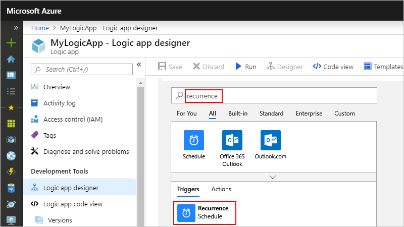
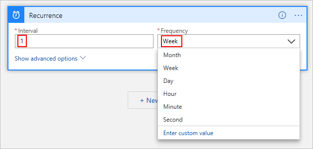
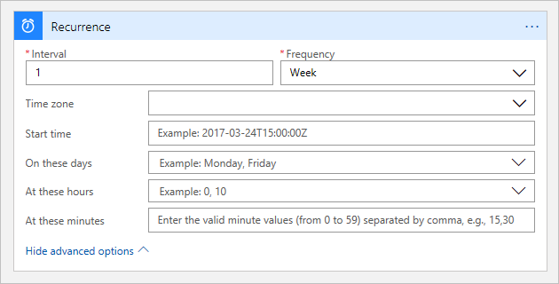

# Create, schedule, and run recurring tasks and workflows with the Recurrence trigger in Azure Logic Apps

To regularly run tasks, processes, or jobs on specific schedule, you can start your logic app workflow with the built-in **Recurrence - Schedule** trigger. You can set a date and time as well as a time zone for starting the workflow and a recurrence for repeating that workflow. If recurrences are missed for any reason, for example, due to disruptions or disabled workflows, this trigger doesn't process the missed recurrences but restarts recurrences at the next scheduled interval. For more information about the built-in Schedule triggers and actions, see [Schedule and run recurring automated, tasks, and workflows with Azure Logic Apps](../logic-apps/concepts-schedule-automated-recurring-tasks-workflows.md).

Here are some patterns that this trigger supports along with more advanced recurrences and complex schedules:

* Run immediately and repeat every *n* number of seconds, minutes, hours, days, weeks, or months.

* Start at a specific date and time, then run and repeat every *n* number of seconds, minutes, hours, days, weeks, or months.

* Run and repeat at one or more times each day, for example, at 8:00 AM and 5:00 PM.

* Run and repeat each week, but only for specific days, such as Saturday and Sunday.

* Run and repeat each week, but only for specific days and times, such as Monday through Friday at 8:00 AM and 5:00 PM.

For differences between this trigger and the Sliding Window trigger or for more information about scheduling recurring workflows, see [Schedule and run recurring automated tasks, processes, and workflows with Azure Logic Apps](../logic-apps/concepts-schedule-automated-recurring-tasks-workflows.md).

> [!TIP]
> If you want to trigger your logic app and run only one time in the future, see 
> [Run jobs one time only](../logic-apps/concepts-schedule-automated-recurring-tasks-workflows.md#run-once).

## Prerequisites

* An Azure subscription. If you don't have a subscription, [sign up for a free Azure account](https://azure.microsoft.com/free/).

* Basic knowledge about [logic apps](../logic-apps/logic-apps-overview.md). If you're new to logic apps, learn [how to create your first logic app](../logic-apps/quickstart-create-first-logic-app-workflow.md).

## Add Recurrence trigger

1. Sign in to the [Azure portal](https://portal.azure.com). Create a blank logic app.

1. After Logic App Designer appears, in the search box, enter `recurrence` as your filter. From the triggers list, select this trigger as the first step in your logic app workflow: **Recurrence**

   

1. Set the interval and frequency for the recurrence. In this example, set these properties to run your workflow every week.

   

   | Property | JSON name | Required | Type | Description |
   |----------|-----------|----------|------|-------------|
   | **Interval** | `interval` | Yes | Integer | A positive integer that describes how often the workflow runs based on the frequency. Here are the minimum and maximum intervals: <p>- Month: 1-16 months <br>- Week: 1-71 weeks <br>- Day: 1-500 days <br>- Hour: 1-12,000 hours <br>- Minute: 1-72,000 minutes <br>- Second: 1-9,999,999 seconds<p>For example, if the interval is 6, and the frequency is "Month", then the recurrence is every 6 months. |
   | **Frequency** | `frequency` | Yes | String | The unit of time for the recurrence: **Second**, **Minute**, **Hour**, **Day**, **Week**, or **Month** |
   ||||||

   > [!IMPORTANT]
   > When recurrences don't specify advanced scheduling options, future recurrences are based on the last run time.
   > The start times for these recurrences might drift due to factors such as latency during storage calls. 
   > To make sure that your logic app doesn't miss a recurrence, especially when the frequency is in days or longer, 
   > use one of these options:
   > 
   > * Provide a start time for the recurrence.
   > 
   > * Specify the hours and minutes for when to run the recurrence by using the 
   > **At these hours** and **At these minutes** properties.
   > 
   > * Use the [Sliding Window trigger](../connectors/connectors-native-sliding-window.md), 
   > rather than the Recurrence trigger.

1. To set advanced scheduling options, open the **Add new parameter** list. Any options that you select appear on the trigger after selection.

   

   | Property | JSON name | Required | Type | Description |
   |----------|-----------|----------|------|-------------|
   | **Time zone** | `timeZone` | No | String | Applies only when you specify a start time because this trigger doesn't accept [UTC offset](https://en.wikipedia.org/wiki/UTC_offset). Select the time zone that you want to apply. |
   | **Start time** | `startTime` | No | String | Provide a start date and time in this format: <p>YYYY-MM-DDThh:mm:ss if you select a time zone <p>-or- <p>YYYY-MM-DDThh:mm:ssZ if you don't select a time zone <p>So for example, if you want September 18, 2020 at 2:00 PM, then specify "2020-09-18T14:00:00" and select a time zone such as Pacific Standard Time. Or, specify "2020-09-18T14:00:00Z" without a time zone. <p>**Note:** This start time has a maximum of 49 years in the future and must follow the [ISO 8601 date time specification](https://en.wikipedia.org/wiki/ISO_8601#Combined_date_and_time_representations) in [UTC date time format](https://en.wikipedia.org/wiki/Coordinated_Universal_Time), but without a [UTC offset](https://en.wikipedia.org/wiki/UTC_offset). If you don't select a time zone, you must add the letter "Z" at the end without any spaces. This "Z" refers to the equivalent [nautical time](https://en.wikipedia.org/wiki/Nautical_time). <p>For simple schedules, the start time is the first occurrence, while for complex schedules, the trigger doesn't fire any sooner than the start time. [*What are the ways that I can use the start date and time?*](../logic-apps/concepts-schedule-automated-recurring-tasks-workflows.md#start-time) |
   | **On these days** | `weekDays` | No | String or string array | If you select "Week", you can select one or more days when you want to run the workflow: **Monday**, **Tuesday**, **Wednesday**, **Thursday**, **Friday**, **Saturday**, and **Sunday** |
   | **At these hours** | `hours` | No | Integer or integer array | If you select "Day" or "Week", you can select one or more integers from 0 to 23 as the hours of the day for when you want to run the workflow. <p><p>For example, if you specify "10", "12" and "14", you get 10 AM, 12 PM, and 2 PM for the hours of the day, but the minutes of the day are calculated based on when the recurrence starts. To set specific minutes of the day, for example, 10:00 AM, 12:00 PM, and 2:00 PM, specify those values by using the **At these minutes** property. |
   | **At these minutes** | `minutes` | No | Integer or integer array | If you select "Day" or "Week", you can select one or more integers from 0 to 59 as the minutes of the hour when you want to run the workflow. <p>For example, you can specify "30" as the minute mark and using the previous example for hours of the day, you get 10:30 AM, 12:30 PM, and 2:30 PM. |
   |||||

   For example, suppose that today is Friday, September 4, 2020. The following Recurrence trigger doesn't fire *any sooner* than the start date and time, which is Friday, September 18, 2020 at 8:00 AM PST. However, the recurrence schedule is set for 10:30 AM, 12:30 PM, and 2:30 PM on Mondays only. So the first time that the trigger fires and creates a logic app workflow instance is on Monday at 10:30 AM. To learn more about how start times work, see these [start time examples](../logic-apps/concepts-schedule-automated-recurring-tasks-workflows.md#start-time).

   Future runs happen at 12:30 PM and 2:30 PM on the same day. Each recurrence creates their own workflow instance. After that, the entire schedule repeats all over again next Monday. [*What are some other example occurrences?*](../logic-apps/concepts-schedule-automated-recurring-tasks-workflows.md#example-recurrences)

   

   > [!NOTE]
   > The trigger shows a preview for your specified recurrence only when you select "Day" or "Week" as the frequency.

1. Now build your remaining workflow with other actions. For more actions that you can add, see [Connectors for Azure Logic Apps](../connectors/apis-list.md).

## Workflow definition - Recurrence

In your logic app's underlying workflow definition, which uses JSON, you can view the [Recurrence trigger definition](../logic-apps/logic-apps-workflow-actions-triggers.md#recurrence-trigger) with the options that you chose. To view this definition, on the designer toolbar, choose **Code view**. To return to the designer, choose on the designer toolbar, **Designer**.

This example shows how a Recurrence trigger definition might look in an underlying workflow definition:

``` json
"triggers": {
   "Recurrence": {
      "type": "Recurrence",
      "recurrence": {
         "frequency": "Week",
         "interval": 1,
         "schedule": {
            "hours": [
               10,
               12,
               14
            ],
            "minutes": [
               30
            ],
            "weekDays": [
               "Monday"
            ]
         },
         "startTime": "2020-09-07T14:00:00Z",
         "timeZone": "Pacific Standard Time"
      }
   }
}
```

## Next steps

* [Pause workflows with delay actions](../connectors/connectors-native-delay.md)
* [Connectors for Logic Apps](../connectors/apis-list.md)
