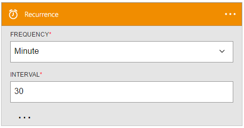

<properties
	pageTitle="Add the recurrence trigger in logic apps | Microsoft Azure"
	description="Overview of the recurrence trigger, and how to use it with an Azure logic app."
	services=""
	documentationCenter=""
	authors="jeffhollan"
	manager="erikre"
	editor=""
	tags="connectors"/>

<tags
   ms.service="logic-apps"
   ms.devlang="na"
   ms.topic="article"
   ms.tgt_pltfrm="na"
   ms.workload="na"
   ms.date="07/18/2016"
   ms.author="jehollan"/>

# Get started with the recurrence trigger

By using the recurrence trigger, you can create powerful workflows in the cloud.

For example, you can:

- Schedule a workflow to run a SQL stored procedure every day.
- Email a summary of all tweets within the last week about a certain hashtag.

To get started using the recurrence trigger in a logic app, see [Create a logic app](../app-service-logic/app-service-logic-create-a-logic-app.md).

## Use a recurrence trigger

A trigger is an event that can be used to start the workflow that is defined in a logic app. [Learn more about triggers](connectors-overview.md).

Here’s an example sequence of how to set up a recurrence trigger in a logic app.

1. Add the **Recurrence** trigger as the first step in a logic app.
2. Fill in the parameters for the recurrence interval.

The logic app now starts a run after each interval of time.

## Trigger details

The recurrence trigger has the following properties that you can configure.

It fires a logic app after a specified time interval.
A * means that it is a required field.

|Display name|Property name|Description|
|---|---|---|
|Frequency*|frequency|The unit of time: `Second`, `Minute`, `Hour`, `Day`, or `Year`.|
|Interval*|interval|The interval of the given frequency for the recurrence.|
|Time Zone|timeZone|If a startTime is provided without a UTC offset, this timeZone will be used.|
|Start time|startTime|The start time in [ISO 8601 format](https://en.wikipedia.org/wiki/ISO_8601#Combined_date_and_time_representations). If a startTime is provided without a UTC offset, this timeZone will be used.|
 

## Next steps

Now, try out the platform and [create a logic app](../app-service-logic/app-service-logic-create-a-logic-app.md). You can explore the other available connectors in logic apps by looking at our [APIs list](apis-list.md).
