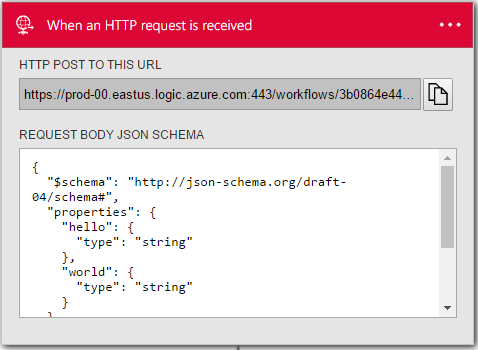
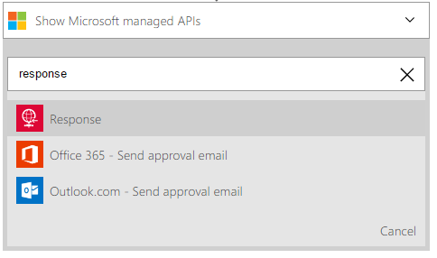
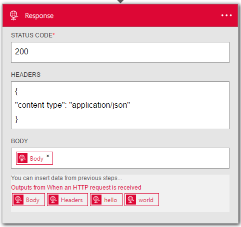

<properties
	pageTitle="Use request and response actions | Microsoft Azure"
	description="Over of the request and response trigger and action in an Azure Logic App"
	services=""
	documentationCenter="" 
	authors="jeffhollan"
	manager="erikre"
	editor=""
	tags="connectors"/>

<tags
   ms.service="app-service-logic"
   ms.devlang="na"
   ms.topic="article"
   ms.tgt_pltfrm="na"
   ms.workload="na" 
   ms.date="07/18/2016"
   ms.author="jehollan"/>

# Get started with the request and response components

With the request and response components in a logic app, you can respond real-time to events like:

- Respond to an HTTP request with data from an on-premises database through a logic app.
- Trigger a logic app from an external webhook event.
- Call a logic app with a request and response action from within another logic app

To get started using the request and response actions in a logic app, see [create a logic app](../app-service-logic/app-service-logic-create-a-logic-app.md).

---

## Use the HTTP Request trigger

A trigger is an event that can be used to start the workflow defined in a Logic app. [Learn more about triggers.](connectors-overview.md). 

Here’s an example sequence of how to setup an HTTP request in the logic app designer.

1. Add the trigger **Request - When an HTTP request is received** in your logic app
	- You can optionally provide a JSON Schema (using a tool like [jsonschema.net](http://jsonschema.net)) for the request body.  This will allow the designer to generate tokens for properties in the HTTP Request.
1. Add another action so you can save the logic app
1. After saving you can get the HTTP Request URL from the request card
1. An HTTP POST (you can use a tool like [Postman](https://www.getpostman.com/)) to the URL will trigger the logic app

>[AZURE.NOTE] If you don't define a response action, a `202 ACCEPTED` response will immediately be returned to the caller.  You can use the response action to customize a response.

## Use the HTTP Response action
	
The HTTP Response action is only valid when used in a workflow triggered by an HTTP Request.  If you don't define a response action, a `202 ACCEPTED` response will immediately be returned to the caller.  A response action be added at any step within the workflow.  The logic app will only keep the incoming request open for 1 minute for a response.  After 1 minute if no response was sent from the workflow (and a response action exists in the definition) a `504 GATEWAY TIMEOUT` will be returned to the caller.  Here's how to add an HTTP response action:

1. Select the **New Step** button
1. Choose **Add an action**
1. In the action search box, type "Response" to list the Response action

	

1. Add in any parameters required for the HTTP response message

	

1. Click save at the top left corner of the toolbar, and your logic app will both save and publish (activate)

---

## Technical details

Below are the details for the triggers and actions this connector supports.

## Request trigger

A trigger is an event that can be used to start the workflow defined in a Logic app. [Learn more about triggers.](connectors-overview.md) There is a single request trigger.

|Trigger|Description|
|---|---|
|Request|When an HTTP request is received|

## Response action

An action is an operation carried out by the workflow defined in a Logic app. [Learn more about actions.](connectors-overview.md) There is a single response action that can only be used when accompanied by a request trigger.

|Action|Description|
|---|---|
|Response|Return a response to the correlated HTTP Request|

### Action details

Below, is information on each of the actions, their required and optional input fields, and the corresponding output details associated with their usage.

#### Request Trigger
Trigger from an incoming HTTP request
An * means required field.

|Display Name|Property Name|Description|
|---|---|---|
|JSON Schema|schema|The JSON Schema of the HTTP Request body|
 

**Output Details**

Request

|Property Name|Data Type|Description|
|---|---|---|
|Headers|object|Request headers|
|Body|object|Request object|

#### Response Action

HTTP Response
An * means required field.

|Display Name|Property Name|Description|
|---|---|---|
|Status Code*|statusCode|The HTTP status code|
|Headers|headers|A JSON object of any response headers to include|
|Body|body|The response body|

## Next steps

Below are details on how to move forward with logic apps and our community.

## Create a logic app

Try out the platform and [create a logic app](../app-service-logic/app-service-logic-create-a-logic-app.md) now. You can explore the other available connectors in logic apps by looking at our [APIs list](apis-list.md).
