# Receive and respond to incoming HTTPS calls by using Azure Logic Apps

With [Azure Logic Apps](../logic-apps/logic-apps-overview.md) and the built-in Request trigger or Response action, you can create automated tasks and workflows that receive and respond to incoming HTTPS requests. For example, you can have your logic app:

* Receive and respond to an HTTPS request for data in an on-premises database.
* Trigger a workflow when an external webhook event happens.
* Receive and respond to an HTTPS call from another logic app.

> [!NOTE]
> The Request trigger supports *only* Transport Layer Security (TLS) 1.2 for incoming calls. Outgoing calls 
> continue to support TLS 1.0, 1.1, and 1.2. If you see SSL handshake errors, make sure that you use TLS 1.2. 
> For incoming calls, here are the supported cipher suites:
>
> * TLS_ECDHE_ECDSA_WITH_AES_256_GCM_SHA384
> * TLS_ECDHE_ECDSA_WITH_AES_128_GCM_SHA256
> * TLS_ECDHE_RSA_WITH_AES_256_GCM_SHA384
> * TLS_ECDHE_RSA_WITH_AES_128_GCM_SHA256
> * TLS_ECDHE_ECDSA_WITH_AES_256_CBC_SHA384
> * TLS_ECDHE_ECDSA_WITH_AES_128_CBC_SHA256
> * TLS_ECDHE_RSA_WITH_AES_256_CBC_SHA384
> * TLS_ECDHE_RSA_WITH_AES_128_CBC_SHA256

## Prerequisites

* An Azure subscription. If you don't have a subscription, you can [sign up for a free Azure account](https://azure.microsoft.com/free/).

* Basic knowledge about [logic apps](../logic-apps/logic-apps-overview.md). If you're new to logic apps, learn [how to create your first logic app](../logic-apps/quickstart-create-first-logic-app-workflow.md).

<a name="add-request"></a>

## Add Request trigger

This built-in trigger creates a manually callable HTTPS endpoint that can receive *only* incoming HTTPS requests. When this event happens, the trigger fires and runs the logic app. For more information about the trigger's underlying JSON definition and how to call this trigger, see the [Request trigger type](../logic-apps/logic-apps-workflow-actions-triggers.md#request-trigger) and [Call, trigger, or nest workflows with HTTP endpoints in Azure Logic Apps](../logic-apps/logic-apps-http-endpoint.md).

1. Sign in to the [Azure portal](https://portal.azure.com). Create a blank logic app.

1. After Logic App Designer opens, in the search box, enter "http request" as your filter. From the triggers list, select the **When an HTTP request is received** trigger, which is the first step in your logic app workflow.

   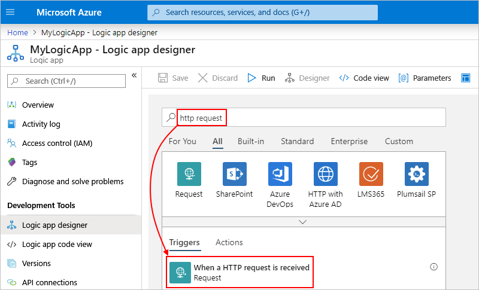

   The Request trigger shows these properties:

   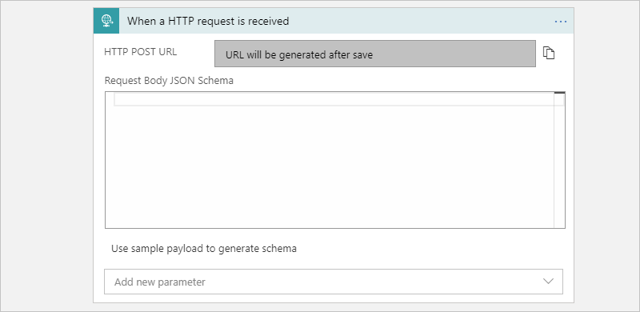

   | Property name | JSON property name | Required | Description |
   |---------------|--------------------|----------|-------------|
   | **HTTP POST URL** | {none} | Yes | The endpoint URL that's generated after you save the logic app and is used for calling your logic app |
   | **Request Body JSON Schema** | `schema` | No | The JSON schema that describes the properties and values in the incoming request body |
   |||||

1. In the **Request Body JSON Schema** box, optionally enter a JSON schema that describes the body in the incoming request, for example:

   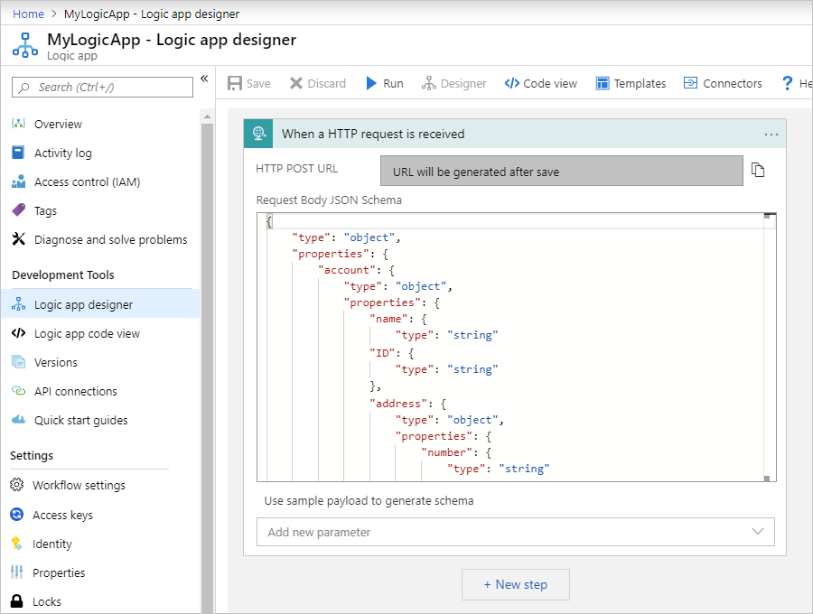

   The designer uses this schema to generate tokens for the properties in the request. That way, your logic app can parse, consume, and pass along data from the request through the trigger into your workflow.

   Here is the sample schema:

   ```json
   {
      "type": "object",
      "properties": {
         "account": {
            "type": "object",
            "properties": {
               "name": {
                  "type": "string"
               },
               "ID": {
                  "type": "string"
               },
               "address": {
                  "type": "object",
                  "properties": {
                     "number": {
                        "type": "string"
                     },
                     "street": {
                        "type": "string"
                     },
                     "city": {
                        "type": "string"
                     },
                     "state": {
                        "type": "string"
                     },
                     "country": {
                        "type": "string"
                     },
                     "postalCode": {
                        "type": "string"
                     }
                  }
               }
            }
         }
      }
   }
   ```

   When you enter a JSON schema, the designer shows a reminder to include the `Content-Type` header in your request and set that header value to `application/json`. For more information, see [Handle content types](../logic-apps/logic-apps-content-type.md).

   

   Here's what this header looks like in JSON format:

   ```json
   {
      "Content-Type": "application/json"
   }
   ```

   To generate a JSON schema that's based on the expected payload (data), you can use a tool such as [JSONSchema.net](https://jsonschema.net), or you can follow these steps:

   1. In the Request trigger, select **Use sample payload to generate schema**.

      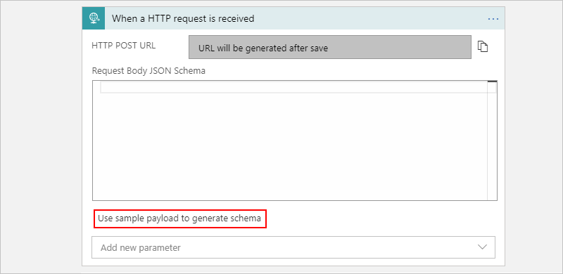

   1. Enter the sample payload, and select **Done**.

      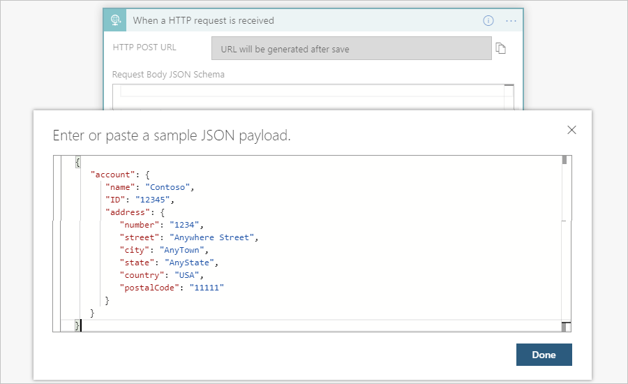

      Here is the sample payload:

      ```json
      {
         "account": {
            "name": "Contoso",
            "ID": "12345",
            "address": { 
               "number": "1234",
               "street": "Anywhere Street",
               "city": "AnyTown",
               "state": "AnyState",
               "country": "USA",
               "postalCode": "11111"
            }
         }
      }
      ```

1. To specify additional properties, open the **Add new parameter** list, and select the parameters that you want to add.

   | Property name | JSON property name | Required | Description |
   |---------------|--------------------|----------|-------------|
   | **Method** | `method` | No | The method that the incoming request must use to call the logic app |
   | **Relative path** | `relativePath` | No | The relative path for the parameter that the logic app's endpoint URL can accept |
   |||||

   This example adds the **Method** property:

   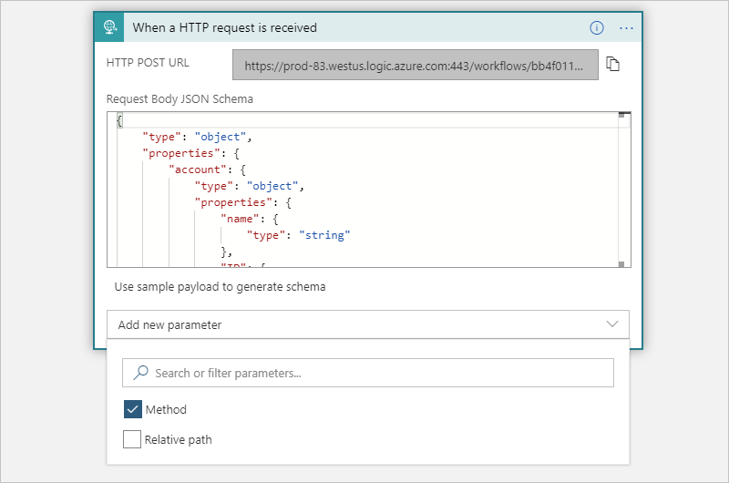

   The **Method** property appears in the trigger so that you can select a method from the list.

   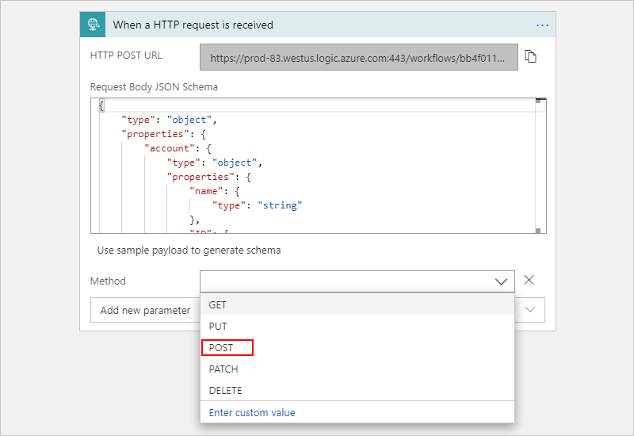

1. Now, add another action as the next step in your workflow. Under the trigger, select **Next step** so that you can find the action that you want to add.

   For example, you can respond to the request by [adding a Response action](#add-response), which you can use to return a customized response and is described later in this topic.

   Your logic app keeps the incoming request open only for one minute. Assuming that your logic app workflow includes a Response action, if the logic app doesn't return a response after this time passes, your logic app returns a `504 GATEWAY TIMEOUT` to the caller. Otherwise, if your logic app doesn't include a Response action, your logic app immediately returns a `202 ACCEPTED` response to the caller.

1. When you're done, save your logic app. On the designer toolbar, select **Save**. 

   This step generates the URL to use for sending the request that triggers the logic app. To copy this URL, select the copy icon next to the URL.

   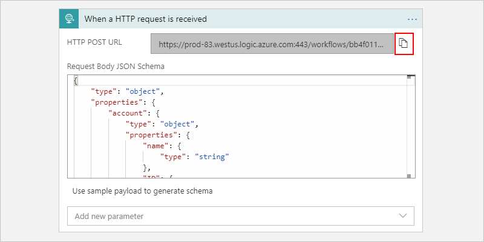

1. To trigger your logic app, send an HTTP POST to the generated URL. For example, you can use a tool such as [Postman](https://www.getpostman.com/).

### Trigger outputs

Here's more information about the outputs from the Request trigger:

| JSON property name | Data type | Description |
|--------------------|-----------|-------------|
| `headers` | Object | A JSON object that describes the headers from the request |
| `body` | Object | A JSON object that describes the body content from the request |
||||

<a name="add-response"></a>

## Add a Response action

You can use the Response action to respond with a payload (data) to an incoming HTTPS request but only in a logic app that's triggered by an HTTPS request. You can add the Response action at any point in your workflow. For more information about the underlying JSON definition for this trigger, see the [Response action type](../logic-apps/logic-apps-workflow-actions-triggers.md#response-action).

Your logic app keeps the incoming request open only for one minute. Assuming that your logic app workflow includes a Response action, if the logic app doesn't return a response after this time passes, your logic app returns a `504 GATEWAY TIMEOUT` to the caller. Otherwise, if your logic app doesn't include a Response action, your logic app immediately returns a `202 ACCEPTED` response to the caller.

1. In the Logic App Designer, under the step where you want to add a Response action, select **New step**.

   For example, using the Request trigger from earlier:

   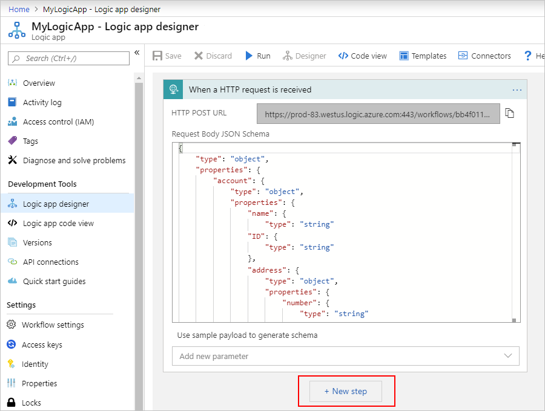

   To add an action between steps, move your pointer over the arrow between those steps. Select the plus sign (**+**) that appears, and then select **Add an action**.

1. Under **Choose an action**, in the search box, enter "response" as your filter, and select the **Response** action.

   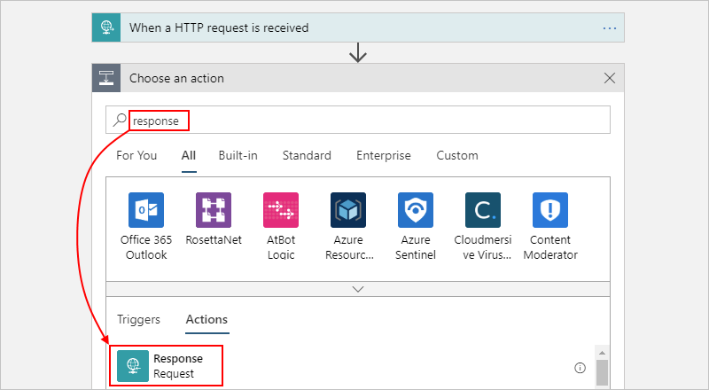

   The Request trigger is collapsed in this example for simplicity.

1. Add any values that are required for the response message. 

   In some fields, clicking inside their boxes opens the dynamic content list. You can then select tokens that represent available outputs from previous steps in the workflow. Properties from the schema specified in the earlier example now appear in the dynamic content list.

   For example, for the **Headers** box, include `Content-Type` as the key name, and set the key value to `application/json` as mentioned earlier in this topic. For the **Body** box, you can select the trigger body output from the dynamic content list.

   

   To view the headers in JSON format, select **Switch to text view**.

   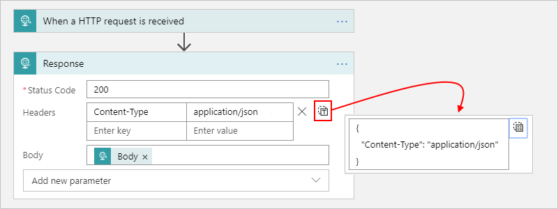

   Here is more information about the properties that you can set in the Response action. 

   | Property name | JSON property name | Required | Description |
   |---------------|--------------------|----------|-------------|
   | **Status Code** | `statusCode` | Yes | The status code to return in the response |
   | **Headers** | `headers` | No | A JSON object that describes one or more headers to include in the response |
   | **Body** | `body` | No | The response body |
   |||||

1. To specify additional properties, such as a JSON schema for the response body, open the **Add new parameter** list, and select the parameters that you want to add.

1. When you're done, save your logic app. On the designer toolbar, select **Save**. 

## Next steps

* [Connectors for Logic Apps](../connectors/apis-list.md)
