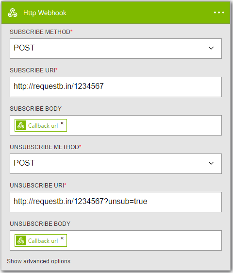
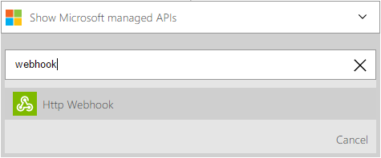
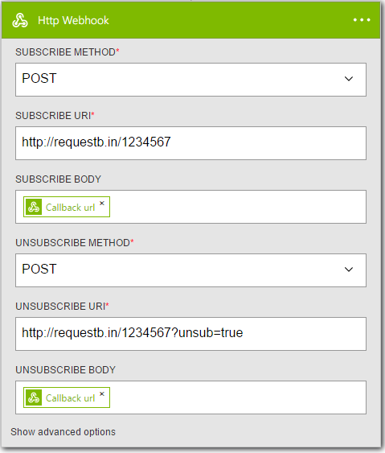

<properties
	pageTitle="Logic App webhook connector | Microsoft Azure"
	description="Overview of webhook action and triggers for performing actions like Filter Array."
	services=""
	documentationCenter="" 
	authors="jeffhollan"
	manager="erikre"
	editor=""
	tags="connectors"/>

<tags
   ms.service="app-service-logic"
   ms.devlang="na"
   ms.topic="article"
   ms.tgt_pltfrm="na"
   ms.workload="na" 
   ms.date="07/21/2016"
   ms.author="jehollan"/>

# Get started with the webhook connector

With the webhook action and trigger you can trigger, pause, and resume flows to accomplish:

- Trigger from an [Azure Event Hub as soon as an item](https://github.com/logicappsio/EventHubAPI) is received
- Wait for an approval before continuing a workflow

Information on creating an API that supports a webhook subscribe can be found [in this article on creating Logic App connectors](../app-service-logic/app-service-logic-create-api-app.md).

---

## Use the webhook trigger

A trigger is an event that can be used to start the workflow defined in a Logic app. [Learn more about triggers](connectors-overview.md).  A webhook trigger is especially useful as it doesn't rely on polling for new items - like the [request trigger](./connectors-native-reqres.md) the logic app will fire the instant an event occurs.  It does this by registering a *callback URL* to a service which can be used to fire the logic app as needed.

Here’s an example sequence of how to setup a HTTP trigger in the logic app designer.  This assumes you have already deployed or are accessing an API that follows [the webhook subscribe and unsubscribe pattern used in Logic Apps](../app-service-logic/app-service-logic-create-api-app.md#webhook-triggers).  The subscribe call is made whenever a logic app is saved with a new webhook, or switched from disabled to enabled.  The unsubscribe call is made whenever a logic app webhook trigger is removed and saved, or switched from enabled to disabled.

1. Add the **HTTP Webhook** trigger as the first step in a logic app
1. Fill in the parameters for the webhook subscribe and unsubscribe calls
	- This follow the same pattern as the [HTTP action](./connectors-native-http.md) format

	

1. Add at least one action
1. Click save to publish the logic app - this will call the subscribe endpoint with the callback URL needed to trigger this logic app
1. Whenever the service makes an `HTTP POST` to the callback URL, the logic app will fire (and include any data passed in the request)

## Use the webhook action
	
An action is an operation carried out by the workflow defined in a logic app. [Learn more about actions.](connectors-overview.md)  A webhook action is especially useful as it will register a *callback URL* with a service and wait until the URL is called before resuming.  The ["Send Approval Email"](./connectors-create-api-office365-outlook.md) is an example of a connector that follows this pattern.  You can extend this pattern into any service through the webhook action.  This assumes you have already deployed or are accessing an API that follows [the webhook subscribe and unsubscribe pattern used in Logic Apps](../app-service-logic/app-service-logic-create-api-app.md#webhook-actions).  The subscribe call is made whenever a logic app executes the webhook action.  The unsubscribe call is made whenever a run is cancelled while awaiting a response, or before the logic app run times out.

To add a webhook action:

1. Select the **New Step** button
1. Choose **Add an action**
1. In the action search box, type "webhook" to list the **HTTP Webhook** action

	

1. Fill in the parameters for the webhook subscribe and unsubscribe calls
	- This follow the same pattern as the [HTTP action](./connectors-native-http.md) format

	

	- At runtime the logic app will call the subscribe endpoint once it reaches the step

1. Click save at the top left corner of the toolbar, and your logic app will both save and publish (activate)

---

## Technical details

Below are the details for the trigger and action webhook supports.

## Webhook triggers

A trigger is an operation to start a workflow. [Learn more about triggers.](connectors-overview.md) This connector has 1 trigger.

|Action|Description|
|---|---|
|HTTP Webhook|Subscribe a callback URL to a service that can call the URL to fire logic app as needed.|

### Trigger details

The webhook connector comes with 1 possible trigger. Below is the information on the action, its required and optional input fields, and the corresponding output details associated with its usage.

#### HTTP Webhook
Subscribe a callback URL to a service that can call the URL to fire logic app as needed.
An * means required field.

|Display Name|Property Name|Description|
|---|---|---|
|Subscribe Method*|method|HTTP Method to use for subscribe request|
|Subscribe URI*|uri|HTTP URI to use for subscribe request|
|Unsubscribe Method*|method|HTTP method to use for unsubscribe request|
|Unsubscribe URI*|uri|HTTP URI to use for unsubscribe request|
|Subscribe Body|body|HTTP request body for subscribe|
|Subscribe Headers|headers|HTTP request headers for subscribe|
|Subscribe Authentication|authencation|HTTP authentication to use for subscribe. [See HTTP connector](./connectors-native-http.md#authenication) for details|
|Unsubscribe Body|body|HTTP request body for unsubscribe|
|Unsubscribe Headers|headers|HTTP request headers for unsubscribe|
|Unsubscribe Authentication|authentication|HTTP authentication to use for unsubscribe. [See HTTP connector](./connectors-native-http.md#authenication) for details|
 

**Output Details**

Webhook request

|Property Name|Data Type|Description|
|---|---|---|
|Headers|object|Webhook request headers|
|Body|object|Webhook request object|
|Status Code|int|Webhook request status code|

## Webhook actions

An action is an operation carried out by the workflow defined in a logic app. [Learn more about actions.](connectors-overview.md) The connector has 1 possible action. 

|Action|Description|
|---|---|
|HTTP Webhook|Subscribe a callback URL to a service that can call the URL to resume a workflow step as needed.|

### Action details

The webhook connector comes with 1 possible action. Below, there is information on the action, its required and optional input fields, and the corresponding output details associated with its usage.

#### HTTP Webhook
Subscribe a callback URL to a service that can call the URL to resume a workflow step as needed.
An * means required field.

|Display Name|Property Name|Description|
|---|---|---|
|Subscribe Method*|method|HTTP Method to use for subscribe request|
|Subscribe URI*|uri|HTTP URI to use for subscribe request|
|Unsubscribe Method*|method|HTTP method to use for unsubscribe request|
|Unsubscribe URI*|uri|HTTP URI to use for unsubscribe request|
|Subscribe Body|body|HTTP request body for subscribe|
|Subscribe Headers|headers|HTTP request headers for subscribe|
|Subscribe Authentication|authencation|HTTP authentication to use for subscribe. [See HTTP connector](./connectors-native-http.md#authenication) for details|
|Unsubscribe Body|body|HTTP request body for unsubscribe|
|Unsubscribe Headers|headers|HTTP request headers for unsubscribe|
|Unsubscribe Authentication|authentication|HTTP authentication to use for unsubscribe. [See HTTP connector](./connectors-native-http.md#authenication) for details|
 

**Output Details**

Webhook request

|Property Name|Data Type|Description|
|---|---|---|
|Headers|object|Webhook request headers|
|Body|object|Webhook request object|
|Status Code|int|Webhook request status code|

---

## Next steps

Below are details on how to move forward with logic apps and our community.

## Create a logic app

Try out the platform and [create a logic app](../app-service-logic/app-service-logic-create-a-logic-app.md) now. You can explore the other available connectors in logic apps by looking at our [APIs list](apis-list.md).
