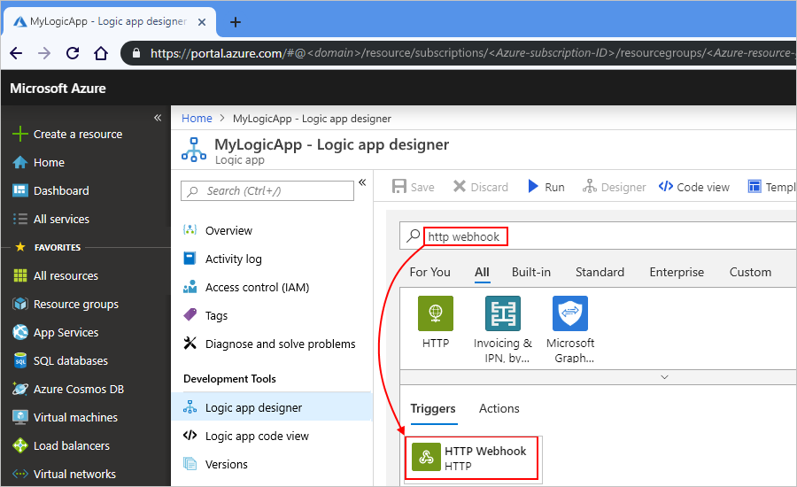
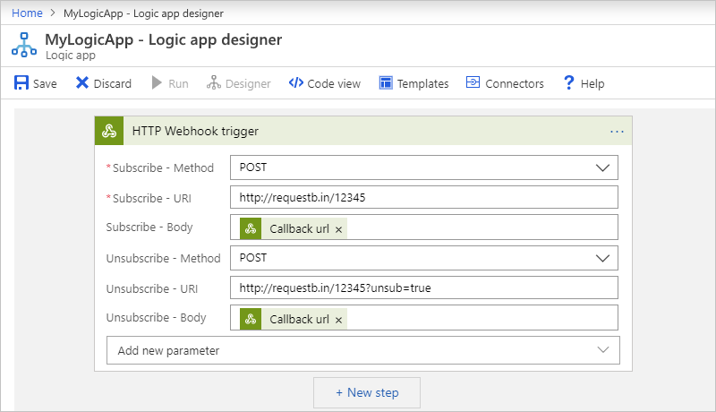
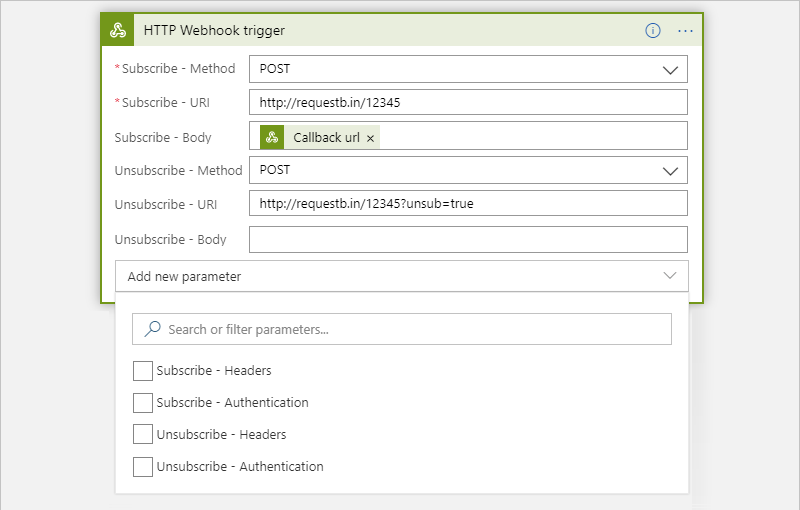
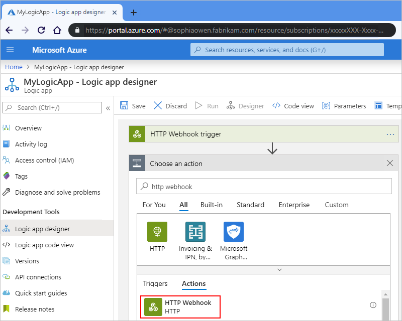
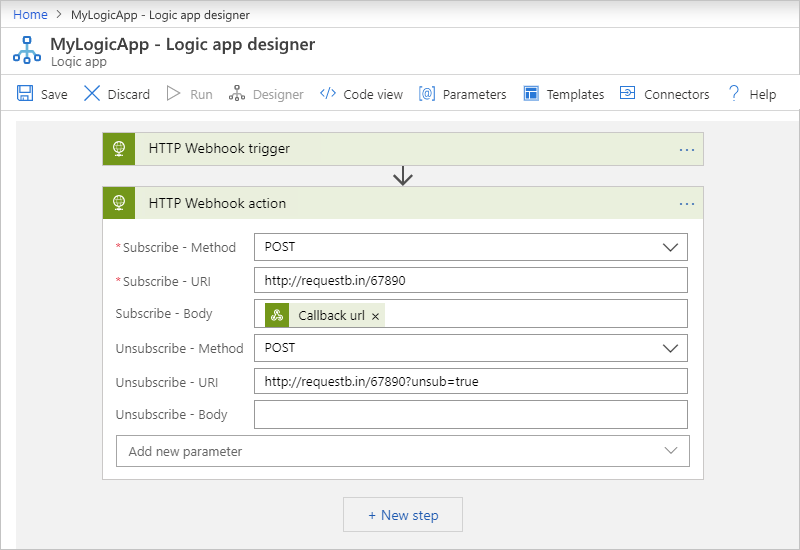
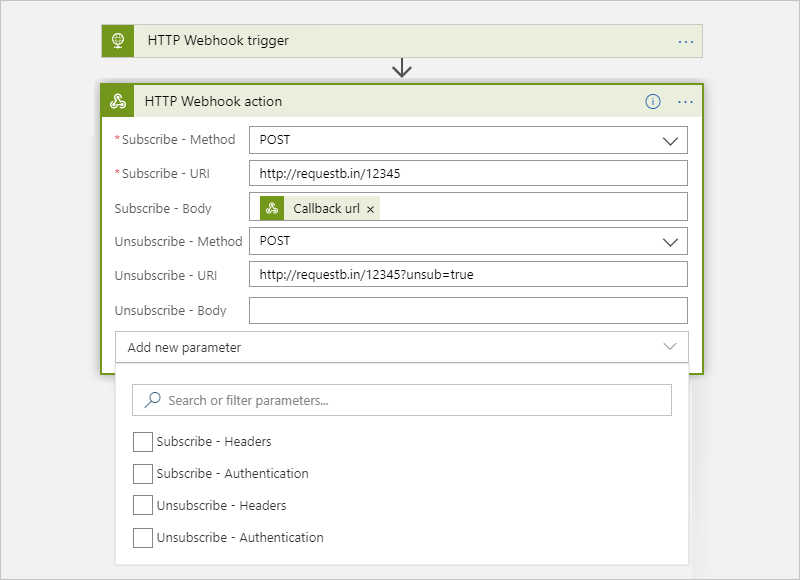

# Create and run automated event-based workflows by using HTTP webhooks in Azure Logic Apps

With [Azure Logic Apps](../logic-apps/logic-apps-overview.md) and the HTTP Webhook built-in connector, you can create an automated workflow that subscribes to a service endpoint, waits for specific events, and runs specific actions, rather than regularly check or *poll* the service endpoint.

Here are some example webhook-based workflows:

* Wait for an event to arrive from [Azure Event Hubs](https://github.com/logicappsio/EventHubAPI) before triggering a workflow run.
* Wait for an approval before continuing a workflow.

This how-to guide shows how to use the HTTP Webhook trigger and Webhook action so that your logic app workflow can receive and respond to events at a service endpoint.

## How do webhooks work?

A webhook trigger is event-based, which doesn't depend on checking or polling regularly for new data or events. After you add a webhook trigger to an empty workflow and then save the workflow, or after you re-enable a disabled logic app resource, the webhook trigger *subscribes* to the specified service endpoint by registering a *callback URL* with that endpoint. The trigger then waits for that service endpoint to call the URL, which fires the trigger and starts the workflow. Similar to the [Request trigger](connectors-native-reqres.md), a webhook trigger fires immediately. The webhook trigger also remains subscribed to the service endpoint unless you manually take the following actions:

* Change the trigger's parameter values.
* Delete the trigger and then save your workflow.
* Disable your logic app resource.

Similar to the webhook trigger, a webhook action works is also event-based. After you add a webhook action to an existing workflow and then save the workflow, or after you re-enable a disabled logic app resource, the webhook action *subscribes* to the specified service endpoint by registering a *callback URL* with that endpoint. When the workflow runs, the webhook action pauses the workflow and waits until the service endpoint calls the URL before the workflow resumes running. A webhook action *unsubscribes* from the service endpoint when the following conditions occur:

* The webhook action successfully finishes.
* The workflow run is canceled while waiting for a response.
* Before a workflow run times out.
* You change any webhook action parameter values that are used as inputs by a webhook trigger.

For example, the Office 365 Outlook connector's [**Send approval email**](connectors-create-api-office365-outlook.md) action is an example of webhook action that follows this pattern. You can extend this pattern into any service by using the webhook action.

For more information, see these topics:

* [Webhooks and subscriptions](../logic-apps/logic-apps-workflow-actions-triggers.md#webhooks-and-subscriptions)
* [Create custom APIs that support a webhook](../logic-apps/logic-apps-create-api-app.md)

For information about encryption, security, and authorization for inbound calls to your logic app, such as [Transport Layer Security (TLS)](https://en.wikipedia.org/wiki/Transport_Layer_Security), previously known as Secure Sockets Layer (SSL), or [Microsoft Entra ID Open Authentication (Microsoft Entra ID OAuth)](../active-directory/develop/index.yml), see [Secure access and data - Access for inbound calls to request-based triggers](../logic-apps/logic-apps-securing-a-logic-app.md#secure-inbound-requests).

## Prerequisites

* An Azure account and subscription. If you don't have an Azure subscription, [sign up for a free Azure account](https://azure.microsoft.com/free/?WT.mc_id=A261C142F).

* The URL for an already deployed endpoint or API that supports the webhook subscribe and unsubscribe pattern for [webhook triggers in logic apps](../logic-apps/logic-apps-create-api-app.md#webhook-triggers) or [webhook actions in logic apps](../logic-apps/logic-apps-create-api-app.md#webhook-actions) as appropriate

* The logic app where you want to wait for specific events at the target endpoint. To start with the HTTP Webhook trigger, create a blank logic app workflow. To use the HTTP Webhook action, start your logic app with any trigger that you want. This example uses the HTTP trigger as the first step.

## Add an HTTP Webhook trigger

This built-in trigger calls the subscribe endpoint on the target service and registers a callback URL with the target service. Your logic app then waits for the target service to send an `HTTP POST` request to the callback URL. When this event happens, the trigger fires and passes any data in the request along to the workflow.

1. In the [Azure portal](https://portal.azure.com), pen your blank logic app workflow in the designer.

1. In the designer's search box, enter `http webhook` as your filter. From the **Triggers** list, select the **HTTP Webhook** trigger.

   

   This example renames the trigger to `HTTP Webhook trigger` so that the step has a more descriptive name. Also, the example later adds an HTTP Webhook action, and both names must be unique.

1. Provide the values for the [HTTP Webhook trigger parameters](../logic-apps/logic-apps-workflow-actions-triggers.md#http-webhook-trigger) that you want to use for the subscribe and unsubscribe calls.

   In this example, the trigger includes the methods, URIs, and message bodies to use when performing the subscribe and unsubscribe operations.

   

   | Property | Required | Description |
   |----------|----------|-------------|
   | **Subscription - Method** | Yes | The method to use when subscribing to the target endpoint |
   | **Subscribe - URI** | Yes | The URL to use for subscribing to the target endpoint |
   | **Subscribe - Body** | No | Any message body to include in the subscribe request. This example includes the callback URL that uniquely identifies the subscriber, which is your logic app, by using the `@listCallbackUrl()` expression to retrieve your logic app's callback URL. |
   | **Unsubscribe - Method** | No | The method to use when unsubscribing from the target endpoint |
   | **Unsubscribe - URI** | No | The URL to use for unsubscribing from the target endpoint |
   | **Unsubscribe - Body** | No | An optional message body to include in the unsubscribe request 

**Note**: This property doesn't support using the `listCallbackUrl()` function. However, the trigger automatically includes and sends the headers, `x-ms-client-tracking-id` and `x-ms-workflow-operation-name`, which the target service can use to uniquely identify the subscriber. |
   ||||

1. To add other trigger properties, open the **Add new parameter** list.

   

   For example, if you need to use authentication, you can add the **Subscribe - Authentication** and **Unsubscribe - Authentication** properties. For more information about authentication types available for HTTP Webhook, see [Add authentication to outbound calls](../logic-apps/logic-apps-securing-a-logic-app.md#add-authentication-outbound).

1. Continue building your logic app's workflow with actions that run when the trigger fires.

1. When you're finished, done, remember to save your logic app. On the designer toolbar, select **Save**.

   Saving your logic app calls the subscribe endpoint on the target service and registers the callback URL. Your logic app then waits for the target service to send an `HTTP POST` request to the callback URL. When this event happens, the trigger fires and passes any data in the request along to the workflow. If this operation completes successfully, the trigger unsubscribes from the endpoint, and your logic app continues the remaining workflow.

## Add an HTTP Webhook action

This built-in action calls the subscribe endpoint on the target service and registers a callback URL with the target service. Your logic app then pauses and waits for target service to send an `HTTP POST` request to the callback URL. When this event happens, the action passes any data in the request along to the workflow. If the operation completes successfully, the action unsubscribes from the endpoint, and your logic app continues running the remaining workflow.

1. Sign in to the [Azure portal](https://portal.azure.com). Open your logic app in Logic App Designer.

   This example uses the HTTP Webhook trigger as the first step.

1. Under the step where you want to add the HTTP Webhook action, select **New step**.

   To add an action between steps, move your pointer over the arrow between steps. Select the plus sign (**+**) that appears, and then select **Add an action**.

1. In the designer's search box, enter `http webhook` as your filter. From the **Actions** list, select the **HTTP Webhook** action.

   

   This example renames the action to "HTTP Webhook action" so that the step has a more descriptive name.

1. Provide the values for the HTTP Webhook action parameters, which are similar to the [HTTP Webhook trigger parameters](../logic-apps/logic-apps-workflow-actions-triggers.md#http-webhook-trigger), that you want to use for the subscribe and unsubscribe calls.

   In this example, the action includes the methods, URIs, and message bodies to use when performing the subscribe and unsubscribe operations.

   

   | Property | Required | Description |
   |----------|----------|-------------|
   | **Subscription - Method** | Yes | The method to use when subscribing to the target endpoint |
   | **Subscribe - URI** | Yes | The URL to use for subscribing to the target endpoint |
   | **Subscribe - Body** | No | Any message body to include in the subscribe request. This example includes the callback URL that uniquely identifies the subscriber, which is your logic app, by using the `@listCallbackUrl()` expression to retrieve your logic app's callback URL. |
   | **Unsubscribe - Method** | No | The method to use when unsubscribing from the target endpoint |
   | **Unsubscribe - URI** | No | The URL to use for unsubscribing from the target endpoint |
   | **Unsubscribe - Body** | No | An optional message body to include in the unsubscribe request 

**Note**: This property doesn't support using the `listCallbackUrl()` function. However, the action automatically includes and sends the headers, `x-ms-client-tracking-id` and `x-ms-workflow-operation-name`, which the target service can use to uniquely identify the subscriber. |
   ||||

1. To add other action properties, open the **Add new parameter** list.

   

   For example, if you need to use authentication, you can add the **Subscribe - Authentication** and **Unsubscribe - Authentication** properties. For more information about authentication types available for HTTP Webhook, see [Add authentication to outbound calls](../logic-apps/logic-apps-securing-a-logic-app.md#add-authentication-outbound).

1. When you're finished, remember to save your logic app. On the designer toolbar, select **Save**.

   Now, when this action runs, your logic app calls the subscribe endpoint on the target service and registers the callback URL. The logic app then pauses the workflow and waits for the target service to send an `HTTP POST` request to the callback URL. When this event happens, the action passes any data in the request along to the workflow. If the operation completes successfully, the action unsubscribes from the endpoint, and your logic app continues running the remaining workflow.

## Trigger and action outputs

Here is more information about the outputs from an HTTP Webhook trigger or action, which returns this information:

| Property name | Type | Description |
|---------------|------|-------------|
| headers | object | The headers from the request |
| body | object | The object with the body content from the request |
| status code | int | The status code from the request |
||||

| Status code | Description |
|-------------|-------------|
| 200 | OK |
| 202 | Accepted |
| 400 | Bad request |
| 401 | Unauthorized |
| 403 | Forbidden |
| 404 | Not Found |
| 500 | Internal server error. Unknown error occurred. |
|||

## Connector reference

For more information about trigger and action parameters, which are similar to each other, see [HTTP Webhook parameters](../logic-apps/logic-apps-workflow-actions-triggers.md#http-webhook-trigger).

## Next steps

* [Secure access and data - Access for inbound calls to request-based triggers](../logic-apps/logic-apps-securing-a-logic-app.md#secure-inbound-requests)
* [Managed connectors for Azure Logic Apps](/connectors/connector-reference/connector-reference-logicapps-connectors)
* [Built-in connectors for Azure Logic Apps](built-in.md)
