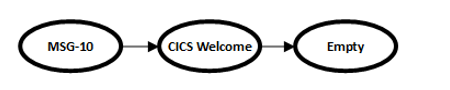
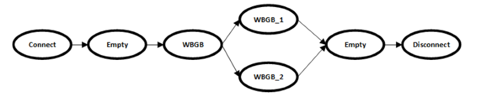
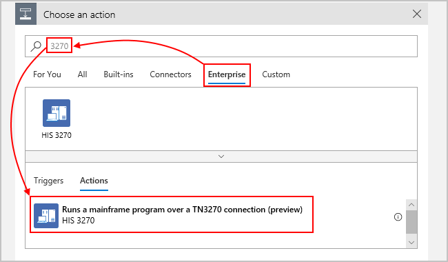
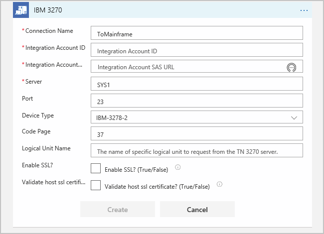
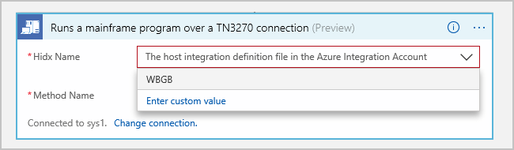
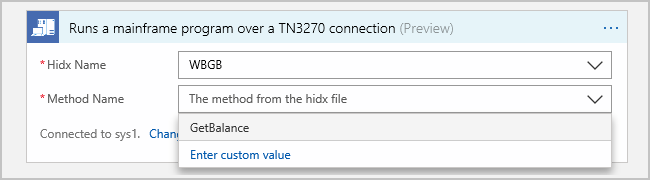

# Integrate 3270 screen-driven apps on IBM mainframes with Azure by using Azure Logic Apps and IBM 3270 connector

> [!NOTE]
> This connector is in 
> [*public preview*](https://azure.microsoft.com/support/legal/preview-supplemental-terms/). 

With Azure Logic Apps and the IBM 3270 connector, you can 
access and run IBM mainframe apps that you usually drive by 
navigating through 3270 emulator screens. That way, you can 
integrate your IBM mainframe apps with Azure, Microsoft, 
and other apps, services, and systems by creating automated 
workflows with Azure Logic Apps. The connector communicates 
with IBM mainframes by using the TN3270 protocol and is 
available in all Azure Logic Apps regions except for Azure 
Government and Azure China 21Vianet. If you're new to logic apps, review 
[What is Azure Logic Apps?](../logic-apps/logic-apps-overview.md)

This article describes these aspects for using the 3270 connector: 

* Why use the IBM 3270 connector in Azure Logic Apps 
and how the connector runs 3270 screen-driven apps

* The prerequisites and setup for using the 3270 connector

* The steps for adding 3270 connector actions to your logic app

## Why use this connector?

To access apps on IBM mainframes, you typically use a 
3270 terminal emulator, often called a "green screen". 
This method is a time-tested way but has limitations. 
Although Host Integration Server (HIS) helps you work 
directly with these apps, sometimes, separating the 
screen and business logic might not be possible. Or, 
maybe you no longer have information for how the host 
applications work.

To extend these scenarios, the IBM 3270 connector in 
Azure Logic Apps works with the 3270 Design Tool, 
which you use to record, or "capture", the host screens 
used for a specific task, define the navigation flow for 
that task through your mainframe app, and define the methods 
with input and output parameters for that task. The design 
tool converts that information into metadata that the 3270 
connector uses when calling an action that represents that 
task from your logic app.

After you generate the metadata file from the design tool, 
you add that file to an integration account in Azure. That way, 
your logic app can access your app's metadata when you add a 
3270 connector action. The connector reads the metadata file 
from your integration account, handles navigation through the 
3270 screens, and dynamically presents the parameters for 
the 3270 connector action. You can then provide data to the 
host application, and the connector returns the results to 
your logic app. That way, you can integrate your legacy apps 
with Azure, Microsoft, and other apps, services, and systems 
that Azure Logic Apps supports.

## Prerequisites

* An Azure subscription. If you don't have an Azure subscription, 
<a href="https://azure.microsoft.com/free/" target="_blank">sign up for a free Azure account</a>.

* Basic knowledge about 
[how to create logic apps](../logic-apps/quickstart-create-first-logic-app-workflow.md)

* Recommended: An [integration service environment (ISE)](../logic-apps/connect-virtual-network-vnet-isolated-environment.md) 

  You can select this environment as the location for creating and 
  running your logic app. An ISE provides access from your logic app 
  to resources that are protected inside Azure virtual networks.

* The logic app to use for automating and running 
your 3270 screen-driven app

  The IBM 3270 connector doesn't have triggers, 
  so use another trigger to start your logic app, 
  such as the **Recurrence** trigger. You can 
  then add 3270 connector actions. To get started, 
  [create a blank logic app](../logic-apps/quickstart-create-first-logic-app-workflow.md). 
  If you use an ISE, select that ISE as your logic app's location.

* [Download and install the 3270 Design Tool](https://aka.ms/3270-design-tool-download).
The only prerequisite is [Microsoft .NET Framework 4.6.1](https://aka.ms/net-framework-download).

  This tool helps you record the screens, navigation paths, 
  methods, and parameters for the tasks in your app that you 
  add and run as 3270 connector actions. The tool generates 
  a Host Integration Designer XML (HIDX) file that provides 
  the necessary metadata for the connector to use for driving 
  your mainframe app.
  
  After downloading and installing this tool, 
  follow these steps for connecting to your host:

  1. Open the 3270 Design Tool. From the 
  **Session** menu, select **Host Sessions**.
  
  1. Provide your TN3270 host server information.

* An [integration account](../logic-apps/logic-apps-enterprise-integration-create-integration-account.md), 
which is the place where you store your HIDX file as a map so your 
logic app can access the metadata and method definitions in that file. 

  Make sure your integration account is linked to the logic app 
  you're using. Also, if you use an ISE, make sure your integration 
  account's location is the same ISE that your logic app uses.

* Access to the TN3270 server that hosts your mainframe app

## Create metadata overview

In a 3270 screen-driven app, the screens and data fields are unique 
to your scenarios, so the 3270 connector needs this information about 
your app, which you can provide as metadata. This metadata describes 
information that helps your logic app identify and recognize screens, 
describes how to navigate between screens, where to input data, 
and where to expect results. To specify and generate this metadata, 
you use the 3270 Design Tool, which walks you through these specific 
*modes*, or stages, as described later in more details:

* **Capture**: In this mode, you record the screens required for completing 
a specific task with your mainframe app, for example, getting a bank balance.

* **Navigation**: In this mode, you specify the plan or path for how 
to navigate through your mainframe app's screens for the specific task.

* **Methods**: In this mode, you define the method, for example, 
`GetBalance`, that describes the screen navigation path. You also 
choose the fields on each screen that become the method's input 
and output parameters.

### Unsupported elements

The design tool doesn't support these elements:

* Partial IBM Basic Mapping Support (BMS) maps: If you import 
a BMS map, the design tool ignores partial screen definitions.
* In/Out parameters: You can't define In/Out parameters.
* Menu processing: Not supported during preview
* Array processing: Not supported during preview

## Capture screens

In this mode, you mark an item on each 3270 screen that 
uniquely identifies that screen. For example, you might 
specify a line of text or a more complex set of conditions, 
such as specific text and a non-empty field. You can either 
record these screens over a live connection to the host server, 
or import this information from an IBM Basic Mapping Support 
(BMS) map. The live connection uses a TN3270 emulator for 
connecting to the host. Each connector action must map to 
a single task that starts with connecting to your session 
and ends with disconnecting from your session.

1. If you haven't already, open the 3270 Design Tool. On the 
toolbar, choose **Capture** so that you enter Capture mode.

1. To start recording, press the F5 key, or from 
the **Recording** menu, select **Start Recording**. 

1. From the **Session** menu, select **Connect**.

1. In the **Capture** pane, starting from the 
first screen in your app, step through your app 
for the specific task that you're recording.

1. After you finish the task, sign out from your app as you usually do.

1. From the **Session** menu, select **Disconnect**.

1. To stop recording, press the Shift + F5 keys, 
or from the **Recording** menu, select **Stop Recording**.

   After you capture the screens for a task, the designer tool 
   shows thumbnails that represent those screens. Some notes 
   about these thumbnails:

   * Included with your captured screens, 
   you have a screen that's named "Empty".

     When you first connect to 
     [CICS](https://www.ibm.com/it-infrastructure/z/cics), 
     you must send the "Clear" key before you can enter the name 
     for the transaction you want to run. The screen where you 
     send the "Clear" key doesn't have any *recognition attributes*, 
     such as a screen title, which you can add by using the Screen 
     Recognition editor. To represent this screen, the thumbnails 
     includes a screen named "Empty". You can later use this screen 
     for representing the screen where you enter the transaction name.

   * By default, the name for a captured screen uses the first word on 
   the screen. If that name already exists, the design tool appends 
   the name with an underscore and a number, for example, "WBGB" and "WBGB_1".

1. To give a more meaningful name to a 
captured screen, follow these steps:

   1. In the **Host Screens** pane, select the 
   screen you want to rename.

   1. In the same pane, near the bottom in the 
   same pane, find the **Screen Name** property.

   1. Change the current screen name to a more descriptive name.

1. Now specify the fields for identifying each screen.

   With the 3270 data stream, screens don't have default identifiers, 
   so you need to select unique text on each screen. For complex scenarios, 
   you can specify multiple conditions, for example, unique text and a 
   field with a specific condition.

After you finish selecting the recognition fields, 
move to the next mode.

### Conditions for identifying repeated screens

For the connector to navigate and differentiate between screens, 
you usually find unique text on a screen that you can use as an 
identifier among the captured screens. For repeated screens, 
you might need more identification methods. For example, suppose 
you have two screens that look the same except one screen returns 
a valid value, while the other screen returns an error message.

In the design tool, you can add *recognition attributes*, 
for example, a screen title such as "Get Account Balance", 
by using the Screen Recognition editor. If you have a forked 
path and both branches return the same screen but with 
different results, you need other recognition attributes. 
At run time, the connector uses these attributes for 
determining the current branch and fork. Here are the 
conditions you can use:

* Specific value: This value matches the 
specified string at the specified location.
* NOT a specific value: This value doesn't match 
the specified string at the specified location.
* Empty: This field is empty.
* NOT empty: This field isn't empty.

To learn more, see the [Example navigation plan](#example-plan) 
later in this topic.

## Define navigation plans

In this mode, you define the flow or steps for navigating 
through your mainframe app's screens for your specific task. 
For example, sometimes, you might have more than one path that 
your app can take where one path produces the correct result, 
while the other path produces an error. For each screen, specify the 
keystrokes necessary for moving to the next screen, such as `CICSPROD <enter>`.

> [!TIP]
> If you're automating several tasks that use the same connect 
> and disconnect screens, the design tool provides special 
> Connect and Disconnect plan types. When you define these plans, 
> you can add them to your navigation plan's beginning and end.

### Guidelines for plan definitions

* Include all screens, starting with 
connecting and ending with disconnecting.

* You can create a standalone plan or use the 
Connect and Disconnect plans, which let you reuse 
a series of screens common to all your transactions.

  * The last screen in your Connect plan must be the 
  same screen as the first screen in your navigation plan.

  * The first screen in your Disconnect plan must be 
  same screen as the last screen in your navigation plan.

* Your captured screens might contain many repeated screens, 
so select and use only one instance of any repeated screens 
in your plan. Here are some examples of repeated screens:

  * The sign in screen, for example, the **MSG-10** screen
  * The welcome screen for CICS
  * The "Clear" or **Empty** screen

### Create plans

1. On the 3270 Design Tool's toolbar, choose 
**Navigation** so that you enter Navigation mode.

1. To start your plan, in the **Navigation** pane, 
choose **New Plan**.

1. Under **Choose New Plan Name**, enter a name for 
your plan. From the **Type** list, select the plan type:

   | Plan type | Description |
   |-----------|-------------|
   | **Process** | For standalone or combined plans |
   | **Connect** | For Connect plans |
   | **Disconnect** | For Disconnect plans |
   |||

1. From the **Host Screens** pane, drag the captured thumbnails 
to the navigation plan surface in the **Navigation** pane.

   To represent the blank screen where you enter 
   the transaction name, use the "Empty" screen.

1. Arrange the screens in the order that 
describes the task that you're defining.

1. To define the flow path between screens, including forks 
and joins, on the design tool's toolbar, choose **Flow**.

1. Choose the first screen in the flow. Drag and 
draw a connection to the next screen in the flow.

1. For each screen, provide the values for the **AID Key** 
property (Attention Identifier) and for the **Fixed Text** 
property, which moves the flow to the next screen.

   You might have just the AID key, 
   or both the AID key and fixed text.

After you finish your navigation plan, 
you can [define methods in the next mode](#define-method).

### Example

In this example, suppose you run a CICS 
transaction named "WBGB" that has these steps: 

* On the first screen, you enter a name and an account.
* On the second screen, you get the account balance.
* You exit to the "Empty" screen.
* You sign out from CICS to the "MSG-10" screen.

Also suppose that you repeat these steps, but you enter incorrect 
data so you can capture the screen that shows the error. Here are 
the screens you capture:

* MSG-10
* CICS Welcome
* Empty
* WBGB_1 (input)
* WBGB_2 (error)
* Empty_1
* MSG-10_1

Although many screens here get unique names, some screens are the same screen, 
for example, "MSG-10" and "Empty". For a repeated screen, use only one instance 
for that screen in your plan. Here are examples that show how a standalone plan, 
Connect plan, Disconnect plan, and a combined plan might look:

* Standalone plan

  

* Connect plan

  

* Disconnect plan

  

* Combined plan

  

#### Example: Identify repeated screens

For the connector to navigate and differentiate screens, 
you usually find unique text on a screen that you can use as 
an identifier across the captured screens. For repeated screens, 
you might need more identification methods. The example plan has a 
fork where you can get screens that look similar. One screen returns 
an account balance, while the other screen returns an error message.

The design tool lets you add recognition attributes, for example, 
a screen title named "Get Account Balance", by using the Screen 
Recognition editor. In the case with similar screens, you need 
other attributes. At run time, the connector uses these attributes 
for determining the branch and fork.

* In the branch that returns valid input, which is 
the screen with the account balance, you can add a 
field that has a "not empty" condition.

* In the branch that returns with an error, you can 
add a field that has an "empty" condition.

## Define methods

In this mode, you define a method that's associated with your navigation plan. 
For each method parameter, you specify the data type, such as a string, integer, 
date or time, and so on. When you're done, you can test your method on the 
live host and confirm that the method works as expected. You then generate 
the metadata file, or Host Integration Designer XML (HIDX) file, which now 
has the method definitions to use for creating and running an action for 
the IBM 3270 connector.

1. On the 3270 Design Tool's toolbar, choose 
**Methods** so that you enter Methods mode. 

1. In the **Navigation** pane, select the 
screen that has the input fields you want.

1. To add the first input parameter for your method, 
follow these steps:

   1. In the **Capture** pane, on the 3270 emulator screen, 
   choose the whole field, not just text inside the field, 
   that you want as the first input.

      > [!TIP]
      > To display all the fields and make sure 
      > that you select the complete field, 
      > on the **View** menu, select **All Fields**.

   1. On the design tool's toolbar, choose **Input Field**. 

   To add more input parameters, 
   repeat the previous steps for each parameter.

1. To add the first output parameter for your method, 
follow these steps:

   1. In the **Capture** pane, on the 3270 emulator screen, 
   choose the whole field, not just text inside the field, 
   that you want as the first output.

      > [!TIP]
      > To display all the fields and make sure 
      > that you select the complete field, 
      > on the **View** menu, select **All Fields**.

   1. On the design tool's toolbar, choose **Output Field**.

   To add more output parameters, 
   repeat the previous steps for each parameter.

1. After you add all your method's parameters, 
define these properties for each parameter:

   | Property name | Possible values | 
   |---------------|-----------------|
   | **Data Type** | Byte, Date Time, Decimal, Int, Long, Short, String |
   | **Field Fill Technique** | Parameters support these fill types, filling with blanks if necessary: 

- **Type**: Enter characters sequentially into the field. 
- **Fill**: Replace the field's contents with characters, filling with blanks if necessary. 
- **EraseEofType**: Clear the field, and then enter characters sequentially into the field. |
   | **Format String** | Some parameter data types use a format string, which informs the 3270 connector how to convert text from the screen into a .NET data type: 

- **DateTime**: The DateTime format string follows the [.NET custom date and time format strings](https://docs.microsoft.com/dotnet/standard/base-types/custom-date-and-time-format-strings). For example, the date `06/30/2019` uses the format string `MM/dd/yyyy`. 
- **Decimal**: The decimal format string uses the [COBOL Picture clause](https://www.ibm.com/support/knowledgecenter/SS6SG3_5.2.0/com.ibm.cobol52.ent.doc/PGandLR/ref/rlddepic.html). For example, the number `100.35` uses the format string `999V99`. |
   |||

## Save and view metadata

After you define your method, but before you test your method, 
save all the information that you defined so far to a RAP (.rap) file.
You can save to this RAP file at any time during any mode. The design 
tool also includes a sample RAP file that you can open and review by 
browsing to the design tool's installation folder at this location 
and opening the "WoodgroveBank.rap" file:

`..\Program Files\Microsoft Host Integration Server - 3270 Design Tool\SDK\WoodgroveBank.rap`

However, if you try saving changes to the sample RAP file or 
generating an HIDX file from the sample RAP file while the file 
stays in the design tool's installation folder, you might get an 
"access denied" error. By default, the design tool installs in 
your Program Files folder without elevated permissions. If you 
get an error, try one of these solutions:

* Copy the sample file to a different location.
* Run the design tool as an administrator.
* Make yourself the owner for the SDK folder.

## Test your method

1. To run your method against the live host, 
while still in Methods mode, press the F5 key, 
or from the design tool's toolbar, choose **Run**.

   > [!TIP]
   > You can change modes at any time. 
   > On the **File** menu, select **Mode**, 
   > and then select the mode you want.

1. Enter your parameters' values, and choose **OK**.

1. To continue to the next screen, choose **Next**.

1. When you're finished, choose **Done**, 
which shows your output parameter values.

## Generate and upload HIDX file

When you're ready, generate the HIDX file so you 
can upload to your integration account. The 3270 
Design Tool creates the HIDX file in a new 
subfolder where you saved your RAP file.

1. On the 3270 Design Tool's toolbar, choose **Generate Code**.

1. Go to the folder that contains your RAP file, and open the 
subfolder that the tool created after generating your HIDX file. 
Confirm that the tool created the HIDX file.

1. Sign in to the [Azure portal](https://portal.azure.com), 
and find your integration account.

1. Add your HIDX file as a map to your integration account 
by [follow these similar steps for adding maps](../logic-apps/logic-apps-enterprise-integration-liquid-transform.md), 
but when you select the map type, select **HIDX**.

Later in this topic, when you add an IBM 3270 action to your 
logic app for the first time, you're prompted to create a 
connection between your logic app and the host server by 
providing connection information, such as the names for 
your integration account and host server. After you create 
the connection, you can select your previously added 
HIDX file, the method to run, and the parameters to use.

When you finish all these steps, you can use the action that 
you create in your logic app for connecting to your IBM mainframe, 
drive screens for your app, enter data, return results, and so on. 
You can also continue adding other actions to your logic app for 
integrating with other apps, services, and systems.

## Run IBM 3270 actions

[!INCLUDE [Create connection general intro](../../includes/connectors-create-connection-general-intro.md)]

1. Sign in to the [Azure portal](https://portal.azure.com), 
and open your logic app in Logic App Designer, if not open already.

1. Under the last step where you want to add an action, 
choose **New step**, and select **Add an action**. 

1. Under the search box, choose **Enterprise**. 
In the search box, enter "3270" as your filter. 
From the actions list, select this action: 
**Runs a mainframe program over a TN3270 connection**

   

   To add an action between steps, 
   move your pointer over the arrow between steps. 
   Choose the plus sign (**+**) that appears, 
   and then select **Add an action**.

1. If no connection exists yet, provide the 
necessary information for your connection, 
and choose **Create**.

   | Property | Required | Value | Description |
   |----------|----------|-------|-------------|
   | **Connection Name** | Yes | <*connection-name*> | The name for your connection |
   | **Integration Account ID** | Yes | <*integration-account-name*> | Your integration account's name |
   | **Integration Account SAS URL** | Yes | <*integration-account-SAS-URL*> | Your integration account's Shared Access Signature (SAS) URL, which you can generate from your integration account's settings in the Azure portal. 
1. On your integration account menu, under **Settings**, select **Callback URL**.  2. In the right-hand pane, copy the **Generated Callback URL** value. |
   | **Server** | Yes | <*TN3270-server-name*> | The server name for your TN3270 service |
   | **Port** | No | <*TN3270-server-port*> | The port used by your TN3270 server. If left blank, the connector uses `23` as the default value. |
   | **Device Type** | No | <*IBM-terminal-model*> | The model name or number for the IBM terminal to emulate. If left blank, the connector uses default values. |
   | **Code Page** | No | <*code-page-number*> | The code page number for the host. If left blank, the connector uses `37` as the default value. |
   | **Logical Unit Name** | No | <*logical-unit-name*> | The specific logical unit name to request from the host |
   | **Enable SSL?** | No | On or off | Turn on or turn off SSL encryption. |
   | **Validate host ssl certificate?** | No | On or off | Turn on or turn off validation for the server's certificate. |
   ||||

   For example:

   

1. Provide the necessary information for the action:

   | Property | Required | Value | Description |
   |----------|----------|-------|-------------|
   | **Hidx Name** | Yes | <*HIDX-file-name*> | Select the 3270 HIDX file that you want to use. |
   | **Method Name** | Yes | <*method-name*> | Select the method in the HIDX file that you want to use. After you select a method, the **Add new parameter** list appears so you can select parameters to use with that method. |
   ||||

   For example:

   **Select the HIDX file**

   

   **Select the method**

   

   **Select the parameters**

   

1. When you're done, save and run your logic app.

   After your logic app finishes running, the steps from the run appear. 
   Successful steps show check marks, while unsuccessful steps show the letter "X".

1. To review the inputs and outputs for each step, expand that step.

1. To review the outputs, choose **See raw outputs**.

## Connector reference

For technical details about triggers, actions, and limit, which are described 
by the connector's OpenAPI (formerly Swagger) description, review the 
[connector's reference page](/connectors/si3270/).

## Get support

* For questions, visit the 
[Azure Logic Apps forum](https://social.msdn.microsoft.com/Forums/en-US/home?forum=azurelogicapps).

* To submit or vote on feature ideas, visit the [Logic Apps user feedback site](https://aka.ms/logicapps-wish).

## Next steps

* Learn about other [Logic Apps connectors](../connectors/apis-list.md)
