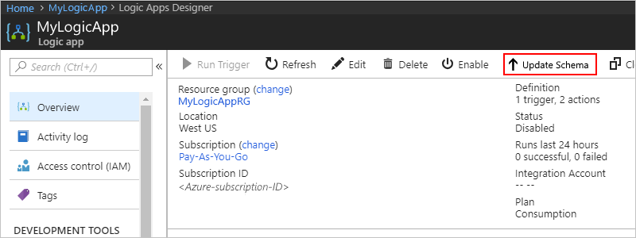

# Migrate logic apps to latest schema version

To move your existing logic apps to the newest schema, 
follow these steps: 

1. In the [Azure portal](https://portal.azure.com), 
open your logic app in the Logic App Designer.

2. On your logic app's menu, choose **Overview**. 
On the toolbar, choose **Update Schema**.

   > [!NOTE]
   > When you choose **Update Schema**, Azure Logic Apps 
   > automatically runs the migration steps and provides 
   > the code output for you. You can use this output for 
   > updating your logic app definition. However, make 
   > sure you follow best practices as described in the 
   > following **Best practices** section.

   

   The Update Schema page appears and shows 
   a link to a document that describes the 
   improvements in the new schema.

## Best practices

Here are some best practices for migrating your 
logic apps to the latest schema version:

* Copy the migrated script to a new logic app. 
Don't overwrite the old version until you complete 
your testing and confirm that your migrated app works as expected.

* Test your logic app **before** putting in production.

* After you finish migration, start updating your logic 
apps to use the [managed APIs](../connectors/apis-list.md) 
where possible. For example, start using Dropbox v2 
everywhere that you use DropBox v1.

## Next steps

* Learn how to [manually migrate your Logic apps](../logic-apps/logic-apps-schema-2015-08-01.md)
