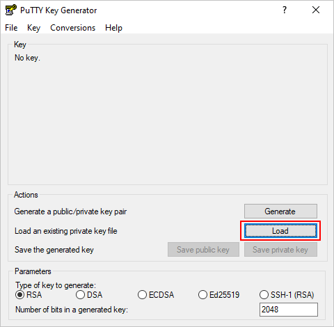
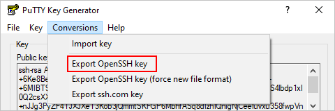
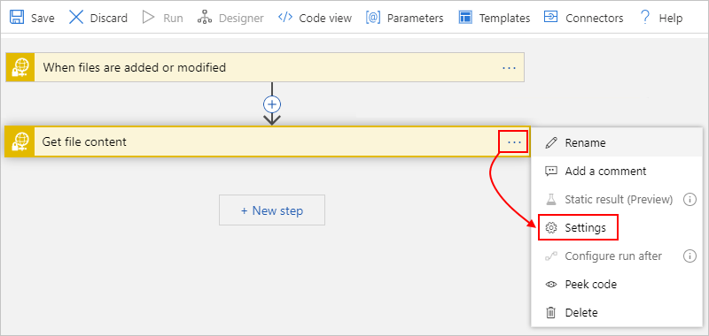

# Create and manage SFTP files using SSH and Azure Logic Apps

To automate tasks that create and manage files on a [Secure File Transfer Protocol (SFTP)](https://www.ssh.com/ssh/sftp/) server using the [Secure Shell (SSH)](https://www.ssh.com/ssh/protocol/) protocol, you can create automated integration workflows by using Azure Logic Apps and the SFTP-SSH connector. SFTP is a network protocol that provides file access, file transfer, and file management over any reliable data stream.

Here are some example tasks you can automate:

* Monitor when files are added or changed.
* Get, create, copy, rename, update, list, and delete files.
* Create folders.
* Get file content and metadata.
* Extract archives to folders.

In your workflow, you can use a trigger that monitors events on your SFTP server and makes output available to other actions. You can then use actions to perform various tasks on your SFTP server. You can also include other actions that use the output from SFTP-SSH actions. For example, if you regularly retrieve files from your SFTP server, you can send email alerts about those files and their content using the Office 365 Outlook connector or Outlook.com connector. If you're new to logic apps, review [What is Azure Logic Apps?](../logic-apps/logic-apps-overview.md)

For differences between the SFTP-SSH connector and the SFTP connector, review the [Compare SFTP-SSH versus SFTP](#comparison) section later in this topic.

## Limits

* The SFTP-SSH connector currently doesn't support these SFTP servers:

  * IBM DataPower
  * MessageWay
  * OpenText Secure MFT
  * OpenText GXS

* SFTP-SSH actions that support [chunking](../logic-apps/logic-apps-handle-large-messages.md) can handle files up to 1 GB, while SFTP-SSH actions that don't support chunking can handle files up to 50 MB. The default chunk size is 15 MB. However, this size can dynamically change, starting from 5 MB and gradually increasing to the 50-MB maximum. Dynamic sizing is based on factors such as network latency, server response time, and so on.

  > [!NOTE]
  > For logic apps in an [integration service environment (ISE)](../logic-apps/connect-virtual-network-vnet-isolated-environment-overview.md), 
  > this connector's ISE-labeled version requires chunking to use the [ISE message limits](../logic-apps/logic-apps-limits-and-config.md#message-size-limits) instead.

  You can override this adaptive behavior when you [specify a constant chunk size](#change-chunk-size) to use instead. This size can range from 5 MB to 50 MB. For example, suppose you have a 45-MB file and a network that can that support that file size without latency. Adaptive chunking results in several calls, rather that one call. To reduce the number of calls, you can try setting a 50-MB chunk size. In different scenario, if your logic app is timing out, for example, when using 15-MB chunks, you can try reducing the size to 5 MB.

  Chunk size is associated with a connection. This attribute means you can use the same connection for both actions that support chunking and actions that don't support chunking. In this case, the chunk size for actions that don't support chunking ranges from 5 MB to 50 MB. This table shows which SFTP-SSH actions support chunking:

  | Action | Chunking support | Override chunk size support |
  |--------|------------------|-----------------------------|
  | **Copy file** | No | Not applicable |
  | **Create file** | Yes | Yes |
  | **Create folder** | Not applicable | Not applicable |
  | **Delete file** | Not applicable | Not applicable |
  | **Extract archive to folder** | Not applicable | Not applicable |
  | **Get file content** | Yes | Yes |
  | **Get file content using path** | Yes | Yes |
  | **Get file metadata** | Not applicable | Not applicable |
  | **Get file metadata using path** | Not applicable | Not applicable |
  | **List files in folder** | Not applicable | Not applicable |
  | **Rename file** | Not applicable | Not applicable |
  | **Update file** | No | Not applicable |
  ||||

* SFTP-SSH triggers don't support message chunking. When requesting file content, triggers select only files that are 15 MB or smaller. To get files larger than 15 MB, follow this pattern instead:

  1. Use an SFTP-SSH trigger that returns only file properties. These triggers have names that include the description, **(properties only)**.

  1. Follow the trigger with the SFTP-SSH **Get file content** action. This action reads the complete file and implicitly uses message chunking.

## Compare SFTP-SSH versus SFTP

The following list describes key SFTP-SSH capabilities that differ from the SFTP connector:

* Uses the [SSH.NET library](https://github.com/sshnet/SSH.NET), which is an open-source Secure Shell (SSH) library that supports .NET.

* Provides the **Create folder** action, which creates a folder at the specified path on the SFTP server.

* Provides the **Rename file** action, which renames a file on the SFTP server.

* Caches the connection to SFTP server *for up to 1 hour*. This capability improves performance and reduces how often the connector tries connecting to the server. To set the duration for this caching behavior, edit the [**ClientAliveInterval** property](https://man.openbsd.org/sshd_config#ClientAliveInterval) in the SSH configuration on your SFTP server.

## Prerequisites

* An Azure subscription. If you don't have an Azure subscription, [sign up for a free Azure account](https://azure.microsoft.com/free/).

* Your SFTP server address and account credentials, so your workflow can access your SFTP account. You also need access to an SSH private key and the SSH private key password. To upload large files using chunking, you need both read and write access for the root folder on your SFTP server. Otherwise, you get a "401 Unauthorized" error.

  The SFTP-SSH connector supports both private key authentication and password authentication. However, the SFTP-SSH connector supports *only* these private key formats, algorithms, and fingerprints:

  * **Private key formats**: RSA (Rivest Shamir Adleman) and DSA (Digital Signature Algorithm) keys in both OpenSSH and ssh.com formats. If your private key is in PuTTY (.ppk) file format, first [convert the key to the OpenSSH (.pem) file format](#convert-to-openssh).
  * **Encryption algorithms**: DES-EDE3-CBC, DES-EDE3-CFB, DES-CBC, AES-128-CBC, AES-192-CBC, and AES-256-CBC
  * **Fingerprint**: MD5

  After you add an SFTP-SSH trigger or action to your workflow, you have to provide connection information for your SFTP server. When you provide your SSH private key for this connection, ***don't manually enter or edit the key***, which might cause the connection to fail. Instead, make sure that you ***copy the key*** from your SSH private key file, and ***paste*** that key into the connection details. For more information, see the [Connect to SFTP with SSH](#connect) section later this article.

* Basic knowledge about [how to create logic apps](../logic-apps/quickstart-create-first-logic-app-workflow.md)

* The logic app workflow where you want to access your SFTP account. To start with an SFTP-SSH trigger, [create a blank logic app workflow](../logic-apps/quickstart-create-first-logic-app-workflow.md). To use an SFTP-SSH action, start your workflow with another trigger, for example, the **Recurrence** trigger.

## How SFTP-SSH triggers work

### Polling behavior

SFTP-SSH triggers poll the SFTP file system and look for any file that changed since the last poll. Some tools let you preserve the timestamp when the files change. In these cases, you have to disable this feature so your trigger can work. Here are some common settings:

| SFTP client | Action |
|-------------|--------|
| Winscp | Go to **Options** > **Preferences** > **Transfer** > **Edit** > **Preserve timestamp** > **Disable** |
| FileZilla | Go to **Transfer** > **Preserve timestamps of transferred files** > **Disable** |
|||

When a trigger finds a new file, the trigger checks that the new file is complete, and not partially written. For example, a file might have changes in progress when the trigger checks the file server. To avoid returning a partially written file, the trigger notes the timestamp for the file that has recent changes, but doesn't immediately return that file. The trigger returns the file only when polling the server again. Sometimes, this behavior might cause a delay that is up to twice the trigger's polling interval.

### Trigger recurrence shift and drift

Connection-based triggers where you need to create a connection first, such as the SFTP-SSH trigger, differ from built-in triggers that run natively in Azure Logic Apps, such as the [Recurrence trigger](../connectors/connectors-native-recurrence.md). In recurring connection-based triggers, the recurrence schedule isn't the only driver that controls execution, and the time zone only determines the initial start time. Subsequent runs depend on the recurrence schedule, the last trigger execution, *and* other factors that might cause run times to drift or produce unexpected behavior. For example, unexpected behavior can include failure to maintain the specified schedule when daylight saving time (DST) starts and ends. To make sure that the recurrence time doesn't shift when DST takes effect, manually adjust the recurrence. That way, your workflow continues to run at the expected time. Otherwise, the start time shifts one hour forward when DST starts and one hour backward when DST ends. For more information, see [Recurrence for connection-based triggers](../connectors/apis-list.md#recurrence-for-connection-based-triggers).

## Convert PuTTY-based key to OpenSSH

The PuTTY format and OpenSSH format use different file name extensions. The PuTTY format uses the .ppk, or PuTTY Private Key, file name extension. The OpenSSH format uses the .pem, or Privacy Enhanced Mail, file name extension. If your private key is in PuTTY format, and you have to use OpenSSH format, first convert the key to the OpenSSH format by following these steps:

### Unix-based OS

1. If you don't have the PuTTY tools installed on your system, do that now, for example:

   `sudo apt-get install -y putty`

1. Run this command, which creates a file that you can use with the SFTP-SSH connector:

   `puttygen <path-to-private-key-file-in-PuTTY-format> -O private-openssh -o <path-to-private-key-file-in-OpenSSH-format>`

   For example:

   `puttygen /tmp/sftp/my-private-key-putty.ppk -O private-openssh -o /tmp/sftp/my-private-key-openssh.pem`

### Windows OS

1. If you haven't done so already, [download the latest PuTTY Generator (puttygen.exe) tool](https://www.chiark.greenend.org.uk/~sgtatham/putty/latest.html), and then launch the tool.

1. On this screen, select **Load**.

   

1. Browse to your private key file in PuTTY format, and select **Open**.

1. From the **Conversions** menu, select **Export OpenSSH key**.

   

1. Save the private key file with the `.pem` file name extension.

## Considerations

This section describes considerations to review when you use this connector's triggers and actions.

### Use different SFTP folders for file upload and processing

On your SFTP server, use separate folders for storing uploaded files and for the trigger to monitor those files for processing. Otherwise, the trigger won't fire and behaves unpredictably, for example, skipping a random number of files that the trigger processes. However, this requirement means that you need a way to move files between those folders. 

If this trigger problem happens, remove the files from the folder that the trigger monitors, and use a different folder to store the uploaded files.

### Create file

To create a file on your SFTP server, you can use the SFTP-SSH **Create file** action. When this action creates the file, the Logic Apps service also automatically calls your SFTP server to get the file's metadata. However, if you move the newly created file before the Logic Apps service can make the call to get the metadata, you get a `404` error message, `'A reference was made to a file or folder which does not exist'`. To skip reading the file's metadata after file creation, follow the steps to [add and set the **Get all file metadata** property to **No**](#file-does-not-exist).

## Connect to SFTP with SSH

[!INCLUDE [Create connection general intro](../../includes/connectors-create-connection-general-intro.md)]

1. Sign in to the [Azure portal](https://portal.azure.com), and open your logic app in Logic App Designer, if not open already.

1. For blank logic apps, in the search box, enter `sftp ssh` as your filter. Under the triggers list, select the trigger you want.

   -or-

   For existing logic apps, under the last step where you want to add an action, select **New step**. In the search box, enter `sftp ssh` as your filter. Under the actions list, select the action you want.

   To add an action between steps, move your pointer over the arrow between steps. Select the plus sign (**+**) that appears, and then select **Add an action**.

1. Provide the necessary details for your connection.

   > [!IMPORTANT]
   >
   > When you enter your SSH private key in the **SSH private key** property, follow these additional steps, which help 
   > make sure you provide the complete and correct value for this property. An invalid key causes the connection to fail.

   Although you can use any text editor, here are sample steps that show how to correctly copy and paste your key by using Notepad.exe as an example.

   1. Open your SSH private key file in a text editor. These steps use Notepad as the example.

   1. On the Notepad **Edit** menu, select **Select All**.

   1. Select **Edit** > **Copy**.

   1. In the SFTP-SSH trigger or action, *paste the complete* copied key in the **SSH private key** property, which supports multiple lines. ***Don't manually enter or edit the key***.

1. After you finish entering the connection details, select **Create**.

1. Now provide the necessary details for your selected trigger or action and continue building your logic app's workflow.

## Override chunk size

To override the default adaptive behavior that chunking uses, you can specify a constant chunk size from 5 MB to 50 MB.

1. In the action's upper-right corner, select the ellipses button (**...**), and then select **Settings**.

   

1. Under **Content Transfer**, in the **Chunk size** property, enter an integer value from `5` to `50`, for example: 

   

1. After you finish, select **Done**.

## Examples

### SFTP - SSH trigger: When a file is added or modified

This trigger starts a workflow when a file is added or changed on an SFTP server. As example follow-up actions, the workflow can use a condition to check whether the file content meets specified criteria. If the content meets the condition, the **Get file content** SFTP-SSH action can get the content, and then another SFTP-SSH action can put that file in a different folder on the SFTP server.

**Enterprise example**: You can use this trigger to monitor an SFTP folder for new files that represent customer orders. You can then use an SFTP-SSH action such as **Get file content** so you get the order's contents for further processing and store that order in an orders database.

### SFTP - SSH action: Get file content using path

This action gets the content from a file on an SFTP server by specifying the file path. So for example, you can add the trigger from the previous example and a condition that the file's content must meet. If the condition is true, the action that gets the content can run.

## Troubleshoot problems

This section describes possible solutions to common errors or problems.

### 504 error: "A connection attempt failed because the connected party did not properly respond after a period of time, or established connection failed because connected host has failed to respond" or "Request to the SFTP server has taken more than '00:00:30' seconds"

This error can happen when your logic app can't successfully establish a connection with the SFTP server. There might be different reasons for this problem, so try these troubleshooting options:

* The connection timeout is 20 seconds. Check that your SFTP server has good performance and intermediate devices, such as firewalls, aren't adding overhead. 

* If you have a firewall set up, make sure that you add the **Managed connector IP** addresses to the approved list. To find the IP addresses for your logic app's region, see [Limits and configuration for Azure Logic Apps](../logic-apps/logic-apps-limits-and-config.md#multi-tenant-azure---outbound-ip-addresses).

* If this error happens intermittently, change the **Retry policy** setting on the SFTP-SSH action to a retry count higher than the default four retries.

* Check whether SFTP server puts a limit on the number of connections from each IP address. If a limit exists, you might have to limit the number of concurrent logic app instances.

* To reduce connection establishment cost, in the SSH configuration for your SFTP server, increase the [**ClientAliveInterval**](https://man.openbsd.org/sshd_config#ClientAliveInterval) property to around one hour.

* Review the SFTP server log to check whether the request from logic app reached the SFTP server. To get more information about the connectivity problem, you can also run a network trace on your firewall and your SFTP server.

### 404 error: "A reference was made to a file or folder which does not exist"

This error can happen when your workflow creates a file on your SFTP server with the SFTP-SSH **Create file** action, but immediately moves that file before the Logic Apps service can get the file's metadata. When your workflow runs the **Create file** action, the Logic Apps service automatically calls your SFTP server to get the file's metadata. However, if your logic app moves the file, the Logic Apps service can no longer find the file so you get the `404` error message.

If you can't avoid or delay moving the file, you can skip reading the file's metadata after file creation instead by following these steps:

1. In the **Create file** action, open the **Add new parameter** list, select the **Get all file metadata** property, and set the value to **No**.

1. If you need this file metadata later, you can use the **Get file metadata** action.

## Connector reference

For more technical details about this connector, such as triggers, actions, and limits as described by the connector's Swagger file, see the [connector's reference page](/connectors/sftpwithssh/).

> [!NOTE]
> For logic apps in an [integration service environment (ISE)](../logic-apps/connect-virtual-network-vnet-isolated-environment-overview.md), 
> this connector's ISE-labeled version require chunking to use the [ISE message limits](../logic-apps/logic-apps-limits-and-config.md#message-size-limits) instead.

## Next steps

* Learn about other [Logic Apps connectors](../connectors/apis-list.md)
