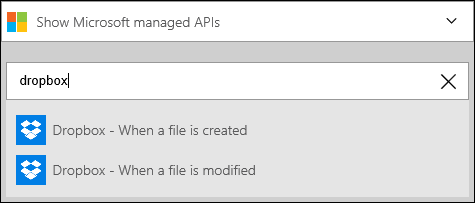
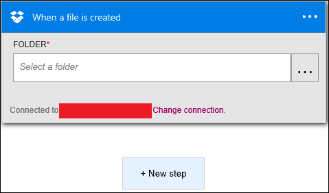
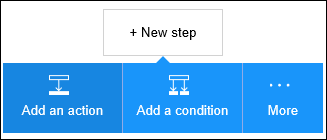
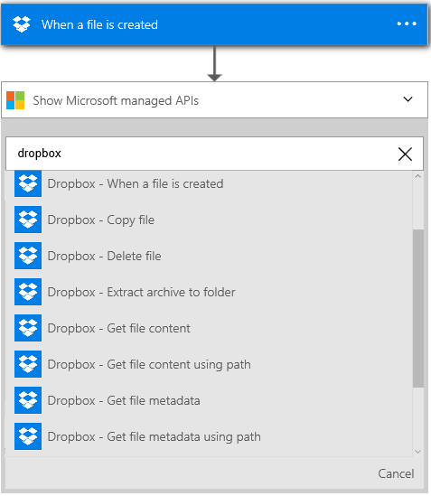
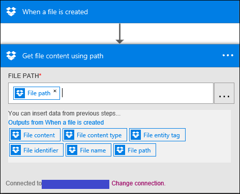

<properties
pageTitle="Dropbox | Microsoft Azure"
description="Create Logic apps with Azure App service. Connect to Dropbox to manage your files. You can perform various actions such as upload, update, get, and delete files in Dropbox."
services="app-servicelogic"	
documentationCenter=".net,nodejs,java" 	
authors="msftman"	
manager="erikre"	
editor=""
tags="connectors" />

<tags
ms.service="app-service-logic"
ms.devlang="multiple"
ms.topic="article"
ms.tgt_pltfrm="na"
ms.workload="integration"
ms.date="07/15/2016"
ms.author="deonhe"/>

# Get started with the Dropbox connector

Connect to Dropbox to manage your files. You can perform various actions such as upload, update, get, and delete files in Dropbox.

To use [any connector](./apis-list.md), you first need to create a Logic App. You can get started by [creating a Logic app now](../app-service-logic/app-service-logic-create-a-logic-app.md).

## Connect to Dropbox

Before your Logic App can access any service, you first need to create a *connection* to the service. A connection provides connectivity between a Logic App and another service. For example, in order to connect to Dropbox, you first need a Dropbox *connection*. To create a connection, you would need to provide the credentials you normally use to access the service you wish to connect to. So, in the Dropbox example, you would need the credentials to your Dropbox account in order to create the connection to Dropbox. [Learn more about connections]()

### Create a connection to Dropbox

>[AZURE.INCLUDE [Steps to create a connection to Dropbox](../../includes/connectors-create-api-dropbox.md)]

## Use a Dropbox trigger

A trigger is an event that can be used to start the workflow defined in a Logic App. [Learn more about triggers](../app-service-logic/app-service-logic-what-are-logic-apps.md#logic-app-concepts).

In this example, we will use the **When a file is created** trigger. When this trigger occurs, we will call the **Get file content using path** Dropbox action. 

1. Enter *dropbox* in the search box on the Logic Apps designer, then select the **Dropbox - When a file is created** trigger.      
   
  
2. Select the folder in which you want to track file creation. Click on .. (identified in the red box) and browse to the folder you wish to select for the trigger's input.  
   

## Use a Dropbox action

An action is an operation carried out by the workflow defined in a Logic App. [Learn more about actions](../app-service-logic/app-service-logic-what-are-logic-apps.md#logic-app-concepts).

Now that the trigger has been added, follow these steps to add an action that will get the new file's content.

1. Select **+ New Step** to add the action you would like to take when a new file is created.  
 

2. Select **Add an action**. This opens the search box where you can search for any action you would like to take.  
 

3. Enter dropbox to search for actions related to Dropbox.  

4. Select **Dropbox - Get file content using path** as the action to take when a new file is created in the selected Dropbox folder. The action control block opens. **Note**: you will be prompted to authorize your Logic App to access your Dropbox account if you have not done so previously.  
 

5. Select ... (located at the right side of the **File Path** control) and browse to the file path you would like to use. Or, use the **file path** token to speed up your Logic App creation.  
 

6. Save your work and create a new file in Dropbox to activate your workflow.  

## Technical Details

Here are the details about the triggers, actions and responses that this connection supports:

## Dropbox triggers

The Dropbox connector has the following trigger(s):  

|Trigger | Description|
|--- | ---|
|[When a file is created](connectors-create-api-dropbox.md#when-a-file-is-created)|This operation triggers a flow when a new file is created in a folder.|
|[When a file is modified](connectors-create-api-dropbox.md#when-a-file-is-modified)|This operation triggers a flow when a file is modified in a folder.|

## Dropbox actions

The Dropbox connector has the following actions:

|Action|Description|
|--- | ---|
|[Get file metadata](connectors-create-api-dropbox.md#get-file-metadata)|This operation gets the metadata for a file.|
|[Update file](connectors-create-api-dropbox.md#update-file)|This operation updates a file.|
|[Delete file](connectors-create-api-dropbox.md#delete-file)|This operation deletes a file.|
|[Get file metadata using path](connectors-create-api-dropbox.md#get-file-metadata-using-path)|This operation gets the metadata of a file using the path.|
|[Get file content using path](connectors-create-api-dropbox.md#get-file-content-using-path)|This operation gets the content of a file using the path.|
|[Get file content](connectors-create-api-dropbox.md#get-file-content)|This operation gets the content of a file.|
|[Create file](connectors-create-api-dropbox.md#create-file)|This operation creates a file.|
|[Copy file](connectors-create-api-dropbox.md#copy-file)|This operation copies a file to Dropbox.|
|[List files in folder](connectors-create-api-dropbox.md#list-files-in-folder)|This operation gets the list of files and subfolders in a folder.|
|[List files in root folder](connectors-create-api-dropbox.md#list-files-in-root-folder)|This operation gets the list of files and subfolders in the root folder.|
|[Extract archive to folder](connectors-create-api-dropbox.md#extract-archive-to-folder)|This operation extracts an archive file into a folder (example: .zip).|

### Action details

Here are the details for the actions and triggers for this connector, along with their responses:

### Get file metadata
This operation gets the metadata for a file. 

                                                                                                                                                                                                                                                                                                                                                                                                                                                                                                 
|Property Name| Display Name|Description|
| ---|---|---|
|id*|File|Select a file|

An * indicates that a property is required

#### Output Details

BlobMetadata

| Property Name | Data Type |
|---|---|
|Id|string|
|Name|string|
|DisplayName|string|
|Path|string|
|LastModified|string|
|Size|integer|
|MediaType|string|
|IsFolder|boolean|
|ETag|string|
|FileLocator|string|

### Update file
This operation updates a file. 

|Property Name| Display Name|Description|
| ---|---|---|
|id*|File|Select a file|
|body*|File content|Content of the file|

An * indicates that a property is required

#### Output Details

BlobMetadata

| Property Name | Data Type |
|---|---|
|Id|string|
|Name|string|
|DisplayName|string|
|Path|string|
|LastModified|string|
|Size|integer|
|MediaType|string|
|IsFolder|boolean|
|ETag|string|
|FileLocator|string|

### Delete file
This operation deletes a file. 

|Property Name| Display Name|Description|
| ---|---|---|
|id*|File|Select a file|

An * indicates that a property is required

### Get file metadata using path
This operation gets the metadata of a file using the path. 

|Property Name| Display Name|Description|
| ---|---|---|
|path*|File path|Select a file|

An * indicates that a property is required

#### Output Details

BlobMetadata

| Property Name | Data Type |
|---|---|
|Id|string|
|Name|string|
|DisplayName|string|
|Path|string|
|LastModified|string|
|Size|integer|
|MediaType|string|
|IsFolder|boolean|
|ETag|string|
|FileLocator|string|

### Get file content using path
This operation gets the content of a file using the path. 

|Property Name| Display Name|Description|
| ---|---|---|
|path*|File path|Select a file|

An * indicates that a property is required

### Get file content
This operation gets the content of a file. 

|Property Name| Display Name|Description|
| ---|---|---|
|id*|File|Select a file|

An * indicates that a property is required

### Create file
This operation creates a file. 

|Property Name| Display Name|Description|
| ---|---|---|
|folderPath*|Folder path|Select a folder|
|name*|File name|Name of the file|
|body*|File content|Content of the file|

An * indicates that a property is required

#### Output Details

BlobMetadata

| Property Name | Data Type |
|---|---|
|Id|string|
|Name|string|
|DisplayName|string|
|Path|string|
|LastModified|string|
|Size|integer|
|MediaType|string|
|IsFolder|boolean|
|ETag|string|
|FileLocator|string|

### Copy file
This operation copies a file to Dropbox. 

|Property Name| Display Name|Description|
| ---|---|---|
|source*|Source url|Url to source file|
|destination*|Destination file path|Destination file path, including target filename|
|overwrite|Overwrite?|Overwrites the destination file if set to 'true'|

An * indicates that a property is required

#### Output Details

BlobMetadata

| Property Name | Data Type |
|---|---|
|Id|string|
|Name|string|
|DisplayName|string|
|Path|string|
|LastModified|string|
|Size|integer|
|MediaType|string|
|IsFolder|boolean|
|ETag|string|
|FileLocator|string|

### When a file is created
This operation triggers a flow when a new file is created in a folder. 

|Property Name| Display Name|Description|
| ---|---|---|
|folderId*|Folder|Select a folder|

An * indicates that a property is required

### When a file is modified
This operation triggers a flow when a file is modified in a folder. 

|Property Name| Display Name|Description|
| ---|---|---|
|folderId*|Folder|Select a folder|

An * indicates that a property is required

### List files in folder
This operation gets the list of files and subfolders in a folder. 

|Property Name| Display Name|Description|
| ---|---|---|
|id*|Folder|Select a folder|

An * indicates that a property is required

#### Output Details

BlobMetadata

| Property Name | Data Type |
|---|---|
|Id|string|
|Name|string|
|DisplayName|string|
|Path|string|
|LastModified|string|
|Size|integer|
|MediaType|string|
|IsFolder|boolean|
|ETag|string|
|FileLocator|string|

### List files in root folder
This operation gets the list of files and subfolders in the root folder. 

There are no parameters for this call

#### Output Details

BlobMetadata

| Property Name | Data Type |
|---|---|
|Id|string|
|Name|string|
|DisplayName|string|
|Path|string|
|LastModified|string|
|Size|integer|
|MediaType|string|
|IsFolder|boolean|
|ETag|string|
|FileLocator|string|

### Extract archive to folder
This operation extracts an archive file into a folder (example: .zip). 

|Property Name| Display Name|Description|
| ---|---|---|
|source*|Source archive file path|Path to the archive file|
|destination*|Destination folder path|Path to extract the archive contents|
|overwrite|Overwrite?|Overwrites the destination files if set to 'true'|

An * indicates that a property is required

#### Output Details

BlobMetadata

| Property Name | Data Type |
|---|---|
|Id|string|
|Name|string|
|DisplayName|string|
|Path|string|
|LastModified|string|
|Size|integer|
|MediaType|string|
|IsFolder|boolean|
|ETag|string|
|FileLocator|string|

## HTTP responses

The actions and triggers above can return one or more of the following HTTP status codes: 

|Name|Description|
|---|---|
|200|OK|
|202|Accepted|
|400|Bad Request|
|401|Unauthorized|
|403|Forbidden|
|404|Not Found|
|500|Internal Server Error. Unknown error occurred.|
|default|Operation Failed.|

## Next Steps
[Create a logic app](../app-service-logic/app-service-logic-create-a-logic-app.md)