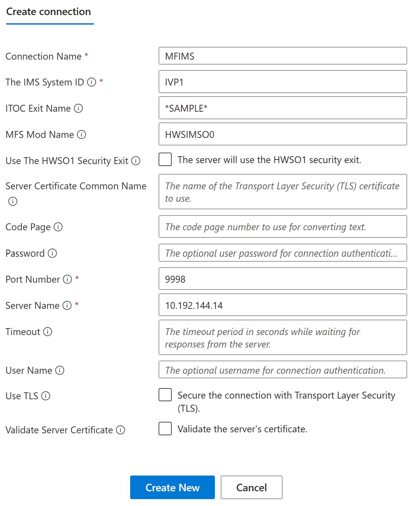
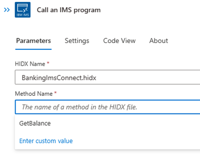

# Integrate IMS programs on IBM mainframes with Standard workflows in Azure Logic Apps using the IBM IMS Program Call connector (preview)

[!INCLUDE [logic-apps-sku-standard](../../includes/logic-apps-sku-standard.md)]

> [!IMPORTANT]
> This capability is in preview and is subject to the 
> [Supplemental Terms of Use for Microsoft Azure Previews](https://azure.microsoft.com/support/legal/preview-supplemental-terms/).

To access and run IBM mainframe apps on Information Management System (IMS) systems from Standard workflows in Azure Logic Apps, you can use the **IMS Program Call** built-in, service provider-based connector. IMS provides a Transaction Program (TP) Monitor with an integrated Transaction Manager (TM) and hierarchical database. The connector communicates with IBM IMS transaction programs by using IMS Connect, which is an IMS TM network component. This component provides high performance communications for IMS systems between one or more TCP/IP clients and one or more IMS systems. The IMS connector is available in all Azure Logic Apps regions except for Azure Government and Microsoft Azure operated by 21Vianet.

This how-to guide describes the following aspects about the IMS connector:

* Why use the IMS connector in Azure Logic Apps

* Prerequisites and setup for using the IMS connector

* Steps for adding IMS connector actions to your Standard logic app workflow

## Why use this connector?

IMS systems were one of the first mission-critical systems that run on mainframes. Microsoft [Host Integration Server (HIS)](/host-integration-server/what-is-his) provides connectivity to IMS systems by following two models: IMS Connect and APPC LU6.2. Customers have used the HIS Transaction Integrator (TI) to integrate their IMS systems with Windows on premises for many years. The **IMS Program Call** connector uses the IMS Connect model to interact with IMS transaction programs through TCP/IP.

The following diagram shows how the IMS connector interacts with an IBM mainframe system:

:::image type="content" source="media/integrate-ims-apps-ibm-mainframe/ims-connector-overview.png" alt-text="Conceptual diagram showing how the IMS Program Call connector works with IBM mainframe system.":::

To extend hybrid cloud scenarios, the IMS Connector in Azure Logic Apps works with the HIS Designer for Logic Apps, which is used to create a “Program Definition” or “Program Map” of the Mainframe Transaction Program.  The HIS Designer for Logic Apps converts that information into metadata that the IMS connector uses when calling an action that represents that task from your logic app.
After you generate the metadata file from the HIS Designer for Logic Apps, you add that file to the logic app maps artifacts in Azure. That way, your logic app can access your app's metadata when you add a IMS connector action. The connector reads the metadata file from your logic app, and dynamically presents the parameters for the IMS connector. You can then provide parameters to the host application, and the connector returns the results to your logic app. That way, you can integrate your legacy apps with Azure, Microsoft, and other apps, services, and systems that Azure Logic Apps supports.

## Prerequisites

* An Azure account and subscription. If you don't have an Azure subscription, 
[sign up for a free Azure account](https://azure.microsoft.com/free/?WT.mc_id=A261C142F).

* Basic knowledge about [logic app workflows](../logic-apps/logic-apps-overview.md)

* The logic app to use to integrate with the IBM IMS system

  The IBM IMS connector doesn't have triggers, so use another trigger to start your logic app, such as the **Recurrence** trigger. You can then add the IMS connector actions. To get started, create a blank logic app workflow.

* [Download and install the HIS Designer for Logic Apps](https://aka.ms/his-desiner-logicapps-download).
The only prerequisite is [Microsoft .NET Framework 4.8](https://aka.ms/net-framework-download).

  This tool helps you define the methods, and parameters for the tasks in your app that you add and run as IMS connector actions. The tool generates a Host Integration Designer XML (HIDX) file that provides the necessary metadata for the connector to use for driving your mainframe app. If you are using Host Integration Server, then you can leverage the TI Designer to create the HIDX file.
  
* Access to the Mainframe that hosts the IMS System.

## Generating the Metadata

To effectively invoke a Mainframe Program, logic apps need to understand the type, parameters and return values of it. The IMS connector manages the process and data conversions necessary to allow input data to be provided to the Mainframe Programs from the logic app workflow and to send any output data generated from the Mainframe Program to the workflow. The IBM IMS connector provides data type conversion, tabular data definition, and code page translation.

For this process to begin, Azure Logic Apps requires this information be provided as metadata. This metadata is created with the [HIS Designer for Logic Apps](/host-integration-server/core/application-integration-ladesigner-2.md). The Designer allows a manual creation of methods that will then be used by the logic app. It also can import mainframe COBOL program definitions (copybooks) that provide all this program structures.

After downloading and installing the HIS Designer for Logic Apps, follow the steps here: [Designing Artifacts for Host Applications](/host-integration-server/core/application-integration-lahostapps.md) to generate the HIDX file from the metadata artifact.

## Upload the HIDX file

To be able to use the HIDX file, you will need to conduct the following steps:

1. Go to the directory where you saved the HIDX file and copy it.
1. Sign in to the Azure portal, and find your integration account.
1. Add your HIDX file as a map to your logic app, under artifacts then maps.

Later in this topic, when you add an IBM IMS action to your logic app for the first time, you're prompted to create a connection between your logic app and the mainframe server by providing connection information, such as the names for your host server and IMS system configuration information. After you create the connection, you can select your previously added HIDX file, the method to run, and the parameters to use.

When you finish all these steps, you can use the action that you created in your logic app for connecting to your IBM mainframe, enter data, return results, and so on. You can also continue adding other actions to your logic app for integrating with other apps, services, and systems.

## Run IBM IMS action

To run the IBM IMS action, follow the instructions below:

1. In the Azure portal, open your logic app, if not already open.
1. Under the Workflow section, create a new workflow by selecting on **Workflows** and then **Add**. Enter a Workflow name, type and select **Create**.
1. Select on the recently created workflow.
1. Select on **Designer**

   :::image type="content" source="media/integrate-ims-apps-ibm-mainframe/la-ims-connector2.png" alt-text="Select Designer":::

1. As this connector provides only one action, to start your logic app, select a separate trigger, for example, the Request trigger. The example in this article uses the Request trigger. Then the “When a HTTP request is received” action.

   :::image type="content" source="media/integrate-ims-apps-ibm-mainframe/la-ims-connector3.png" alt-text="Request trigger":::

1. Select in the **+** icon to add another action.
1. Type IMS in Add an Action page and then select **Call an IMS Program**

   :::image type="content" source="media/integrate-ims-apps-ibm-mainframe/la-ims-connector4.png" alt-text="Call an IMS Program":::

1. The Create connection page will appear. Complete all the information following the guidance in each text box and then select on **Create New**:

   |Property  |Required  |Value  |Description  |
   |---------|---------|---------|---------|
   |**Connection Name**     |    Yes     |  <*connection-name*>     |   The name for your connection      |
   |**The IMS System ID**     |   Yes      | <*IMS-system-id*>        |      The name of the IMS system where IMS Connect directs incoming requests   |
   |**ITOC Exit Name**     |      No   | <*ITOC-exit-name*>        | The name for the exit routine that IMS uses to handle incoming requests         |
   |**MFS Mod Name**     |      No   | <*MFS-Mod-Name*>         |   The name associated with the outbound IMS message output descriptor      |
   |**Use the HWSO1 Security Exit**     |   No      |      <*HWSO1*>   |The server will use the HWSO1 security exit         |
   |**Server certificate common name**     |   No      |<*server-cert-common-name*>         | The name of the Transport Security layer (TLS) certificate to use         |
   |**Code Page**     |    No     | <*code-page*>         | The code page number to use for converting text         |
   |**Password**     |     No    | <*password*>         | The optional user password for connection authentication         |
   |**Port Number**     |   Yes      | <*port-number*>         | The port number to use for connection authentication         |
   |**Server Name**     | Yes        | <*server-name*>         | The server name         |
   |**Time out**     |   No      | <*time-out*>         | The timeout period in seconds while waiting for responses from the server         |
   |**User Name**     |       No  | <*user-Name*>         | The optional username for connection authentication         |
   |**Use TLS**     |     No    | <*tls*>         | Secure the connection with Transport Security Layer (TLS)          |
   |**Validate Server certificate**     |  No       | <*validate-server-certificate*>         | Validate the server's certificate         |

   For example:

   

1. In the **Parameters** section, provide the necessary information for the action:

   |Property  |Required  |Value  |Description  |
   |---------|---------|---------|---------|
   |**Hidx Name**      |   Yes      |     <*HIDX-file-name*>    |   Select the IMS HIDX file that you want to use.      |
   |**Method Name**     |   Yes      |      <*method-name*>   |  Select the method in the HIDX file that you want to use. After you select a method, the **Add new parameter** list appears so you can select parameters to use with that method.       |
   ||||

   For example:

   **Select the HIDX file and Method**

   

   **Select the parameters**

   

1. When you're done, save and run your logic app.

   After your logic app finishes running, the steps from the run appear. 
   Successful steps show check marks, while unsuccessful steps show the letter "X".

1. To review the inputs and outputs for each step, expand that step.

1. To review the outputs, select **See raw outputs**.

## Connector reference

For more technical details about this connector, such as triggers, actions, and limits as described by the connector's Swagger file, see the [connector's reference page](/connectors/si3270/).

## Next steps

* [Managed connectors for Azure Logic Apps](/connectors/connector-reference/connector-reference-logicapps-connectors)
* [Built-in connectors for Azure Logic Apps](built-in.md)
