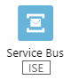
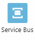

# What are connectors in Azure Logic Apps

When you build a workflow using Azure Logic Apps, you can use a *connector* to work with data, events, and resources in other apps, services, systems, and platforms - without writing code. A connector provides one or more prebuilt operations, which you use as steps in your workflow.

In a connector, each operation is either a [*trigger*](#triggers) condition that starts a workflow or a subsequent [*action*](#actions) that performs a specific task, along with properties that you can configure. While many connectors have both triggers and actions, some connectors offer only triggers, while others provide only actions.

In Azure Logic Apps, connectors are available in either a [built-in version, managed version, or both](#built-in-vs-managed). Many connectors usually require that you first [create and configure a connection](#connection-configuration) to the underlying service or system, usually so that you can authenticate access to a user account. If no connector is available for the service or system that you want to access, you can send a request using the [generic HTTP operation](connectors-native-http.md), or you can [create a custom connector](#custom-connectors-and-apis).

This overview provides a high-level introduction to connectors and how they generally work. For more connector information, see the following documentation:

* [Connectors overview for services such as Power Automate and Power Apps](/connectors/connectors)
* [Built-in connectors overview for Azure Logic Apps](built-in.md)
* [Managed connectors overview for Azure Logic Apps](managed.md)
* [Managed connectors reference for Azure Logic Apps](/connectors/connector-reference/connector-reference-logicapps-connectors)

## Built-in connectors versus managed connectors

In Azure Logic Apps, connectors are either *built in* or *managed*. Some connectors have both versions. The available versions depend on whether you create a *Consumption* logic app workflow that runs in multi-tenant Azure Logic Apps or a *Standard* logic app workflow that runs in single-tenant Azure Logic Apps. For more information about logic app resource types, see [Resource types and host environment differences](../logic-apps/logic-apps-overview.md#resource-environment-differences).

* [Built-in connectors](built-in.md) are designed to run directly and natively inside Azure Logic Apps.

* [Managed connectors](managed.md) are deployed, hosted, and managed in Azure by Microsoft. Managed connectors mostly provide a proxy or a wrapper around an API that the underlying service or system uses to communicate with Azure Logic Apps.

  * In a Consumption workflow, managed connectors appear in the designer under the **Standard** or **Enterprise** labels, based on their pricing level.

  * In a Standard workflow, all managed connectors appear in the designer under the **Azure** label.

For more information, see the following documentation:

* [Pricing and billing models in Azure Logic Apps](../logic-apps/logic-apps-pricing.md)
* [Azure Logic Apps pricing details](https://azure.microsoft.com/pricing/details/logic-apps/)

## Triggers

A trigger specifies the condition to meet before the workflow can start and is always the first step in any workflow. Each trigger also follows a specific firing pattern that controls how the trigger monitors and responds to events. Usually, a trigger follows either a *polling* pattern or a *push* pattern. Sometimes, both trigger versions are available.

- *Polling* triggers regularly check a specific service or system on a specified schedule to check for new data or a specific event. If new data is available, or the specific event happens, these triggers create and run a new instance of your workflow. This new instance can then use the data that's passed as input.

- *Push* or *webhook* triggers listen for new data or for an event to happen, without polling. When new data is available, or when the event happens, these triggers create and run a new instance of your workflow. This new instance can then use the data that's passed as input.

For example, suppose you want to build a workflow that runs when a file is uploaded to your FTP server. As the first step in your workflow, you can add the [FTP trigger](/connectors/ftp/#triggers) named **When a file is added or modified**, which follows a polling pattern. You then specify the schedule to regularly check for upload events.

When the trigger fires, the trigger usually passes along event outputs for subsequent actions to reference and use. For the FTP example, the trigger automatically outputs information such as the file name and path. You can also set up the trigger to include the file content. So, to process this data, you must add actions to your workflow.

## Actions

An action specifies a task to perform and always appears as a subsequent step in the workflow. You can use multiple actions in your workflow. For example, you might start the workflow with a [SQL Server trigger](/connectors/sql/#triggers) that checks for new customer data in an SQL database. Following the trigger, your workflow can have a [SQL Server action](/connectors/sql/#actions) that gets the customer data. Following this SQL Server action, your workflow can use a different action that processes the data, for example, a [Data Operations action](../logic-apps/logic-apps-perform-data-operations.md) that creates a CSV table.

## Connection permissions

In a Consumption logic app workflow, before you can create or manage logic app resources, workflows, and their connections, you need specific permissions. For more information about these permissions, see [Secure operations - Secure access and data in Azure Logic Apps](../logic-apps/logic-apps-securing-a-logic-app.md#secure-operations).

## Connection creation, configuration, and authentication

Before you can use a connector's operations in your workflow, many connectors require that you first create a *connection* to the target service or system. To create a connection from inside the workflow designer, you have to authenticate your identity with account credentials and sometimes other connection information.

For example, before your workflow can access and work with your Office 365 Outlook email account, you must authorize a connection to that account. For some built-in connectors and managed connectors, you can [set up and use a managed identity for authentication](../logic-apps/create-managed-service-identity.md#triggers-actions-managed-identity), rather than provide your credentials.

Although you create connections within a workflow, these connections are actually separate Azure resources with their own resource definitions. To review these connection resource definitions, follow these steps based on whether you have a Consumption or Standard workflow:

* Consumption

  * To view and manage these connections in the Azure portal, see [View connections for Consumption workflows in the Azure portal](../logic-apps/manage-logic-apps-with-azure-portal.md#view-connections).

  * To view and manage these connections in Visual Studio, see [Manage Consumption workflows with Visual Studio](../logic-apps/manage-logic-apps-with-visual-studio.md), and download your logic app resource from Azure into Visual Studio.

  For more information about connection resource definitions for Consumption workflows, see [Connection resource definitions](../logic-apps/logic-apps-azure-resource-manager-templates-overview.md#connection-resource-definitions).

* Standard

  * To view and manage these connections in the Azure portal, see [View connections for Standard workflows in the Azure portal](../logic-apps/create-single-tenant-workflows-azure-portal.md#view-connections).

  * To view and manage these connections in Visual Studio Code, see [View your logic app workflow in Visual Studio Code](../logic-apps/create-single-tenant-workflows-visual-studio-code.md#manage-deployed-apps-vs-code). The **connections.json** file contains the required configuration for the connections created by connectors.

### Connection security and encryption

Connection configuration details, such as server address, username, and password, credentials, and secrets are [encrypted and stored in the secured Azure environment](../security/fundamentals/encryption-overview.md). This information can be used only in logic app resources and by clients who have permissions for the connection resource, which is enforced using linked access checks. Connections that use Microsoft Entra ID Open Authentication (Microsoft Entra ID OAuth), such as Office 365, Salesforce, and GitHub, require that you sign in, but Azure Logic Apps stores only access and refresh tokens as secrets, not sign-in credentials.

Established connections can access the target service or system for as long as that service or system allows. For services that use Microsoft Entra ID OAuth connections, such as Office 365 and Dynamics, Azure Logic Apps refreshes access tokens indefinitely. Other services might have limits on how long Logic Apps can use a token without refreshing. Some actions, such as changing your password, invalidate all access tokens.

> [!NOTE]
> 
> If your organization doesn't permit you to access specific resources through connectors in Azure Logic Apps, you can [block the capability to create such connections](../logic-apps/block-connections-connectors.md) using [Azure Policy](../governance/policy/overview.md).

For more information about securing logic app workflows and connections, see [Secure access and data in Azure Logic Apps](../logic-apps/logic-apps-securing-a-logic-app.md).

### Firewall access for connections

If you use a firewall that limits traffic, and your logic app workflows need to communicate through that firewall, you have to set up your firewall to allow access for both the [inbound](../logic-apps/logic-apps-limits-and-config.md#inbound) and [outbound](../logic-apps/logic-apps-limits-and-config.md#outbound) IP addresses used by the Azure Logic Apps platform or runtime in the Azure region where your logic app workflows exist.

If your workflows also use managed connectors, such as the Office 365 Outlook connector or SQL connector, or use custom connectors, your firewall also needs to allow access for *all* the [managed connector outbound IP addresses](/connectors/common/outbound-ip-addresses#azure-logic-apps) in your logic app resource's Azure region. For more information, see [Firewall configuration](../logic-apps/logic-apps-limits-and-config.md#firewall-configuration-ip-addresses-and-service-tags).

## Custom connectors and APIs

In Consumption workflows for multi-tenant Azure Logic Apps, you can call Swagger-based or SOAP-based APIs that aren't available as out-of-the-box connectors. You can also run custom code by creating custom API Apps. For more information, see the following documentation:

* [Swagger-based or SOAP-based custom connectors for Consumption workflows](../logic-apps/custom-connector-overview.md#custom-connector-consumption)

* Create a [Swagger-based](/connectors/custom-connectors/define-openapi-definition) or [SOAP-based](/connectors/custom-connectors/create-register-logic-apps-soap-connector) custom connector, which makes these APIs available to any Consumption logic app workflow in your Azure subscription.

  To make your custom connector public for anyone to use in Azure, [submit your connector for Microsoft certification](/connectors/custom-connectors/submit-certification).

* [Create custom API Apps](../logic-apps/logic-apps-create-api-app.md)

In Standard workflows for single-tenant Azure Logic Apps, you can create natively running service provider-based custom built-in connectors that are available to any Standard logic app workflow. For more information, see the following documentation:

* [Service provider-based custom built-in connectors for Standard workflows](../logic-apps/custom-connector-overview.md#custom-connector-standard)

* [Create service provider-based custom built-in connectors for Standard workflows](../logic-apps/create-custom-built-in-connector-standard.md)

## ISE and connectors

For workflows that need direct access to resources in an Azure virtual network, you can create a dedicated [integration service environment (ISE)](../logic-apps/connect-virtual-network-vnet-isolated-environment-overview.md) where you can build, deploy, and run your workflows on dedicated resources. For more information about creating ISEs, see [Connect to Azure virtual networks from Azure Logic Apps](../logic-apps/connect-virtual-network-vnet-isolated-environment.md).

Custom connectors created within an ISE don't work with the on-premises data gateway. However, these connectors can directly access on-premises data sources that are connected to an Azure virtual network hosting the ISE. So, logic app workflows in an ISE most likely don't need the data gateway when communicating with those resources. If you have custom connectors that you created outside an ISE that require the on-premises data gateway, workflows in an ISE can use those connectors.

In the workflow designer, when you browse the built-in connectors or managed connectors that you want to use for workflows in an ISE, the **CORE** label appears on built-in connectors, while the **ISE** label appears on managed connectors that are designed to work with an ISE.

:::row:::
    :::column:::
        
        \
        \
        **CORE**
        \
        \
        Built-in connectors with this label run in the same ISE as your workflows.
    :::column-end:::
    :::column:::
        
        \
        \
        **ISE**
        \
        \
        Managed connectors with this label run in the same ISE as your workflows.
        \
        \
        If you have an on-premises system that's connected to an Azure virtual network, an ISE lets your workflows directly access that system without using the [on-premises data gateway](../logic-apps/logic-apps-gateway-connection.md). Instead, you can either use that system's **ISE** connector if available, an HTTP action, or a [custom connector](#custom-connectors-and-apis).
        \
        \
        For on-premises systems that don't have **ISE** connectors, use the on-premises data gateway. To find available ISE connectors, review [ISE connectors](#ise-and-connectors).
    :::column-end:::
    :::column:::
        
        \
        \
        No label
        \
        \
        All other connectors without a label, which you can continue to use, run in the global, multi-tenant Logic Apps service.
    :::column-end:::
    :::column:::
    :::column-end:::
:::row-end:::

## Known issues

The following table includes known issues for connectors in Azure Logic Apps:

| Error message| Description | Resolution |
|--------------|-------------|------------|
| `Error: BadGateway. Client request id: '{GUID}'` | This error results from updating the tags on a logic app resource where one or more connections don't support Microsoft Entra ID OAuth authentication, such as SFTP ad SQL, breaking those connections. | To prevent this behavior, avoid updating those tags. |

## Next steps

> [!div class="nextstepaction"]
>
> [Create a Consumption logic app workflow - Azure portal](../logic-apps/quickstart-create-example-consumption-workflow.md)
>
> [Create a Standard logic app workflow - Azure portal](../logic-apps/create-single-tenant-workflows-azure-portal.md)
