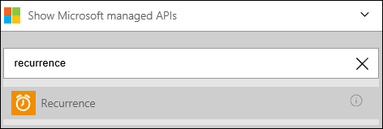
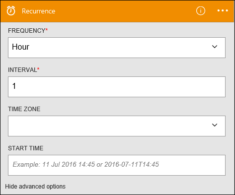
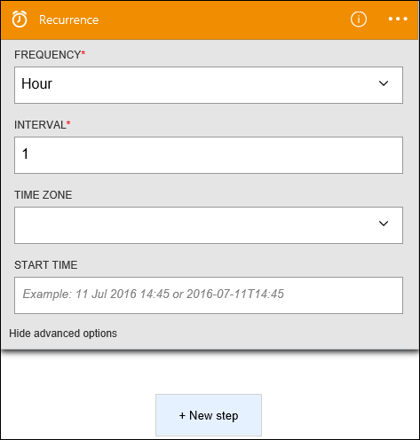

<properties
pageTitle="SMTP | Microsoft Azure"
description="Create logic apps with Azure App service. Connect to SMTP to send email."
services="app-servicelogic"	
documentationCenter=".net,nodejs,java" 	
authors="msftman"	
manager="erikre"	
editor=""
tags="connectors" />

<tags
ms.service="app-service-logic"
ms.devlang="multiple"
ms.topic="article"
ms.tgt_pltfrm="na"
ms.workload="integration"
ms.date="07/15/2016"
ms.author="deonhe"/>

# Get started with the SMTP connector

Connect to SMTP to send email.

To use [any connector](./apis-list.md), you first need to create a logic app. You can get started by [creating a logic app now](../app-service-logic/app-service-logic-create-a-logic-app.md).

## Connect to SMTP

Before your logic app can access any service, you first need to create a *connection* to the service. A [connection](./connectors-overview.md) provides connectivity between a logic app and another service. For example, in order to connect to SMTP, you first need an SMTP *connection*. To create a connection, you would need to provide the credentials you normally use to access the service you wish to connect to. So, in the SMTP example, you would need the credentials to your connection name, SMTP server address, and user login information in order to create the connection to SMTP. [Learn more about connections]()  

### Create a connection to SMTP

>[AZURE.INCLUDE [Steps to create a connection to SMTP](../../includes/connectors-create-api-smtp.md)]

## Use a SMTP trigger

A trigger is an event that can be used to start the workflow defined in a logic app. [Learn more about triggers](../app-service-logic/app-service-logic-what-are-logic-apps.md#logic-app-concepts).

In this example, because SMTP does not have a trigger of its own, we'll use the **recurrence** trigger. This trigger ensures that some action occurs periodically based on configured recurrence settings. 

1. Enter *recurrence* in the search box on the Logic Apps designer, then select the **Recurrence** trigger.  
   

2. In this example, we'll use the default recurrence settings.
  

## Use a SMTP action

An action is an operation carried out by the workflow defined in a logic app. [Learn more about actions](../app-service-logic/app-service-logic-what-are-logic-apps.md#logic-app-concepts).

Now that the trigger has been added, follow these steps to add an action that will occur periodically based on the recurrence settings.

1. Select **+ New Step** to add the action you would like to take when a new file is created.  
   

2. Select **Add an action**. This opens the search box where you can search for any action you would like to take.  
   

3. Enter *smtp* to search for actions related to SMTP.  

4. Select **SMTP - Send Email** as the action to take when the recurrence period occurs. The action control block opens. **Note**: you will have to establish your smtp connection in the designer block if you have not done so previously.  
   

5. Input your desired email information in the **SMTP - Send Email** block.  
   

6. Save your work in order to activate your workflow.  

## Technical Details

Here are the details about the triggers, actions and responses that this connection supports:

## SMTP triggers

SMTP has no triggers. 

## SMTP actions

SMTP has the following action:

|Action|Description|
|--- | ---|
|[Send Email](connectors-create-api-smtp.md#send-email)|This operation sends an email to one or more recipients.|

### Action details

Here are the details for the action of this connector, along with its responses:

### Send Email
This operation sends an email to one or more recipients. 

|Property Name| Display Name|Description|
| ---|---|---|
|emailMessage*|Email message|Email message|

An * indicates that a property is required

## HTTP responses

The actions and triggers above can return one or more of the following HTTP status codes: 

|Name|Description|
|---|---|
|200|OK|
|202|Accepted|
|400|Bad Request|
|401|Unauthorized|
|403|Forbidden|
|404|Not Found|
|500|Internal Server Error. Unknown error occurred.|
|default|Operation Failed.|

## Next Steps
[Create a logic app](../app-service-logic/app-service-logic-create-a-logic-app.md)