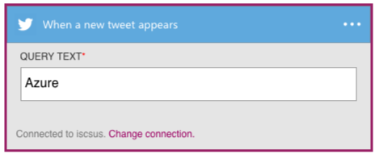
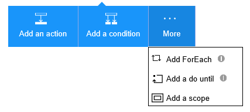
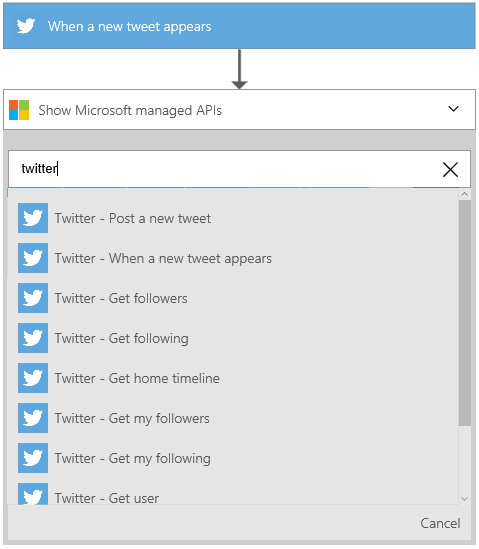
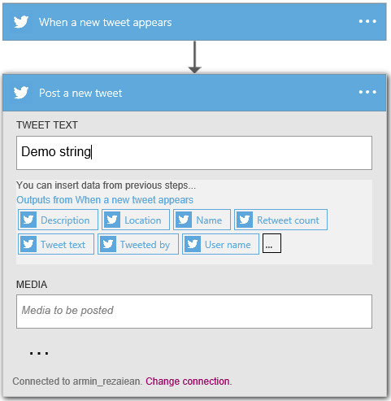

<properties
	pageTitle="Add the Twitter connector in Logic Apps | Microsoft Azure"
	description="Overview of Twitter connector with REST API parameters"
	services=""
	documentationCenter="" 
	authors="MandiOhlinger"
	manager=""
	editor="Armin"
	tags="connectors"/>

<tags
   ms.service="multiple"
   ms.devlang="na"
   ms.topic="article"
   ms.tgt_pltfrm="na"
   ms.workload="na" 
   ms.date="07/07/2016"
   ms.author="mandia"/>

# Get started with the Twitter connector
With the Twitter connector, you can create valuable workflows for your organization and accomplish a great deal.

- Create logic app workflows that activate (trigger) when there is a new tweet.  
- Use any of the actions our team designed to enable the freedom and flexibility of interacting with Twitter and drawing the data you need, or executing your desired outcome. 
- Our actions include posting tweets, searching tweets, and various other options. For example, when a new tweet appears (trigger), you can post this tweet (action) on Facebook. See the full list of [triggers and actions](../articles/connectors/connectors-create-api-twitter.md#triggers-and-actions) for Twitter below.

To explore Twitter triggers and actions, see [create a logic app](../app-service-logic/app-service-logic-create-a-logic-app.md).

---

## Getting Started

### Connect to Twitter

When you add this connector to your logic apps, you must authorize logic apps to connect to your Twitter account.

1. Sign in to your Twitter account.
2. Select Authorize, and allow your logic apps to connect and use your Twitter account. 

>[AZURE.INCLUDE [Steps to create a connection to Twitter](../../includes/connectors-create-api-twitter.md)]

### Using a trigger

Logic App connectors come with triggers by which you can set up your workflow to activate. Here’s an example sequence of how to setup a Twitter trigger in the logic app designer.

1) After following the steps in [connect to Twitter](../articles/connectors/connectors-create-api-twitter.md#connect-to-twitter) and establishing the Twitter connection, your trigger is almost set up. Next, you'll have to enter the query text for which you want to search Twitter.

### Using an action
	
2) Select the plus sign, and then you’ll see several choices: "Add an action", "Add a condition", or one of the "More" options.

3) In this scenario, let’s choose "Add an action" so that we can practice adding a Twitter action.

4) Once the connection is established, and a trigger is successfully setup, we can begin applying Twitter actions. In the text box, type “Twitter” to get a list of all the available Twitter actions.

5) In our example, we’ll choose the post a new tweet action. We can either choose something to tweet, or we can utilize some of the available outputs from when the tweet appeared in our trigger.

6) Click save at the top left corner of the toolbar, and your logic app will both save and publish (activate).

---

## Technical Details

### Triggers

Triggers represent operations that activate the workflow in your logic app. They’re basically your “if” statement. The Twitter connector has one trigger. 

|Trigger|Description|
|---|---|
|When a new tweet appears|Activate your logic app workflow based on when specific  text appears in tweets|

### Actions

Actions represent the things that occur when your trigger activates. The Twitter connector has 10 possible actions. 

|Action|Description|
|---|---|
|Post a new tweet|Tweet|
|When a new tweet appears|Triggers a workflow when a new tweet is posted which matches your search query|
|Get home timeline|Retrieves the most recent tweets and re-tweets posted me and my followers|
|Get user|Retrieves details about the specified user (example: user name, description, followers count, etc.)|
|Get user timeline|Retrieves a collection of the most recent tweets posted by the specified user|
|Search tweet|Retrieves a collection of relevant tweets matching a specified query|
|Get followers|Retrieves users following the specified user|
|Get my followers|Retrieves users who are following me|
|Get following|Retrieves users who the specified user is following|
|Get my following|Retrieves users that I am following|

### Action Details

The Twitter connector comes with a variety of possible actions. Below, there is information on each of the actions, their required and optional input fields, and the corresponding output details associated with their usage.

#### Post a new tweet 
Tweet.  
An * means required field.

|Property Name|Display Name|Description|
|---|---|---|
|tweetText|Tweet Text|Text to be posted|
|body|Media|Media to be posted|

##### Output Details
TweetResponseModel: model representing posted tweet.

|Property Name|Data Type|Description|
|---|---|---|
|TweetId*|string|ID of the retrieved tweet.|

#### When a new tweet appears 
Triggers a workflow when a new tweet is posted which matches your search query.  
An * means required field.

|Property Name|Display Name|Description|
|---|---|---|
|searchQuery*|Query Text|Query text (you may use any Twitter supported query operators: http://www.twitter.com/search)|

##### Output Details
TriggerBatchResponse[TweetModel]: 

|Property Name|Data Type|Description|
|---|---|---|
|value|array|The properties included in the TweetModel|

#### Get home timeline 
Retrieves the most recent tweets and re-tweets posted me and my followers.  
An * means required field.

|Property Name|Display Name|Description|
|---|---|---|
|maxResults|Maximum Results|Maximum number of tweets to retrieve|

##### Output Details
TweetModel: representation of tweet object

|Property Name|Data Type|Description|
|---|---|---|
|TweetText*|string|Text content of the retrieved tweet.|
|TweetId|string|Id of the retrieved tweet.|
|CreatedAt|string|Time at which tweet was posted.|
|RetweetCount*|integer|The total number of re-tweets for this Tweet.|
|TweetedBy*|string|User Name of the user who has posted the tweet.|
|MediaUrls|array|Url of the media posted along with the tweet.|

#### Get user 
Retrieves details about the specified user (example: user name, description, followers count, etc.).  
An * means required field.

|Property Name|Display Name|Description|
|---|---|---|
|userName*|User Name|Twitter handle of the user|

##### Output Details
UserDetailsModel: representation of a Twitter user's details

|Property Name|Data Type|Description|
|---|---|---|
|FullName*|string|Name of the User|
|Location*|string|Location of the User|
|Id|integer|Twitter ID of the user|
|UserName*|string|Screen Name of the User|
|FollowersCount|integer|Number of Followers|
|Description*|string|User Description|
|StatusesCount|integer|User Status Count|
|FriendsCount|integer|Number of Friends|

#### Get user timeline 
Retrieves a collection of the most recent tweets posted by the specified user.  
An * means required field.

|Property Name|Display Name|Description|
|---|---|---|
|userName*|User Name|Twitter handle|
|maxResults|Maximum Results|Maximum number of tweets to retrieve|

##### Output Details
TweetModel: representation of tweet object

|Property Name|Data Type|Description|
|---|---|---|
|TweetText*|string|Text content of the retrieved tweet.|
|TweetId|string|Id of the retrieved tweet.|
|CreatedAt|string|Time at which tweet was posted.|
|RetweetCount*|integer|The total number of re-tweets for this Tweet.|
|TweetedBy*|string|User Name of the user who has posted the tweet.|
|MediaUrls|array|Url of the media posted along with the tweet.|

#### Search tweet 
Retrieves a collection of relevant tweets matching a specified query.  
An * means required field.

|Property Name|Display Name|Description|
|---|---|---|
|searchQuery*|Query Text|Query text (you may use any Twitter supported query operators: http://www.twitter.com/search)|
|maxResults|Maximum Results|Maximum number of tweets to retrieve|

##### Output Details
TweetModel: representation of tweet object

|Property Name|Data Type|Description|
|---|---|---|
|TweetText*|string|Text content of the retrieved tweet.|
|TweetId|string|Id of the retrieved tweet.|
|CreatedAt|string|Time at which tweet was posted.|
|RetweetCount*|integer|The total number of re-tweets for this Tweet.|
|TweetedBy*|string|User Name of the user who has posted the tweet.|
|MediaUrls|array|Url of the media posted along with the tweet.|

#### Get followers 
Retrieves users following the specified user.  
An * means required field.

|Property Name|Display Name|Description|
|---|---|---|
|userName*|User Name|Twitter handle of the user|
|maxResults|Maximum Results|Maximum number of users to retrieve|

##### Output Details
UserDetailsModel: representation of a Twitter user's details

|Property Name|Data Type|Description|
|---|---|---|
|FullName*|string|Name of the User|
|Location*|string|Location of the User|
|Id|integer|Twitter ID of the user|
|UserName*|string|Screen Name of the User|
|FollowersCount|integer|Number of Followers|
|Description*|string|User Description|
|StatusesCount|integer|User Status Count|
|FriendsCount|integer|Number of Friends|

#### Get my followers 
Retrieves users who are following me.  
An * means required field.

|Property Name|Display Name|Description|
|---|---|---|
|maxResults|Maximum Results|Maximum number of users to retrieve|

##### Output Details
UserDetailsModel: representation of a Twitter user's details

|Property Name|Data Type|Description|
|---|---|---|
|FullName*|string|Name of the User|
|Location*|string|Location of the User|
|Id|integer|Twitter ID of the user|
|UserName*|string|Screen Name of the User|
|FollowersCount|integer|Number of Followers|
|Description*|string|User Description|
|StatusesCount|integer|User Status Count|
|FriendsCount|integer|Number of Friends|

#### Get following 
Retrieves users who the specified user is following.  
An * means required field.

|Property Name|Display Name|Description|
|---|---|---|
|userName*|User Name|Twitter handle of the user|
|maxResults|Maximum Results|Maximum number of users to retrieve|

##### Output Details
UserDetailsModel: representation of a Twitter user's details

|Property Name|Data Type|Description|
|---|---|---|
|FullName*|string|Name of the User|
|Location*|string|Location of the User|
|Id|integer|Twitter ID of the user|
|UserName*|string|Screen Name of the User|
|FollowersCount|integer|Number of Followers|
|Description*|string|User Description|
|StatusesCount|integer|User Status Count|
|FriendsCount|integer|Number of Friends|

#### Get my following 
Retrieves users that I am following.  
An * means required field.

|Property Name|Display Name|Description|
|---|---|---|
|maxResults|Maximum Results|Maximum number of users to retrieve|

##### Output Details
UserDetailsModel: representation of a Twitter user's details

|Property Name|Data Type|Description|
|---|---|---|
|FullName*|string|Name of the User|
|Location*|string|Location of the User|
|Id|integer|Twitter ID of the user|
|UserName*|string|Screen Name of the User|
|FollowersCount|integer|Number of Followers|
|Description*|string|User Description|
|StatusesCount|integer|User Status Count|
|FriendsCount|integer|Number of Friends|

### HTTP Responses

When making calls to various actions, you might get certain responses. Below is a table outlining corresponding responses and descriptions.

|Name|Description|
|---|---|
|200|OK|
|202|Accepted|
|400|Bad Request|
|401|Unauthorized|
|403|Forbidden|
|404|Not Found|
|500|Internal Server Error. Unknown error occurred|
|default|Operation Failed.|

---

## Next Steps

### Create a logic app

Try out the platform and [create a logic app](../app-service-logic/app-service-logic-create-a-logic-app.md) now. You can explore the other available connectors in logic apps by looking at our [APIs list](apis-list.md).

### Engage with our community

Engage with the logic app community by posting below, tweeting us, or sending our team an email. 
