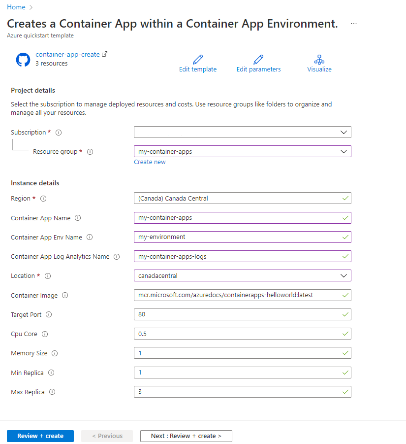

# Quickstart: Deploy your first container app using the ARM template

Azure Container Apps Preview enables you to run microservices and containerized applications on a serverless platform. With Container Apps, you enjoy the benefits of running containers while leaving behind the concerns of manually configuring cloud infrastructure and complex container orchestrators.

In this quickstart, you create a secure Container Apps environment and deploy your first container app using the ARM template.

## Prerequisites

An Azure account with an active subscription is required. If you don't already have one, you can [create an account for free](https://azure.microsoft.com/free/?WT.mc_id=A261C142F).


## Review the template

The template used in this quickstart is from [Azure Quickstart templates](https://azure.microsoft.com/pl-pl/resources/templates/container-app-create/).

:::code language="json" source="~/quickstart-templates/quickstarts/microsoft.web/container-app-create/azuredeploy.json":::


## Deploy ARM template using portal

1. Select the following button to sign in to Azure and open a template.

    [](https://portal.azure.com/#create/Microsoft.Template/uri/https%3A%2F%2Fraw.githubusercontent.com%2FAzure%2Fazure-quickstart-templates%2Fmaster%2Fquickstarts%2Fmicrosoft.web%2Fcontainer-app-create%2Fazuredeploy.json)

2. Select or enter the following values.

    For this quickstart, leave the default values for the *Container Image*, *Target Port*, *Cpu Core*, *Memory Size*, *Min Replica* and *Max Replica*. Provide your own values for the following template parameters:

    * **Subscription**: Select an Azure subscription.
    * **Resource group**: Select **Create new**. Enter a unique name for the resource group, such as *my-container-apps*, then choose **OK**.
    * **Region**: Select a region, such as **Canada Central**.
    * **Container App Name**: Enter a name for the container app, such as **my-container-app**.
    * **Container App Env Name**: Enter a name for the environment, such as **my-environment**.
    * **Container App Log Analytics Name**: Enter a name for the log analytics, such as **my-container-apps-logs**.
    * **Location**: Location for Log Analytics should be filled with **canadacentral**.

    

3. Select **Review + Create**.

It takes a few minutes to create the Container apps. Wait for the app to be successfully deployed before you move on to the next step.

## Deploy ARM template with CLI

[!INCLUDE [azure-cli-prepare-your-environment-h3](../../includes/azure-cli-prepare-your-environment-h3.md)]

### Deploy Container Apps
To create Container Apps use below script:

# [Bash](#tab/bash)

```azurecli
az group create --name my-container-apps --location canadacentral

az deployment group create \
  --resource-group my-container-apps \
  --template-uri https://raw.githubusercontent.com/Azure/azure-quickstart-templates/master/quickstarts/microsoft.web/container-app-create/azuredeploy.json \
  --parameters '{ \"containerAppName\": { \"value\": \"my-container-app\" }, \"containerAppEnvName\": { \"value\": \"my-environment\" }, \"containerAppLogAnalyticsName\": { \"value\": \"my-container-apps-logs\"}, \"location\": { \"value\": \"canadacentral\"} }'
```

# [PowerShell](#tab/powershell)

```azurecli
New-AzResourceGroup -Name my-container-apps -Location canadacentral

New-AzResourceGroupDeployment -ResourceGroupName my-container-apps `
-TemplateUri https://raw.githubusercontent.com/Azure/azure-quickstart-templates/master/quickstarts/microsoft.web/container-app-create/azuredeploy.json `
-containerAppName my-container-app `
-containerAppEnvName my-environment `
-containerAppLogAnalyticsName my-container-apps-logs `
-location canadacentral
```

### Verify deployment

Select **Go to resource** to view your new container app.  Select the link next to *Application URL* to view your application. You'll see the following message in your browser.

:::image type="content" source="media/get-started/azure-container-apps-quickstart.png" alt-text="Your first Azure Container Apps deployment.":::

## Clean up resources

If you're not going to continue to use this application, you can delete the Azure Container Apps instance and all the associated services by removing the resource group.

1. Select the **my-container-apps** resource group from the *Overview* section.
1. Select the **Delete resource group** button at the top of the resource group *Overview*.
1. Enter the resource group name **my-container-apps** in the *Are you sure you want to delete "my-container-apps"* confirmation dialog.
1. Select **Delete**.  
    The process to delete the resource group may take a few minutes to complete.

> [!TIP]
> Having issues? Let us know on GitHub by opening an issue in the [Azure Container Apps repo](https://github.com/microsoft/azure-container-apps).

## Next steps

> [!div class="nextstepaction"]
> [Environments in Azure Container Apps](environment.md)

