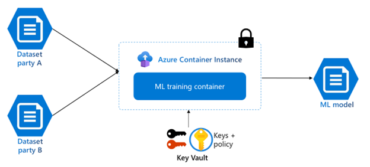
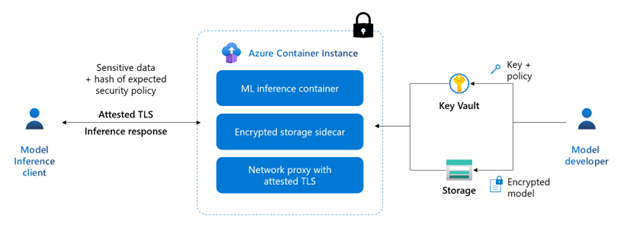

# Confidential containers on Azure Container Instances
This article introduces how confidential containers on Azure Container Instances can enable you to secure your workloads running in the cloud. This article provides background about the feature set, scenarios, limitations, and resources.

Confidential containers on Azure Container Instances enable customers to run Linux containers within a hardware-based and attested Trusted Execution Environment (TEE). Customers can lift and shift their containerized Linux applications or build new confidential computing applications without needing to adopt any specialized programming models to achieve the benefits of confidentiality in a TEE. Confidential containers on Azure Container Instances protect data-in-use and encrypts data being used in memory. Azure Container Instances extends this capability through verifiable execution policies, and verifiable hardware root of trust assurances through guest attestation.

   

## Features of confidential containers on Azure Container Instances

### Lift and shift applications 
Customers can lift and shift their containerized Linux applications or build new confidential computing applications without needing to adopt specialized programming models to achieve the benefits of confidentiality in a TEE. 

### Hardware based trusted execution environment 
Confidential containers on Azure Container Instances are deployed in a container group with a Hyper-V isolated TEE, which includes a memory encryption key that is generated and managed by an AMD SEV-SNP capable processor. Data in use in memory is encrypted with this key to help provide protection against data replay, corruption, remapping, and aliasing-based attacks.  

### Verifiable execution policies
Confidential containers on Azure Container Instances can run with verifiable execution policies that enable customers to have control over what software and actions are allowed to run within the TEE. These execution policies help to protect against bad actors creating unexpected application modifications that could potentially leak sensitive data.  Execution policies are authored by the customer through provided [tooling](https://github.com/Azure/azure-cli-extensions/blob/main/src/confcom/azext_confcom/README.md) and are verified through cryptographic proof. 

### Remote guest attestation
Confidential containers on ACI provide support for remote guest attestation which is used to verify the trustworthiness of your container group before creating a secure channel with a relying party. Container groups can generate an SNP hardware attestation report, which is signed by the hardware and includes information about the hardware and software. This generated hardware attestation report can then be verified by the Microsoft Azure Attestation service via an [open-source sidecar application](https://github.com/microsoft/confidential-sidecar-containers) or by another attestation service before any sensitive data is released to the TEE. 

## Confidential computing enforcement policies 
Confidential containers support container-level integrity and attestation via confidential computing enforcement (CCE) policies. Confidential computing enforcement policies prescribe the components that are permitted to run within the container group and will be enforced by the container runtime. 

### Azure CLI confcom extension 
The Azure CLI confcom extension enables customers to generate confidential computing enforcement policies using an ARM template as an input and providing a base 64 string policy as an output. This output is included in the definition of the container group to enforce which components are permitted to run. For more details on authoring confidential computing execution policies, see [Azure CLI confcom extension](https://github.com/Azure/azure-cli-extensions/blob/main/src/confcom/azext_confcom/README.md).

## Secure key release and encrypted file system sidecars
Confidential containers on Azure Container Instances integrates with two open source sidecars to support confidential functionality within the container group.  You can find these sidecars and more information in the [confidential sidecar repository](https://github.com/microsoft/confidential-sidecar-containers).

### Secure key release sidecar 
Confidential containers on Azure Container Instances provide a sidecar open source container for attestation and secure key release. This sidecar instantiates a web server, which exposes a REST API so that other containers can retrieve a hardware attestation report or a Microsoft Azure Attestation token via the POST method. The sidecar integrates with Azure Key vault for releasing a key to the container group after validation has been completed.

### Encrypted file system sidecar 
Confidential containers on Azure Container Instances provide a sidecar container to mount a remote encrypted filesystem previously uploaded to Azure Blob Storage. The sidecar container transparently retrieves the hardware attestation and the certificate chain endorsing the attestation’s signing key. It then requests Microsoft Azure Attestation to authorize an attestation token, which is required for securely releasing the filesystem’s encryption key from the managed HSM. The key is released to the sidecar container only if the attestation token is signed by the expected authority and the attestation claims match the key’s release policy. The sidecar container transparently uses the key to mount the remote encrypted filesystem; this process will preserve the confidentiality and integrity of the filesystem upon any operation from a container that is running within the container group.

## Scenarios 

### Data clean rooms for multi-party data analytics and machine learning training
Business transactions and project collaborations often require sharing confidential data amongst multiple parties. This data may include personal information, financial information, and medical records which need to be protected from unauthorized access. Confidential containers on Azure Container Instances provide the necessary features (hardware-based TEEs, remote attestation) for customers to process training data from multiple sources without exposing input data to other parties. This enables organizations to get more value from their or their partners' datasets while maintaining  control over access to their sensitive information. This makes confidential containers on Azure Container Instances ideal for multi-party data analytics scenarios such as confidential machine learning. 

   

### Confidential inference
ACI provides fast and easy deployments, flexible resource allocation, and pay per use pricing, which positions it as a great platform for confidential inference workloads. With confidential containers on Azure Container Instances, model developers and data owners can collaborate while protecting the intellectual property of the model developer and keeping the data used for inferencing secure and private. Check out a [sample](https://aka.ms/ccaciinference) deployment of confidential inference using confidential containers on Azure Container Instances.  

   

## Unsupported Scenarios
* Confidential computing enforcement policies must be generated by the Azure CLI confcom extension and can't be manually created.

## Resources 

* [Azure CLI confcom extension](https://github.com/Azure/azure-cli-extensions/blob/main/src/confcom/azext_confcom/README.md) 
* [Confidential sidecar containers](https://github.com/microsoft/confidential-sidecar-containers)
* [Confidential hello world application](https://aka.ms/ccacihelloworld)
* [Machine learning inference demo](https://aka.ms/ccaciinference)

## Next Steps 

* For a deployment example, see [Deploy a confidential container group with Azure Resource Manager](./container-instances-tutorial-deploy-confidential-containers-cce-arm.md)
