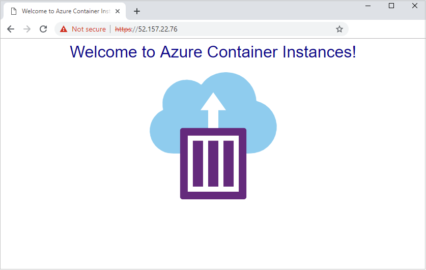

# Enable an SSL endpoint in a container group

This article shows how to create a [container group](container-instances-container-groups.md) with an application container and a sidecar container running an SSL provider. By setting up a container group with a separate SSL endpoint, you enable SSL connections for your application without changing your application code.

You set up a container group consisting of two containers:
* An application container that runs a simple web app using the public Microsoft [aci-helloworld](https://hub.docker.com/_/microsoft-azuredocs-aci-helloworld) image. 
* A sidecar container running the public [Nginx](https://hub.docker.com/_/nginx) image, configured to use SSL. 

In this example, the container group only exposes port 443 for Nginx with its public IP address. Nginx routes HTTPS requests to the companion web app, which listens internally on port 80. You can adapt the example for container apps that listen on other ports.

[!INCLUDE [cloud-shell-try-it.md](../../includes/cloud-shell-try-it.md)]

You can use the Azure Cloud Shell or a local installation of the Azure CLI to complete this article. If you'd like to use it locally, version 2.0.55 or later is recommended. Run `az --version` to find the version. If you need to install or upgrade, see [Install Azure CLI](/cli/azure/install-azure-cli).

## Create a self-signed certificate

To set up Nginx as an SSL provider, you need an SSL certificate. This article shows how to create and set up a self-signed SSL certificate. For production scenarios, you should obtain a certificate from a certificate authority.

To create a self-signed SSL certificate, use the [OpenSSL](https://www.openssl.org/) tool available in Azure Cloud Shell and many Linux distributions, or use a comparable client tool in your operating system.

First create a certificate request (.csr file) in a local working directory:

```console
openssl req -new -newkey rsa:2048 -nodes -keyout ssl.key -out ssl.csr
```

Follow the prompts to add the identification information. For Common Name, enter the hostname associated with the certificate. When prompted for a password, press Enter without typing, to skip adding a password.

Run the following command to create the self-signed certificate (.crt file) from the certificate request. For example:

```console
openssl x509 -req -days 365 -in ssl.csr -signkey ssl.key -out ssl.crt
```

You should now see three files in the directory: the certificate request (`ssl.csr`), the private key (`ssl.key`), and the self-signed certificate (`ssl.crt`). You use `ssl.key` and `ssl.crt` in later steps.

## Configure Nginx to use SSL

### Create Nginx configuration file

In this section, you create a configuration file for Nginx to use SSL. Start by copying the following text into a new file named`nginx.conf`. In Azure Cloud Shell, you can use Visual Studio Code to create the file in your working directory:

```console
code nginx.conf
```

In `location`, be sure to set `proxy_pass` with the correct port for app. In this example, we set port 80 for the `aci-helloworld` container.

```console
# nginx Configuration File
# https://wiki.nginx.org/Configuration

# Run as a less privileged user for security reasons.
user nginx;

worker_processes auto;

events {
  worker_connections 1024;
}

pid        /var/run/nginx.pid;

http {

    #Redirect to https, using 307 instead of 301 to preserve post data

    server {
        listen [::]:443 ssl;
        listen 443 ssl;

        server_name localhost;

        # Protect against the BEAST attack by not using SSLv3 at all. If you need to support older browsers (IE6) you may need to add
        # SSLv3 to the list of protocols below.
        ssl_protocols              TLSv1 TLSv1.1 TLSv1.2;

        # Ciphers set to best allow protection from Beast, while providing forwarding secrecy, as defined by Mozilla - https://wiki.mozilla.org/Security/Server_Side_TLS#Nginx
        ssl_ciphers                ECDHE-RSA-AES128-GCM-SHA256:ECDHE-ECDSA-AES128-GCM-SHA256:ECDHE-RSA-AES256-GCM-SHA384:ECDHE-ECDSA-AES256-GCM-SHA384:DHE-RSA-AES128-GCM-SHA256:DHE-DSS-AES128-GCM-SHA256:kEDH+AESGCM:ECDHE-RSA-AES128-SHA256:ECDHE-ECDSA-AES128-SHA256:ECDHE-RSA-AES128-SHA:ECDHE-ECDSA-AES128-SHA:ECDHE-RSA-AES256-SHA384:ECDHE-ECDSA-AES256-SHA384:ECDHE-RSA-AES256-SHA:ECDHE-ECDSA-AES256-SHA:DHE-RSA-AES128-SHA256:DHE-RSA-AES128-SHA:DHE-DSS-AES128-SHA256:DHE-RSA-AES256-SHA256:DHE-DSS-AES256-SHA:DHE-RSA-AES256-SHA:AES128-GCM-SHA256:AES256-GCM-SHA384:ECDHE-RSA-RC4-SHA:ECDHE-ECDSA-RC4-SHA:AES128:AES256:RC4-SHA:HIGH:!aNULL:!eNULL:!EXPORT:!DES:!3DES:!MD5:!PSK;
        ssl_prefer_server_ciphers  on;

        # Optimize SSL by caching session parameters for 10 minutes. This cuts down on the number of expensive SSL handshakes.
        # The handshake is the most CPU-intensive operation, and by default it is re-negotiated on every new/parallel connection.
        # By enabling a cache (of type "shared between all Nginx workers"), we tell the client to re-use the already negotiated state.
        # Further optimization can be achieved by raising keepalive_timeout, but that shouldn't be done unless you serve primarily HTTPS.
        ssl_session_cache    shared:SSL:10m; # a 1mb cache can hold about 4000 sessions, so we can hold 40000 sessions
        ssl_session_timeout  24h;


        # Use a higher keepalive timeout to reduce the need for repeated handshakes
        keepalive_timeout 300; # up from 75 secs default

        # remember the certificate for a year and automatically connect to HTTPS
        add_header Strict-Transport-Security 'max-age=31536000; includeSubDomains';

        ssl_certificate      /etc/nginx/ssl.crt;
        ssl_certificate_key  /etc/nginx/ssl.key;

        location / {
            proxy_pass http://localhost:80; # TODO: replace port if app listens on port other than 80
            
            proxy_set_header Connection "";
            proxy_set_header Host $host;
            proxy_set_header X-Real-IP $remote_addr;
            proxy_set_header X-Forwarded-For $remote_addr;
        }
    }
}
```

### Base64-encode secrets and configuration file

Base64-encode the Nginx configuration file, the SSL certificate, and the SSL key. In the next section, you enter the encoded contents in a YAML file used to deploy the container group.

```console
cat nginx.conf | base64 -w 0 > base64-nginx.conf
cat ssl.crt | base64 -w 0 > base64-ssl.crt
cat ssl.key | base64 -w 0 > base64-ssl.key
```

## Deploy container group

Now deploy the container group by specifying the container configurations in a [YAML file](container-instances-multi-container-yaml.md).

### Create YAML file

Copy the following YAML into a new file named `deploy-aci.yaml`. In Azure Cloud Shell, you can use Visual Studio Code to create the file in your working directory:

```console
code deploy-aci.yaml
```

Enter the contents of the base64-encoded files where indicated under `secret`. For example, `cat` each of the base64-encoded files to see its contents. During deployment, these files are added to a [secret volume](container-instances-volume-secret.md) in the container group. In this example, the secret volume is mounted to the Nginx container.

```YAML
api-version: 2018-10-01
location: westus
name: app-with-ssl
properties:
  containers:
  - name: nginx-with-ssl
    properties:
      image: nginx
      ports:
      - port: 443
        protocol: TCP
      resources:
        requests:
          cpu: 1.0
          memoryInGB: 1.5
      volumeMounts:
      - name: nginx-config
        mountPath: /etc/nginx
  - name: my-app
    properties:
      image: mcr.microsoft.com/azuredocs/aci-helloworld
      ports:
      - port: 80
        protocol: TCP
      resources:
        requests:
          cpu: 1.0
          memoryInGB: 1.5
  volumes:
  - secret:
      ssl.crt: <Enter contents of base64-ssl.crt here>
      ssl.key: <Enter contents of base64-ssl.key here>
      nginx.conf: <Enter contents of base64-nginx.conf here>
    name: nginx-config
  ipAddress:
    ports:
    - port: 443
      protocol: TCP
    type: Public
  osType: Linux
tags: null
type: Microsoft.ContainerInstance/containerGroups
```

### Deploy the container group

Create a resource group with the [az group create](/cli/azure/group#az-group-create) command:

```azurecli-interactive
az group create --name myResourceGroup --location eastus
```

Deploy the container group with the [az container create](/cli/azure/container#az-container-create) command, passing the YAML file as an argument.

```azurecli
az container create --resource-group <myResourceGroup> --file deploy-aci.yaml
```

### View deployment state

To view the state of the deployment, use the following [az container show](/cli/azure/container#az-container-show) command:

```azurecli
az container show --resource-group <myResourceGroup> --name app-with-ssl --output table
```

For a successful deployment, output is similar to the following:

```console
Name          ResourceGroup    Status    Image                                                    IP:ports             Network    CPU/Memory       OsType    Location
------------  ---------------  --------  -------------------------------------------------------  -------------------  ---------  ---------------  --------  ----------
app-with-ssl  myresourcegroup  Running   mcr.microsoft.com/azuredocs/nginx, aci-helloworld        52.157.22.76:443     Public     1.0 core/1.5 gb  Linux     westus
```

## Verify SSL connection

To view the running application, navigate to its IP address in your browser. For example, the IP address shown in this example is `52.157.22.76`. You must use `https://<IP-ADDRESS>` to see the running application, because of the Nginx server configuration. Attempts to connect with `http://<IP-ADDRESS>` fail.



> [!NOTE]
> Because this example uses a self-signed certificate and not one from a certificate authority, the browser displays a security warning when connecting to the site over HTTPS. This behavior is expected.
>

## Next steps

This article showed you how to set up an Nginx container to enable SSL connections to a web app running in the container group. You can adapt this example for apps that listen on ports other than port 80. You can also update the Nginx configuration file to automatically redirect server connections on port 80 (HTTP) to use HTTPS.

While this article uses Nginx in the sidecar, you can use another SSL provider such as [Caddy](https://caddyserver.com/).

Another approach to enabling SSL in a container group is to deploy the group in an [Azure virtual network](container-instances-vnet.md) with an [Azure application gateway](../application-gateway/overview.md). The gateway can be set up as an SSL endpoint. See a sample [deployment template](https://github.com/Azure/azure-quickstart-templates/tree/master/201-aci-wordpress-vnet) you can adapt to enable SSL termination on the gateway.
