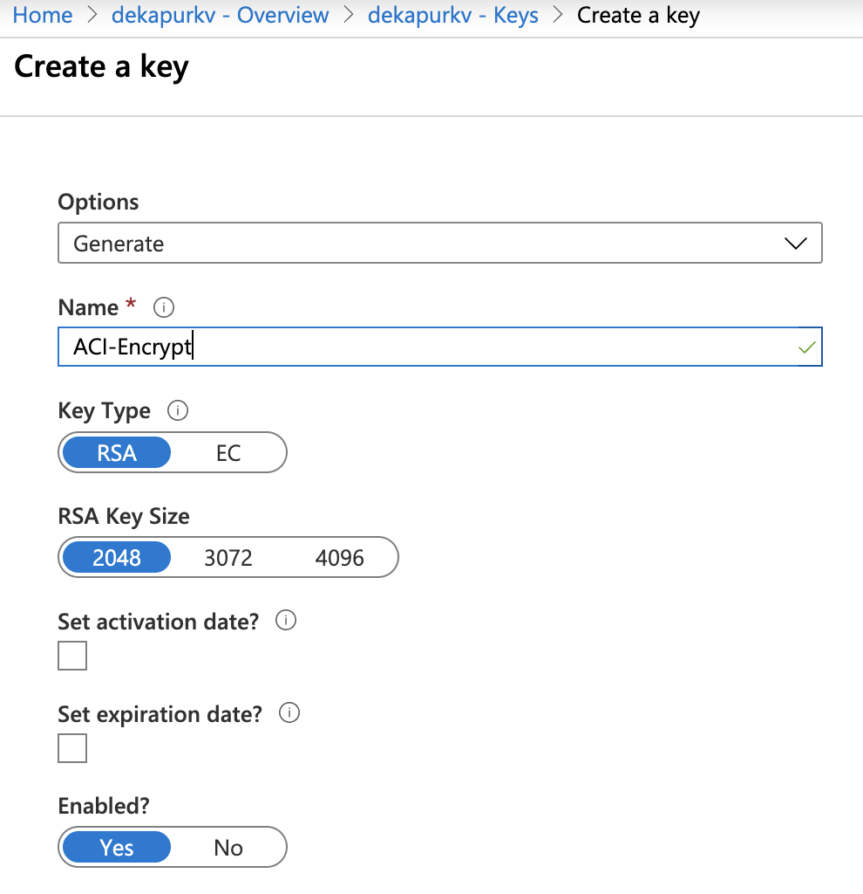
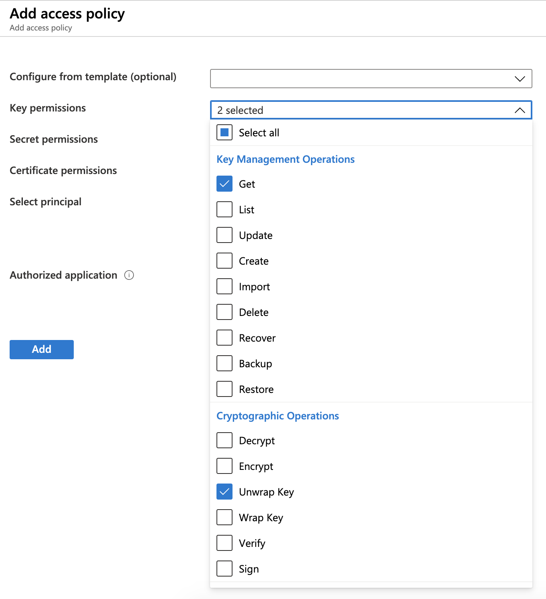
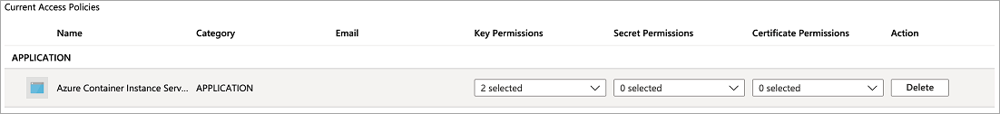

# Encrypt deployment data

When running Azure Container Instances (ACI) resources in the cloud, the ACI service collects and persists data related to your containers. ACI automatically encrypts this data when it is persisted in the cloud. This encryption protects your data to help meet your organization's security and compliance commitments. ACI also gives you the option to encrypt this data with your own key, giving you greater control over the data related to your ACI deployments.

## About ACI data encryption 

Data in ACI is encrypted and decrypted using 256-bit AES encryption. It is enabled for all ACI deployments, and you don't need to modify your deployment or containers to take advantage of this encryption. This includes metadata about the deployment, environment variables, keys being passed into your containers, and logs persisted after your containers are stopped so you can still see them. Encryption does not affect your container group performance, and there is no additional cost for encryption.

You can rely on Microsoft-managed keys for the encryption of your container data, or you can manage the encryption with your own keys. The following table compares these options: 

|    |    Microsoft-managed keys     |     Customer-managed keys     |
|----|----|----|
|    **Encryption/decryption operations**    |    Azure    |    Azure    |
|    **Key storage**    |    Microsoft key store    |    Azure Key Vault    |
|    **Key rotation responsibility**    |    Microsoft    |    Customer    |
|    **Key access**    |    Microsoft only    |    Microsoft, Customer    |

This article reviews two flows for encrypting data with a customer-managed key:
* Encrypt data with a customer-managed key stored in a standard Azure Key Vault
* Encrypt data with a customer-managed key stored in a network-protected Azure Key Vault with [Trusted Services](../key-vault/general/network-security.md) enabled.

## Encrypt data with a customer-managed key stored in a standard Azure Key Vault
[!INCLUDE [azure-cli-prepare-your-environment.md](~/reusable-content/azure-cli/azure-cli-prepare-your-environment.md)]
### Create Service Principal for ACI

The first step is to ensure that your [Azure tenant](../active-directory/develop/quickstart-create-new-tenant.md) has a service principal assigned for granting permissions to the Azure Container Instances service. 

> [!IMPORTANT]
> In order to run the following command and create a service principal successfully, confirm that you have permissions to create service principals in your tenant.
>

The following CLI command will set up the ACI SP in your Azure environment:

```azurecli-interactive
az ad sp create --id 6bb8e274-af5d-4df2-98a3-4fd78b4cafd9
```

The output from running this command should show you a service principal that has been set up with "displayName": "Azure Container Instance Service."

In case you are unable to successfully create the service principal:
* confirm that you have permissions to do so in your tenant
* check to see if a service principal already exists in your tenant for deploying to ACI. You can do that by running `az ad sp show --id 6bb8e274-af5d-4df2-98a3-4fd78b4cafd9` and use that service principal instead

### Create a Key Vault resource

Create an Azure Key Vault using [Azure portal](../key-vault/general/quick-create-portal.md), [Azure CLI](../key-vault/general/quick-create-cli.md), or [Azure PowerShell](../key-vault/general/quick-create-powershell.md).

For the properties of your key vault, use the following guidelines: 
* Name: A unique name is required. 
* Subscription: Choose a subscription.
* Under Resource Group, either choose an existing resource group, or create new and enter a resource group name.
* In the Location pull-down menu, choose a location.
* You can leave the other options to their defaults or pick based on additional requirements.

> [!IMPORTANT]
> When using customer-managed keys to encrypt an ACI deployment template, it is recommended that the following two properties be set on the key vault, Soft Delete and Do Not Purge. These properties are not enabled by default, but can be enabled using either PowerShell or Azure CLI on a new or existing key vault.

### Generate a new key 

Once your key vault is created, navigate to the resource in Azure portal. On the left navigation menu of the resource blade, under Settings, click **Keys**. On the view for "Keys," click "Generate/Import" to generate a new key. Use any unique Name for this key, and any other preferences based on your requirements. 



### Set access policy

Create a new access policy for allowing the ACI service to access your Key.

* Once your key has been generated, back in your key vault resource blade, under Settings, click **Access Policies**.
* On the "Access Policies" page for your key vault, click **Add Access Policy**.
* Set the *Key Permissions* to include **Get** and **Unwrap Key**
    
* For *Select Principal*, select **Azure Container Instance Service**
* Click **Add** at the bottom 

The access policy should now show up in your key vault's access policies.



### Modify your JSON deployment template

> [!IMPORTANT]
> Encrypting deployment data with a customer-managed key is available in the latest API version (2019-12-01) that is currently rolling out. Specify this API version in your deployment template. If you have any issues with this, please reach out to Azure Support.

Once the key vault key and access policy are set up, add the following properties to your ACI deployment template. Learn more about deploying ACI resources with a template in the [Tutorial: Deploy a multi-container group using a Resource Manager template](./container-instances-multi-container-group.md). 
* Under `resources`, set `apiVersion` to `2019-12-01`.
* Under the container group properties section of the deployment template, add an `encryptionProperties`, which contains the following values:
  * `vaultBaseUrl`: the DNS Name of your key vault, can be found  on the overview blade of the key vault resource in Portal
  * `keyName`: the name of the key generated earlier
  * `keyVersion`: the current version of the key. This can be found by clicking into the key itself (under "Keys" in the Settings section of your key vault resource)
* Under the container group properties, add a `sku` property with value `Standard`. The `sku` property is required in API version 2019-12-01.

The following template snippet shows these additional properties to encrypt deployment data:

```json
[...]
"resources": [
    {
        "name": "[parameters('containerGroupName')]",
        "type": "Microsoft.ContainerInstance/containerGroups",
        "apiVersion": "2019-12-01",
        "location": "[resourceGroup().location]",    
        "properties": {
            "encryptionProperties": {
                "vaultBaseUrl": "https://example.vault.azure.net",
                "keyName": "acikey",
                "keyVersion": "xxxxxxxxxxxxxxxx"
            },
            "sku": "Standard",
            "containers": {
                [...]
            }
        }
    }
]
```

Following is a complete template, adapted from the template in [Tutorial: Deploy a multi-container group using a Resource Manager template](./container-instances-multi-container-group.md). 

```json
{
  "$schema": "https://schema.management.azure.com/schemas/2015-01-01/deploymentTemplate.json#",
  "contentVersion": "1.0.0.0",
  "parameters": {
    "containerGroupName": {
      "type": "string",
      "defaultValue": "myContainerGroup",
      "metadata": {
        "description": "Container Group name."
      }
    }
  },
  "variables": {
    "container1name": "aci-tutorial-app",
    "container1image": "mcr.microsoft.com/azuredocs/aci-helloworld:latest",
    "container2name": "aci-tutorial-sidecar",
    "container2image": "mcr.microsoft.com/azuredocs/aci-tutorial-sidecar"
  },
  "resources": [
    {
      "name": "[parameters('containerGroupName')]",
      "type": "Microsoft.ContainerInstance/containerGroups",
      "apiVersion": "2019-12-01",
      "location": "[resourceGroup().location]",
      "properties": {
        "encryptionProperties": {
            "vaultBaseUrl": "https://example.vault.azure.net",
            "keyName": "acikey",
            "keyVersion": "xxxxxxxxxxxxxxxx"
        },
        "sku": "Standard",  
        "containers": [
          {
            "name": "[variables('container1name')]",
            "properties": {
              "image": "[variables('container1image')]",
              "resources": {
                "requests": {
                  "cpu": 1,
                  "memoryInGb": 1.5
                }
              },
              "ports": [
                {
                  "port": 80
                },
                {
                  "port": 8080
                }
              ]
            }
          },
          {
            "name": "[variables('container2name')]",
            "properties": {
              "image": "[variables('container2image')]",
              "resources": {
                "requests": {
                  "cpu": 1,
                  "memoryInGb": 1.5
                }
              }
            }
          }
        ],
        "osType": "Linux",
        "ipAddress": {
          "type": "Public",
          "ports": [
            {
              "protocol": "tcp",
              "port": "80"
            },
            {
                "protocol": "tcp",
                "port": "8080"
            }
          ]
        }
      }
    }
  ],
  "outputs": {
    "containerIPv4Address": {
      "type": "string",
      "value": "[reference(resourceId('Microsoft.ContainerInstance/containerGroups/', parameters('containerGroupName'))).ipAddress.ip]"
    }
  }
}
```

### Deploy your resources

If you created and edited the template file on your desktop, you can upload it to your Cloud Shell directory by dragging the file into it. 

Create a resource group with the [az group create][az-group-create] command.

```azurecli-interactive
az group create --name myResourceGroup --location eastus
```

Deploy the template with the [az deployment group create][az-deployment-group-create] command.

```azurecli-interactive
az deployment group create --resource-group myResourceGroup --template-file deployment-template.json
```

Within a few seconds, you should receive an initial response from Azure. Once the deployment completes, all data related to it persisted by the ACI service will be encrypted with the key you provided.

## Encrypt data with a customer-managed key in a network protected Azure Key Vault with Trusted Services enabled

### Create a Key Vault resource

Create an Azure Key Vault using [Azure portal](../key-vault/general/quick-create-portal.md), [Azure CLI](../key-vault/general/quick-create-cli.md), or [Azure PowerShell](../key-vault/general/quick-create-powershell.md). To start, do not apply any network-limitations so we can add necessary keys to the vault. In subsequent steps, we will add network-limitations and enable trusted services. 

For the properties of your key vault, use the following guidelines: 
* Name: A unique name is required. 
* Subscription: Choose a subscription.
* Under Resource Group, either choose an existing resource group, or create new and enter a resource group name.
* In the Location pull-down menu, choose a location.
* You can leave the other options to their defaults or pick based on additional requirements.

> [!IMPORTANT]
> When using customer-managed keys to encrypt an ACI deployment template, it is recommended that the following two properties be set on the key vault, Soft Delete and Do Not Purge. These properties are not enabled by default, but can be enabled using either PowerShell or Azure CLI on a new or existing key vault.
### Generate a new key 

Once your key vault is created, navigate to the resource in Azure portal. On the left navigation menu of the resource blade, under Settings, click **Keys**. On the view for "Keys," click "Generate/Import" to generate a new key. Use any unique Name for this key, and any other preferences based on your requirements. Make sure to capture key name and version for subsequent steps.


### Create a user-assigned managed identity for your container group
Create an identity in your subscription using the [az identity create](/cli/azure/identity#az-identity-create) command. You can use the same resource group used to create the key vault, or use a different one.

```azurecli-interactive
az identity create \
  --resource-group myResourceGroup \
  --name myACIId
```

To use the identity in the following steps, use the [az identity show](/cli/azure/identity#az-identity-show) command to store the identity's service principal ID and resource ID in variables.

```azurecli-interactive
# Get service principal ID of the user-assigned identity
spID=$(az identity show \
  --resource-group myResourceGroup \
  --name myACIId \
  --query principalId --output tsv)
```

### Set access policy

Create a new access policy for allowing the user-assigned identity to access and unwrap your key for encryption purposes.

```azurecli-interactive
az keyvault set-policy \
    --name mykeyvault \
    --resource-group myResourceGroup \
    --object-id $spID \
    --key-permissions get unwrapKey
 ```   

### Modify Azure Key Vault's network permissions
The following commands set up an Azure Firewall for your Azure Key Vault and allow Azure Trusted Services such as ACI access. 

```azurecli-interactive
az keyvault update \
    --name mykeyvault \
    --resource-group myResourceGroup \
    --default-action Deny
 ```   

```azurecli-interactive
az keyvault update \
    --name mykeyvault \
    --resource-group myResourceGroup \
    --bypass AzureServices
 ```    

### Modify your JSON deployment template

> [!IMPORTANT]
> Encrypting deployment data with a customer-managed key is available in the 2022-09-01 API version or newer. The 2022-09-01 API version is only available via ARM or REST. If you have any issues with this, please reach out to Azure Support.
Once the key vault key and access policy are set up, add the following properties to your ACI deployment template. Learn more about deploying ACI resources with a template in the [Tutorial: Deploy a multi-container group using a Resource Manager template](./container-instances-multi-container-group.md). 
* Under `resources`, set `apiVersion` to `2022-09-01`.
* Under the container group properties section of the deployment template, add an `encryptionProperties`, which contains the following values:
  * `vaultBaseUrl`: the DNS Name of your key vault. This can be found on the overview blade of the key vault resource in Portal
  * `keyName`: the name of the key generated earlier
  * `keyVersion`: the current version of the key. This can be found by clicking into the key itself (under "Keys" in the Settings section of your key vault resource)
  * `identity`: this is the resource URI of the Managed Identity instance created earlier
* Under the container group properties, add a `sku` property with value `Standard`. The `sku` property is required in API version 2022-09-01.
* Under resources, add the `identity` object required to use Managed Identity with ACI, which contains the following values:
  * `type`: the type of the identity being used (either user-assigned or system-assigned). This case will be set to "UserAssigned"
  * `userAssignedIdentities`: the resourceURI of the same user-assigned identity used above in the `encryptionProperties` object. 

The following template snippet shows these additional properties to encrypt deployment data:

```json
[...]
"resources": [
    {
        "name": "[parameters('containerGroupName')]",
        "type": "Microsoft.ContainerInstance/containerGroups",
        "apiVersion": "2019-12-01",
        "location": "[resourceGroup().location]",    
        "identity": {
         "type": "UserAssigned",
         "userAssignedIdentities": {
           "/subscriptions/XXXXXXXXXXXXXXXXXXXXXX/resourcegroups/XXXXXXXXXXXXXXXXXXXXXX/providers/Microsoft.ManagedIdentity/userAssignedIdentities/myACIId": {}
         }
        },
        "properties": {
            "encryptionProperties": {
                "vaultBaseUrl": "https://example.vault.azure.net",
                "keyName": "acikey",
                "keyVersion": "xxxxxxxxxxxxxxxx",
                "identity": "/subscriptions/XXXXXXXXXXXXXXXXXXXXXX/resourcegroups/XXXXXXXXXXXXXXXXXXXXXX/providers/Microsoft.ManagedIdentity/userAssignedIdentities/myACIId"
            },
            "sku": "Standard",
            "containers": {
                [...]
            }
        }
    }
]
```

Following is a complete template, adapted from the template in [Tutorial: Deploy a multi-container group using a Resource Manager template](./container-instances-multi-container-group.md). 

```json
{
  "$schema": "https://schema.management.azure.com/schemas/2015-01-01/deploymentTemplate.json#",
  "contentVersion": "1.0.0.0",
  "parameters": {
    "containerGroupName": {
      "type": "string",
      "defaultValue": "myContainerGroup",
      "metadata": {
        "description": "Container Group name."
      }
    }
  },
  "variables": {
    "container1name": "aci-tutorial-app",
    "container1image": "mcr.microsoft.com/azuredocs/aci-helloworld:latest",
    "container2name": "aci-tutorial-sidecar",
    "container2image": "mcr.microsoft.com/azuredocs/aci-tutorial-sidecar"
  },
  "resources": [
    {
      "name": "[parameters('containerGroupName')]",
      "type": "Microsoft.ContainerInstance/containerGroups",
      "apiVersion": "2022-09-01",
      "location": "[resourceGroup().location]",
      "identity": {
        "type": "UserAssigned",
        "userAssignedIdentities": {
          "/subscriptions/XXXXXXXXXXXXXXXXXXXXXX/resourcegroups/XXXXXXXXXXXXXXXXXXXXXX/providers/Microsoft.ManagedIdentity/userAssignedIdentities/myACIId": {}
        }
      },
      "properties": {
        "encryptionProperties": {
          "vaultBaseUrl": "https://example.vault.azure.net",
          "keyName": "acikey",
          "keyVersion": "xxxxxxxxxxxxxxxx",
          "identity": "/subscriptions/XXXXXXXXXXXXXXXXXXXXXX/resourcegroups/XXXXXXXXXXXXXXXXXXXXXX/providers/Microsoft.ManagedIdentity/userAssignedIdentities/myACIId"
        },
        "sku": "Standard",
        "containers": [
          {
            "name": "[variables('container1name')]",
            "properties": {
              "image": "[variables('container1image')]",
              "resources": {
                "requests": {
                  "cpu": 1,
                  "memoryInGb": 1.5
                }
              },
              "ports": [
                {
                  "port": 80
                },
                {
                  "port": 8080
                }
              ]
            }
          },
          {
            "name": "[variables('container2name')]",
            "properties": {
              "image": "[variables('container2image')]",
              "resources": {
                "requests": {
                  "cpu": 1,
                  "memoryInGb": 1.5
                }
              }
            }
          }
        ],
        "osType": "Linux",
        "ipAddress": {
          "type": "Public",
          "ports": [
            {
              "protocol": "tcp",
              "port": "80"
            },
            {
              "protocol": "tcp",
              "port": "8080"
            }
          ]
        }
      }
    }
  ],
  "outputs": {
    "containerIPv4Address": {
      "type": "string",
      "value": "[reference(resourceId('Microsoft.ContainerInstance/containerGroups/', parameters('containerGroupName'))).ipAddress.ip]"
    }
  }
}
```

### Deploy your resources

If you created and edited the template file on your desktop, you can upload it to your Cloud Shell directory by dragging the file into it. 

Create a resource group with the [az group create][az-group-create] command.

```azurecli-interactive
az group create --name myResourceGroup --location eastus
```

Deploy the template with the [az deployment group create][az-deployment-group-create] command.

```azurecli-interactive
az deployment group create --resource-group myResourceGroup --template-file deployment-template.json
```

Within a few seconds, you should receive an initial response from Azure. Once the deployment completes, all data related to it persisted by the ACI service will be encrypted with the key you provided.
<!-- LINKS - Internal -->
[az-group-create]: /cli/azure/group#az_group_create
[az-deployment-group-create]: /cli/azure/deployment/group/#az_deployment_group_create
