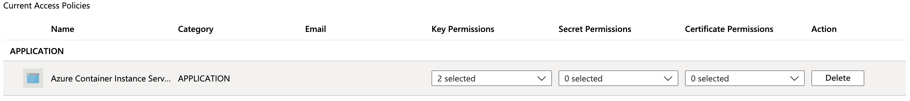

# Encrypt the deployment template

Azure Container Instances (ACI) gives you the option to encrypt your deployment template, in the case that you would like to encrypt secrets and other values present in it with your own key. This gives you greater control over what information is made available to us and when. We achieve this by having you create a managed key in Key Vault that you can use to encrypt the template. 

This document will go through the steps required to encrypt your ACI deployment template. 

> [!IMPORTANT]
> Encrypting deployment templates is available in the latest API version that is still in the process of rolling out. You can use this API version to deploy ACI resources through the REST API endpoint. 

[!INCLUDE [cloud-shell-try-it.md](../../includes/cloud-shell-try-it.md)]

## Create Service Principal for ACI

The first step is to ensure that your [Azure tenant](https://docs.microsoft.com/azure/active-directory/develop/quickstart-create-new-tenant) has a service principal assigned for granting permissions to the Azure Container Instances service. 

The following CLI command will set up the ACI SP in your Azure environment:

```azurecli-interactive
az ad sp create --id 6bb8e274-af5d-4df2-98a3-4fd78b4cafd9
```

The output from running this command should show you a service principal that has been set up with "displayName": "Azure Container Instance Service."

## Create a KeyVault and a Key

### Create the KeyVault resource
Create a KeyVault using [Azure Portal](https://docs.microsoft.com/azure/key-vault/quick-create-portal#create-a-vault), [CLI](https://docs.microsoft.com/azure/key-vault/quick-create-cli), or [PowerShell](https://docs.microsoft.com/azure/key-vault/quick-create-powershell). 

For the properties of your KeyVault, use the following guidelines: 
* Name: A unique name is required. 
* Subscription: Choose a subscription.
* Under Resource Group, either choose an existing resource group, or create new and enter a resource group name.
* In the Location pull-down menu, choose a location.
* You can leave the other options to their defaults or pick based on additional requirements.

> [!IMPORTANT]
> When using customer-managed keys to encrypt an ACI deployment template, it is recommended that the following two properties be set on the key vault, Soft Delete and Do Not Purge. These properties are not enabled by default, but can be enabled using either PowerShell or Azure CLI on a new or existing key vault.

### Generate a new key 

Once your KeyVault is created, navigate to the resource in Azure Portal. On the left navigation menu of the resource blade, under Settings, click **Keys**. On the view for "Keys," click "Generate/Import" to generate a new key. Use any unique Name for this key, and any other preferences based on your requirements. 


## Set access policy

Create a new access policy for allowing the ACI service to access your Key.

* Once your key has been generated, back in your KeyVault resource blade, under Settings, click **Access Policies**.
* On the "Access Policies" page for your KeyVault, click **Add Access Policy**.
* Set the *Key Permissions* to include **Get** and **Unwrap Key**
    
* For *Select Principal*, select **Azure Container Instance Service**
* Click **Add** at the bottom 

The access policy should now show up in your KeyVault's access policies.




## Modify your template

Once the KeyVault key and access policy is set up, add the following property to your ACI deployment template. You can learn more about deployment ACI resources with a template through Azure Resource Manager and our REST API in the [Tutorial: Deploy a multi-container group using a Resource Manager template](https://docs.microsoft.com/azure/container-instances/container-instances-multi-container-group). 

Specifically, under the "properties" section of the deployment template, add an "encryptionProperties" which contains the following values:
* vaultBaseUrl: the DNS Name of your KeyVault, can be found  on the overview blade of the KeyVault resource in Portal
* keyName: the name of the key generated earlier
* keyVersion: the current version of the key. This can be found by clicking into the key itself (under "Keys" in the Settings section of your KeyVault resource)


```json
    "properties": {
        "encryptionProperties": {
        "vaultBaseUrl": "https://example.vault.azure.net",
        "keyName": "acikey",
        "keyVersion": "xxxxxxxxxxxxxxxx"
        },
        "containers": {
            [...]
        }
```

Once you deploy this template to create your ACI resources, the template will now be encrypted, and ACI will only be able to access it as long as the key version is current and the access policies exist for the associated service principal. Deleting your deployment template or rolling your key version over will successfully prevent the ACI service from using your template to restart or manage your deployment on your behalf. 