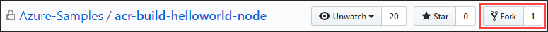
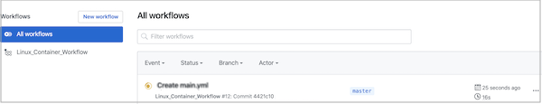
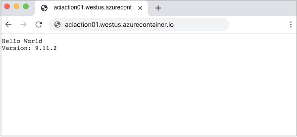

# Configure a GitHub Action to create a container instance

[GitHub Actions](https://docs.github.com/en/actions) is a suite of features in GitHub to automate your software development workflows in the same place you store code and collaborate on pull requests and issues.

Use the [Deploy to Azure Container Instances](https://github.com/azure/aci-deploy) GitHub Actions to automate deployment of a single container to Azure Container Instances. The action allows you to set properties for a container instance similar to those in the [az container create][az-container-create] command.

This article shows how to set up a workflow in a GitHub repo that performs the following actions:

* Build an image from a Dockerfile
* Push the image to an Azure container registry
* Deploy the container image to an Azure container instance

This article shows two ways to set up the workflow:

* [Configure GitHub workflow](#configure-github-workflow) - Create a workflow in a GitHub repo using the Deploy to Azure Container Instances action and other actions.  
* [Use CLI extension](#use-deploy-to-azure-extension) - Use the `az container app up` command in the [Deploy to Azure](https://github.com/Azure/deploy-to-azure-cli-extension) extension in the Azure CLI. This command streamlines creation of the GitHub workflow and deployment steps.

> [!IMPORTANT]
> The GitHub Actions for Azure Container Instances is currently in preview. Previews are made available to you on the condition that you agree to the [supplemental terms of use][terms-of-use]. Some aspects of this feature may change prior to general availability (GA).

## Prerequisites

* **GitHub account** - Create an account on https://github.com if you don't already have one.
* **Azure CLI** - You can use the Azure Cloud Shell or a local installation of the Azure CLI to complete the Azure CLI steps. If you need to install or upgrade, see [Install Azure CLI][azure-cli-install].
* **Azure container registry** - If you don't have one, create an Azure container registry in the Basic tier using the [Azure CLI](../container-registry/container-registry-get-started-azure-cli.md), [Azure portal](../container-registry/container-registry-get-started-portal.md), or other methods. Take note of the resource group used for the deployment, which is used for the GitHub workflow.

## Set up repo

* For the examples in this article, use GitHub to fork the following repository: https://github.com/Azure-Samples/acr-build-helloworld-node

  This repo contains a Dockerfile and source files to create a container image of a small web app.

  

* Ensure Actions is enabled for your repository. Navigate to your forked repository and select **Settings** > **Actions**. In **Actions permissions**, ensure that **Allow all actions** is selected.

## Configure GitHub workflow

### Create credentials for Azure authentication

# [Service principal](#tab/userlevel)

In the GitHub workflow, you need to supply Azure credentials to authenticate to the Azure CLI. The following example creates a service principal with the Contributor role scoped to the resource group for your container registry.

First, get the resource ID of your resource group. Substitute the name of your group in the following [az group show][az-group-show] command:

```azurecli-interactive
groupId=$(az group show \
  --name <resource-group-name> \
  --query id --output tsv)
```

Use [az ad sp create-for-rbac][az-ad-sp-create-for-rbac] to create the service principal:

```azurecli-interactive
az ad sp create-for-rbac \
  --scope $groupId \
  --role Contributor \
  --sdk-auth
```

Output is similar to:

```json
{
  "clientId": "xxxx6ddc-xxxx-xxxx-xxx-ef78a99dxxxx",
  "clientSecret": "xxxx79dc-xxxx-xxxx-xxxx-aaaaaec5xxxx",
  "subscriptionId": "xxxx251c-xxxx-xxxx-xxxx-bf99a306xxxx",
  "tenantId": "xxxx88bf-xxxx-xxxx-xxxx-2d7cd011xxxx",
  "activeDirectoryEndpointUrl": "https://login.microsoftonline.com",
  "resourceManagerEndpointUrl": "https://management.azure.com/",
  "activeDirectoryGraphResourceId": "https://graph.windows.net/",
  "sqlManagementEndpointUrl": "https://management.core.windows.net:8443/",
  "galleryEndpointUrl": "https://gallery.azure.com/",
  "managementEndpointUrl": "https://management.core.windows.net/"
}
```

Save the JSON output because it is used in a later step. Also, take note of the `clientId`, which you need to update the service principal in the next section.

# [OpenID Connect](#tab/openid)

OpenID Connect is an authentication method that uses short-lived tokens. Setting up [OpenID Connect with GitHub Actions](https://docs.github.com/en/actions/deployment/security-hardening-your-deployments/about-security-hardening-with-openid-connect) is more complex process that offers hardened security. 

1.  If you do not have an existing application, register a [new Active Directory application and service principal that can access resources](../active-directory/develop/howto-create-service-principal-portal.md). Create the Active Directory application. 

    ```azurecli-interactive
    az ad app create --display-name myApp
    ```

    This command will output JSON with an `appId` that is your `client-id`. Save the value to use as the `AZURE_CLIENT_ID` GitHub secret later. 

    You'll use the `objectId` value when creating federated credentials with Graph API and reference it as the `APPLICATION-OBJECT-ID`.

1. Create a service principal. Replace the `$appID` with the appId from your JSON output. 

    This command generates JSON output with a different `objectId` and will be used in the next step. The new  `objectId` is the `assignee-object-id`. 
    
    Copy the `appOwnerTenantId` to use as a GitHub secret for `AZURE_TENANT_ID` later. 

    ```azurecli-interactive
     az ad sp create --id $appId
    ```

1. Create a new role assignment by subscription and object. By default, the role assignment will be tied to your default subscription. Replace `$subscriptionId` with your subscription ID, `$resourceGroupName` with your resource group name, and `$assigneeObjectId` with the generated `assignee-object-id`. Learn [how to manage Azure subscriptions with the Azure CLI](/cli/azure/manage-azure-subscriptions-azure-cli). 

    ```azurecli-interactive
    az role assignment create --role contributor --subscription $subscriptionId --assignee-object-id  $assigneeObjectId --scope /subscriptions/$subscriptionId/resourceGroups/$resourceGroupName/providers/Microsoft.Web/sites/ --assignee-principal-type ServicePrincipal
    ```

1. Run the following command to [create a new federated identity credential](/graph/api/application-post-federatedidentitycredentials?view=graph-rest-beta&preserve-view=true) for your active directory application.

    * Replace `APPLICATION-OBJECT-ID` with the **objectId (generated while creating app)** for your Active Directory application.
    * Set a value for `CREDENTIAL-NAME` to reference later.
    * Set the `subject`. The value of this is defined by GitHub depending on your workflow:
      * Jobs in your GitHub Actions environment: `repo:< Organization/Repository >:environment:< Name >`
      * For Jobs not tied to an environment, include the ref path for branch/tag based on the ref path used for triggering the workflow: `repo:< Organization/Repository >:ref:< ref path>`.  For example, `repo:n-username/ node_express:ref:refs/heads/my-branch` or `repo:n-username/ node_express:ref:refs/tags/my-tag`.
      * For workflows triggered by a pull request event: `repo:< Organization/Repository >:pull_request`.
    
    ```azurecli-interactive
    az ad app federated-credential create --id <APPLICATION-OBJECT-ID> --parameters credential.json
    ("credential.json" contains the following content)
    {
        "name": "<CREDENTIAL-NAME>",
        "issuer": "https://token.actions.githubusercontent.com/",
        "subject": "repo:organization/repository:ref:refs/heads/main",
        "description": "Testing",
        "audiences": [
            "api://AzureADTokenExchange"
        ]
    }     
    ```
    
To learn how to create a Create an active directory application, service principal, and federated credentials in Azure portal, see [Connect GitHub and Azure](/azure/developer/github/connect-from-azure#use-the-azure-login-action-with-openid-connect).

---

### Update for registry authentication

# [Service principal](#tab/userlevel)

Update the Azure service principal credentials to allow push and pull access to your container registry. This step enables the GitHub workflow to use the service principal to [authenticate with your container registry](../container-registry/container-registry-auth-service-principal.md) and to push and pull a Docker image. 

Get the resource ID of your container registry. Substitute the name of your registry in the following [az acr show][az-acr-show] command:

```azurecli-interactive
registryId=$(az acr show \
  --name <registry-name> \
  --resource-group <resource-group-name> \
  --query id --output tsv)
```

Use [az role assignment create][az-role-assignment-create] to assign the AcrPush role, which gives push and pull access to the registry. Substitute the client ID of your service principal:

```azurecli-interactive
az role assignment create \
  --assignee <ClientId> \
  --scope $registryId \
  --role AcrPush
```

# [OpenID Connect](#tab/openid)

You need to give your application permission to access the Azure Container Registry and to create an Azure Container Instance. 

1. In Azure portal, go to [App registrations](https://portal.azure.com/#view/Microsoft_AAD_IAM/ActiveDirectoryMenuBlade/~/RegisteredApps). 
1. Search for your OpenID Connect app registration and copy the **Application (client) ID**. 
1. Grant permissions for your app to your resource group. You'll need to set permissions at the resource group level so that you can create Azure Container instances. 

    ```azurecli-interactive
    az role assignment create \
    --assignee <appID> \
    --role Contributor \
     --scope /subscriptions/<subscription-id>/resourceGroups/<resource-group>
    ```
---


### Save credentials to GitHub repo

# [Service principal](#tab/userlevel)

1. In the GitHub UI, navigate to your forked repository and select **Security > Secrets and variables > Actions**.

1. Select **New repository secret** to add the following secrets:

|Secret  |Value  |
|---------|---------|
|`AZURE_CREDENTIALS`     | The entire JSON output from the service principal creation step |
|`REGISTRY_LOGIN_SERVER`   | The login server name of your registry (all lowercase). Example: *myregistry.azurecr.io*        |
|`REGISTRY_USERNAME`     |  The `clientId` from the JSON output from the service principal creation       |
|`REGISTRY_PASSWORD`     |  The `clientSecret` from the JSON output from the service principal creation |
| `RESOURCE_GROUP` | The name of the resource group you used to scope the service principal |

# [OpenID Connect](#tab/openid)

You need to provide your application's **Client ID**, **Tenant ID** and **Subscription ID** to the login action. These values can either be provided directly in the workflow or can be stored in GitHub secrets and referenced in your workflow. Saving the values as GitHub secrets is the more secure option.

1. Open your GitHub repository and go to **Settings > Security > Secrets and variables > Actions > New repository secret**.

1. Create secrets for `AZURE_CLIENT_ID`, `AZURE_TENANT_ID`, and `AZURE_SUBSCRIPTION_ID`. Use these values from your Active Directory application for your GitHub secrets:

    |GitHub Secret  | Active Directory Application  |
    |---------|---------|
    |AZURE_CLIENT_ID     |      Application (client) ID   |
    |AZURE_TENANT_ID     |     Directory (tenant) ID    |
    |AZURE_SUBSCRIPTION_ID     |     Subscription ID    |

1. Save each secret by selecting **Add secret**.

---

### Create workflow file

1. In the GitHub UI, select **Actions**.
1. Select **set up a workflow yourself**.
1. In **Edit new file**, paste the following YAML contents to overwrite the sample code. Accept the default filename `main.yml`, or provide a filename you choose.
1. Select **Start commit**, optionally provide short and extended descriptions of your commit, and select **Commit new file**.

# [Service principal](#tab/userlevel)

```yml
on: [push]
name: Linux_Container_Workflow

jobs:
    build-and-deploy:
        runs-on: ubuntu-latest
        steps:
        # checkout the repo
        - name: 'Checkout GitHub Action'
          uses: actions/checkout@main
          
        - name: 'Login via Azure CLI'
          uses: azure/login@v1
          with:
            creds: ${{ secrets.AZURE_CREDENTIALS }}
        
        - name: 'Build and push image'
          uses: azure/docker-login@v1
          with:
            login-server: ${{ secrets.REGISTRY_LOGIN_SERVER }}
            username: ${{ secrets.REGISTRY_USERNAME }}
            password: ${{ secrets.REGISTRY_PASSWORD }}
        - run: |
            docker build . -t ${{ secrets.REGISTRY_LOGIN_SERVER }}/sampleapp:${{ github.sha }}
            docker push ${{ secrets.REGISTRY_LOGIN_SERVER }}/sampleapp:${{ github.sha }}

        - name: 'Deploy to Azure Container Instances'
          uses: 'azure/aci-deploy@v1'
          with:
            resource-group: ${{ secrets.RESOURCE_GROUP }}
            dns-name-label: ${{ secrets.RESOURCE_GROUP }}${{ github.run_number }}
            image: ${{ secrets.REGISTRY_LOGIN_SERVER }}/sampleapp:${{ github.sha }}
            registry-login-server: ${{ secrets.REGISTRY_LOGIN_SERVER }}
            registry-username: ${{ secrets.REGISTRY_USERNAME }}
            registry-password: ${{ secrets.REGISTRY_PASSWORD }}
            name: aci-sampleapp
            location: 'west us'
```

# [OpenID Connect](#tab/openid)

```yml
on: [push]
name: Linux_Container_Workflow_OIDC

permissions:
  id-token: write
  contents: read

on:
  push:
    branches:
    - main
    - release/*

jobs:
    build-and-deploy:
        runs-on: ubuntu-latest
        steps:
        - name: 'Checkout GitHub Action'
          uses: actions/checkout@main
          
        - name: 'Login via Azure CLI'
          uses: azure/login@v1
          with:
           client-id: ${{ secrets.AZURE_CLIENT_ID }}
           tenant-id: ${{ secrets.AZURE_TENANT_ID }}
           subscription-id: ${{ secrets.AZURE_SUBSCRIPTION_ID }}

        - name: Build and push image
          id: build-image
          run: |
           az acr build --image ${{ secrets.REGISTRY_LOGIN_SERVER }}/sampleapp:${{ github.sha }} --registry ${{ secrets.REGISTRY_LOGIN_SERVER }} --file "Dockerfile" .

        - name: 'Deploy to Azure Container Instances'
          uses: 'azure/aci-deploy@v1'
          with:
           resource-group: ${{ secrets.RESOURCE_GROUP }}
           dns-name-label: ${{ secrets.RESOURCE_GROUP }}${{ github.run_number }}
           image: ${{ secrets.REGISTRY_LOGIN_SERVER }}/sampleapp:${{ github.sha }}
           registry-login-server: ${{ secrets.REGISTRY_LOGIN_SERVER }}
           registry-username: ${{ secrets.REGISTRY_USERNAME }}
           registry-password: ${{ secrets.REGISTRY_PASSWORD }}
           name: aci-sampleapp
           location: 'west us'
```

---

### Validate workflow

After you commit the workflow file, the workflow is triggered. To review workflow progress, navigate to **Actions** > **Workflows**. 



See [Viewing workflow run history](https://docs.github.com/en/actions/managing-workflow-runs/viewing-workflow-run-history) for information about viewing the status and results of each step in your workflow. If the workflow doesn't complete, see [Viewing logs to diagnose failures](https://docs.github.com/en/actions/managing-workflow-runs/using-workflow-run-logs#viewing-logs-to-diagnose-failures).

When the workflow completes successfully, get information about the container instance named *aci-sampleapp* by running the [az container show][az-container-show] command. Substitute the name of your resource group: 

```azurecli-interactive
az container show \
  --resource-group <resource-group-name> \
  --name aci-sampleapp \
  --query "{FQDN:ipAddress.fqdn,ProvisioningState:provisioningState}" \
  --output table
```

Output is similar to:

```output
FQDN                                   ProvisioningState
---------------------------------      -------------------
aci-action01.westus.azurecontainer.io  Succeeded
```

After the instance is provisioned, navigate to the container's FQDN in your browser to view the running web app.



## Use Deploy to Azure extension

Alternatively, use the [Deploy to Azure extension](https://github.com/Azure/deploy-to-azure-cli-extension) in the Azure CLI to configure the workflow. The `az container app up` command in the extension takes input parameters from you to set up a workflow to deploy to Azure Container Instances. 

The workflow created by the Azure CLI is similar to the workflow you can [create manually using GitHub](#configure-github-workflow).

### Additional prerequisite

In addition to the [prerequisites](#prerequisites) and [repo setup](#set-up-repo) for this scenario, you need to install the  **Deploy to Azure extension** for the Azure CLI.

Run the [az extension add][az-extension-add] command to install the extension:

```azurecli-interactive
az extension add \
  --name deploy-to-azure
```

For information about finding, installing, and managing extensions, see [Use extensions with Azure CLI](/cli/azure/azure-cli-extensions-overview).

### Run `az container app up`

To run the [az container app up][az-container-app-up] command, provide at minimum:

* The name of your Azure container registry, for example, *myregistry*
* The URL to your GitHub repo, for example, `https://github.com/<your-GitHub-Id>/acr-build-helloworld-node`

Sample command:

```azurecli-interactive
az container app up \
  --acr myregistry \
  --repository https://github.com/myID/acr-build-helloworld-node
```

### Command progress

* When prompted, provide your GitHub credentials or provide a [GitHub personal access token](https://docs.github.com/en/github/authenticating-to-github/creating-a-personal-access-token) (PAT) that has *repo* and *user* scopes to authenticate with your GitHub account. If you provide GitHub credentials, the command creates a PAT for you. Follow additional prompts to configure the workflow.

* The command creates repo secrets for the workflow:

  * Service principal credentials for the Azure CLI
  * Credentials to access the Azure container registry

* After the command commits the workflow file to your repo, the workflow is triggered. 

Output is similar to:

```output
[...]
Checking in file github/workflows/main.yml in the GitHub repository myid/acr-build-helloworld-node
Creating workflow...
GitHub Action Workflow has been created - https://github.com/myid/acr-build-helloworld-node/runs/515192398
GitHub workflow completed.
Workflow succeeded
Your app is deployed at:  http://acr-build-helloworld-node.eastus.azurecontainer.io:8080/
```

To view the workflow status and results of each step in the GitHub UI, see [Viewing workflow run history](https://docs.github.com/en/actions/managing-workflow-runs/viewing-workflow-run-history).

### Validate workflow

The workflow deploys an Azure container instance with the base name of your GitHub repo, in this case, *acr-build-helloworld-node*. When the workflow completes successfully, get information about the container instance named *acr-build-helloworld-node* by running the [az container show][az-container-show] command. Substitute the name of your resource group: 

```azurecli-interactive
az container show \
  --resource-group <resource-group-name> \
  --name acr-build-helloworld-node \
  --query "{FQDN:ipAddress.fqdn,ProvisioningState:provisioningState}" \
  --output table
```

Output is similar to:

```output
FQDN                                                   ProvisioningState
---------------------------------                      -------------------
acr-build-helloworld-node.westus.azurecontainer.io     Succeeded
```

After the instance is provisioned, navigate to the container's FQDN in your browser to view the running web app.

## Clean up resources

Stop the container instance with the [az container delete][az-container-delete] command:

```azurecli-interactive
az container delete \
  --name <instance-name>
  --resource-group <resource-group-name>
```

To delete the resource group and all the resources in it, run the [az group delete][az-group-delete] command:

```azurecli-interactive
az group delete \
  --name <resource-group-name>
```

## Next steps

Browse the [GitHub Marketplace](https://github.com/marketplace?type=actions) for more actions to automate your development workflow


<!-- LINKS - external -->
[terms-of-use]: https://azure.microsoft.com/support/legal/preview-supplemental-terms/

<!-- LINKS - internal -->

[azure-cli-install]: /cli/azure/install-azure-cli
[az-group-show]: /cli/azure/group#az_group_show
[az-group-delete]: /cli/azure/group#az_group_delete
[az-ad-sp-create-for-rbac]: /cli/azure/ad/sp#az_ad_sp_create_for_rbac
[az-role-assignment-create]: /cli/azure/role/assignment#az_role_assignment_create
[az-container-create]: /cli/azure/container#az_container_create
[az-acr-show]: /cli/azure/acr#az_acr_show
[az-container-show]: /cli/azure/container#az_container_show
[az-container-delete]: /cli/azure/container#az_container_delete
[az-extension-add]: /cli/azure/extension#az_extension_add
[az-container-app-up]: /cli/azure/container/app#az_container_app_up
