# Use Azure Container Instances as a Jenkins build agent

Azure Container Instances (ACI) provides an on-demand, burstable, and isolated environment for running containerized workloads. Because of these attributes, ACI makes a great platform for running Jenkins build jobs at a large scale. This article walks through deploying and using a Jenkins server that's pre-configured with ACI as a build target.

For more information on Azure Container Instances, see [About Azure Container Instances][about-aci].

## Deploy a Jenkins server

1. In the Azure portal, select **Create a resource** and search for **Jenkins**. Select the Jenkins offering with a publisher of **Microsoft**, and then select **Create**.

2. Enter the following information on the **Basics** form, and then select **OK**.

   - **Name**: Enter a name for the Jenkins deployment.
   - **User name**: Enter a name for the admin user of the Jenkins virtual machine.
   - **Authentication type**: We recommend an SSH public key for authentication. If you select this option, paste in an SSH public key to be used for logging in to the Jenkins virtual machine.
   - **Subscription**: Select an Azure subscription.
   - **Resource group**: Create a resource group or select an existing one.
   - **Location**: Select a location for the Jenkins server.

   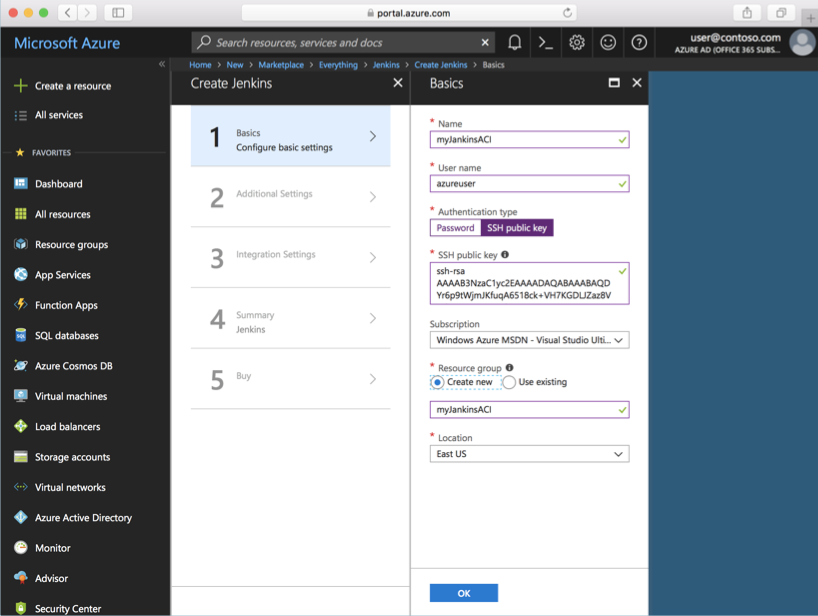

3. On the **Additional Settings** form, complete the following items:

   - **Size**: Select the appropriate sizing option for your Jenkins virtual machine.
   - **VM disk type**: Specify either **HDD** (hard-disk drive) or **SSD** (solid-state drive) for the Jenkins server.
   - **Virtual network**: Select the arrow if you want to modify the default settings.
   - **Subnets**: Select the arrow, verify the information, and select **OK**.
   - **Public IP address**: Select the arrow to give the public IP address a custom name, configure the SKU, and set the assignment method.
   - **Domain name label**: Specify a value to create a fully qualified URL to the Jenkins virtual machine.
   - **Jenkins release type**: Select the desired release type from the options: **LTS**, **Weekly build**, or **Azure Verified**.

   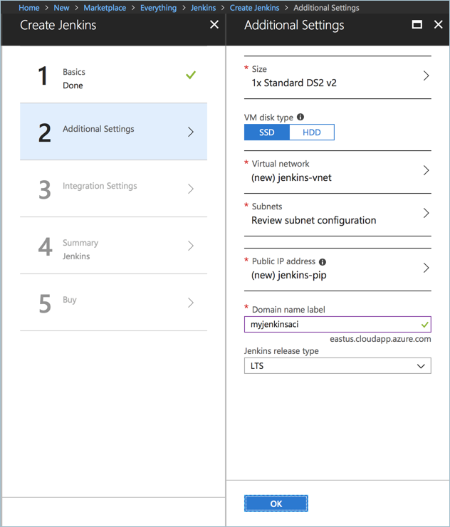

4. For service principal integration, select **Auto(MSI)** to have [managed identities for Azure resources][managed-identities-azure-resources] automatically create an authentication identity for the Jenkins instance. Select **Manual** to provide your own service principal credentials.

5. Cloud agents configure a cloud-based platform for Jenkins build jobs. For the sake of this article, select **ACI**. With the ACI cloud agent, each Jenkins build job is run in a container instance.

   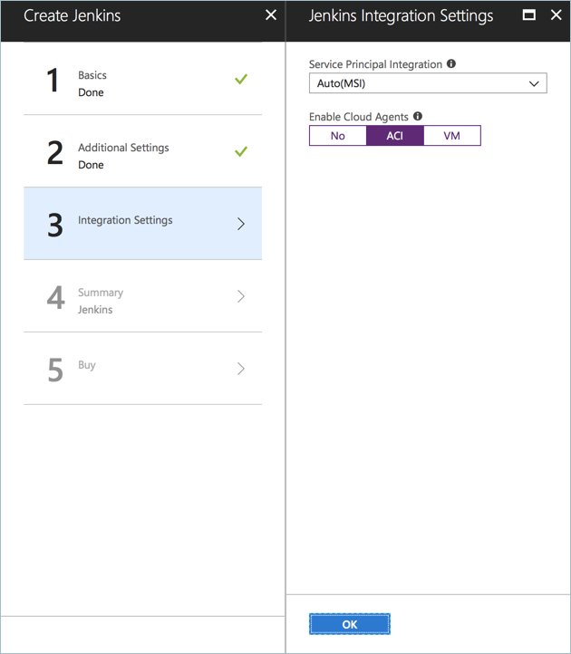

6. When you're done with the integration settings, select **OK**, and then select **OK** again on the validation summary. Select **Create** on the **Terms of use** summary. The Jenkins server takes a few minutes to deploy.

## Configure Jenkins

1. In the Azure portal, browse to the Jenkins resource group, select the Jenkins virtual machine, and take note of the DNS name.

   

2. Browse to the DNS name of the Jenkins VM and copy the returned SSH string.

   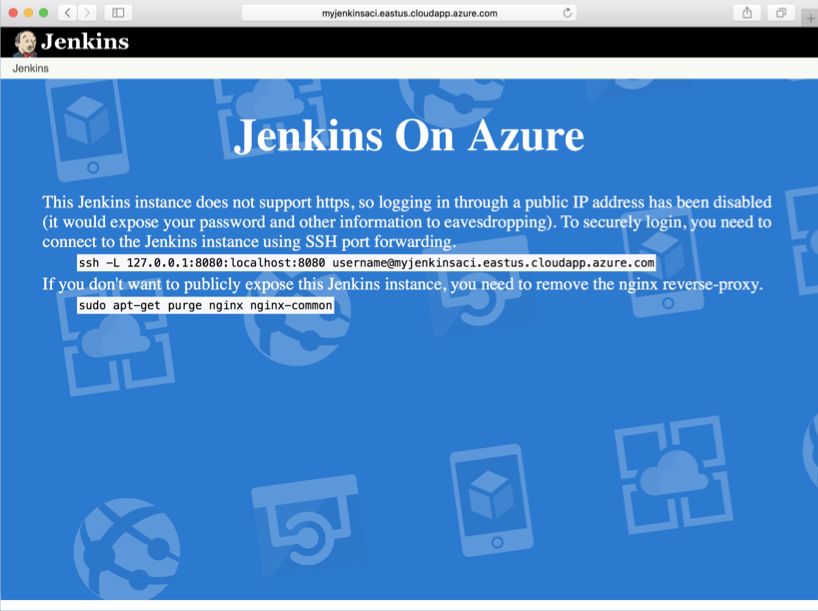

3. Open a terminal session on your development system, and paste in the SSH string from the last step. Update `username` to the username that you specified when you deployed the Jenkins server.

4. After the session is connected, run the following command to retrieve the initial admin password:

   ```
   sudo cat /var/lib/jenkins/secrets/initialAdminPassword
   ```

5. Leave the SSH session and tunnel running, and go to `http://localhost:8080` in a browser. Paste the initial admin password into the box, and then select **Continue**.

   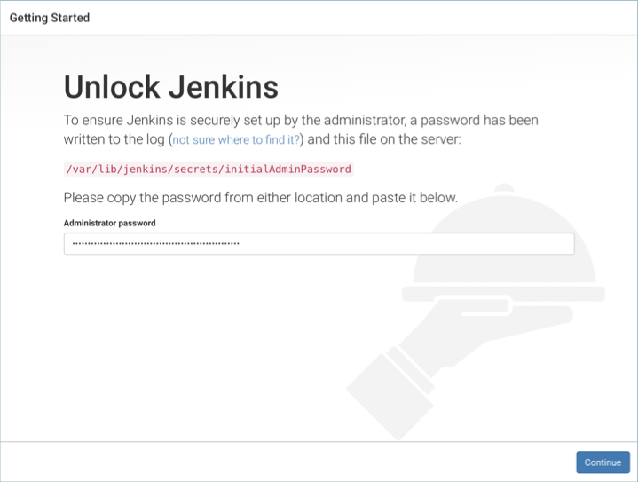

6. Select **Install suggested plugins** to install all recommended Jenkins plugins.

   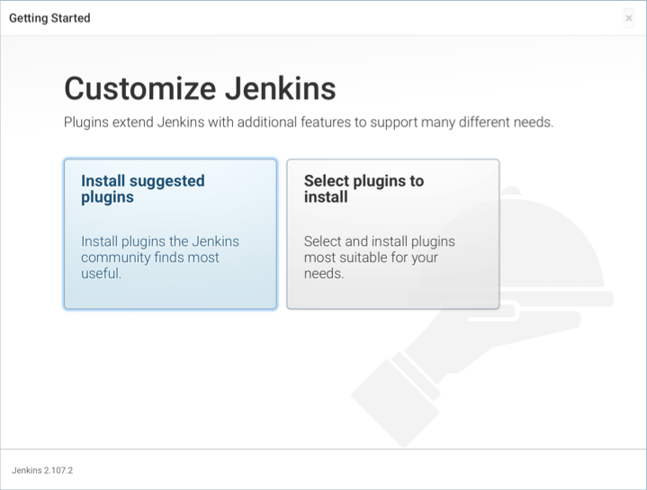

7. Create an admin user account. This account is used for logging in to and working with your Jenkins instance.

   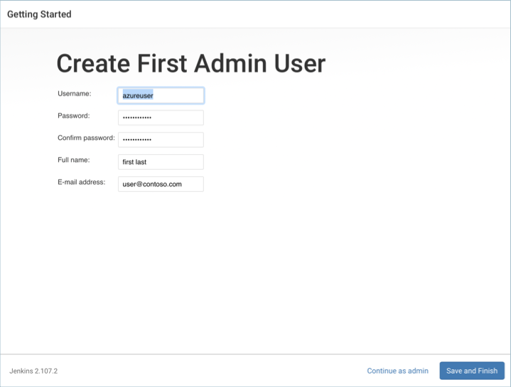

8. Select **Save and Finish**, and then select **Start using Jenkins** to complete the configuration.

Jenkins is now configured and ready to build and deploy code. For this example, a simple Java application is used to demonstrate a Jenkins build on Azure Container Instances.

## Create a build job

Now, a Jenkins build job is created to demonstrate Jenkins builds on an Azure container instance.

1. Select **New Item**, give the build project a name such as **aci-demo**, select **Freestyle project**, and select **OK**.

   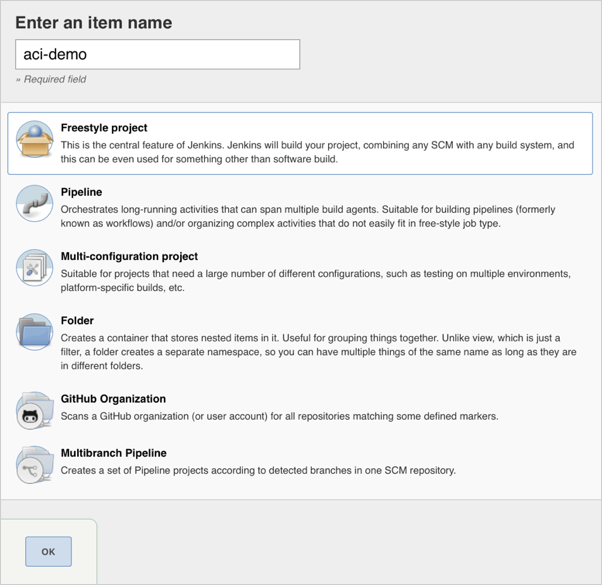

2. Under **General**, ensure that **Restrict where this project can be run** is selected. Enter **linux** for the label expression. This configuration ensures that this build job runs on the ACI cloud.

   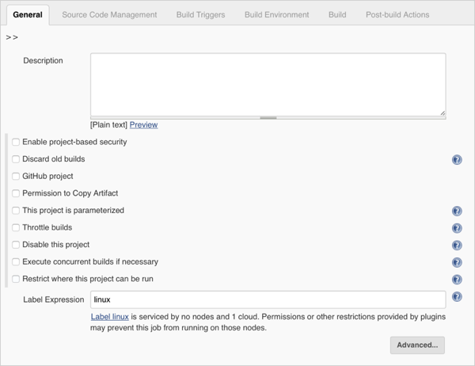

3. Under **Build**, select **Add build step** and select **Execute Shell**. Enter `echo "aci-demo"` as the command.

   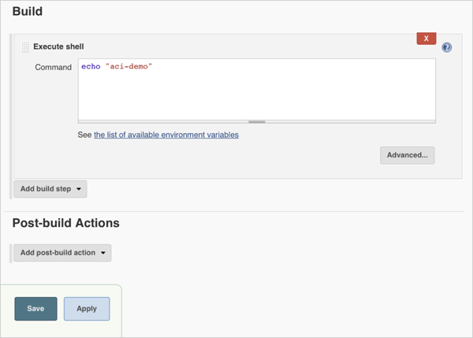

5. Select **Save**.

## Run the build job

To test the build job and observe Azure Container Instances as the build platform, manually start a build.

1. Select **Build Now** to start a build job. It takes a few minutes for the job to start. You should see a status that's similar to the following image:

   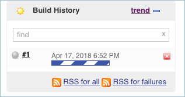

2. While the job is running, open the Azure portal and look at the Jenkins resource group. You should see that a container instance has been created. The Jenkins job is running inside this instance.

   

3. As Jenkins runs more jobs than the configured number of Jenkins executors (default 2), multiple container instances are created.

   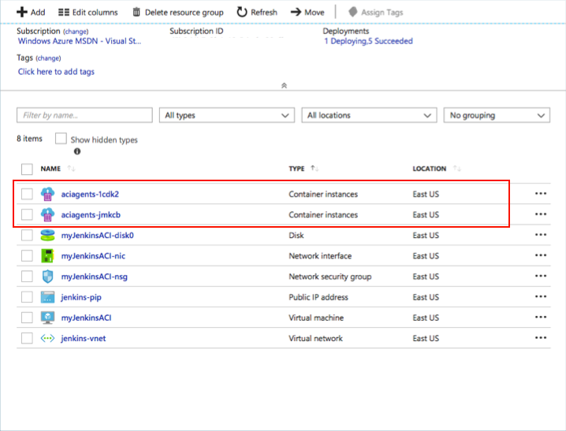

4. After all build jobs have finished, the container instances are removed.

   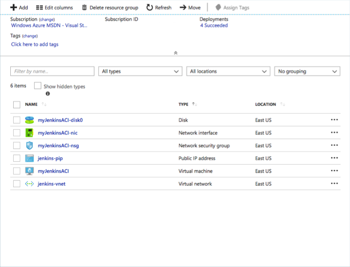

## Troubleshooting the Jenkins plugin

If you encounter any bugs with the Jenkins plugins, file an issue in the [Jenkins JIRA](https://issues.jenkins-ci.org/) for the specific component.

## Next steps

To learn more about Jenkins on Azure, see [Azure and Jenkins][jenkins-azure].

<!-- LINKS - internal -->
[about-aci]: ./container-instances-overview.md
[jenkins-azure]: ../jenkins/overview.md
[managed-identities-azure-resources]: ../active-directory/managed-identities-azure-resources/overview.md