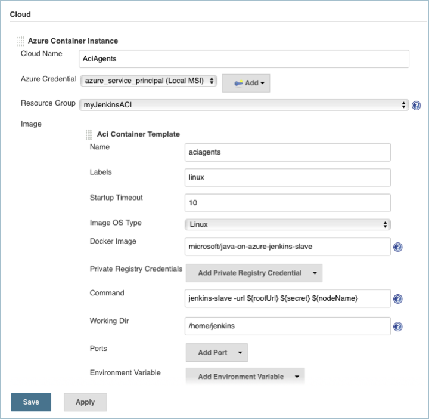
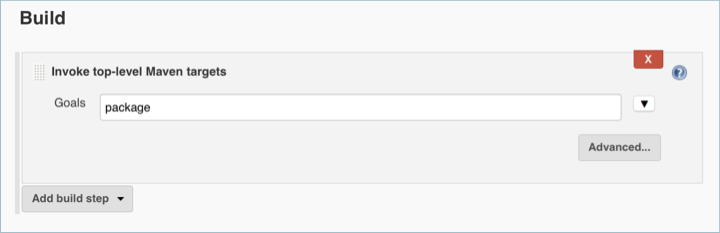

# Use Azure Container Instances as a Jenkins build server

Azure Container Instances provide an on-demand, burstable, and isolated environment for running containerized workload. Because of these attributes, Azure Container Instances make a great platform for running Jenkins build jobs at a large scale. This document walks through deploying and using a Jenkins server that is pre-configured with ACI as a build target.

For more information on Azure Container Instances, see [About Azure Container Instances][about-aci].

## Deploy Jenkins server

In the Azure portal, select **Create a resource** and search for **Jenkins**. Select the Jenkins offering with a publisher of **Microsoft** and select **Create**.

Enter the following information on the basics form and click **OK** when done.

- **Name** - name for the Jenkins deployment.
- **User name** - this user name is used as the admin user for the Jenkins virtual machine.
- **Authentication type** - SSH public key is recommended. If selected, copy in an SSH public key to be used when logging into the Jenkins virtual machine.
- **Subscription** - select an Azure subscription.
- **Resource group** - create a new or select an existing resource group.
- **Location** - select a location for the Jenkins server.


On the additional settings form, complete the following items:

- **Size** - Select the appropriate sizing option for your Jenkins virtual machine.
- **VM disk type** - Specify either HDD (hard-disk drive) or SSD (solid-state drive) for the Jenkins server.
- **Virtual network** - (Optional) Select Virtual network to modify the default settings.
- **Subnets** - Select Subnets, verify the information, and select **OK**.
- **Public IP address** - Selecting the Public IP address allows you to give it a custom name, configure SKU, and assignment method.
- **Domain name label** - Specify a value to create a fully qualified URL to the Jenkins virtual machine.
- **Jenkins release type** - Select the desired release type from the options: LTS, Weekly build, or Azure Verified.


For service principal integration, select **Auto(MSI)** to have [Azure Managed Service Identity][managed-service-identity] auto create an authentication identity for the Jenkins instance. Select Manual to provider your own service principal credentials.

Cloud agents configure a cloud based platform for Jenkins build jobs. For the sake of this document, select ACI. With the ACI cloud agent, each Jenkins build job is run in an Azure Container Instance.


Once done with the integration settings, click **OK**, and then **OK** again on the validation summary. Click **Create** on the Terms of use summary. The Jenkins server takes a few minutes to deploy.

## Configure Jenkins

In the Azure portal, browse to the Jenkins Resource Group, select the Jenkins virtual machine, and take note of the DNS name.


Browser to the DNS name of the Jenkins VM and copy the returned SSH string.


Open up a terminal session on your development system, and paste in the SSH string from the last step. Update 'username' to the username specified when deploying the Jenkins server.

Once connected, run the following command to retrieve the initial admin password.

```
sudo cat /var/lib/jenkins/secrets/initialAdminPassword
```

Leave the SSH session and tunnel running, and navigate to http://localhost:8080 in a browser. Paste the initial admin password into the field as seen below. Select **Continue** when done.


Select **Install suggested plugins** to install all recommended Jenkins plugins.


Create a new admin user account. This account is used for logging into and working with your Jenkins instance.


Select **Save and Finish** when done, and then **Start using Jenkins** to complete the configuration.

Jenkins is now configured and ready to build and deploy code. For this example, a simple Java application is used to demonstrate a Jenkins build on Azure Container Instances.

## Create build job

When using a container image as a Jenkins build target, you need to specify an image that includes all tooling necisary for a sucessful build. For the sake of this sample application, the `microsoft/java-on-azure-jenkins-slave` can be used.

To specify the image, select **Manage Jenkins** > **Configure System** > and scroll down to the **Cloud** section. Update the Docker image use the `microsoft/java-on-azure-jenkins-slave` image. Once done, click **Save** to return to the Jenkins dashboard.



Now create a Jenkins build job. Select **New Item**, give the build project a name such as `aci-java-demo`, select **Freestyle project**, and click **OK**.


Under **General**, ensure that **Restrict where this project can be run** is selected. Enter `linux` for the Label Expression. This configuration ensures that this build job runs on the ACI cloud.


Under source code management, select `git` and enter `https://github.com/spring-projects/spring-petclinic.git` for the repository URL. This GitHub repo contains the sample appliction code.


Under Build, select **add a build step** and select `Invoke top-level Maven targets`. Enter `package` as the build step goal.



Select **Save** when done.

## Run the build job

To test the build job and observe Azure Container Instances as the build platform, manually start a build.

Select **Build Now** to start a build job. When running, you should see status similar to the following image.


While the job is running, open up the Azure portal and look at the Jenkins resource group. You should see that an Azure Container Instance has been created. It is inside this instance that the Jenkins job is running.


As Jenkins runs ore jobs than the configured number of Jenkins executors (default 2), multiple Azure Container Instances are created.


Once all build jobs have been completed, the Azure Container Instances are removed.


## Next steps

To learn more about Jenkins on Azure see, [Azure and Jenkins][jenkins-azure]

<!-- LINKS - internal -->
[about-aci]: ./container-instances-overview.md
[jenkins-azure]: ../jenkins/overview.md
[managed-service-identity]: ../active-directory/managed-service-identity/overview.md