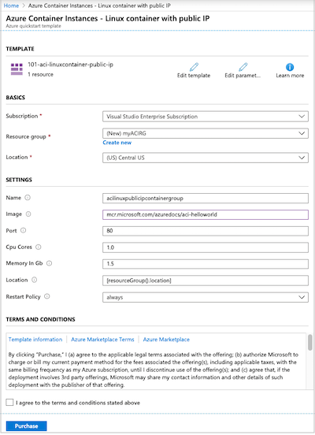
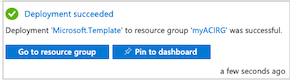
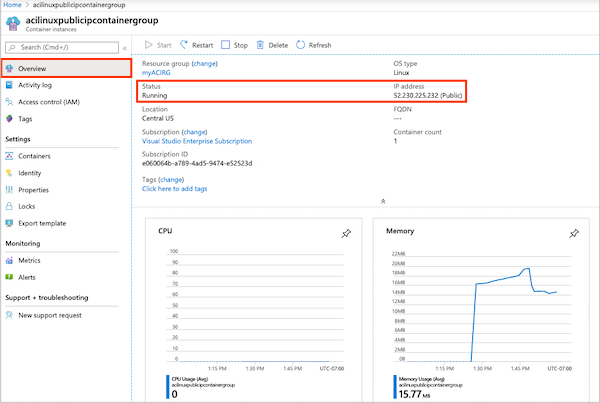

# Quickstart: Deploy a container instance in Azure using an ARM template

Use Azure Container Instances to run serverless Docker containers in Azure with simplicity and speed. Deploy an application to a container instance on-demand when you don't need a full container orchestration platform like Azure Kubernetes Service. In this quickstart, you use an Azure Resource Manager template (ARM template) to deploy an isolated Docker container and make its web application available with a public IP address.

[!INCLUDE [About Azure Resource Manager](../../includes/resource-manager-quickstart-introduction.md)]

If your environment meets the prerequisites and you're familiar with using ARM templates, select the **Deploy to Azure** button. The template will open in the Azure portal.

:::image type="content" source="~/reusable-content/ce-skilling/azure/media/template-deployments/deploy-to-azure-button.svg" alt-text="Button to deploy the Resource Manager template to Azure." border="false" link="https://portal.azure.com/#create/Microsoft.Template/uri/https%3A%2F%2Fraw.githubusercontent.com%2FAzure%2Fazure-quickstart-templates%2Fmaster%2Fquickstarts%2Fmicrosoft.containerinstance%2Faci-linuxcontainer-public-ip%2Fazuredeploy.json":::

## Prerequisites

If you don't have an Azure subscription, create a [free](https://azure.microsoft.com/free/) account before you begin.

## Review the template

The template used in this quickstart is from [Azure Quickstart Templates](https://azure.microsoft.com/resources/templates/aci-linuxcontainer-public-ip/).

:::code language="json" source="~/quickstart-templates/quickstarts/microsoft.containerinstance/aci-linuxcontainer-public-ip/azuredeploy.json":::

The following resource is defined in the template:

* **[Microsoft.ContainerInstance/containerGroups](/azure/templates/microsoft.containerinstance/containergroups)**: create an Azure container group. This template defines a group consisting of a single container instance.

More Azure Container Instances template samples can be found in the [quickstart template gallery](https://azure.microsoft.com/resources/templates/?resourceType=Microsoft.Containerinstance&pageNumber=1&sort=Popular).

## Deploy the template

 1. Select the following image to sign in to Azure and open a template. The template creates a registry and a replica in another location.

    :::image type="content" source="~/reusable-content/ce-skilling/azure/media/template-deployments/deploy-to-azure-button.svg" alt-text="Button to deploy the Resource Manager template to Azure." border="false" link="https://portal.azure.com/#create/Microsoft.Template/uri/https%3A%2F%2Fraw.githubusercontent.com%2FAzure%2Fazure-quickstart-templates%2Fmaster%2Fquickstarts%2Fmicrosoft.containerinstance%2Faci-linuxcontainer-public-ip%2Fazuredeploy.json":::

 2. Select or enter the following values.

    * **Subscription**: select an Azure subscription.
    * **Resource group**: select **Create new**, enter a unique name for the resource group, and then select **OK**.
    * **Location**: select a location for the resource group. Example: **Central US**.
    * **Name**: accept the generated name for the instance, or enter a name.
    * **Image**: accept the default image name. This sample Linux image packages a small web app written in Node.js that serves a static HTML page. 

    Accept default values for the remaining properties.

    Review the terms and conditions. If you agree, select **I agree to the terms and conditions stated above**.

    

 3. After the instance has been created successfully, you get a notification:

    

 The Azure portal is used to deploy the template. In addition to the Azure portal, you can use the Azure PowerShell, Azure CLI, and REST API. To learn other deployment methods, see [Deploy templates](../azure-resource-manager/templates/deploy-cli.md).

## Review deployed resources

Use the Azure portal or a tool such as the [Azure CLI](container-instances-quickstart.md) to review the properties of the container instance.

1. In the portal, search for Container Instances, and select the container instance you created.

1. On the **Overview** page, note the **Status** of the instance and its **IP address**.

    

2. Once its status is *Running*, navigate to the IP address in your browser. 

    

### View container logs

Viewing the logs for a container instance is helpful when troubleshooting issues with your container or the application it runs.

To view the container's logs, under **Settings**, select **Containers** > **Logs**. You should see the HTTP GET request generated when you viewed the application in your browser.

## Clean up resources

When you're done with the container, on the **Overview** page for the container instance, select **Delete**. When prompted, confirm the deletion.

## Next steps

In this quickstart, you created an Azure container instance from a public Microsoft image. If you'd like to build a container image and deploy it from a private Azure container registry, continue to the Azure Container Instances tutorial.

> [!div class="nextstepaction"]
> [Tutorial: Create a container image for deployment to Azure Container Instances](./container-instances-tutorial-prepare-app.md)

For a step-by-step tutorial that guides you through the process of creating a template, see:

> [!div class="nextstepaction"]
> [Tutorial: Create and deploy your first ARM template](../azure-resource-manager/templates/template-tutorial-create-first-template.md)
