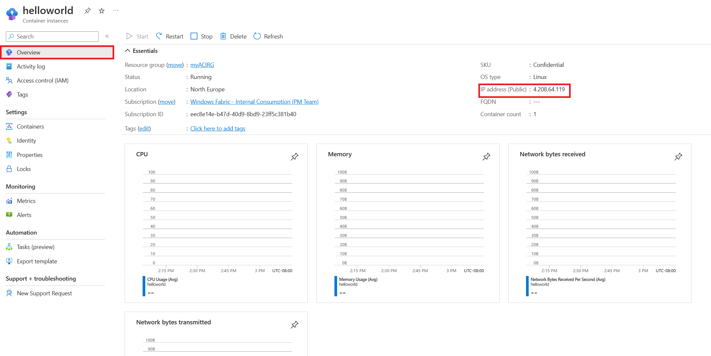

# Tutorial: Deploy a confidential container to Azure Container Instances via Azure portal

In this tutorial, you will use Azure portal to deploy a confidential container to Azure Container Instances with a development confidential computing enforcement policy. After deploying the container, you can browse to the running application. 

> [!NOTE]
> When deploying confidential containers on Azure Container Instances via Portal you will only be able to deploy with a development confidential computing enforcement policy. This policy is only recommended for development and test workloads. Logging,  and exec functionality are still available in the container group when using this policiy and software components are not validated. To full attest your container group while running production workloads, it is recommended that you deploy with a custom confidential computing enforcement policy via an Azure Resource Manager template. See [tutorial](./container-instances-tutorial-deploy-confidential-containers-cce-arm.md) for more details.

:::image type="content" source="media/container-instances-confidential-containers-tutorials/confidential-containers-aci-hello-world.png" alt-text="Screenshot of a hello-world application deployed via Azure portal, PNG.":::

## Sign in to Azure 

Sign in to the Azure portal at https://portal.azure.com

If you don't have an Azure subscription, create a [free account][azure-free-account] before you begin.

## Create a confidential container on Azure Container Instances 

On the Azure portal homepage, select **Create a resource**.

:::image type="content" source="media/container-instances-quickstart-portal/quickstart-portal-create-resource.png" alt-text="Screenshot showing how to begin creating a new container instance in the Azure portal.":::

Select **Containers** > **Container Instances**.

:::image type="content" source="media/container-instances-quickstart-portal/qs-portal-01.png" alt-text="Screenshot showing how to select a new container instance that you want to create in the Azure portal.":::

On the **Basics** page, choose a subscription and enter the following values for **Resource group**, **Container name**, **Image source**, and **Container image**.

* Resource group: **Create new** > `myresourcegroup`
* Container name: `helloworld`
* Region: One of `West Europe`/`North Europe`/`East US`
* SKU: `Confidential (development policy)`
* Image source: **Quickstart images**
* Container image: `mcr.microsoft.com/aci/aci-confidential-helloworld:v1` (Linux)

:::image type="content" source="media/container-instances-confidential-containers-tutorials/confidential-containers-aci-portal-sku.png" alt-text="Screenshot of the SKU selection of a container group, PNG.":::

> [!NOTE]
> When deploying confidential containers on Azure Container Instances via Portal you will only be able to deploy with a development confidential computing enforcement policy. This policy is only recommended for development and test workloads. Logging,  and exec functionality are still available in the container group when using this policiy and software components are not validated. To full attest your container group while running production workloads, it is recommended that you deploy with a custom confidential computing enforcement policy via an Azure Resource Manager template. See [tutorial](./container-instances-tutorial-deploy-confidential-containers-cce-arm.md) for more details.

Leave all other settings as their defaults, then select **Review + create**.

When the validation completes, you're shown a summary of the container's settings. Select **Create** to submit your container deployment request.

:::image type="content" source="media/container-instances-confidential-containers-tutorials/confidential-containers-aci-portal-review.png" alt-text="Screenshot of all the properties in the container group on a review page, PNG.":::

When deployment starts, a notification appears that indicates the deployment is in progress. Another notification is displayed when the container group has been deployed.

Open the overview for the container group by navigating to **Resource Groups** > **myACIRG** > **helloworld**. Make a note of the **IP** of the container instance and its **Status**.

1. On the **Overview** page, note the **Status** of the instance and its **IP address**.

    

2. Once its status is *Running*, navigate to the IP address in your browser. 

    :::image type="content" source="media/container-instances-confidential-containers-tutorials/confidential-containers-aci-hello-world.png" alt-text="Screenshot of the hello world application running, PNG.":::

    The presence of the attestation report below the Azure Container Instances logo confirms that the container is running on hardware that supports a hardware-based and attested trusted execution environment (TEE).
    If you deploy to hardware that does not support a TEE, for example by choosing a region where the [ACI Confidential SKU is not available](./container-instances-region-availability.md#linux-container-groups), no attestation report will be shown.

Congratulations! You have deployed a confidential container on Azure Container Instances which is displaying a hardware attestation report in your browser. 

## Clean up resources

When you're done with the container, select **Overview** for the *helloworld* container instance, then select **Delete**.

## Next steps

In this tutorial, you created a confidential container on Azure Container instances with a development confidential computing enforcement policy. If you would like to deploy a confidential container group with a custom computing enforcement policy continue to the confidential containers on Azure Container Instances - deploy with Azure Resource Manager template tutorial. 

* [Azure Container Instances Azure Resource Manager template tutorial](./container-instances-tutorial-deploy-confidential-containers-cce-arm.md)
* [Confidential computing enforcement policies overview](./container-instances-confidential-overview.md)
* [Azure CLI confcom extension examples](https://github.com/Azure/azure-cli-extensions/blob/main/src/confcom/azext_confcom/README.md)
* [Confidential Hello World application](https://aka.ms/ccacihelloworld)

<!-- LINKS - External -->
[azure-free-account]: https://azure.microsoft.com/free/
