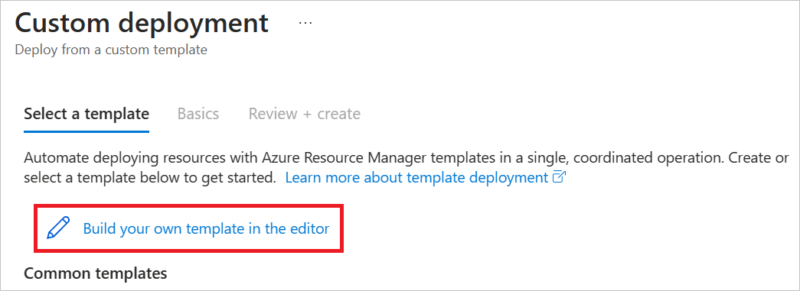
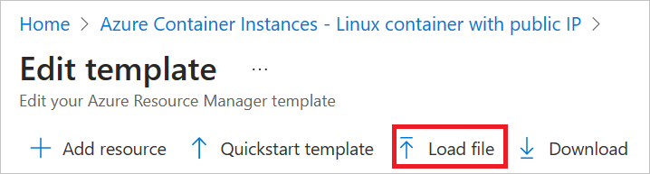
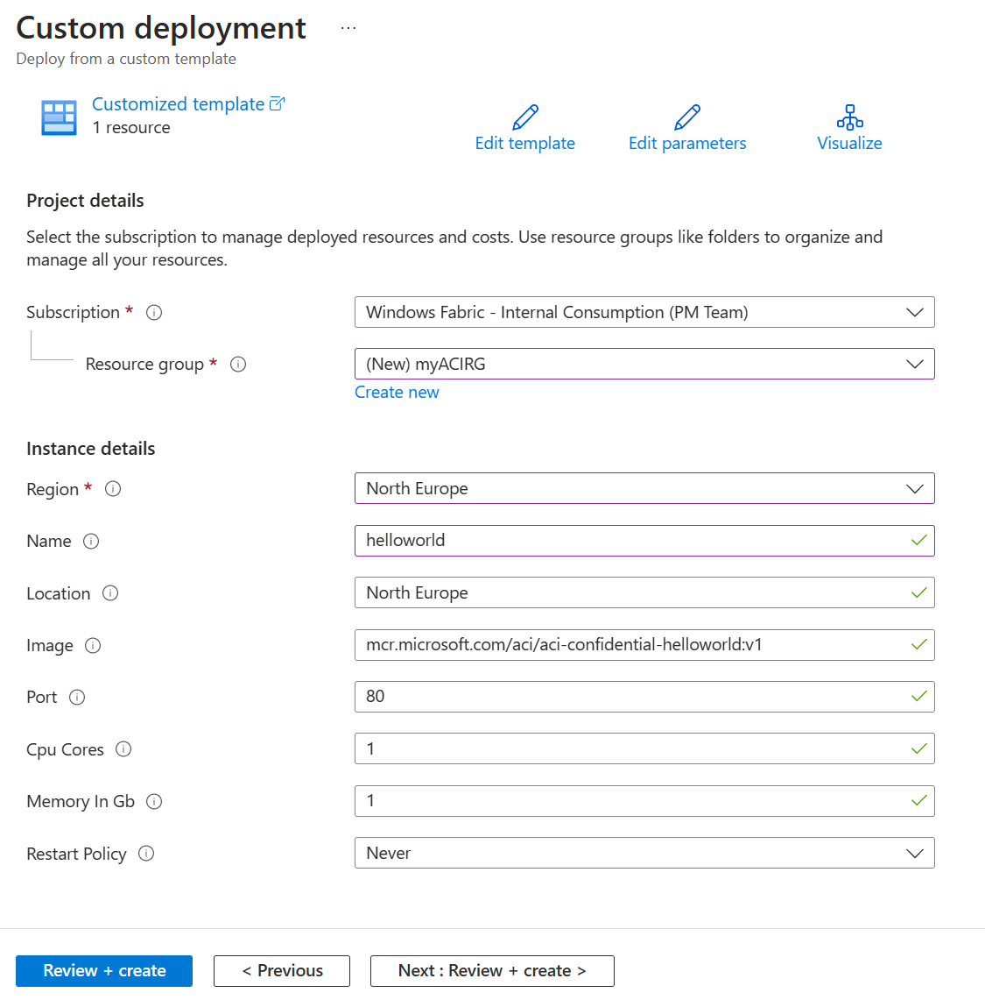
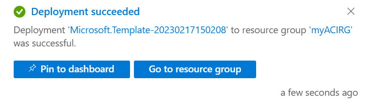
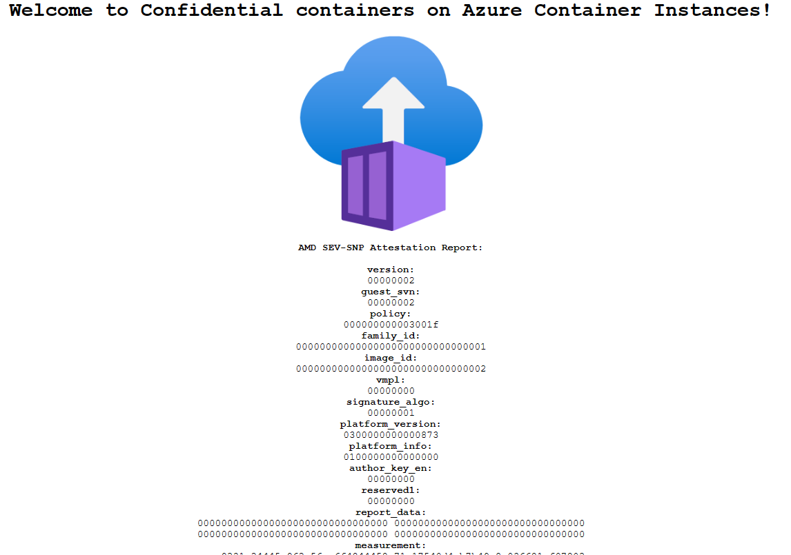

# Tutorial: Prepare a deployment for a confidential container on Azure Container Instances

In Azure Container Instances, you can use confidential containers on the serverless platform to run container applications in a hardware-based and attested trusted execution environment (TEE). This capability can help protect data in use and provides in-memory encryption via Secure Nested Paging.

In this tutorial, you learn how to:

> [!div class="checklist"]
>
> * Create an Azure Resource Manager template (ARM template) for a confidential container group.
> * Generate a confidential computing enforcement (CCE) policy.
> * Deploy the confidential container group to Azure.

## Prerequisites

[!INCLUDE [container-instances-tutorial-prerequisites-confidential-containers](../../includes/container-instances-tutorial-prerequisites-confidential-containers.md)]

## Create an ARM template for a Container Instances container group

In this tutorial, you deploy a Hello World application that generates a hardware attestation report. You start by creating an ARM template with a container group resource to define the properties of this application. You then use this ARM template with the Azure CLI confcom tooling to generate a CCE policy for attestation.

This tutorial uses [this ARM template](https://raw.githubusercontent.com/Azure-Samples/aci-confidential-hello-world/main/template.json?token=GHSAT0AAAAAAB5B6SJ7VUYU3G6MMQUL7KKKY7QBZBA) as an example. To view the source code for this application, see [Azure Container Instances Confidential Hello World](https://aka.ms/ccacihelloworld).

The example template adds two properties to the Container Instances resource definition to make the container group confidential:

* `sku`: Enables you to select between confidential and standard container group deployments. If you don't add this property to the resource, the container group will be a standard deployment.
* `confidentialComputeProperties`: Enables you to pass in a custom CCE policy for attestation of your container group. If you don't add this object to the resource, the software components that run within the container group won't be validated.

> [!NOTE]
> The `ccePolicy` parameter under `confidentialComputeProperties` is blank. You'll fill it in after you generate the policy later in the tutorial.

Use your preferred text editor to save this ARM template on your local machine as *template.json*.

```ARM
{
    "$schema": "https://schema.management.azure.com/schemas/2019-04-01/deploymentTemplate.json#",
    "contentVersion": "1.0.0.0",
    "parameters": {
      "name": {
        "type": "string",
        "defaultValue": "helloworld",
        "metadata": {
          "description": "Name for the container group"
        }
      },
      "location": {
        "type": "string",
        "defaultValue": "North Europe",
        "metadata": {
          "description": "Location for all resources."
        }
      },
      "image": {
        "type": "string",
        "defaultValue": "mcr.microsoft.com/aci/aci-confidential-helloworld:v1",
        "metadata": {
          "description": "Container image to deploy. Should be of the form repoName/imagename:tag for images stored in public Docker Hub, or a fully qualified URI for other registries. Images from private registries require additional registry credentials."
        }
      },
      "port": {
        "type": "int",
        "defaultValue": 80,
        "metadata": {
          "description": "Port to open on the container and the public IP address."
        }
      },
      "cpuCores": {
        "type": "int",
        "defaultValue": 1,
        "metadata": {
          "description": "The number of CPU cores to allocate to the container."
        }
      },
      "memoryInGb": {
        "type": "int",
        "defaultValue": 1,
        "metadata": {
          "description": "The amount of memory to allocate to the container in gigabytes."
        }
      },
      "restartPolicy": {
        "type": "string",
        "defaultValue": "Never",
        "allowedValues": [
          "Always",
          "Never",
          "OnFailure"
        ],
        "metadata": {
          "description": "The behavior of Azure runtime if container has stopped."
        }
      }
    },
    "resources": [
      {
        "type": "Microsoft.ContainerInstance/containerGroups",
        "apiVersion": "2023-05-01",
        "name": "[parameters('name')]",
        "location": "[parameters('location')]",
        "properties": {
          "confidentialComputeProperties": {
            "ccePolicy": ""
          },
          "containers": [
            {
              "name": "[parameters('name')]",
              "properties": {
                "image": "[parameters('image')]",
                "ports": [
                  {
                    "port": "[parameters('port')]",
                    "protocol": "TCP"
                  }
                ],
                "resources": {
                  "requests": {
                    "cpu": "[parameters('cpuCores')]",
                    "memoryInGB": "[parameters('memoryInGb')]"
                  }
                }
              }
            }
          ],
          "sku": "Confidential",
          "osType": "Linux",
          "restartPolicy": "[parameters('restartPolicy')]",
          "ipAddress": {
            "type": "Public",
            "ports": [
              {
                "port": "[parameters('port')]",
                "protocol": "TCP"
              }
            ]
          }
        }
      }
    ],
    "outputs": {
      "containerIPv4Address": {
        "type": "string",
        "value": "[reference(resourceId('Microsoft.ContainerInstance/containerGroups', parameters('name'))).ipAddress.ip]"
      }
    }
  }
```

## Create a custom CCE policy

With the ARM template that you crafted and the Azure CLI confcom extension, you can generate a custom CCE policy. The CCE policy is used for attestation. The tool takes the ARM template as an input to generate the policy. The policy enforces the specific container images, environment variables, mounts, and commands, which can then be validated when the container group starts up. For more information on the Azure CLI confcom extension, see the [documentation on GitHub](https://github.com/Azure/azure-cli-extensions/blob/main/src/confcom/azext_confcom/README.md).

1. To generate the CCE policy, run the following command by using the ARM template as input:

   ```azurecli-interactive
   az confcom acipolicygen -a .\template.json --print-policy
   ```

   When this command finishes, a Base64 string generated as output should appear in the following format. This string is the CCE policy that you copy and paste into your ARM template as the value of the `ccePolicy` property.

   ```output
   cGFja2FnZSBwb2xpY3kKCmFwaV9zdm4gOj0gIjAuOS4wIgoKaW1wb3J0IGZ1dHVyZS5rZXl3b3Jkcy5ldmVyeQppbXBvcnQgZnV0dXJlLmtleXdvcmRzLmluCgpmcmFnbWVudHMgOj0gWwpdCgpjb250YWluZXJzIDo9IFsKICAgIHsKICAgICAgICAiY29tbWFuZCI6IFsiL3BhdXNlIl0sCiAgICAgICAgImVudl9ydWxlcyI6IFt7InBhdHRlcm4iOiAiUEFUSD0vdXNyL2xvY2FsL3NiaW46L3Vzci9sb2NhbC9iaW46L3Vzci9zYmluOi91c3IvYmluOi9zYmluOi9iaW4iLCAic3RyYXRlZ3kiOiAic3RyaW5nIiwgInJlcXVpcmVkIjogdHJ1ZX0seyJwYXR0ZXJuIjogIlRFUk09eHRlcm0iLCAic3RyYXRlZ3kiOiAic3RyaW5nIiwgInJlcXVpcmVkIjogZmFsc2V9XSwKICAgICAgICAibGF5ZXJzIjogWyIxNmI1MTQwNTdhMDZhZDY2NWY5MmMwMjg2M2FjYTA3NGZkNTk3NmM3NTVkMjZiZmYxNjM2NTI5OTE2OWU4NDE1Il0sCiAgICAgICAgIm1vdW50cyI6IFtdLAogICAgICAgICJleGVjX3Byb2Nlc3NlcyI6IFtdLAogICAgICAgICJzaWduYWxzIjogW10sCiAgICAgICAgImFsbG93X2VsZXZhdGVkIjogZmFsc2UsCiAgICAgICAgIndvcmtpbmdfZGlyIjogIi8iCiAgICB9LApdCmFsbG93X3Byb3BlcnRpZXNfYWNjZXNzIDo9IHRydWUKYWxsb3dfZHVtcF9zdGFja3MgOj0gdHJ1ZQphbGxvd19ydW50aW1lX2xvZ2dpbmcgOj0gdHJ1ZQphbGxvd19lbnZpcm9ubWVudF92YXJpYWJsZV9kcm9wcGluZyA6PSB0cnVlCmFsbG93X3VuZW5jcnlwdGVkX3NjcmF0Y2ggOj0gdHJ1ZQoKCm1vdW50X2RldmljZSA6PSB7ICJhbGxvd2VkIiA6IHRydWUgfQp1bm1vdW50X2RldmljZSA6PSB7ICJhbGxvd2VkIiA6IHRydWUgfQptb3VudF9vdmVybGF5IDo9IHsgImFsbG93ZWQiIDogdHJ1ZSB9CnVubW91bnRfb3ZlcmxheSA6PSB7ICJhbGxvd2VkIiA6IHRydWUgfQpjcmVhdGVfY29udGFpbmVyIDo9IHsgImFsbG93ZWQiIDogdHJ1ZSB9CmV4ZWNfaW5fY29udGFpbmVyIDo9IHsgImFsbG93ZWQiIDogdHJ1ZSB9CmV4ZWNfZXh0ZXJuYWwgOj0geyAiYWxsb3dlZCIgOiB0cnVlIH0Kc2h1dGRvd25fY29udGFpbmVyIDo9IHsgImFsbG93ZWQiIDogdHJ1ZSB9CnNpZ25hbF9jb250YWluZXJfcHJvY2VzcyA6PSB7ICJhbGxvd2VkIiA6IHRydWUgfQpwbGFuOV9tb3VudCA6PSB7ICJhbGxvd2VkIiA6IHRydWUgfQpwbGFuOV91bm1vdW50IDo9IHsgImFsbG93ZWQiIDogdHJ1ZSB9CmdldF9wcm9wZXJ0aWVzIDo9IHsgImFsbG93ZWQiIDogdHJ1ZSB9CmR1bXBfc3RhY2tzIDo9IHsgImFsbG93ZWQiIDogdHJ1ZSB9CnJ1bnRpbWVfbG9nZ2luZyA6PSB7ICJhbGxvd2VkIiA6IHRydWUgfQpsb2FkX2ZyYWdtZW50IDo9IHsgImFsbG93ZWQiIDogdHJ1ZSB9CnNjcmF0Y2hfbW91bnQgOj0geyAiYWxsb3dlZCIgOiB0cnVlIH0Kc2NyYXRjaF91bm1vdW50IDo9IHsgImFsbG93ZWQiIDogdHJ1ZSB9CnJlYXNvbiA6PSB7ImVycm9ycyI6IGRhdGEuZnJhbWV3b3JrLmVycm9yc30K
   ```

2. Save the changes to your local copy of the ARM template.

## Deploy the template

In the following steps, you use the Azure portal to deploy the template. You can also use Azure PowerShell, the Azure CLI, or the REST API. To learn about other deployment methods, see [Deploy templates](../azure-resource-manager/templates/deploy-cli.md).

1. Select the **Deploy to Azure** button to sign in to Azure and begin a Container Instances deployment.

   :::image type="content" source="~/reusable-content/ce-skilling/azure/media/template-deployments/deploy-to-azure-button.svg" alt-text="Button to deploy the Resource Manager template to Azure." border="false" link="https://ms.portal.azure.com/#create/Microsoft.Template":::

1. Select **Build your own template in the editor**.

   

   The template JSON that appears is mostly blank.

1. Select **Load file** and upload *template.json*, which you modified by adding the CCE policy in the previous steps.

   

1. Select **Save**.

1. Select or enter the following values:

   * **Subscription**: Select an Azure subscription.
   * **Resource group**: Select **Create new**, enter a unique name for the resource group, and then select **OK**.
   * **Name**: Accept the generated name for the instance, or enter a name.
   * **Location**: Select a location for the resource group. Choose a region where [confidential containers are supported](./container-instances-region-availability.md#linux-container-groups). Example: **North Europe**.
   * **Image**: Accept the default image name. This sample Linux image displays a hardware attestation.

   Accept default values for the remaining properties, and then select **Review + create**.

   

1. Review the terms and conditions. If you agree, select **I agree to the terms and conditions stated above**.

1. Wait until the **Deployment succeeded** notification appears. It confirms that you successfully created the instance.

   

## Review deployed resources

In the following steps, you use the Azure portal to review the properties of the container instance. You can also use a tool such as the [Azure CLI](container-instances-quickstart.md).

1. In the portal, search for **Container Instances**, and then select the container instance that you created.

2. On the **Overview** page, note the status of the instance and its IP address.

    

3. When the status of the instance is **Running**, go to the IP address in your browser.

    

    The presence of the attestation report below the Azure Container Instances logo confirms that the container is running on hardware that supports a TEE.

    If you deploy to hardware that doesn't support a TEE (for example, by choosing a region where Container Instances Confidential isn't available), no attestation report appears.

## Related content

Now that you've deployed a confidential container group on Container Instances, you can learn more about how policies are enforced:

* [Confidential containers on Azure Container Instances](./container-instances-confidential-overview.md)
* [Azure CLI confcom extension examples](https://github.com/Azure/azure-cli-extensions/blob/main/src/confcom/azext_confcom/README.md)
* [Confidential Hello World application](https://aka.ms/ccacihelloworld)
