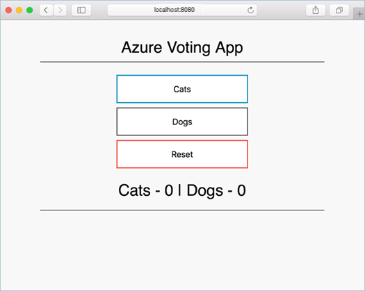

# Tutorial: Deploy a multi-container group using Docker Compose 

Azure Container Instances enables deployment of Docker containers onto Azure infrastructure without provisioning any virtual machines or adopting a higher-level service. In this tutorial, you use [Docker Compose](https://docs.docker.com/compose/) to define and run a multi-container application locally and then deploy it as a container group in Azure Container Instances. 

Deploy to Azure Container Instances on-demand when you develop cloud-native apps and you want to switch seamlessly from local development to cloud deployment. This capability is enabled by [integration between Docker and Azure](https://docs.docker.com/engine/context/aci-integration/) (beta). 

> [!IMPORTANT]
> This feature is currently in preview, and requires beta (preview) features in Docker. Read more about [Stable and Edge versions of Docker Desktop](https://docs.docker.com/desktop/#stable-and-edge-versions). Not all features of Azure Container Instances are supported. Provide feedback about the Docker-Azure integration by creating an issue in the [aci-integration-beta](https://github.com/docker/aci-integration-beta) GitHub repository.


In this article, you:

> [!div class="checklist"]
> * Create an Azure container registry
> * Clone application source code from GitHub
> * Use Docker Compose to run and build a multi-container application locally
> * Push the application image to your container registry
> * Create an Azure context for Docker
> * Bring the application up in Azure Container Instances

## Prerequisites

* **Azure CLI** - You must have the Azure CLI installed on your local computer. Version 2.10.1 or later is recommended. Run `az --version` to find the version. If you need to install or upgrade, see [Install the Azure CLI](/cli/azure/install-azure-cli).

* **Docker Desktop Edge version 2.3.2.0 or later** - Installation packages are available for [Windows](https://desktop.docker.com/win/edge/Docker%20Desktop%20Installer.exe) or [macOS](https://desktop.docker.com/mac/edge/Docker.dmg). Or install the [Docker ACI Integration CLI for Linux](https://docs.docker.com/engine/context/aci-integration/#install-the-docker-aci-integration-cli-on-linux) (beta). 

[!INCLUDE [container-instances-create-registry](../../includes/container-instances-create-registry.md)]

## Get application code

The sample application used in this tutorial is a basic voting app. The application consists of a front-end web component and a back-end Redis instance. The web component is packaged into a custom container image. The Redis instance uses an unmodified image from Docker Hub.

Use [git](https://git-scm.com/downloads) to clone the sample application to your development environment:

```console
git clone https://github.com/Azure-Samples/azure-voting-app-redis.git
```

Change into the cloned directory.

```console
cd azure-voting-app-redis
```

Inside the directory is the application source code and a pre-created Docker compose file, docker-compose.yaml.

## Modify Docker compose file

Open docker-compose.yaml in a text editor. Note the configuration of the `azure-vote-back` and `azure-vote-front` services.

```yml
version: '3'
services:
  azure-vote-back:
    image: redis
    container_name: azure-vote-back
    ports:
        - "6379:6379"

  azure-vote-front:
    build: ./azure-vote
    image: azure-vote-front
    container_name: azure-vote-front
    environment:
      REDIS: azure-vote-back
    ports:
        - "8080:80"
```

In the `azure-vote-front` configuration, update the image property `azure-vote-front`:

```yml
[...]
  azure-vote-front:
    build: ./azure-vote
    image: azure-vote-front
[...]
```

Insert the login server name of your Azure container registry, <acrName>.azurecr.io. For example, if your registry is named *myregistry*, the login server name is *myregistry.azurecr.io*:

```yml
[...]
  azure-vote-front:
    build: ./azure-vote
    image: myregistry.azurecr.io/azure-vote-front
[...]
```

By making this substitution, the `azure-vote-front` image you build in the next ste will be tagged for your Azure container registry.

## Run multi-container application locally

Run [docker-compose up](https://docs.docker.com/compose/reference/up/), which uses the sample `docker-compose.yaml` file to build the container image, download the Redis image, and start the application:

```console
docker-compose up --build -d
```

When completed, use the [docker images](https://docs.docker.com/engine/reference/commandline/images/) command to see the created images. Three images have been downloaded or created. The `azure-vote-front` image contains the front-end application and uses the `nginx-flask` image as a base. The `redis` image is used to start a Redis instance.

```
$ docker images

REPOSITORY                                TAG        IMAGE ID            CREATED             SIZE
myregistry.azurecr.io/azure-vote-front    latest     9cc914e25834        40 seconds ago      944MB
redis                                     latest     a1b99da73d05        7 days ago          104MB
tiangolo/uwsgi-nginx-flask                python3.6  788ca94b2313        9 months ago        9444MB
```

Run the [docker ps](https://docs.docker.com/engine/reference/commandline/ps/) command to see the running containers:

```
$ docker ps

CONTAINER ID        IMAGE                                   COMMAND                  CREATED             STATUS              PORTS                           NAMES
82411933e8f9        myregistry.azurecr.io/azure-vote-front  "/entrypoint.sh /sta…"   57 seconds ago      Up 30 seconds       443/tcp, 0.0.0.0:8080->80/tcp   azure-vote-front
b68fed4b66b6        redis                                   "docker-entrypoint.s…"   57 seconds ago      Up 30 seconds       0.0.0.0:6379->6379/tcp          azure-vote-back
```

To see the running application, enter `http://localhost:8080` in a local web browser. The sample application loads, as shown in the following example:



After trying the local applicaion, run [docker-compose down](https://docs.docker.com/compose/reference/down/) to stop the application and remove the containers.

## Run the application locally

Before you deploy the container to Azure Container Instances, use [docker run][docker-run] to run it locally and confirm that it works. The `-d` switch lets the container run in the background, while `-p` allows you to map an arbitrary port on your computer to port 80 in the container.

```bash
docker run -d -p 8080:80 aci-tutorial-app
```

Output from the `docker run` command displays the running container's ID if the command was successful:

```console
$ docker run -d -p 8080:80 aci-tutorial-app
a2e3e4435db58ab0c664ce521854c2e1a1bda88c9cf2fcff46aedf48df86cccf
```

Now, navigate to `http://localhost:8080` in your browser to confirm that the container is running. You should see a web page similar to the following:

![Running the app locally in the browser][aci-tutorial-app-local]

[!INCLUDE [container-instances-create-docker-context](../../includes/container-instances-create-docker-context.md)]

## Next steps

In this tutorial, you created a container image that can be deployed in Azure Container Instances, and verified that it runs locally. So far, you've done the following:

> [!div class="checklist"]
> * Cloned the application source from GitHub
> * Created a container image from the application source
> * Tested the container locally

Advance to the next tutorial in the series to learn about storing your container image in Azure Container Registry:

> [!div class="nextstepaction"]
> [Push image to Azure Container Registry](container-instances-tutorial-prepare-acr.md)

<!--- IMAGES --->
[aci-tutorial-app]:./media/container-instances-quickstart/aci-app-browser.png
[aci-tutorial-app-local]: ./media/container-instances-tutorial-prepare-app/aci-app-browser-local.png

<!-- LINKS - External -->
[aci-helloworld-zip]: https://github.com/Azure-Samples/aci-helloworld/archive/master.zip
[alpine-linux]: https://alpinelinux.org/
[docker-build]: https://docs.docker.com/engine/reference/commandline/build/
[docker-get-started]: https://docs.docker.com/get-started/
[docker-hub-nodeimage]: https://store.docker.com/images/node
[docker-images]: https://docs.docker.com/engine/reference/commandline/images/
[docker-linux]: https://docs.docker.com/engine/installation/#supported-platforms
[docker-login]: https://docs.docker.com/engine/reference/commandline/login/
[docker-mac]: https://docs.docker.com/docker-for-mac/
[docker-push]: https://docs.docker.com/engine/reference/commandline/push/
[docker-run]: https://docs.docker.com/engine/reference/commandline/run/
[docker-tag]: https://docs.docker.com/engine/reference/commandline/tag/
[docker-windows]: https://docs.docker.com/docker-for-windows/
[nodejs]: https://nodejs.org

<!-- LINKS - Internal -->
[azure-cli-install]: /cli/azure/install-azure-cli
