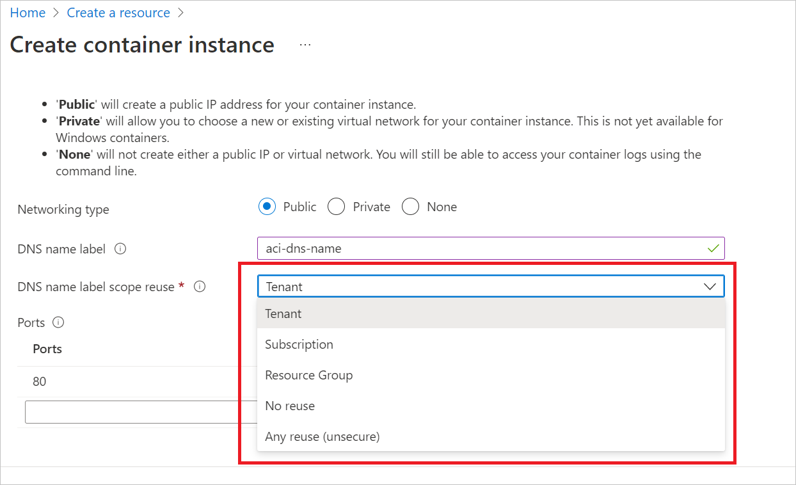

# Deploy an Azure Container Instances (ACI) container group with DNS name reuse policy (preview)

DNS name reuse is convenient for DevOps within any modern company. The idea of redeploying an application by reusing the DNS name fulfills an on-demand philosophy that secures cloud development. Therefore, it's important to note that DNS names that are available to anyone become a problem when one customer releases a name only to have that same name taken by another customer. This is called subdomain takeover. A customer releases a resource using a particular name, and another customer creates a new resource with that same DNS name. If there were any records pointing to the old resource, they now also point to the new resource.

In order to avoid this, ACI will now allow customers to reuse DNS names while preventing DNS names from being reused by different customers. ACI secures DNS names by randomly generating a hash value to associate with the DNS name, making it difficult for another customer to accidentally create an ACI with the same name and get linked to the past customer's ACI information.

> [!IMPORTANT]
> DNS name reuse policy support is only available on ACI API version `10-01-2021` or later.

## Prerequisites

* An **active Azure subscription**. If you don't have an active Azure subscription, create a [free account](https://azure.microsoft.com/free) before you begin.

* A **resource group** to manage all the resources you use in this how-to guide. We use the example resource group name **ACIResourceGroup** throughout this article.

   ```azurecli-interactive
   az group create --name ACIResourceGroup --location westus

## Understand the DNS name reuse policy

You now have the choice when creating an ACI to choose what level of reuse you want your DNS name label to have.

| Policy name | Policy definition |
| - | - |
| unsecure | Hash will not be generated. Object's domain label can't be reused within resource group, subscription, or tenant. |
| tenantReuse | **Default** Hash will be generated based on the DNS name and the tenant ID. Object's domain name label can be reused within the same tenant. |
| subscriptionReuse | Hash will be generated based on the DNS name and the tenant ID and subscription ID. Object's domain name label can be reused within the same subscription. |
| resourceGroupReuse | Hash will be generated based on the DNS name and the tenant ID, subscription ID, and resource group name. Object's domain name label can be reused within the same resource group. |
| noReuse | Hash will be generated using a GUID. Object's domain label can be reused freely, as this hash will always be unique. |

## Create a container instance

> [!IMPORTANT]
> Setting the DNS name reuse policy is not currently supported through the Azure CLI .

The process for deploying your container instance remains same. If you want the full process of how to deploy a container instance, see the quickstart featuring your preferred deployment method. For example, the [ARM template quickstart](container-instances-quickstart-template.md).

For [Azure portal](https://portal.azure.com) users, you can set the DNS name reuse policy on the **Networking** tab during the container instance creation process using the **DNS name label scope reuse** field.



For ARM template users, see the [Resource Manager reference](/azure/templates/microsoft.containerinstance/containergroups) to see how the dnsNameLabelReusePolicy field fits into the existing schema.

For YAML template users, see the [YAML reference](container-instances-reference-yaml.md) to see how the dnsNameLabelReusePolicy field fits into the existing schema.

## Next steps

See the Azure Quickstart Template [Create an Azure container group with VNet](https://github.com/Azure/azure-quickstart-templates/tree/master/quickstarts/microsoft.containerinstance/aci-vnet), to deploy a container group within a virtual network.
