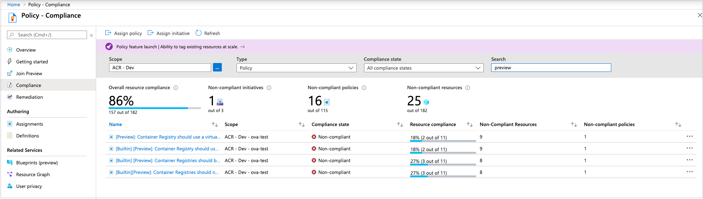

# Audit compliance of Azure container registries using Azure Policy

[Azure Policy](../governance/policy/overview.md) is a service in Azure that you use to create, assign, and manage policies. These policies enforce different rules and effects over your resources, so those resources stay compliant with your corporate standards and service level agreements.

This article introduces built-in policies for Azure Container Registry. Use these policies to audit new and existing registries for compliance.

There are no charges for using Azure Policy.

## Built-in policy definitions

The following built-in policy definitions are specific to Azure Container Registry:

[!INCLUDE [azure-policy-reference-rp-containerreg](../../includes/policy/reference/byrp/microsoft.containerregistry.md)]

## Assign policies

* Assign policies using the [Azure portal](../governance/policy/assign-policy-portal.md), [Azure CLI](../governance/policy/assign-policy-azurecli.md), a [Resource Manager template](../governance/policy/assign-policy-template.md), or the Azure Policy SDKs.
* Scope a policy assignment to a resource group, a subscription, or an [Azure management group](../governance/management-groups/overview.md). Container registry policy assignments apply to existing and new container registries within the scope.
* Enable or disable [policy enforcement](../governance/policy/concepts/assignment-structure.md#enforcement-mode) at any time.

> [!NOTE]
> After you assign or update a policy, it takes some time for the assignment to be applied to resources in the defined scope. See information about [policy evaluation triggers](../governance/policy/how-to/get-compliance-data.md#evaluation-triggers).

## Review policy compliance

Access compliance information generated by your policy assignments using the Azure portal, Azure command-line tools, or the Azure Policy SDKs. For details, see [Get compliance data of Azure resources](../governance/policy/how-to/get-compliance-data.md).

When a resource is non-compliant, there are many possible reasons. To determine the reason or to find the change responsible, see [Determine non-compliance](../governance/policy/how-to/determine-non-compliance.md).

### Policy compliance in the portal:

1. Select **All services**, and search for **Policy**.
1. Select **Compliance**.
1. Use the filters to limit compliance states or to search for policies.

    
    
1. Select a policy to review aggregate compliance details and events. If desired, then select a specific registry for resource compliance.

### Policy compliance in the Azure CLI

You can also use the Azure CLI to get compliance data. For example, use the [az policy assignment list](/cli/azure/policy/assignment#az_policy_assignment_list) command in the CLI to get the policy IDs of the Azure Container Registry policies that are applied:

```azurecli
az policy assignment list --query "[?contains(displayName,'Container Registries')].{name:displayName, ID:id}" --output table
```

Sample output:

```
Name                                                                                   ID
-------------------------------------------------------------------------------------  --------------------------------------------------------------------------------------------------------------------------------
Container Registries should not allow unrestricted network access           /subscriptions/<subscriptionID>/providers/Microsoft.Authorization/policyAssignments/b4faf132dc344b84ba68a441
Container Registries should be encrypted with a Customer-Managed Key (CMK)  /subscriptions/<subscriptionID>/providers/Microsoft.Authorization/policyAssignments/cce1ed4f38a147ad994ab60a
```

Then run [az policy state list](/cli/azure/policy/state#az_policy_state_list) to return the JSON-formatted compliance state for all resources under a specific policy ID:

```azurecli
az policy state list \
  --resource <policyID>
```

Or run [az policy state list](/cli/azure/policy/state#az_policy_state_list) to return the JSON-formatted compliance state of a specific registry resource, such as *myregistry*:

```azurecli
az policy state list \
 --resource myregistry \
 --namespace Microsoft.ContainerRegistry \
 --resource-type registries \
 --resource-group myresourcegroup
```

## Next steps

* Learn more about Azure Policy [definitions](../governance/policy/concepts/definition-structure.md) and [effects](../governance/policy/concepts/effects.md).

* Create a [custom policy definition](../governance/policy/tutorials/create-custom-policy-definition.md).

* Learn more about [governance capabilities](../governance/index.yml) in Azure.
