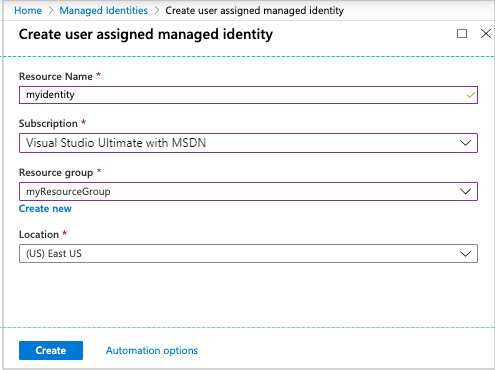
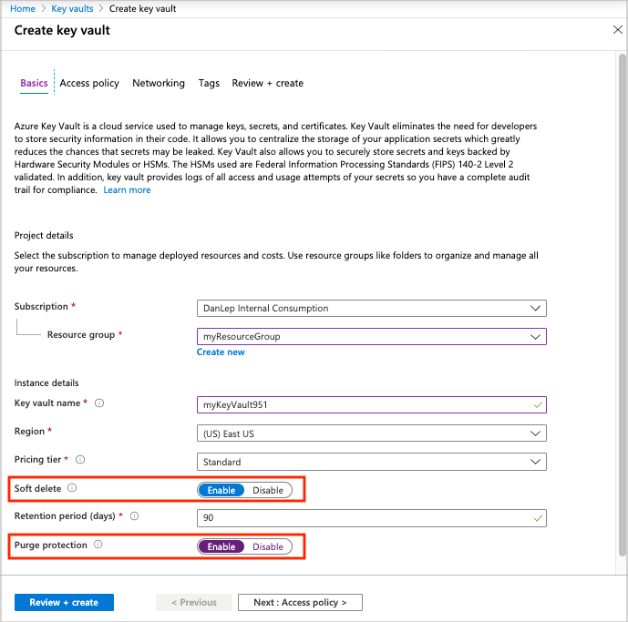
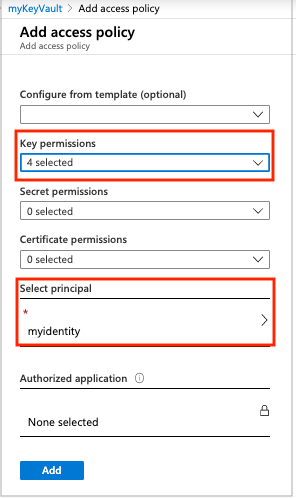
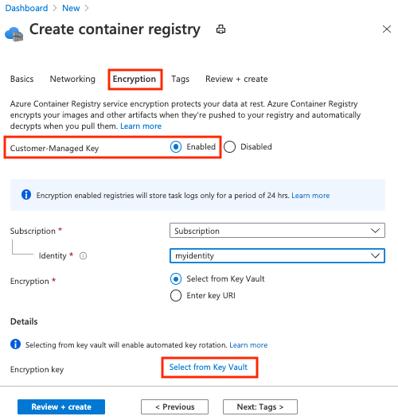
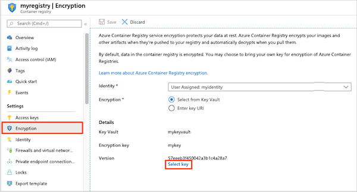

# Encrypt registry using a customer-managed key

When you store images and other artifacts in an Azure container registry, Azure automatically encrypts the registry content at rest with [service-managed keys](../security/fundamentals/encryption-models.md). You can supplement default encryption with an additional encryption layer using a key that you create and manage in Azure Key Vault (a customer-managed key). This article walks you through the steps using the Azure CLI and the Azure portal.

Server-side encryption with customer-managed keys is supported through integration with [Azure Key Vault](../key-vault/general/overview.md). You can create your own encryption keys and store them in a key vault, or use Azure Key Vault's APIs to generate keys. With Azure Key Vault, you can also audit key usage.

This feature is available in the **Premium** container registry service tier. For information about registry service tiers and limits, see [Azure Container Registry service tiers](container-registry-skus.md).


## Things to know

* You can currently enable a customer-managed key only when you create a registry. When enabling the key, you configure a *user-assigned* managed identity to access the key vault.
* After enabling encryption with a customer-managed key on a registry, you can't disable the encryption.  
* [Content trust](container-registry-content-trust.md) is currently not supported in a registry encrypted with a customer-managed key.
* In a registry encrypted with a customer-managed key, run logs for [ACR Tasks](container-registry-tasks-overview.md) are currently retained for only 24 hours. If you need to retain logs for a longer period, see guidance to [export and store task run logs](container-registry-tasks-logs.md#alternative-log-storage).


> [!NOTE]
> If access to your Azure key vault is restricted using a virtual network with a [Key Vault firewall](../key-vault/general/network-security.md), extra configuration steps are needed. After creating the registry and enabling the customer-managed key, set up access to the key using the registry's *system-assigned* managed identity, and configure the registry to bypass the Key Vault firewall. Follow the steps in this article first to enable encryption with a customer-managed key, and then see the guidance for [Advanced scenario: Key Vault firewall](#advanced-scenario-key-vault-firewall) later in this article.

## Prerequisites

To use the Azure CLI steps in this article, you need Azure CLI version 2.2.0 or later. If you need to install or upgrade, see [Install Azure CLI](/cli/azure/install-azure-cli).

## Enable customer-managed key - CLI

### Create a resource group

If needed, run the [az group create][az-group-create] command to create a resource group for creating the key vault, container registry, and other required resources.

```azurecli
az group create --name <resource-group-name> --location <location>
```

### Create a user-assigned managed identity

Create a user-assigned [managed identity for Azure resources](../active-directory/managed-identities-azure-resources/overview.md) with the [az identity create][az-identity-create] command. This identity will be used by your registry to access the Key Vault service.

```azurecli
az identity create \
  --resource-group <resource-group-name> \
  --name <managed-identity-name>
```

In the command output, take note of the following values: `id` and `principalId`. You need these values in later steps to configure registry access to the key vault.

```JSON
{
  "clientId": "xxxx2bac-xxxx-xxxx-xxxx-192cxxxx6273",
  "clientSecretUrl": "https://control-eastus.identity.azure.net/subscriptions/xxxxxxxx-xxxx-xxxx-xxxx-xxxxxxxxxxxx/resourcegroups/myresourcegroup/providers/Microsoft.ManagedIdentity/userAssignedIdentities/myidentityname/credentials?tid=xxxxxxxx-xxxx-xxxx-xxxx-xxxxxxxxxxxx&oid=xxxxxxxx-xxxx-xxxx-xxxx-xxxxxxxxxxxx&aid=xxxxxxxx-xxxx-xxxx-xxxx-xxxxxxxxxxxx",
  "id": "/subscriptions/xxxxxxxx-xxxx-xxxx-xxxx-xxxxxxxxxxxx/resourcegroups/myresourcegroup/providers/Microsoft.ManagedIdentity/userAssignedIdentities/myresourcegroup",
  "location": "eastus",
  "name": "myidentityname",
  "principalId": "xxxxxxxx-xxxx-xxxx-xxxx-xxxxxxxxxxxx",
  "resourceGroup": "myresourcegroup",
  "tags": {},
  "tenantId": "xxxxxxxx-xxxx-xxxx-xxxx-xxxxxxxxxxxx",
  "type": "Microsoft.ManagedIdentity/userAssignedIdentities"
}
```

For convenience, store these values in environment variables:

```azurecli
identityID=$(az identity show --resource-group <resource-group-name> --name <managed-identity-name> --query 'id' --output tsv)

identityPrincipalID=$(az identity show --resource-group <resource-group-name> --name <managed-identity-name> --query 'principalId' --output tsv)
```

### Create a key vault

Create a key vault with [az keyvault create][az-keyvault-create] to store a customer-managed key for registry encryption.

To prevent data loss caused by accidental key or key vault deletions, enable the following settings: **Soft delete** and **Purge protection**. The following example includes parameters for these settings:

```azurecli
az keyvault create --name <key-vault-name> \
  --resource-group <resource-group-name> \
  --enable-soft-delete \
  --enable-purge-protection
```

> [!NOTE]
> As of Azure CLI version 2.2, `az keyvault create` enables soft delete by default.

For use in later steps, get the resource Id of the key vault:

```azurecli
keyvaultID=$(az keyvault show --resource-group <resource-group-name> --name <key-vault-name> --query 'id' --output tsv)
```

### Enable key vault access

Configure a policy for the key vault so that the identity can access it. In the following [az keyvault set-policy][az-keyvault-set-policy] command, you pass the principal ID of the managed identity that you created, stored previously in an environment variable. Set key permissions to **get**, **unwrapKey**, and **wrapKey**.  

```azurecli
az keyvault set-policy \
  --resource-group <resource-group-name> \
  --name <key-vault-name> \
  --object-id $identityPrincipalID \
  --key-permissions get unwrapKey wrapKey
```

Alternatively, use [Azure RBAC for Key Vault](../key-vault/general/rbac-guide.md) (preview) to assign permissions to the identity to access the key vault. For example, assign the Key Vault Crypto Service Encryption role to the identity using the [az role assignment create](/cli/azure/role/assignment?view=azure-cli-latest#az-role-assignment-create) command:

```azurecli 
az role assignment create --assignee $identityPrincipalID \
  --role "Key Vault Crypto Service Encryption (preview)" \
  --scope $keyvaultID
```

### Create key and get key ID

Run the [az keyvault key create][az-keyvault-key-create] command to create a key in the key vault.

```azurecli
az keyvault key create \
  --name <key-name> \
  --vault-name <key-vault-name>
```

In the command output, take note of the key's ID, `kid`. You use this ID in the next step:

```JSON
[...]
  "key": {
    "crv": null,
    "d": null,
    "dp": null,
    "dq": null,
    "e": "AQAB",
    "k": null,
    "keyOps": [
      "encrypt",
      "decrypt",
      "sign",
      "verify",
      "wrapKey",
      "unwrapKey"
    ],
    "kid": "https://mykeyvault.vault.azure.net/keys/mykey/xxxxxxxxxxxxxxxxxxxxxxxx",
    "kty": "RSA",
[...]
```
For convenience, store this value in an environment variable:

```azurecli
keyID=$(az keyvault key show \
  --name <keyname> \
  --vault-name <key-vault-name> \
  --query 'key.kid' --output tsv)
```

### Create a registry with customer-managed key

Run the [az acr create][az-acr-create] command to create a registry in the Premium service tier and enable the customer-managed key. Pass the managed identity principal ID and the key ID, stored previously in environment variables:

```azurecli
az acr create \
  --resource-group <resource-group-name> \
  --name <container-registry-name> \
  --identity $identityID \
  --key-encryption-key $keyID \
  --sku Premium
```

### Show encryption status

To show whether registry encryption with a customer-managed key is enabled, run the [az acr encryption show][az-acr-encryption-show] command:

```azurecli
az acr encryption show --name <registry-name>
```

Output is similar to:

```console
{
  "keyVaultProperties": {
    "identity": "xxxxxxxx-xxxx-xxxx-xxxx-xxxxxxxxxxxx",
    "keyIdentifier": "https://myvault.vault.azure.net/keys/myresourcegroup/abcdefg123456789...",
    "versionedKeyIdentifier": "https://myvault.vault.azure.net/keys/myresourcegroup/abcdefg123456789..."
  },
  "status": "enabled"
}
```

## Enable customer-managed key - portal

### Create a managed identity

Create a user-assigned [managed identity for Azure resources](../active-directory/managed-identities-azure-resources/overview.md) in the Azure portal. For steps, see [Create a user-assigned identity](../active-directory/managed-identities-azure-resources/how-to-manage-ua-identity-portal.md#create-a-user-assigned-managed-identity).

You use the identity's name in later steps.



### Create a key vault

For steps to create a key vault, see [Quickstart: Set and retrieve a secret from Azure Key Vault using the Azure portal](../key-vault/secrets/quick-create-portal.md).

When creating a key vault for a customer-managed key, in the **Basics** tab, enable the following protection settings: **Soft delete** and **Purge protection**. These settings help prevent data loss caused by accidental key or key vault deletions.



### Enable key vault access

Configure a policy for the key vault so that the identity can access it.

1. Navigate to your key vault.
1. Select **Settings** > **Access policies > +Add Access Policy**.
1. Select **Key permissions**, and select **Get**, **Unwrap Key**, and **Wrap Key**.
1. Select **Select principal** and select the resource name of your user-assigned managed identity.  
1. Select **Add**, then select **Save**.



 Alternatively, use [Azure RBAC for Key Vault](../key-vault/general/rbac-guide.md) (preview) to assign permissions to the identity to access the key vault. For example, assign the Key Vault Crypto Service Encryption role to the identity.

1. Navigate to your key vault.
1. Select **Access control (IAM)** > **+Add** > **Add role assignment**.
1. In the **Add role assignment** window:
    1. Select **Key Vault Crypto Service Encryption (preview)** role. 
    1. Assign access to **User assigned managed identity**.
    1. Select the resource name of your user-assigned managed identity, and select **Save**.

### Create key

1. Navigate to your key vault.
1. Select **Settings** > **Keys**.
1. Select **+Generate/Import** and enter a unique name for the key.
1. Accept the remaining default values and select **Create**.
1. After creation, select the key and take note of the current key version.

### Create Azure container registry

1. Select **Create a resource** > **Containers** > **Container Registry**.
1. In the **Basics** tab, select or create a resource group, and enter a registry name. In **SKU**, select **Premium**.
1. In the **Encryption** tab, in **Customer-managed key**, select **Enabled**.
1. In **Identity**, select the managed identity you created.
1. In **Encryption**, select **Select from Key Vault**.
1. In the **Select key from Azure Key Vault** window, select the key vault, key, and version you created in the preceding section.
1. In the **Encryption** tab, select **Review + create**.
1. Select **Create** to deploy the registry instance.



To see the encryption status of your registry in the portal, navigate to your registry. Under **Settings**, select  **Encryption**.

## Enable customer-managed key - template

You can also use a Resource Manager template to create a registry and enable encryption with a customer-managed key.

The following template creates a new container registry and a user-assigned managed identity. Copy the following contents to a new file and save it using a filename such as `CMKtemplate.json`.

```JSON
{
  "$schema": "https://schema.management.azure.com/schemas/2015-01-01/deploymentTemplate.json#",
  "contentVersion": "1.0.0.0",
  "parameters": {
    "vault_name": {
      "defaultValue": "",
      "type": "String"
    },
    "registry_name": {
      "defaultValue": "",
      "type": "String"
    },
    "identity_name": {
      "defaultValue": "",
      "type": "String"
    },
    "kek_id": {
      "type": "String"
    }
  },
  "variables": {},
  "resources": [
    {
      "type": "Microsoft.ContainerRegistry/registries",
      "apiVersion": "2019-12-01-preview",
      "name": "[parameters('registry_name')]",
      "location": "[resourceGroup().location]",
      "sku": {
        "name": "Premium",
        "tier": "Premium"
      },
      "identity": {
        "type": "UserAssigned",
        "userAssignedIdentities": {
          "[resourceID('Microsoft.ManagedIdentity/userAssignedIdentities', parameters('identity_name'))]": {}
        }
      },
      "dependsOn": [
        "[resourceId('Microsoft.ManagedIdentity/userAssignedIdentities', parameters('identity_name'))]"
      ],
      "properties": {
        "adminUserEnabled": false,
        "encryption": {
          "status": "enabled",
          "keyVaultProperties": {
            "identity": "[reference(resourceId('Microsoft.ManagedIdentity/userAssignedIdentities', parameters('identity_name')), '2018-11-30').clientId]",
            "KeyIdentifier": "[parameters('kek_id')]"
          }
        },
        "networkRuleSet": {
          "defaultAction": "Allow",
          "virtualNetworkRules": [],
          "ipRules": []
        },
        "policies": {
          "quarantinePolicy": {
            "status": "disabled"
          },
          "trustPolicy": {
            "type": "Notary",
            "status": "disabled"
          },
          "retentionPolicy": {
            "days": 7,
            "status": "disabled"
          }
        }
      }
    },
    {
      "type": "Microsoft.KeyVault/vaults/accessPolicies",
      "apiVersion": "2018-02-14",
      "name": "[concat(parameters('vault_name'), '/add')]",
      "dependsOn": [
        "[resourceId('Microsoft.ManagedIdentity/userAssignedIdentities', parameters('identity_name'))]"
      ],
      "properties": {
        "accessPolicies": [
          {
            "tenantId": "[subscription().tenantId]",
            "objectId": "[reference(resourceId('Microsoft.ManagedIdentity/userAssignedIdentities', parameters('identity_name')), '2018-11-30').principalId]",
            "permissions": {
              "keys": [
                "get",
                "unwrapKey",
                "wrapKey"
              ]
            }
          }
        ]
      }
    },
    {
      "type": "Microsoft.ManagedIdentity/userAssignedIdentities",
      "apiVersion": "2018-11-30",
      "name": "[parameters('identity_name')]",
      "location": "[resourceGroup().location]"
    }
  ]
}

```

Follow the steps in the previous sections to create the following resources:

* Key vault, identified by name
* Key vault key, identified by key ID

Run the following [az group deployment create][az-group-deployment-create] command to create the registry using the preceding template file. Where indicated, provide a new registry name and managed identity name, as well as the key vault name and key ID you created.

```bash
az group deployment create \
  --resource-group <resource-group-name> \
  --template-file CMKtemplate.json \
  --parameters \
    registry_name=<registry-name> \
    identity_name=<managed-identity> \
    vault_name=<key-vault-name> \
    kek_id=<key-vault-key-id>
```

### Show encryption status

To show the status of registry encryption, run the [az acr encryption show][az-acr-encryption-show] command:

```azurecli
az acr encryption show --name <registry-name>
```

## Use the registry

After enabling a customer-managed key in a registry, you can perform the same registry operations that you perform in a registry that's not encrypted with a customer-managed key. For example, you can authenticate with the registry and push Docker images. See example commands in [Push and pull an image](container-registry-get-started-docker-cli.md).

## Rotate key

Rotate a customer-managed key used for registry encryption according to your compliance policies. Create a new key, or update a key version, and then update the registry to encrypt data using the key. You can perform these steps using the Azure CLI or in the portal.

When rotating a key, typically you specify the same identity used when creating the registry. Optionally, configure a new user-assigned identity for key access, or enable and specify the registry's system-assigned identity.

> [!NOTE]
> Ensure that the required [key vault access](#enable-key-vault-access) is set for the identity you configure for key access.

### Azure CLI

Use [az keyvault key][az-keyvault-key] commands to create or manage your key vault keys. For example, to create a new key version or key, run the [az keyvault key create][az-keyvault-key-create] command:

```azurecli
# Create new version of existing key
az keyvault key create \
  –-name <key-name> \
  --vault-name <key-vault-name>

# Create new key
az keyvault key create \
  –-name <new-key-name> \
  --vault-name <key-vault-name>
```

Then run the [az acr encryption rotate-key][az-acr-encryption-rotate-key] command, passing the new key ID and the identity you want to configure:

```azurecli
# Rotate key and use user-assigned identity
az acr encryption rotate-key \
  --name <registry-name> \
  --key-encryption-key <new-key-id> \
  --identity <principal-id-user-assigned-identity>

# Rotate key and use system-assigned identity
az acr encryption rotate-key \
  --name <registry-name> \
  --key-encryption-key <new-key-id> \
  --identity [system]
```

### Portal

Use the registry's **Encryption** settings to update the key version, key, key vault, or identity settings used for the customer-managed key.

For example, to generate and configure a new key version:

1. In the portal, navigate to your registry.
1. Under **Settings**, select  **Encryption** > **Change key**.
1. Select **Select key**

    
1. In the **Select key from Azure Key Vault** window, select the key vault and key you configured previously, and in **Version**, select **Create new**.
1. In the **Create a key** window, select **Generate**, and then **Create**.
1. Complete the key selection and select **Save**.

## Revoke key

Revoke the customer-managed encryption key by changing the access policy or permissions on the key vault or by deleting the key. For example, use the [az keyvault delete-policy][az-keyvault-delete-policy] command to change the access policy of the managed identity used by your registry:

```azurecli
az keyvault delete-policy \
  --resource-group <resource-group-name> \
  --name <key-vault-name> \
  --object-id $identityPrincipalID
```

Revoking the key effectively blocks access to all registry data, since the registry can't access the encryption key. If access to the key is enabled or the deleted key is restored, your registry will pick the key so you can again access the encrypted registry data.

## Advanced scenario: Key Vault firewall

If your Azure key vault is deployed in a virtual network with a Key Vault firewall, perform the following additional steps after enabling customer-managed key encryption in your registry.

1. Configure registry encryption to use the registry's system-assigned identity
1. Enable the registry to bypass the Key Vault firewall
1. Rotate the customer-managed key

### Configure system-assigned identity

You can configure a registry's system-assigned managed identity to access the key vault for encryption keys. If you're unfamiliar with the different managed identities for Azure resources, see the [overview](../active-directory/managed-identities-azure-resources/overview.md).

To enable the registry's system-assigned identity in the portal:

1. In the portal, navigate to your registry.
1. Select **Settings** >  **Identity**.
1. Under **System assigned**, set **Status** to **On**. Select **Save**.
1. Copy the **Object ID** of the identity.

To grant the identity access to your key vault:

1. Navigate to your key vault.
1. Select **Settings** > **Access policies > +Add Access Policy**.
1. Select **Key permissions**, and select **Get**, **Unwrap Key**, and **Wrap Key**.
1. Select **Select principal** and search for the object ID of your system-assigned managed identity, or the name of your registry.  
1. Select **Add**, then select **Save**.

To update the registry's encryption settings to use the identity:

1. In the portal, navigate to your registry.
1. Under **Settings**, select  **Encryption** > **Change key**.
1. In **Identity**, select **System assigned**, and select **Save**.

### Enable key vault bypass

To access a key vault configured with a Key Vault firewall, the registry must bypass the firewall. Ensure that the key vault is configured to allow access by any [trusted service](../key-vault/general/overview-vnet-service-endpoints.md#trusted-services). Azure Container Registry is one of the trusted services.

1. In the portal, navigate to your key vault.
1. Select **Settings** > **Networking**.
1. Confirm, update, or add virtual network settings. For detailed steps, see [Configure Azure Key Vault firewalls and virtual networks](../key-vault/general/network-security.md).
1. In **Allow Microsoft Trusted Services to bypass this firewall**, select **Yes**. 

### Rotate the customer-managed key

After completing the preceding steps, rotate the key to a new key in the key vault behind a firewall. For steps, see [Rotate key](#rotate-key) in this article.

## Troubleshoot

### Removing user-assigned identity

If you try to remove a user-assigned identity from a registry that is used for encryption, you might see an error message similar to:
 
```
Azure resource '/subscriptions/xxxx/resourcegroups/myGroup/providers/Microsoft.ContainerRegistry/registries/myRegistry' does not have access to identity 'xxxxxxxxx-xxxx-xxxx-xxxx-xxxxxxxxxxx' Try forcibly adding the identity to the registry <registry name>. For more information on bring your own key, please visit 'https://aka.ms/acr/cmk'.
```
 
You will also be unable to change (rotate) the encryption key. If this issue occurs, first reassign the identity using the GUID displayed in the error message. For example:

```azurecli
az acr identity assign -n myRegistry --identities xxxxxxxxx-xxxx-xxxx-xxxx-xxxxxxxxxxx
```
        
Then, after changing the key and assigning a different identity, you can remove the original user-assigned identity.

## Next steps

* Learn more about [encryption at rest in Azure](../security/fundamentals/encryption-atrest.md).
* Learn more about access policies and how to [secure access to a key vault](../key-vault/general/secure-your-key-vault.md).


<!-- LINKS - external -->

<!-- LINKS - internal -->

[az-feature-register]: /cli/azure/feature#az-feature-register
[az-feature-show]: /cli/azure/feature#az-feature-show
[az-group-create]: /cli/azure/group#az-group-create
[az-identity-create]: /cli/azure/identity#az-identity-create
[az-feature-register]: /cli/azure/feature#az-feature-register
[az-group-deployment-create]: /cli/azure/group/deployment#az-group-deployment-create
[az-keyvault-create]: /cli/azure/keyvault#az-keyvault-create
[az-keyvault-key-create]: /cli/azure/keyvault/key#az-keyvault-key-create
[az-keyvault-key]: /cli/azure/keyvault/key
[az-keyvault-set-policy]: /cli/azure/keyvault#az-keyvault-set-policy
[az-keyvault-delete-policy]: /cli/azure/keyvault#az-keyvault-delete-policy
[az-resource-show]: /cli/azure/resource#az-resource-show
[az-acr-create]: /cli/azure/acr#az-acr-create
[az-acr-show]: /cli/azure/acr#az-acr-show
[az-acr-encryption-rotate-key]: /cli/azure/acr/encryption#az-acr-encryption-rotate-key
[az-acr-encryption-show]: /cli/azure/acr/encryption#az-acr-encryption-show
