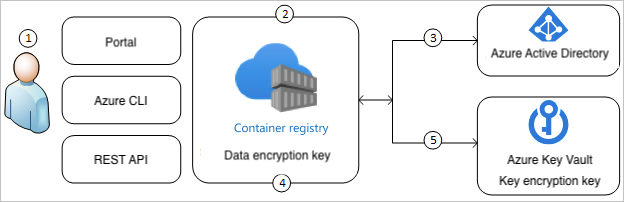

# Encrypt registry data with a customer-managed key 

When you store image data and other artifacts in an Azure container registry, Azure automatically encrypts this data at rest. By default, data is encrypted and decrypted with Microsoft-managed keys, using 256-bit AES encryption.

For additional control, you can supply a customer-managed key to encrypt and decrypt registry data. The key must be stored in an Azure key vault. This article shows how to create and store a key in an Azure key vault, and then enable a registry to use this key for encryption and decryption.

This feature is only available in a **Premium** container registry. For information about registry service tiers and limits, see [Azure Container Registry SKUs](container-registry-skus.md).

> [!IMPORTANT]
> This feature is currently in preview, and some [limitations](#preview-limitations) apply. Previews are made available to you on the condition that you agree to the [supplemental terms of use][terms-of-use]. Some aspects of this feature may change prior to general availability (GA).
>
   
## Preview limitations 

* You can currently enable this feature only on a newly created registry.
* After enabling a customer-managed key on a registry, you can't disable it.
* In a registry where a customer-managed key is enabled, logs for [ACR Tasks](container-registry-tasks-overview.md) are currently retained for only 24 hours. If you need to retain task logs for a longer period, export the logs to local files, or import log files to Azure Storage.
* [CLI version minimum? Use Cloud Shell?]


## About encryption key management

The following table compares registry encryption using Microsoft-managed keys or customer-managed keys: 

|    |    Microsoft-managed keys     |     Customer-managed keys     |
|----|----|----|
|    Encryption/decryption operations    |    Azure    |    Azure    |
|    Key storage    |    Microsoft key store    |    Azure Key Vault    |
|    Key rotation responsibility    |    Microsoft    |    Customer    |
|    Key access    |    Microsoft only    |    Microsoft, Customer    |

## Customer-managed keys with Azure Key Vault

Use Azure Key Vault to store your customer-managed keys. You can either create your own keys and store them in a key vault, or use the Azure Key Vault APIs to generate keys. The registry and the key vault must be in the same Azure Active Directory (Azure AD) tenant, but they can be in different subscriptions. For more information about Azure Key Vault, see [What is Azure Key Vault?](../key-vault/key-vault-overview.md).

### How the customer-managed key works

The following diagram shows how Azure Container Registry uses Azure Active Directory and Azure Key Vault to make requests using the customer-managed key:



Explanation of steps:

1. An Azure Key Vault admin grants permissions to encryption keys to the managed identity that's associated with the container registry.
1. An Azure Container Registry admin configures encryption with a customer-managed key for the registry.
1. Azure Container Registry uses a managed identity that's associated with the registry to authenticate access to Azure Key Vault via Azure Active Directory.
1. Azure Container Registry wraps the data encryption key with the customer key in Azure Key Vault. Because the customer-managed key encrypts the registry's data encryption key, it's also called a *key encryption key*.
1. For read/write operations, Azure Container Registry sends requests to Azure Key Vault to wrap and unwrap the data encryption key to perform encryption and decryption operations.

### Additional information 

* When Azure wraps the data encryption key with the customer-managed key, the registry is encrypted with the new key immediately, without any time delay.
* Data encryption using a customer-managed key doesn't affect registry performance.
* If you modify the customer-managed key being used for registry, for example, by rotating the key, only the encryption of the root key changes. Data in your Azure container registry doesn't need to be re-encrypted.

## Enable customer-managed key - portal

### Create a managed identity

Create a [user-assigned [managed identity for Azure resources](../active-directory/managed-identities-azure-resources/overview.md) in the Azure portal. For steps, see [Create a user-assigned identity](../active-directory/managed-identities-azure-resources/how-to-manage-ua-identity-portal.md#create-a-user-assigned-managed-identity).

Take note of the **Resource Name** of the managed identity. You need this name in later steps.

### Create a key vault

For steps to create a key vault, see [Quickstart: Set and retrieve a secret from Azure Key Vault using the Azure portal](../key-vault/quick-create-portal.md).

### Enable soft delete and purge protection

This key vault should have two key protection settings enabled: **Soft delete** and **Purge protection**.

To enable the settings in the portal:

1. Navigate to your key vault.
1. Select **Settings** > **Properties**.
1. In **Soft delete**, select **Enable**. Enter a retention period in days, or accept the default value.
1. In **Purge protection**, select **Enable**. Click **Save**.

### Configure key vault access policy

Configure the access policy for the key vault so that the registry has permissions to access it.

1. Navigate to your key vault.
1. Select **Settings** > **Access policies >+Add new**.
1. Select principal** and select the resource name of your user-assigned managed identity.
1. Select **Key permissions** and select **Get**, **Recover**, **Wrap Key**, and **Unwrap Key**.

### Create key and get key ID

1. Navigate to your key vault.
1. Select **Settings** > **Keys**.
1. Select **+Generate/Import** and enter a unique name for the key.
1. Accept the remaining default values and select **Create**.
1. After creation, select the key and select the current key version.
1. On the **Key Version** screen, copy the **Key Identifier**. You need this ID when you create your Azure container registry.

### Create Azure container registry

Follow the steps in [Quickstart: Create a private container registry in the Azure portal](container-registry-get-started-portal.md).

1. Select **Create a resource** > **Containers** > **Container Registry**.
1. For **SKU**, select 'Premium'.
1. [More steps to come...] 
1. Select **Create** to deploy the registry instance.


## Enable customer-managed key - CLI

### Create a resource group

If needed, run the [az group create][az-group-create] command to create a resource group for creating the key vault, container registry, and other required resources.

```azurecli
az group create --name <resource-group-name> --location <location>
```

### Create a user-assigned managed identity

Create a user-assigned [managed identity for Azure resources](../active-directory/managed-identities-azure-resources/overview.md) with the [az identity create][az-identity-create] command. This identity will be use by your registry to access the Key Vault service.

```azurecli
az identity create \
  --resource-group <resource-group-name> \
  --name <managed-identity-name> 
```

In the command output, take note of the `principalId` of the identity. You need this value in later steps to configure registry access to the key vault.

```JSON
{
  "clientId": "xxxx2bac-xxxx-xxxx-xxxx-192cxxxx6273",
  "clientSecretUrl": "https://control-eastus.identity.azure.net/subscriptions/xxxxxxxx-xxxx-xxxx-xxxx-xxxxxxxxxxxx/resourcegroups/myresourcegroup/providers/Microsoft.ManagedIdentity/userAssignedIdentities/myidentityname/credentials?tid=xxxxxxxx-xxxx-xxxx-xxxx-xxxxxxxxxxxx&oid=xxxxxxxx-xxxx-xxxx-xxxx-xxxxxxxxxxxx&aid=xxxxxxxx-xxxx-xxxx-xxxx-xxxxxxxxxxxx",
  "id": "/subscriptions/xxxxxxxx-xxxx-xxxx-xxxx-xxxxxxxxxxxx/resourcegroups/myresourcegroup/providers/Microsoft.ManagedIdentity/userAssignedIdentities/myresourcegroup",
  "location": "eastus",
  "name": "myidentityname",
  "principalId": "xxxxxxxx-xxxx-xxxx-xxxx-xxxxxxxxxxxx",
  "resourceGroup": "myresourcegroup",
  "tags": {},
  "tenantId": "xxxxxxxx-xxxx-xxxx-xxxx-xxxxxxxxxxxx",
  "type": "Microsoft.ManagedIdentity/userAssignedIdentities"
}
```

### Create a key vault

Create a key vault with [az keyvault create][az-keyvault-create] to store customer-managed keys for registry encryption. To allow you to recover the key if you accidentally delete it, this key vault should have two key protection settings enabled: **Soft delete** and **Purge protection**. This following example includes parameters for these settings: 

```azurecli
az keyvault create \
  –-name <key-vault-name> \
  --resource-group <resource-group-name> \
  --enable-soft-delete \
  --enable-purge-protection \
  --location <location-name>
```

### Configure key vault access policy

Configure the access policy for the key vault so that the registry has permissions to access it. In the following [az keyvault set-policy][az-keyvault-set-policy] command, you pass the principal ID of the managed identity that you previously created. Set key permissions to **get**, **recover**, **wrapKey**, and **unwrapKey**.  

```azurecli
az keyvault set-policy \
  --resource-group <resource-group-name> \
  –-name <key-vault-name> \
  --object-id <managed-identity-principal-id> \
  --key-permissions get recover unwrapKey wrapKey 

```
### Create key and get key ID

Run the [az keyvault key create][az-keyvault-key-create] command to create a key in the key vault.

```azurecli
az keyvault key create --name <key-name> --vault-name <key-vault-name> 
```

In the command output, take note of the key's `kid`. You use this ID in the next step:

```JSON
[...]
  "key": {
    "crv": null,
    "d": null,
    "dp": null,
    "dq": null,
    "e": "AQAB",
    "k": null,
    "keyOps": [
      "encrypt",
      "decrypt",
      "sign",
      "verify",
      "wrapKey",
      "unwrapKey"
    ],
    "kid": "https://mykeyvault.vault.azure.net/keys/mykey/xxxxxxxxxxxxxxxxxxxxxxxx",
    "kty": "RSA",
[...]
```

### Create a registry with customer-managed key

Run the [az acr create][az-acr-create] command to create a registry with the customer-managed key enabled. Pass the managed identity principal ID and the key ID you obtained previously:

```azurecli
az acr create \
  --resource-group <resource-group-name> \ 
  --name <container-registry-name> \
  --identity <managed-identity-principal-id> \ 
  --kek <key-id>  
```

### Show encryption status

To show the status of registry encryption, run the [az acr encryption show-status][az-acr-encryption-show-status] command:

```azurecli
az acr encryption show-status --name <registry-name> 
```

## Enable customer-managed key - template

You can also use a Resource Manager template to create a registry and enable encryption with a customer-managed key. 

The following template creates a new container registry and a user-assigned managed identity. Copy the following contents to a new file and save it using a filename such as `CMKtemplate.json`.

```JSON
{
  "$schema": "https://schema.management.azure.com/schemas/2015-01-01/deploymentTemplate.json#",
  "contentVersion": "1.0.0.0",
  "parameters": {
    "vault_name": {
      "defaultValue": "",
      "type": "String"
    },
    "registry_name": {
      "defaultValue": "",
      "type": "String"
    },
    "identity_name": {
      "defaultValue": "",
      "type": "String"
    },
    "kek_id": {
      "type": "String"
    }
  },
  "variables": {},
  "resources": [
    {
      "type": "Microsoft.ContainerRegistry/registries",
      "apiVersion": "2019-12-01-preview",
      "name": "[parameters('registry_name')]",
      "location": "[resourceGroup().location]",
      "sku": {
        "name": "Premium",
        "tier": "Premium"
      },
      "identity": {
        "type": "SystemAssigned,UserAssigned",
        "userAssignedIdentities": {
          "[resourceID('Microsoft.ManagedIdentity/userAssignedIdentities', parameters('identity_name'))]": {}
        }
      },
      "dependsOn": [
        "[resourceId('Microsoft.ManagedIdentity/userAssignedIdentities', parameters('identity_name'))]"
      ],
      "properties": {
        "adminUserEnabled": false,
        "encryption": {
          "status": "enabled",
          "keyVaultProperties": {
            "identity": "[reference(resourceId('Microsoft.ManagedIdentity/userAssignedIdentities', parameters('identity_name')), '2018-11-30').clientId]",
            "KeyIdentifier": "[parameters('kek_id')]"
          }
        },
        "networkRuleSet": {
          "defaultAction": "Allow",
          "virtualNetworkRules": [],
          "ipRules": []
        },
        "policies": {
          "quarantinePolicy": {
            "status": "disabled"
          },
          "trustPolicy": {
            "type": "Notary",
            "status": "disabled"
          },
          "retentionPolicy": {
            "days": 7,
            "status": "disabled"
          }
        }
      }
    },
    {
      "type": "Microsoft.KeyVault/vaults/accessPolicies",
      "apiVersion": "2018-02-14",
      "name": "[concat(parameters('vault_name'), '/add')]",
      "dependsOn": [
        "[resourceId('Microsoft.ManagedIdentity/userAssignedIdentities', parameters('identity_name'))]"
      ],
      "properties": {
        "accessPolicies": [
          {
            "tenantId": "[subscription().tenantId]",
            "objectId": "[reference(resourceId('Microsoft.ManagedIdentity/userAssignedIdentities', parameters('identity_name')), '2018-11-30').principalId]",
            "permissions": {
              "keys": [
                "get",
                "unwrapKey",
                "wrapKey"
              ]
            }
          }
        ]
      }
    },
    {
      "type": "Microsoft.ManagedIdentity/userAssignedIdentities",
      "apiVersion": "2018-11-30",
      "name": "[parameters('identity_name')]",
      "location": "[resourceGroup().location]"
    }
  ]
}

```

Follow the steps in the previous sections to create the following resources:

* Key vault, identified by name
* Key vault key, identified by key ID

Run the following [az group deployment create][az-group-deployment-create] command to create the registry using the preceding template file. Where indicated, provide a new registry name and managed identity name, as well as the key vault name and key ID you created. 

```bash
az group deployment create \
  --resource-group <resource-group-name> \
  --template-file CMKtemplate.json \
  --parameters \
    registry_name=<registry-name> \
    identity_name=<managed-identity> \
    vault_name=<key-vault-name> \
    kek_id=<key-vault-key-id>
```

### Show encryption status

To show the status of registry encryption, run the [az acr encryption show-status][az-acr-encryption-show-status] command:

```azurecli
az acr encryption show-status --name <registry-name> 
```

## Use the registry

After you enable a registry to encrypt data using a customer-managed key, you can perform the same registry operations that you perform in a registry that's not encrypted with a customer-managed key. For example, you can authenticate with the registry and push Docker images. See example commands in [Push and pull an image](container-registry-get-started-docker-cli.md).

## Rotate key

You can rotate a customer-managed key in Azure Key Vault according to your compliance policies. Create a new key, and then update the registry to encrypt data using the new key. For example, run the [az keyvault key create][az-keyvault-key-create] to create a new key:

```azurecli
az keyvault key create –-name <new-key-name> --vault-name <key-vault-name> 
```

Then run the [az acr encryption rotatekey][az-acr-encryption-rotatekey] command, passing the name of the new key and the principal ID of the managed identity you previously configured:

```azurecli
az acr encryption rotatekey \ 
  --name <registry-name> \
  --encryption-key-name <new-key-name> \
  --identity <managed-identity-principal-id>\ 
```

## Revoke key

Revoke the customer-managed encryption key by changing the access policy on the key vault or by deleting the key. For example, use the [az keyvault delete-policy][az-keyvault-delete-policy] command to change the access policy of the managed identity used by your registry. For example

```azurecli
az keyvault delete-policy \
  --resource-group <resource-group-name> \
  –-name <key-vault-name> \
  --object-id <managed-identity-principal-id> \
```

Revoking the key effectively blocks access to all registry data, since the registry can't access the encryption key. If access to the key is enabled or the deleted key is restored, your registry will pick the key so you can again access the encrypted registry data.

Learn more about access policies and securing your key vault: [Secure access to a key vault](../key-vault/key-vault-secure-your-key-vault.md).

## Next steps

* Learn more about [encryption at rest in Azure](../security/fundamentals/encryption-atrest.md)

* To provide feedback on customer-managed keys for Azure Container Registry, visit the [ACR GitHub site](https://aka.ms/acr/issues)


<!-- LINKS - external -->
[terms-of-use]: https://azure.microsoft.com/support/legal/preview-supplemental-terms

<!-- LINKS - internal -->

[az-feature-register]: /cli/azure/feature#az-feature-register
[az-feature-show]: /cli/azure/feature#az-feature-show
[az-group-create]: /cli/azure/group#az-group-create
[az-identity-create]: /cli/azure/identity#az-identity-create
[az-feature-register]: /cli/azure/feature#az-feature-register
[az-group-deployment-create]: /cli/azure/group/deployment#az-group-deployment-create
[az-keyvault-create]: /cli/azure/keyvault#az-keyvault-create
[az-keyvault-key-create]: /cli/azure/keyvault/keyt#az-keyvault-key-create
[az-keyvault-set-policy]: /cli/azure/keyvault/keyt#az-keyvault-set-policy
[az-keyvault-delete-policy]: /cli/azure/keyvault/keyt#az-keyvault-delete-policy
[az-resource-show]: /cli/azure/resource#az-resource-show
[az-acr-create]: /cli/azure/acr#az-acr-create
[az-acr-show]: /cli/azure/acr#az-acr-show
[az-acr-encryption-rotatekey]: /cli/azure/acr/encryption#az-acr-encryption-rotatekey
[az-acr-encryption-show-status]: /cli/azure/acr/encryption#az-acr-encryption-show-status