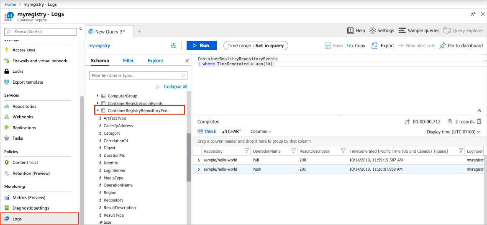

# Azure Container Registry logs for diagnostic evaluation and auditing

This article explains how to collect log data for an Azure container registry using features of [Azure Monitor](../azure-monitor/overview.md). Azure Monitor collects [resource logs](../azure-monitor/platform/platform-logs-overview.md) (formerly called *diagnostic logs*) for user-driven events in your registry. Collect and consume this data to meet needs such as:

* Audit registry authentication events to ensure security and compliance 

* Provide a complete activity trail on registry artifacts such as pull and pull events so you can diagnose operational issues with your registry 

Collecting resource log data using Azure Monitor may incur additional costs. See [Azure Monitor pricing](https://azure.microsoft.com/pricing/details/monitor/). 

## Repository events

The following repository-level events for images and other artifacts are currently logged:

* **Push**
* **Pull**
* **Untag**
* **Delete** (including repository delete events)
* **Purge tag** and **Purge manifest**

> [!NOTE]
> Purge events are logged only if a registry [retention policy](container-registry-retention-policy.md) is configured.

## Registry resource logs

Resource logs contain information emitted by Azure resources that describe their internal operation. For an Azure container registry, the logs contain authentication and repository-level events stored in the following tables. 

* **ContainerRegistryLoginEvents**  - Registry authentication events and status, including the incoming identity and IP address
* **ContainerRegistryRepositoryEvents** - Operations such as push and pull for images and other artifacts in registry repositories
* **AzureMetrics** - [Container registry metrics](../azure-monitor/platform/metrics-supported.md#microsoftcontainerregistryregistries) such as aggregated push and pull counts.

For operations, log data includes:
  * Success or failure status
  * Start and end time stamps

In addition to resource logs, Azure provides an [activity log](../azure-monitor/platform/platform-logs-overview.md), a single subscription-level record of Azure management events such as the creation or deletion of a container registry.

## Enable collection of resource logs

Collection of resource logs for a container registry isn't enabled by default. Explicitly enable diagnostic settings for each registry you want to monitor. For options to enable diagnostic settings, see [Create diagnostic setting to collect platform logs and metrics in Azure](../azure-monitor/platform/diagnostic-settings.md).

For example, to view logs and metrics for a container registry in near real-time in Azure Monitor, collect the resource logs in a Log Analytics workspace. To enable this diagnostic setting using the Azure portal:

1. If you don't already have a workspace, create a workspace using the [Azure portal](../azure-monitor/learn/quick-create-workspace.md). To minimize latency in data collection, ensure that the workspace is in the **same region** as your container registry.
1. In the portal, select the registry, and select **Monitoring > Diagnostic settings > Add diagnostic setting**.
1. Enter a name for the setting, and select **Send to Log Analytics**.
1. Select the workspace for the registry diagnostic logs.
1. Select the log data you want to collect, and click **Save**.

The following image shows creation of a diagnostic setting for a registry using the portal.


> [!TIP]
> Collect only the data that you need, balancing cost and your monitoring needs. For example, if you only need to audit authentication events, select only the **ContainerRegistryLoginEvents** log. 

## View data in Azure Monitor

After you enable collection of diagnostic logs in Log Analytics, it can take a few minutes for data to appear in Azure Monitor. To view the data in the portal, select the registry, and select **Monitoring > Logs**. Select one of the tables that contains data for the registry. 

Run queries to view the data. Several sample queries are provided, or run your own. For example, the following query retrieves the most recent 24 hours of data from the **ContainerRegistryRepositoryEvents** table:

```Kusto
ContainerRegistryRepositoryEvents
| where TimeGenerated > ago(1d) 
```

The following image shows sample output:



For a tutorial on using Log Analytics in the Azure portal, see [Get started with Azure Monitor Log Analytics](../azure-monitor/log-query/get-started-portal.md), or try the Log Analytics [Demo environment](https://portal.loganalytics.io/demo). 

For more information on log queries, see [Overview of log queries in Azure Monitor](../azure-monitor/log-query/log-query-overview.md).

## Query examples

### Error events from the last hour

```Kusto
union Event, Syslog // Event table stores Windows event records, Syslog stores Linux records
| where TimeGenerated > ago(1h)
| where EventLevelName == "Error" // EventLevelName is used in the Event (Windows) records
	or SeverityLevel== "err" // SeverityLevel is used in Syslog (Linux) records
```

### 100 most recent registry events

```Kusto
ContainerRegistryRepositoryEvents
| union ContainerRegistryLoginEvents
| top 100 by TimeGenerated
| project TimeGenerated, LoginServer, OperationName, Identity, Repository, DurationMs, Region , ResultType
```

### Identity of user or object that deleted repository

```Kusto
ContainerRegistryRepositoryEvents
| where OperationName contains "Delete"
| project LoginServer, OperationName, Repository, Identity, CallerIpAddress
```

### Identity of user or object that deleted tag

```Kusto
ContainerRegistryRepositoryEvents
| where OperationName contains "Untag"
| project LoginServer, OperationName, Repository, Tag, Identity, CallerIpAddress
```

### Reposity-level operation failures

```kusto
ContainerRegistryRepositoryEvents 
| where ResultDescription contains "40"
| project TimeGenerated, OperationName, Repository, Tag, ResultDescription
```

### Registry authentication failures

```kusto
ContainerRegistryLoginEvents 
| where ResultDescription != "200"
| project TimeGenerated, Identity, CallerIpAddress, ResultDescription
```


## Additional log destinations

In addition to sending the logs to Log Analytics, or as an alternative, a common scenario is to select an Azure Storage account as a log destination. To archive logs in Azure Storage, create a storage account before enabling archiving through the diagnostic settings.

You can also stream diagnostic log events to an [Azure Event Hub](../event-hubs/event-hubs-what-is-event-hubs.md). Event Hubs can ingest millions of events per second, which you can then transform and store using any real-time analytics provider. 

## Next steps

* Learn more about using [Log Analytics](../azure-monitor/log-query/get-started-portal.md) and creating [log queries](../azure-monitor/log-query/get-started-queries.md).
* See [Overview of Azure platform logs](../azure-monitor/platform/platform-logs-overview.md) to learn about platform logs that are available at different layers of Azure.

