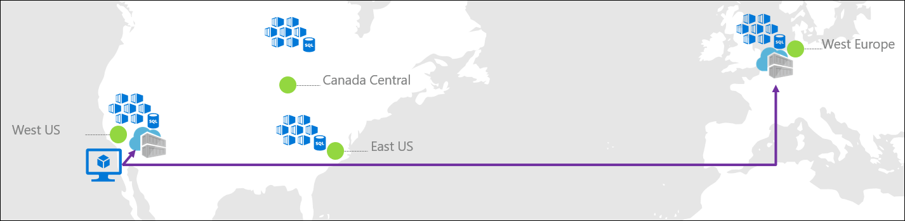
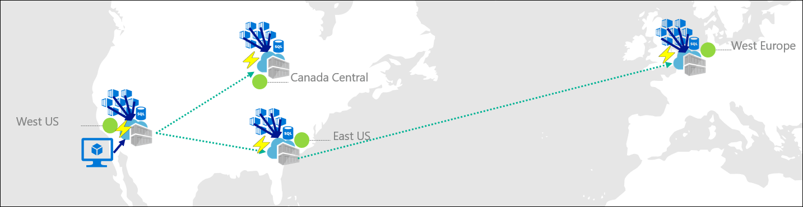
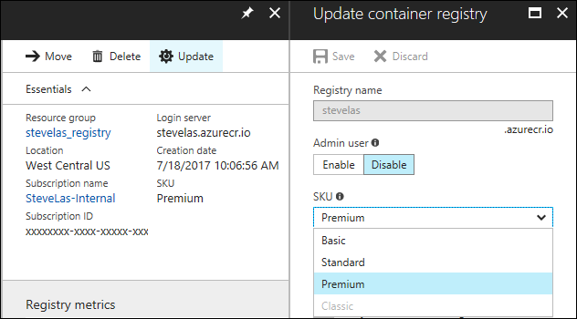
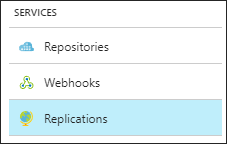
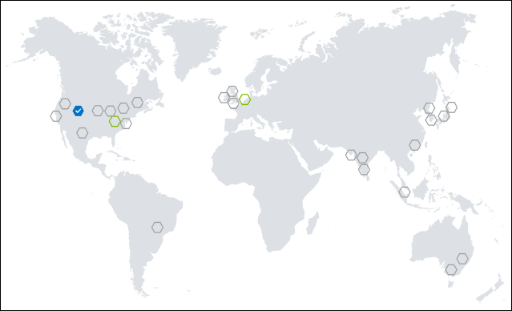
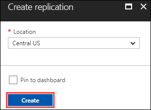

# Geo-replication in Azure Container Registry

Companies that want a local presence, or a hot backup, choose to run services from multiple Azure regions. As a best practice, placing a container registry in each region where images are run allows network-close operations, enabling fast, reliable image layer transfers. Geo-replication enables an Azure container registry to function as a single registry, serving multiple regions with multi-master regional registries. 

A geo-replicated registry provides the following benefits:

* Single registry, image, and tag names can be used across multiple regions
* Improve performance and reliability of regional deployments with network-close registry access
* Reduce data transfer costs by pulling image layers from a local, replicated registry in the same or nearby region as your container host
* Single management of a registry across multiple regions
* Registry resilience if a regional outage occurs

> [!NOTE]
> If you need to maintain copies of container images in more than one Azure container registry, Azure Container Registry also supports [image import](container-registry-import-images.md). For example, in a DevOps workflow, you can import an image from a development registry to a production registry, without needing to use Docker commands.
>

## Example use case
Contoso runs a public presence website located across the US, Canada, and Europe. To serve these markets with local and network-close content, Contoso runs [Azure Kubernetes Service](../aks/index.yml) (AKS) clusters in West US, East US, Canada Central, and West Europe. The website application, deployed as a Docker image, utilizes the same code and image across all regions. Content, local to that region, is retrieved from a database, which is provisioned uniquely in each region. Each regional deployment has its unique configuration for resources like the local database.

The development team is located in Seattle WA, utilizing the West US data center.

<br />*Pushing to multiple registries*

Prior to using the geo-replication features, Contoso had a US-based registry in West US, with an additional registry in West Europe. To serve these different regions, the development team pushed images to two different registries.

```bash
docker push contoso.azurecr.io/public/products/web:1.2
docker push contosowesteu.azurecr.io/public/products/web:1.2
```
<br />*Pulling from multiple registries*

Typical challenges of multiple registries include:

* The East US, West US, and Canada Central clusters all pull from the West US registry, incurring egress fees as each of these remote container hosts pull images from West US data centers.
* The development team must push images to West US and West Europe registries.
* The development team must configure and maintain each regional deployment with image names referencing the local registry.
* Registry access must be configured for each region.

## Benefits of geo-replication



Using the geo-replication feature of Azure Container Registry, these benefits are realized:

* Manage a single registry across all regions: `contoso.azurecr.io`
* Manage a single configuration of image deployments as all regions use the same image URL: `contoso.azurecr.io/public/products/web:1.2`
* Push to a single registry, while ACR manages the geo-replication. ACR only replicates unique layers, reducing data transfer across regions. 
* Configure regional [webhooks](container-registry-webhook.md) to notify you of events in specific replicas.
* Provide a highly available registry that is resilient to regional outages.

Azure Container Registry also supports [availability zones](zone-redundancy.md) to create a resilient and high availability Azure container registry within an Azure region. The combination of availability zones for redundancy within a region, and geo-replication across multiple regions, enhances both the reliability and performance of a registry.

## Configure geo-replication

Configuring geo-replication is as easy as clicking regions on a map. You can also manage geo-replication using tools including the [az acr replication](/cli/azure/acr/replication) commands in the Azure CLI, or deploy a registry enabled for geo-replication with an [Azure Resource Manager template](https://github.com/Azure/azure-quickstart-templates/tree/master/101-container-registry-geo-replication).

Geo-replication is a feature of [Premium registries](container-registry-skus.md). If your registry isn't yet Premium, you can change from Basic and Standard to Premium in the [Azure portal](https://portal.azure.com):



To configure geo-replication for your Premium registry, log in to the Azure portal at https://portal.azure.com.

Navigate to your Azure Container Registry, and select **Replications**:



A map is displayed showing all current Azure Regions:

 

* Blue hexagons represent current replicas
* Green hexagons represent possible replica regions
* Gray hexagons represent Azure regions not yet available for replication

To configure a replica, select a green hexagon, then select **Create**:

 

To configure additional replicas, select the green hexagons for other regions, then click **Create**.

ACR begins syncing images across the configured replicas. Once complete, the portal reflects *Ready*. The replica status in the portal doesn't automatically update. Use the refresh button to see the updated status.

## Considerations for using a geo-replicated registry

* Each region in a geo-replicated registry is independent once set up. Azure Container Registry SLAs apply to each geo-replicated region.
* When you push or pull images from a geo-replicated registry, Azure Traffic Manager in the background sends the request to the registry located in the region that is closest to you in terms of network latency.
* After you push an image or tag update to the closest region, it takes some time for Azure Container Registry to replicate the manifests and layers to the remaining regions you opted into. Larger images take longer to replicate than smaller ones. Images and tags are synchronized across the replication regions with an eventual consistency model.
* To manage workflows that depend on push updates to a geo-replicated registry, we recommend that you configure [webhooks](container-registry-webhook.md) to respond to the push events. You can set up regional webhooks within a geo-replicated registry to track push events as they complete across the geo-replicated regions.
* To serve blobs representing content layers, Azure Container Registry uses data endpoints. You can enable [dedicated data endpoints](container-registry-firewall-access-rules.md#enable-dedicated-data-endpoints) for your registry in each of your registry's geo-replicated regions. These endpoints allow configuration of tightly scoped firewall access rules. For troubleshooting purposes, you can optionally [disable routing to a replication](#temporarily-disable-routing-to-replication) while maintaining replicated data.
* If you configure a [private link](container-registry-private-link.md) for your registry using private endpoints in a virtual network, dedicated data endpoints in each of the geo-replicated regions are enabled by default. 

## Delete a replica

After you've configured a replica for your registry, you can delete it at any time if it's no longer needed. Delete a replica using the Azure portal or other tools such as the [az acr replication delete](/cli/azure/acr/replication#az_acr_replication_delete) command in the Azure CLI.

To delete a replica in the Azure portal:

1. Navigate to your Azure Container Registry, and select **Replications**.
1. Select the name of a replica, and select **Delete**. Confirm that you want to delete the replica.

To use the Azure CLI to delete a replica of *myregistry* in the East US region:

```azurecli
az acr replication delete --name eastus --registry myregistry
```

## Geo-replication pricing

Geo-replication is a feature of the [Premium service tier](container-registry-skus.md) of Azure Container Registry. When you replicate a registry to your desired regions, you incur Premium registry fees for each region.

In the preceding example, Contoso consolidated two registries down to one, adding replicas to East US, Canada Central, and West Europe. Contoso would pay four times Premium per month, with no additional configuration or management. Each region now pulls their images locally, improving performance, reliability without network egress fees from West US to Canada and East US.

## Troubleshoot push operations with geo-replicated registries
 
A Docker client that pushes an image to a geo-replicated registry may not push all image layers and its manifest to a single replicated region. This may occur because Azure Traffic Manager routes registry requests to the network-closest replicated registry. If the registry has two *nearby* replication regions, image layers and the manifest could be distributed to the two sites, and the push operation fails when the manifest is validated. This problem occurs because of the way the DNS name of the registry is resolved on some Linux hosts. This issue doesn't occur on Windows, which provides a client-side DNS cache.
 
If this problem occurs, one solution is to apply a client-side DNS cache such as `dnsmasq` on the Linux host. This helps ensure that the registry's name is resolved consistently. If you're using a Linux VM in Azure to push to a registry, see options in [DNS Name Resolution options for Linux virtual machines in Azure](../virtual-machines/linux/azure-dns.md).

To optimize DNS resolution to the closest replica when pushing images, configure a geo-replicated registry in the same Azure regions as the source of the push operations, or the closest region when working outside of Azure.

### Temporarily disable routing to replication

To troubleshoot operations with a geo-replicated registry, you might want to temporarily disable Traffic Manager routing to one or more replications. Starting in Azure CLI version 2.8, you can configure a `--region-endpoint-enabled` option (preview) when you create or update a replicated region. When you set a replication's `--region-endpoint-enabled` option to `false`, Traffic Manager no longer routes docker push or pull requests to that region. By default, routing to all replications is enabled, and data synchronization across all replications takes place whether routing is enabled or disabled.

To disable routing to an existing replication, first run [az acr replication list][az-acr-replication-list] to list the replications in the registry. Then, run [az acr replication update][az-acr-replication-update] and set `--region-endpoint-enabled false` for a specific replication. For example, to configure the setting for the *westus* replication in *myregistry*:

```azurecli
# Show names of existing replications
az acr replication list --registry --output table

# Disable routing to replication
az acr replication update --name westus \
  --registry myregistry --resource-group MyResourceGroup \
  --region-endpoint-enabled false
```

To restore routing to a replication:

```azurecli
az acr replication update --name westus \
  --registry myregistry --resource-group MyResourceGroup \
  --region-endpoint-enabled true
```

## Next steps

Check out the three-part tutorial series, [Geo-replication in Azure Container Registry](container-registry-tutorial-prepare-registry.md). Walk through creating a geo-replicated registry, building a container, and then deploying it with a single `docker push` command to multiple regional Web Apps for Containers instances.

> [!div class="nextstepaction"]
> [Geo-replication in Azure Container Registry](container-registry-tutorial-prepare-registry.md)

[az-acr-replication-list]: /cli/azure/acr/replication#az_acr_replication_list
[az-acr-replication-update]: /cli/azure/acr/replication#az_acr_replication_update
