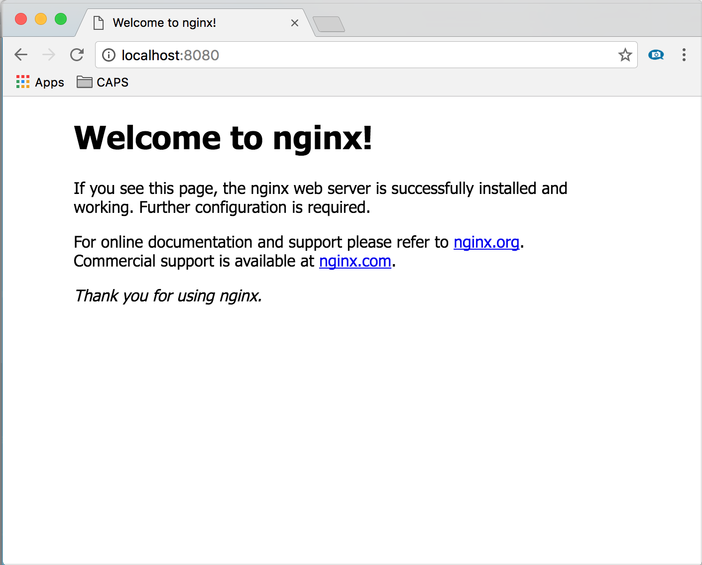

# Push your first image to a private Docker container registry using the Docker CLI
An Azure container registry stores and manages private [Docker](http://hub.docker.com) container images, similar to the way [Docker Hub](https://hub.docker.com/) stores public Docker images. You use the [Docker Command-Line Interface](https://docs.docker.com/engine/reference/commandline/cli/) (Docker CLI) for [login](https://docs.docker.com/engine/reference/commandline/login/), [push](https://docs.docker.com/engine/reference/commandline/push/), [pull](https://docs.docker.com/engine/reference/commandline/pull/), and other operations on your container registry.

For more background and concepts, see [the overview](container-registry-intro.md)


## Prerequisites
* **Azure container registry** - Create a container registry in your Azure subscription. For example, use the [Azure portal](container-registry-get-started-portal.md) or the [Azure CLI 2.0](container-registry-get-started-azure-cli.md).
* **Docker CLI** - To set up your local computer as a Docker host and access the Docker CLI commands, install [Docker Engine](https://docs.docker.com/engine/installation/).

## Log in to a registry
Run `docker login` to log in to your container registry with your [registry credentials](container-registry-authentication.md).

The following example passes the ID and password of an Azure Active Directory [service principal](../active-directory/active-directory-application-objects.md). For example, you might have assigned a service principal to your registry for an automation scenario.

```
docker login myregistry.azurecr.io -u xxxxxxxx-xxxx-xxxx-xxxx-xxxxxxxxxxxx -p myPassword
```

> [!TIP]
> Make sure to specify the fully qualified registry name (all lowercase). In this example, it is `myregistry.azurecr.io`.

## Steps to pull and push an image
The follow example downloads the Nginx image from the public Docker Hub registry, tags it for your private Azure container registry, pushes it to your registry, then pulls it again.

**1. Pull the Docker official image for Nginx**

First pull the public Nginx image to your local computer.

```
docker pull nginx
```
**2. Start the Nginx container**

The following command starts the local Nginx container interactively on port 8080, allowing you to see output from Nginx. It removes the running container once stopped.

```
docker run -it --rm -p 8080:80 nginx
```

Browse to [http://localhost:8080](http://localhost:8080) to view the running container. You see a screen similar to the following one.



To stop the running container, press [CTRL]+[C].

**3. Create an alias of the image in your registry**

The following command creates an alias of the image, with a fully qualified path to your registry. This example specifies the `samples` namespace to avoid clutter in the root of the registry.

```
docker tag nginx myregistry.azurecr.io/samples/nginx
```  

**4. Push the image to your registry**

```
docker push myregistry.azurecr.io/samples/nginx
```

**5. Pull the image from your registry**

```
docker pull myregistry.azurecr.io/samples/nginx
```

**6. Start the Nginx container from your registry**

```
docker run -it --rm -p 8080:80 myregistry.azurecr.io/samples/nginx
```

Browse to [http://localhost:8080](http://localhost:8080) to view the running container.

To stop the running container, press [CTRL]+[C].

**7. (Optional) Remove the image**

```
docker rmi myregistry.azurecr.io/samples/nginx
```

##Concurrent Limits
In some scenarios, executing calls concurrently might result in errors. The following table contains the limits of concurrent calls with "Push" and "Pull" operations on Azure container registry:

| Operation  | Limit                                  |
| ---------- | -------------------------------------- |
| PULL       | Up to 10 concurrent pulls per registry |
| PUSH       | Up to 5 concurrent pushes per registry |

## Next steps
Now that you know the basics, you are ready to start using your registry! For example, start deploying container images to an [Azure Container Service](https://azure.microsoft.com/documentation/services/container-service/) cluster.
