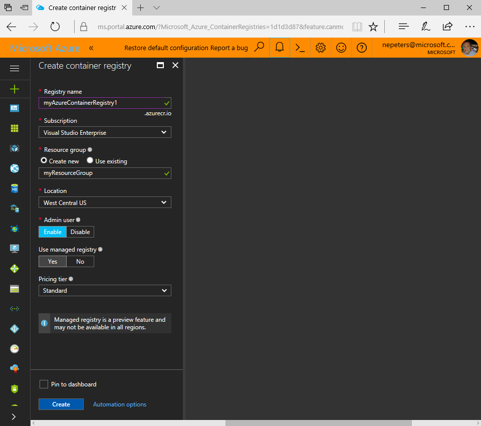

# Create a private Docker container registry using the Azure portal

Azure Container Registry is a managed Docker container registry service used for storing private Docker container images. This guide details creating an Azure Container Registry instance using the Azure portal.

## Log in to Azure

Log in to the Azure portal at http://portal.azure.com.

## Create a container registry

1. Click the **New** button found on the upper left-hand corner of the Azure portal.

2. Search the marketplace for **Azure container registry** and select it.

4. Click **Create** which will open the ACR creation blade.

    

5. In the **Azure Container Registry** blade, enter the following information. Click **Create** when you are done.

    a. **Registry name**: A globally unique top-level domain name for your specific registry. In this example, the registry name is *myAzureContainerRegistry1*, but substitute a unique name of your own. The name can contain only letters and numbers.

    b. **Resource group**: Select an existing [resource group](../azure-resource-manager/resource-group-overview.md#resource-groups) or type the name for a new one.

    c. **Location**: Select an Azure datacenter location where the service is [available](https://azure.microsoft.com/regions/services/), such as **South Central US**.

    d. **Admin user**: If you want, enable an admin user to access the registry. You can change this setting after creating the registry.

    e. **Use managed registry**: Select yes to have ACR automatically manage the registry storage, use webhooks, and geo-replication.

    d. **Pricing Tier**: Select a pricing tier, see here ACR pricing for more information.


## Log in to ACR instance

Before pushing and pulling container images, you must log in to the ACR instance. 

To do so, use the Azure CLI 2.0. First, if needed, log into azure using the [az login] command. 

```azurecli
az login
```

Next, use the [az acr login]() command to log in to the Azure Container Registry.

```azurecli-interactive
az acr login --myAzureContainerRegistry1
```

## Use Azure Container Registry

### List container images

Use the `az acr` CLI commands to query the images and tags in a repository.

> [!NOTE]
> Currently, Container Registry does not support the `docker search` command to query for images and tags.

### List repositories

The following example lists the repositories in a registry, in JSON (JavaScript Object Notation) format:

```azurecli
az acr repository list -n myContainerRegistry1 -o json
```

### List tags

The following example lists the tags on the **samples/nginx** repository, in JSON format:

```azurecli
az acr repository show-tags -n myContainerRegistry1 --repository samples/nginx -o json
```

## Next steps

In this quick start, you’ve deployed a simple virtual machine, a network security group rule, and installed a web server.

> [!div class="nextstepaction"]
> [Push your first image using the Docker CLI](container-registry-get-started-docker-cli.md)

## Next steps
* [Push your first image using the Docker CLI](container-registry-get-started-docker-cli.md)
