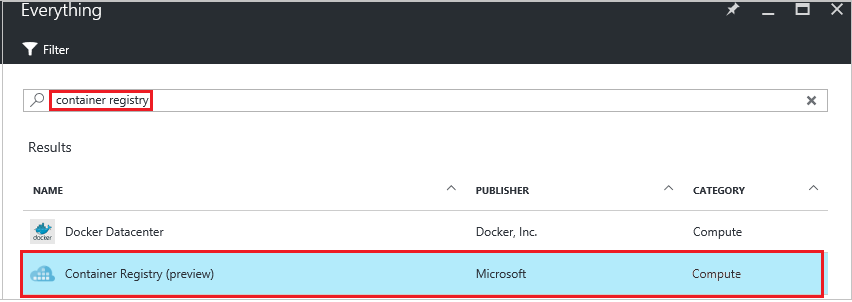
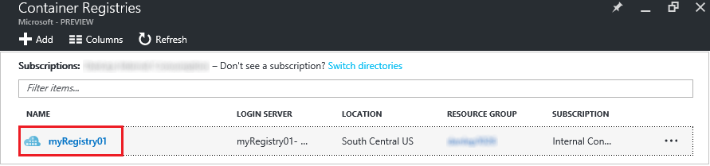
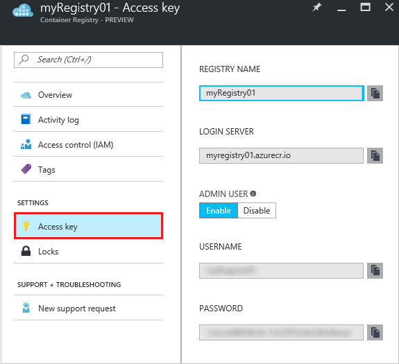

# Create a private Docker container registry using the Azure portal
Use the Azure portal to create a container registry and manage its settings. You can also create and manage container registries using the [Azure CLI 2.0 commands](container-registry-get-started-azure-cli.md) or programmatically with the Container Registry [REST API](https://go.microsoft.com/fwlink/p/?linkid=834376).

For background and concepts, see [the overview](container-registry-intro.md).

## Create a container registry
1. In the [Azure portal](https://portal.azure.com), click **+ New**.
2. Search the marketplace for **Azure container registry**.
3. Select **Azure Container Registry**, with publisher **Microsoft**.
    
4. Click **Create**. The **Azure Container Registry** blade appears.

    
5. In the **Azure Container Registry** blade, enter the following information. Click **Create** when you are done.

    a. **Registry name**: A globally unique top-level domain name for your specific registry. In this example, the registry name is *myRegistry01*, but substitute a unique name of your own. The name can contain only letters and numbers.

    b. **Resource group**: Select an existing [resource group](../azure-resource-manager/resource-group-overview.md#resource-groups) or type the name for a new one.

    c. **Location**: Select an Azure datacenter location where the service is [available](https://azure.microsoft.com/regions/services/), such as **South Central US**.

    d. **Admin user**: If you want, enable an admin user to access the registry. You can change this setting after creating the registry.

      > [!IMPORTANT]
      > In addition to providing access through an admin user account, container registries support authentication backed by Azure Active Directory service principals. For more information and considerations, see [Authenticate with a container registry](container-registry-authentication.md).
      >

    e. **Storage account**: Use the default setting to create a [storage account](../storage/storage-introduction.md), or select an existing storage account in the same location. Currently Premium Storage is not supported.

## Manage registry settings
After creating the registry, find the registry settings by starting at the **Container Registries** blade in the portal. For example, you might need the settings to log in to your registry, or you might want to enable or disable the admin user.

1. On the **Container Registries** blade, click the name of your registry.

    
2. To manage access settings, click **Access key**.

    
3. Note the following settings:

   * **Login server** - The fully qualified name you use to log in to the registry. In this example, it is `myregistry01.azurecr.io`.
   * **Admin user** - Toggle to enable or disable the registry's admin user account.
   * **Username** and **Password** - The credentials of the admin user account (if enabled) you can use to log in to the registry. You can optionally regenerate the passwords. Two passwords are created so that you can maintain connections to the registry by using one password while you regenerate the other password. To authenticate with a service principal instead, see [Authenticate with a private Docker container registry](container-registry-authentication.md).

## Next steps
* [Push your first image using the Docker CLI](container-registry-get-started-docker-cli.md)
