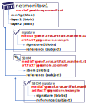

# Push and pull supply chain artifacts using Azure Registry (Preview)

Use an Azure container registry to store and manage a graph of supply chain artifacts, including signatures, software bill of materials (SBOM), security scan results and other types.



To demonstrate this capability, this article shows how to use the [OCI Registry as Storage (ORAS)](https://oras.land) CLI to `push`, `discover` and `pull` a graph of supply chain artifacts to an Azure container registry.
Storing individual (root) OCI Artifacts are covered in [Push and pull OCI artifacts](container-registry-oci-artifacts.md).

To store a graph of artifacts, a reference to a `subject` artifact is defined using the [OCI Artifact Manifest][oci-artifact-manifest], which is part of the [pre-release OCI 1.1 Distribution specification][oci-1_1-spec].
OCI 1.1 Artifact Manifest support is an ACR preview feature and subject to [limitations](#preview-limitations). 

## Prerequisites

* **Azure container registry** - Create a container registry in your Azure subscription. For example, use the [Azure portal](container-registry-get-started-portal.md) or the [Azure CLI][az-acr-create].  
*See [Preview limitations](#preview-limitations) for Azure cloud support.*
* **Azure CLI** - Version `2.29.1` or later is required. See [Install Azure CLI][azure-cli-install] for installation and/or upgrade.
* **ORAS CLI** - Version `v0.16.0` is required. See: [ORAS installation][oras-install-docs].
* **Docker (Optional)** - To complete the walkthrough, a container image is referenced.
You can use [Docker installed locally][docker-install] to build and push a container image, or use [`acr build`][az-acr-build] to build remotely in Azure.  
While Docker Desktop isn't required, the `oras` cli utilizes the Docker desktop credential store for storing credentials. If Docker Desktop is installed, it must be running for `oras login`.  

## Preview limitations

OCI Artifact Manifest support ([OCI 1.1 specification][oci-1_1-spec]) is available in all Azure public regions. Microsoft Azure operated by 21Vianet and government clouds aren't yet supported.

## Configure a registry

Configure environment variables to easily copy/paste commands into your shell. The commands can be run locally or in the [Azure Cloud Shell](https://shell.azure.com/).

```console
ACR_NAME=myregistry
REGISTRY=$ACR_NAME.azurecr.io
REPO=net-monitor
TAG=v1
IMAGE=$REGISTRY/${REPO}:$TAG
```

Authenticate with your [individual Azure AD identity](container-registry-authentication.md?tabs=azure-cli#individual-login-with-azure-ad) using an AD token. Always use "000..." for the `USER_NAME` as the token is parsed through the `PASSWORD` variable.

```azurecli
# Login to Azure
az login

# Login to ACR, using a token based on your Azure identity
USER_NAME="00000000-0000-0000-0000-000000000000"
PASSWORD=$(az acr login --name $ACR_NAME --expose-token --output tsv --query accessToken)
```

> [!NOTE]
> ACR and ORAS support multiple authentication options for users and system automation. This article uses individual identity, using an Azure token. For more authentication options see [Authenticate with an Azure container registry][acr-authentication]

### Sign in with ORAS

Provide the credentials to `oras login`.

  ```bash
  oras login $REGISTRY \
    --username $USER_NAME \
    --password $PASSWORD
  ```

## Push a container image

This example associates a graph of artifacts to a container image.

Build and push a container image, or skip this step if `$IMAGE` references an existing image in the registry.

```bash
az acr build -r $ACR_NAME -t $IMAGE https://github.com/wabbit-networks/net-monitor.git#main
```

## Create a sample signature to the container image

```bash
echo '{"artifact": "'${IMAGE}'", "signature": "jayden hancock"}' > signature.json
```

### Attach a signature to the registry, as a reference to the container image

The `oras attach` command creates a reference between the file (`./signature.json`) to the `$IMAGE`. The `--artifact-type` provides for differentiating artifacts, similar to file extensions that enable different file types. One or more files can be attached by specifying `[file]:[mediaType]`.

```bash
oras attach $IMAGE \
    --artifact-type signature/example \
    ./signature.json:application/json
```

For more information on oras attach, see [ORAS documentation][oras-docs].

## Attach a multi-file artifact as a reference

When OCI artifacts are pushed to a registry with ORAS, each file reference is pushed as a blob. To push separate blobs, reference the files individually, or collection of files by referencing a directory.  
For more information how to push a collection of files, see [Pushing artifacts with multiple files][oras-push-multifiles].

Create some documentation around an artifact:

```bash
echo 'Readme Content' > readme.md
mkdir details/
echo 'Detailed Content' > details/readme-details.md
echo 'More detailed Content' > details/readme-more-details.md
```

Attach the multi-file artifact as a reference to `$IMAGE`:

**Linux, WSL2 or macOS**

```bash
oras attach $IMAGE \
    --artifact-type readme/example \
    ./readme.md:application/markdown \
    ./details
```

**Windows**

```cmd
.\oras.exe attach $IMAGE ^
    --artifact-type readme/example ^
    .\readme.md:application/markdown ^
    .\details
```

## Discovering artifact references

The [OCI v1.1 Specification][oci-spec] defines a [referrers API][oci-artifact-referrers] for discovering references to a `subject` artifact. The `oras discover` command can show the list of references to the container image.

Using `oras discover`, view the graph of artifacts now stored in the registry.

```bash
oras discover -o tree $IMAGE
```

The output shows the beginning of a graph of artifacts, where the signature and docs are viewed as children of the container image.

```output
myregistry.azurecr.io/net-monitor:v1
├── signature/example
│   └── sha256:555ea91f39e7fb30c06f3b7aa483663f067f2950dcb...
└── readme/example
    └── sha256:1a118663d1085e229ff1b2d4d89b5f6d67911f22e55...
```

## Creating a deep graphs of artifacts

The OCI v1.1 Specification enables deep graphs, enabling signed software bill of materials (SBOM) and other artifact types.

### Create a sample SBOM

```bash
echo '{"version": "0.0.0.0", "artifact": "'${IMAGE}'", "contents": "good"}' > sbom.json
```

### Attach a sample SBOM to the image in the registry

**Linux, WSL2 or macOS**

```bash
oras attach $IMAGE \
  --artifact-type sbom/example \
  ./sbom.json:application/json
```

**Windows**

```cmd
.\oras.exe attach $IMAGE ^
    --artifact-type sbom/example ^
    ./sbom.json:application/json
```

### Sign the SBOM

Artifacts that are pushed as references, typically don't have tags as they're considered part of the `subject` artifact. To push a signature to an artifact that is a child of another artifact, use the `oras discover` with `--artifact-type` filtering to find the digest.

```bash
SBOM_DIGEST=$(oras discover -o json \
                --artifact-type sbom/example \
                $IMAGE | jq -r ".manifests[0].digest")
```

Create a signature of an SBOM

```bash
echo '{"artifact": "'$IMAGE@$SBOM_DIGEST'", "signature": "jayden hancock"}' > sbom-signature.json
```

### Attach the SBOM signature

```bash
oras attach $IMAGE@$SBOM_DIGEST \
  --artifact-type 'signature/example' \
  ./sbom-signature.json:application/json
```

### View the graph

```bash
oras discover -o tree $IMAGE
```

Generates the following output:

```output
myregistry.azurecr.io/net-monitor:v1
├── sbom/example
│   └── sha256:4f1843833c029ecf0524bc214a0df9a5787409fd27bed2160d83f8cc39fedef5
│       └── signature/example
│           └── sha256:3c43b8cb0c941ec165c9f33f197d7f75980a292400d340f1a51c6b325764aa93
├── readme/example
│   └── sha256:5fafd40589e2c980e2864a78818bff51ee641119cf96ebb0d5be83f42aa215af
└── signature/example
    └── sha256:00da2c1c3ceea087b16e70c3f4e80dbce6f5b7625d6c8308ad095f7d3f6107b5
```

## Promote the graph

A typical DevOps workflow will promote artifacts from dev through staging, to the production environment
Secure supply chain workflows promote public content to privately secured environments.
In either case you'll want to promote the signatures, SBOMs, scan results and other related artifact with the root artifact to have a complete graph of dependencies.

Using the [`oras copy`][oras-cli] command, you can promote a filtered graph of artifacts across registries.

Copy the `net-monitor:v1` image, and it's related artifacts to `sample-staging/net-monitor:v1`:

```bash
TARGET_REPO=$REGISTRY/sample-staging/$REPO
oras copy -r $IMAGE $TARGET_REPO:$TAG
```

The output of `oras copy`:

```console
Copying 6bdea3cdc730 sbom-signature.json
Copying 78e159e81c6b sbom.json
Copied  6bdea3cdc730 sbom-signature.json
Copied  78e159e81c6b sbom.json
Copying 7cf1385c7f4d signature.json
Copied  7cf1385c7f4d signature.json
Copying 3e797ecd0697 details
Copying 2fdeac43552b readme.md
Copied  3e797ecd0697 details
Copied  2fdeac43552b readme.md
Copied demo42.myregistry.io/net-monitor:v1 => myregistry.azurecr.io/sample-staging/net-monitor:v1
Digest: sha256:ff858b2ea3cdf4373cba65d2ca6bcede4da1d620503a547cab5916614080c763
```
## Discover the promoted artifact graph

```bash
oras discover -o tree $TARGET_REPO:$TAG
```

Output of `oras discover`:

```console
myregistry.azurecr.io/sample-staging/net-monitor:v1
├── sbom/example
│   └── sha256:4f1843833c029ecf0524bc214a0df9a5787409fd27bed2160d83f8cc39fedef5
│       └── signature/example
│           └── sha256:3c43b8cb0c941ec165c9f33f197d7f75980a292400d340f1a51c6b325764aa93
├── readme/example
│   └── sha256:5fafd40589e2c980e2864a78818bff51ee641119cf96ebb0d5be83f42aa215af
└── signature/example
    └── sha256:00da2c1c3ceea087b16e70c3f4e80dbce6f5b7625d6c8308ad095f7d3f6107b5
```

## Pull a referenced artifact

To pull a specific referenced artifact, the digest of reference is discovered with the `oras discover` command:

```bash
DOC_DIGEST=$(oras discover -o json \
              --artifact-type 'readme/example' \
              $TARGET_REPO:$TAG | jq -r ".manifests[0].digest")
```

### Create a clean directory for downloading

```bash
mkdir ./download
```

### Pull the docs into the download directory

```bash
oras pull -o ./download $TARGET_REPO@$DOC_DIGEST
```

### View the docs

```bash
tree ./download
```

The output of `tree`:

```output
./download
├── details
│   ├── readme-details.md
│   └── readme-more-details.md
└── readme.md
```

## View the repository and tag listing

The OCI Artifact Manifest enables artifact graphs to be pushed, discovered, pulled and copied without having to assign tags. Artifact manifests enable a tag listing to focus on the artifacts users think about, as opposed to the signatures and SBOMs that are associated with the container images, helm charts and other artifacts.

### View a list of tags

```bash
oras repo tags $REGISTRY/$REPO
```

### View a list of manifests

A repository can have a list of manifests that are both tagged and untagged. Using the [`az acr manifest`][az-acr-manifest-metadata] CLI, view the full list of manifests:

```azurecli
az acr manifest list-metadata \
  --name $REPO \
  --registry $ACR_NAME \
  --output jsonc
```

Note the container image manifests have `"tags"`, while the reference types (`"mediaType": "application/vnd.oci.artifact.manifest.v1+json"`) don't.

In the output, the signature is untagged, but tracked as a `oci.artifact.manifest` reference to the container image:

```json
{
  "changeableAttributes": {
    "deleteEnabled": true,
    "listEnabled": true,
    "readEnabled": true,
    "writeEnabled": true
  },
  "createdTime": "2023-01-10T17:58:28.4403142Z",
  "digest": "sha256:00da2c1c3ceea087b16e70c3f4e80dbce6f5b7625d6c8308ad095f7d3f6107b5",
  "imageSize": 80,
  "lastUpdateTime": "2023-01-10T17:58:28.4403142Z",
  "mediaType": "application/vnd.oci.artifact.manifest.v1+json"
}
```

## Delete all artifacts in the graph

Support for the OCI v1.1 Specification enables deleting the graph of artifacts associated with the root artifact. Use the [`oras delete`][oras-cli] command to delete the graph of artifacts (signature, SBOM and the signature of the SBOM).

```azurecli
oras manifest delete -f $REGISTRY/$REPO:$TAG

oras manifest delete -f $REGISTRY/sample-staging/$REPO:$TAG
```

### View the remaining manifests

By deleting the root artifact, all related artifacts are also deleted leaving a clean environment:

```azurecli
az acr manifest list-metadata \
  --name $REPO \
  --registry $ACR_NAME -o jsonc
```

Output: 
```output
2023-01-10 18:38:45.366387 Error: repository "net-monitor" is not found.
```
## Summary

In this article, a graph of supply chain artifacts is created, discovered, promoted and pulled providing lifecycle management of the artifacts you build and depend upon.

## Next steps

* Learn more about [the ORAS CLI][oras-cli]
* Learn more about [OCI Artifact Manifest][oci-artifact-manifest] for how to push, discover, pull, copy a graph of supply chain artifacts

<!-- LINKS - external -->
[docker-install]:           https://www.docker.com/get-started/
[oci-artifact-manifest]:    https://github.com/opencontainers/image-spec/blob/main/manifest.md
[oci-artifact-referrers]:   https://github.com/opencontainers/distribution-spec/blob/main/spec.md#listing-referrers/
[oci-spec]:                 https://github.com/opencontainers/distribution-spec/blob/main/spec.md/
[oci-1_1-spec]:             https://github.com/opencontainers/distribution-spec/releases/tag/v1.1.0-rc1
[oras-docs]:                https://oras.land/
[oras-install-docs]:        https://oras.land/docs/installation
[oras-cli]:                 https://oras.land/docs/category/oras-commands/
[oras-push-multifiles]:     https://oras.land/docs/how_to_guides/pushing_and_pulling#pushing-artifacts-with-multiple-files


<!-- LINKS - internal -->
[acr-authentication]:       ./container-registry-authentication.md?tabs=azure-cli
[az-acr-create]:            ./container-registry-get-started-azure-cli.md
[az-acr-build]:             /cli/azure/acr#az_acr_build
[az-acr-manifest-metadata]: /cli/azure/acr/manifest/metadata
[az-acr-repository-delete]: /cli/azure/acr/repository#az_acr_repository_delete
[azure-cli-install]:        /cli/azure/install-azure-cli
